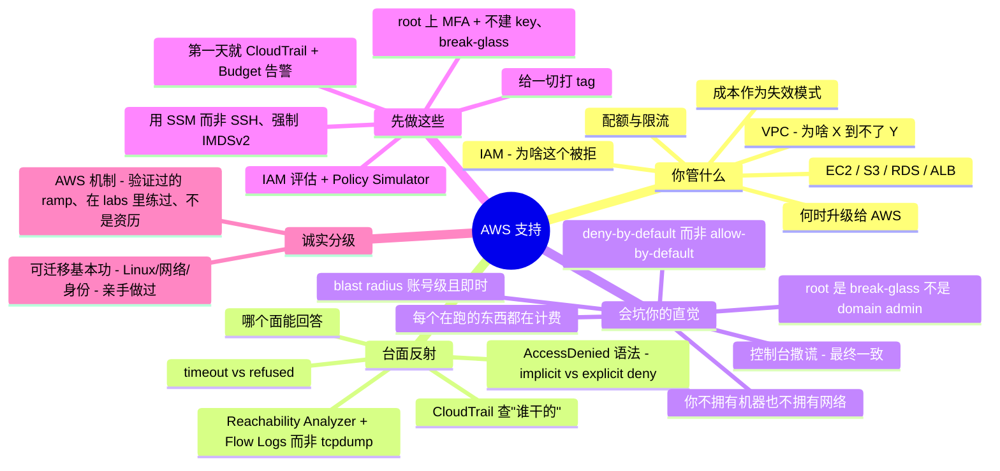

# AWS 支持 —— 运维者的转轨指南

> 🌐 **语言：** [English（默认）](../../../../platforms/aws/support.md) · **中文**
>
> ⚠️ 本项目**默认语言为英文**，`platforms/aws/support.md` 是"事实来源"。本页中文是多语言支持的一部分，可能略滞后于英文版；两者不一致时以英文为准。

---

> [`operations.md`](../../../../platforms/aws/operations.md) 讲的是运营你自己那套 AWS 的**节奏** —— 什么会 page 你，以及每天/每周/每季度的活。本篇讲另一半：**把 AWS support 当作一门修/救（break-fix）手艺** —— 真正反复出现的工单、精确的排查落点，以及最有用的那点：**一个来自别的方向的强 sysadmin 接手它时，哪些直觉会坑他。** AWS 本身在这里仍是 🧗 ramp；撑起它的可迁移基本功（Linux、网络、身份、排障）才是那个 ✋ 亲手做过——而这正是本页的意义。

一个熟练的 Linux / on-prem 网络 / 虚拟化 / 别的云的运维，接手 AWS support 通常比一个新招的云工程师快 —— **前提是**他能察觉自己哪些直觉已经不再成立。这段转轨里的痛不是"不懂"，而是**把一身自信的肌肉记忆，指向了一个把自己好几条规则都反过来的平台** —— deny-by-default 而非 allow-by-default、按量计费的账单而非沉没成本、一个你抓不了包的 API 而非一台你能上手的交换机。本篇把职责、反复出现的工单及其诊断面、以及有经验老手反射恰好失灵的那几处一一点名 —— 让这次迁移变成一张核对清单，而不是一连串自找的故障（或账单）。

## 支持 AWS 让你要为什么负责

映射到 [seven surfaces](../../../../00-the-operating-model.md)，按工单到达顺序：

| Surface | 你要为之负责的事 |
| --- | --- |
| **身份与访问（IAM）** | "为啥这个被拒了？"—— 跨 identity/resource/SCP/boundary/session 的策略评估、assume-role 信任、跨账号、最小权限。头号时间黑洞。 |
| **网络（VPC）** | "为啥 X 到不了 Y？"—— security group、NACL、route table、IGW/NAT、public-IP vs EIP、Route 53 DNS。每日事故。 |
| **计算（EC2）** | 启动/健康/访问 —— status check、SSH vs SSM、磁盘满/EBS 扩容。 |
| **存储（S3/EBS）** | S3 403（分层那种）、Block Public Access、bucket policy vs ACL vs KMS；EBS 扩容。 |
| **托管数据（RDS）** | 连接、`storage-full`、`max_connections`、参数组。 |
| **负载均衡与 TLS** | ALB 502/503/504、unhealthy target group、ACM 证书校验/续期。 |
| **可观测性** | CloudWatch 指标/日志/告警；**CloudTrail** 查"谁干的"。 |
| **成本** | 意外账单是一等失效模式 —— NAT、egress、cross-AZ、孤儿资源、公网 IPv4。 |
| **配额与限流** | 启动时的 `LimitExceeded`；脚本里的 `ThrottlingException`。 |
| **升级给 AWS** | Trusted Advisor、AWS Health Dashboard，以及何时该开 Support case（你的套餐到底允许什么）。 |

其中两项 —— **IAM** 和**网络** —— 贡献了绝大多数工单量，而它们也正是外来者直觉栽得最惨的地方（见经验差一节）。

## 常见工单 —— 以及去哪查

AWS 的修/救本质是在一小组控制台和日志上做模式识别。你要练成的反射是：**"哪个面能回答这个问题，它又有什么局限？"**

**IAM —— "Access Denied"（头号工单）。** 读懂错误语法：*"no identity-based policy allows the action"* 是**隐式拒绝（implicit deny）** —— 没有任何东西授予它 —— 不同于 *"…with an explicit deny in a … policy"*，后者意味着有东西**主动**在拦（常是一条**你从账号里根本看不到的 SCP 或 permissions boundary**）。一次 `sts:AssumeRole` 失败需要**目标 role 的 trust policy** *和*调用方的 identity policy **都**放行。碰到不透明的 `UnauthorizedOperation`（encoded）错误，用 **`aws sts decode-authorization-message`** 解码。*去哪查：* **IAM Policy Simulator**（但要知道它的局限 —— 不模拟 role 的 resource policy、不测 SCP 条件、不做跨账号、也不发真实请求）、**CloudTrail** 的 `errorCode`/`errorMessage`、以及 **IAM Access Analyzer**。

**网络 —— "到不了。"** 先分清 **timeout vs refused**：*connection timed out* 是**网络层**被拦 —— security group 没有 inbound 规则、NACL 拦、缺到 IGW/NAT 的路由、或**没有公网 IP** —— 而 *connection refused* 意味着你到了主机，但那个端口上**没有服务在听**。记住那条会绊倒防火墙老手的语义：**security group 有状态且只放行（allow-only）**（回程自动放行），但 **NACL 无状态** —— 你必须**同时放行 ephemeral 回程范围**（放行 1024–65535）。*去哪查：* **VPC Reachability Analyzer**（分析 SG/NACL/route/IGW 的配置路径并**点名阻塞组件** —— 不是 `tcpdump`，那台交换机你碰不到）和 **VPC Flow Logs**（每条流的 `ACCEPT`/`REJECT`）。

**EC2 —— 连接与健康。** **Status check** 定位故障：**System** check 失败是 AWS 底层宿主机 → 处置是 **stop/start**（迁到新硬件）；**Instance** check 失败是*你*的 OS/配置 → 重启或修（"2/2 vs 1/2 checks passed" 是控制台的简写）。SSH `Permission denied (publickey)` 是 AMI 用户名不对（`ec2-user` / `ubuntu` / `admin` / …）或密钥不对；`UNPROTECTED PRIVATE KEY FILE` → `chmod 400`。**别再 SSH** —— 用 **SSM Session Manager**（不开 22 端口、无 bastion、IAM 管控、可审计）；连不上时通常是缺 `AmazonSSMManagedInstanceCore` role、agent 没跑、或没有网络路径（那三个 `ssm`/`ec2messages`/`ssmmessages` endpoint）。EBS 扩容后磁盘还满，是个**两步**陷阱：扩了卷还不够 —— 要 `growpart` 分区，再 `xfs_growfs` / `resize2fs` 文件系统。

**S3 —— 403 Access Denied（分层那种）。** 下列任何一层都会拒：**IAM identity policy**、**bucket policy**、**S3 Block Public Access**（"配了 bucket policy *还是* private" 的常见根因 —— 账号+bucket 取最严）、**Object Ownership / ACL**（跨账号上传、对象归写入方所有是经典盲区）、或 **SSE-KMS 密钥权限**（`GetObject` 需要 `kms:Decrypt`）。先 `aws sts get-caller-identity`，好知道被拒的是*哪个* principal。

**负载均衡与 TLS。** ALB **502** = target 没返回可用响应（崩了、响应畸形、或过早关闭连接）；**503** = **没有健康的 target**；**504** = target 在超时内没应答。`HTTPCode_ELB_5XX`（LB 自己产生）vs `HTTPCode_Target_5XX`（LB 只是转发你应用的错）告诉你该查哪一侧。一个卡在 **unhealthy** 的 target，通常是 security group 没放行 LB 到**健康检查端口**、ping path 不对、或响应不是 200。**ACM** 证书会卡在 *Pending validation*，直到你加上（并**保留** —— 删了会破坏自动续期）DNS **CNAME**，而且它是**分区的**（CloudFront 需要证书在 **us-east-1**）。

**RDS。** 连不上是 DB 的 security group 没放行客户端到 **3306/5432**，或 "Publicly accessible = No" 却没有 IGW 路径。存储吃紧表现为状态 **`storage-full`** 和 CloudWatch **`FreeStorageSpace`** —— 启用 **storage autoscaling**。还有参数组陷阱：**static** 参数改动要**手动重启**才生效，而且你**改不了默认参数组**（新建一个自定义的）。

**成本 —— 意外账单也是工单。** 那些经典款：一个 **NAT Gateway** 按小时费**加上**按 GB 处理费，*即使流量去 S3、根本不出 AWS*（修法：一个免费的 **Gateway VPC Endpoint**）；你以为"内部"的 **cross-AZ 和 egress** 数据传输；**每公网 IPv4 每小时 $0.005**（2024-02 起，无论挂着还是空闲）；以及孤儿 —— **未挂载的 EBS 卷、AMI 留下的 snapshot、未关联的 Elastic IP** —— 都在悄悄计费。*去哪查：* **Cost Explorer**、**Budgets**、**Cost Anomaly Detection**（[`cross-cutting/cost.md`](../../../../cross-cutting/cost.md)）。

**配额与限流。** 分清两件事：**count 配额**（`LimitExceeded` —— 你的启动撞到了 per-region 上限 → 在 **Service Quotas** 里提前提额）和 **API 速率限流**（`RequestLimitExceeded` / `ThrottlingException` "Rate exceeded" —— 你的脚本调太快 → **指数退避 + jitter**；SDK 已经会重试，但手搓的 `boto3`/CLI 循环不会）。

**DNS / Route 53。** **CNAME 不能放在 zone apex（根域）** —— 用 **Alias** 记录。还有委派陷阱：重建一个 hosted zone 会给你**一组新的 4 台 name server**，于是解析会断，直到**注册商的 NS 记录**与该 zone 的匹配。

## 经验差 —— 一个强 sysadmin 的直觉会错在哪

这才是工单队列藏起来的部分。**做过** AWS support 的人和没做过的人之间的差距不在控制台 —— 聪明的运维一周就学会控制台。差距在于一组来自 on-prem / 别的云世界的**承重假设，在这里是错的**，每一条都挂着一个失效模式。

- **IAM 是 deny-by-default，而且是你的头号时间黑洞。** on-prem 上"admin 无所不能"，防火墙是你往上打例外的 allow-list。AWS 把两者都反过来：**没有匹配的 Allow = 拒绝**，而且**显式 Deny 永远赢** —— 赢过任何 Allow，来自六种策略类型（identity、resource、SCP、RCP、boundary、session）中的任意一种，它们以并集和交集组合。"直接给他 admin"的反射会悄悄失灵 —— 当一条 **SCP 或 permissions boundary 把他压住**时 —— 而 AWS 自己的文档告诉你，那条拒绝的策略可能待在**你从账号里根本看不到的地方。**
- **你不拥有机器、也不拥有网络（shared responsibility）。** AWS 拥有 hypervisor、物理宿主机、交换机。你**不能 SSH 宿主机、不能 `tcpdump` 网络**，而托管服务（RDS、Lambda）**根本不给你 shell**。"登上机器看一眼"的工作流，对平台的一大片区域已经不存在；你从**配置分析（Reachability Analyzer）+ 日志（Flow Logs、CloudWatch、CloudTrail）**去诊断，而诚实的终点有时就是*"开个 Support case"*。
- **"直接开防火墙"映射得很糟。** 这里有语义不同的多层 —— ENI 上**有状态、只放行的 security group** vs 子网上**无状态、有序的 NACL**（要显式放行回程流量）vs route table vs IGW/NAT。一急就把 security group 放开到 `0.0.0.0/0` 是反模式；去找那**一条**阻塞规则。
- **控制台会撒几秒钟谎（最终一致）。** 一个新建的 IAM role/policy 可能要**一分钟**才生效；S3 bucket policy、Route 53 TTL、tag/控制台视图也都滞后。on-prem 那套*改-刷新-没生效-再改*的反射会制造冲突状态。**改一次，然后等** —— SDK 甚至为此专门提供了 *waiter*。
- **一切皆 API，而 API 有速率限制。** 不带**退避 + jitter** 地循环一万个资源，你会把自己 `ThrottlingException` 成一次自造的故障。on-prem 上猛敲自己的服务器是免费的；这里平台会回推你。
- **成本是一等失效模式 —— 这是相对 on-prem 独有的。** 沉没成本的硬件闲着不花钱；在 AWS **每个在跑的东西都在计费**，而这块表有些非直觉的边（NAT 按 GB 处理费叠在 egress 上、cross-AZ 传输、按小时的公网 IPv4、孤儿 EBS/EIP）。"我回头清"= 一张意外账单。**第一天就设一个 Budget 告警**不是可选项。
- **Blast radius 更大也更快。** 一条 IAM policy、一次 security-group 改动、一次路由编辑，**一次命中所有东西** —— 没有 per-rack 的故障隔离。而且许多*全局*控制平面历史上都倚赖 **us-east-1**；那里一次区域性事件曾级联影响数十个服务。最小权限和变更纪律在这里**更**重要，不是更不重要。
- **root 用户不是"domain admin"。** 它是个 **break-glass 身份**：给它上 MFA、**不给它建 access key**、用一个组邮箱、然后别碰它 —— 人通过 **IAM Identity Center / role** 干活。没有你每天开的超级用户。
- **配额是软的、按区域、要*提前*提。** "为啥我的启动失败：`InstanceLimitExceeded`"是一个你上周就该提的配额；提额可能要几分钟到几天。
- **"它不在这儿"通常意味着"选错了 region"。** 资源是 regional/zonal 的，**不会自动复制、除非你做**；有些控制台会悄悄把你落在与你建东西时不同的 region。
- **CloudTrail 是你的"谁删的" —— 而且它不能回溯。** 它是审计线索、是事后的 pcap，但只覆盖你**启用之后**的事件。在你需要它们之前就把它（还有 Budget、还有 IMDSv2）**先**打开。

## 什么可迁移，什么不可

| 强迁移 | 带保留地迁移 | 别带过来 |
| --- | --- | --- |
| Linux / guest-OS 深度 —— 仍 100% 是你的（shared model 里你那一侧） | 防火墙/ACL 推理 —— 重学有状态 SG vs 无状态 NACL + 分层评估 | 抓包 —— 碰不到的交换机没法 `tcpdump` |
| DNS 推理（Route 53 就是 DNS；留意最终一致） | 身份与最小权限 —— *原则*成立；deny-by-default 的 JSON 是新的 | "admin 无所不能" —— deny-by-default + SCP 连 admin 都压；root 是 break-glass |
| TLS / 证书推理（ACM 管签发；PKI 一模一样） | "我有 admin，所以什么都能看到" —— 托管服务没 shell；"开个 case" | 沉没成本 / 容量思维 —— 闲着 = 计费 |
| TCP/IP、子网、CIDR → VPC 设计 | 读写强一致 —— 要为传播延迟重新校准 | "从备份服务器恢复" —— 只有你*事先配好的*（snapshot/Backup/versioning）才存在 |
| 结构化排障、日志阅读、脚本 | | "直接把防火墙开到 0.0.0.0/0" —— 去找那一条阻塞规则 |
| 变更纪律（试点 / IaC / 回滚）—— 这里*更*重要 | | 静态-宠物-服务器思维 —— 如果你在 SSH 进去手修，那是自动化失败了 |

## 第一周 / 前 90 天

**第一周 —— 在你动任何大范围东西之前。**
1. **保护 root 用户** —— 开 MFA、**删掉任何 root access key**、用组邮箱、写好 break-glass（别把 root 密码存进一个需要这同一个账号才能解锁的库里）。
2. **启用 CloudTrail**（所有 region）—— 它无法捕获过去。
3. **设一个 Budget + 账单告警** —— 出账后的第一件事；失控的成本在月底*之前*被抓到，而不是之后。
4. **确认并收藏你的工作 region** —— 一半的"资源不见了"工单是选错 region。

**前 30 天 —— 防止自己造故障的反射。**
5. **学 IAM 策略评估 + Policy Simulator** —— 你大部分支持时间都花在这。读懂 `AccessDenied` 语法（implicit vs explicit deny）。
6. **用 Reachability Analyzer + Flow Logs 读 SG/NACL/route 路径**，而不是 `tcpdump`。
7. **用 SSM Session Manager 而非 SSH 密钥；在实例上强制 IMDSv2。**
8. **绝不在没搞清 blast radius 的情况下改一条宽泛 IAM policy 或一个共享 security group** —— 一次改动是账号级、即时的。

**前 90 天 —— 抢在失效模式前面。**
9. **创建时就给一切打 tag** —— 它是你与孤儿-与-账单混乱之间唯一的东西，还驱动成本分摊和 ABAC。
10. **知道 Service Quotas 存在**，在启动/扩容事件前提额。
11. **让每个循环脚本为限流而设计**（退避 + jitter）。
12. **减少对 us-east-1 控制平面的随意依赖**，凡是必须扛过区域性事件的东西。

## AI 辅助的 ramp（AWS-support 口味）

- **把你的直觉翻译成 AWS 的行话：** *"我会 `tcpdump` 那个网口、grep 防火墙日志 —— '这个到不了那个'在 AWS 的等价做法是什么，我又有哪些看不到？"* 那个诚实的答案（Reachability Analyzer + Flow Logs + shared-responsibility 那条线）恰恰是 AI 擅长压缩的东西。
- **让它起草 policy/命令，你亲手做最小权限。** AI 在 **IAM JSON、`aws` CLI、`boto3`、Terraform** 上是真强 —— 而它也会**发明不存在的 IAM action 和 API 调用**、**过度放开到 `"*"`**、并爽快地提一个 **blast radius 是整个账号**的 security-group 或 policy 改动。每一段生成的 policy 都要对着文档（和一个 linter —— 见 field kit）核验、并在一个**一次性账号**里跑过，才允许碰生产。这跟本仓库其余部分是同一套"往死里验证"的纪律 —— 见 [`ai-workflow/`](../../../../ai-workflow/) 和[运营环](../../../../platforms/aws/operations.md#how-ai-assists-the-operating-work-not-just-the-learning)。

## 诚实边界

**AWS 在本仓库里是个 🧗 验证过的 ramp，本页也守着这条线。** 让这个 ramp 快的，是那些**✋ 可迁移、且真实**的基本功在承重：**Linux** 与 guest-OS 运维、**网络 / DNS / TLS**（[`the-stack/02`](../../../../the-stack/02-network.md)）、以及**身份与最小权限思维**（[`identity-iam.md`](../../../../cross-cutting/identity-iam.md)）—— AWS support 里那些*本来就是*这些技能、只是换了 AWS 名字的部分。AWS 特有的机制（deny-by-default 的策略评估、VPC 的分层、服务目录、计费的边）是被映射、对着文档核验、并在可跑的 [labs](../../../../platforms/aws/labs/) 里练过的 —— **不是**声称成多年生产资历。这里的声明就是[平台 README](../../../../platforms/aws/README.md) 做的那一个：*一套可迁移的操作模型，加一条 AI 加速、在本仓库里可验证、能快速到达"胜任"的 ramp* —— 而上面那些 support 反射就是这条 ramp 落到实处。某个具体服务上更深、规模化的生产 AWS 仍在前方，注释如实说明、绝不吹。

## Field kit —— 真实工具与参考

以下指针在 GitHub 上逐个核实存在，按用途分组。安全/审计工具兼作排障清单；部分属进阶。

**Curated / 实用（每日台面）：**
- [`open-guides/og-aws`](https://github.com/open-guides/og-aws) —— 众包的"AWS 实用指南"，大量 gotcha、限制、失效模式。最好的单篇 ops/排障读物。
- [`donnemartin/awesome-aws`](https://github.com/donnemartin/awesome-aws) —— AWS 工具/库的总索引。
- [`awslabs/aws-support-tools`](https://github.com/awslabs/aws-support-tools) —— 由 **AWS Premium Support** 亲自写的脚本，正对这些 break-fix 场景。
- [`aws/aws-cli`](https://github.com/aws/aws-cli) · [`boto/boto3`](https://github.com/boto/boto3) —— 主诊断面，以及每个脚本底下的 SDK。

**IAM 与权限调试（头号痛点）：**
- [`iann0036/iamlive`](https://github.com/iann0036/iamlive) —— 通过监听实时 API 调用生成最小权限 policy；解决 `AccessDenied` 最快的路（直接告诉你缺哪个 action）。
- [`salesforce/cloudsplaining`](https://github.com/salesforce/cloudsplaining) —— 把账号的 IAM 蔓生变成一份按风险排序的报告。
- [`nccgroup/PMapper`](https://github.com/nccgroup/PMapper) —— 把 IAM 建成图：`"principal X 到底能不能做 Y？"` 以及提权路径。
- [`salesforce/policy_sentry`](https://github.com/salesforce/policy_sentry) · [`duo-labs/parliament`](https://github.com/duo-labs/parliament) —— 生成与 lint 最小权限 policy。

**网络 / 姿态 / 诊断：**
- [`duo-labs/cloudmapper`](https://github.com/duo-labs/cloudmapper) —— 可视化 VPC 拓扑与 security-group 暴露面。
- [`prowler-cloud/prowler`](https://github.com/prowler-cloud/prowler) —— "这账号哪儿不对？"的首选扫描器；findings 读起来就是整改 runbook。
- [`turbot/steampipe`](https://github.com/turbot/steampipe) —— 用 SQL 实时查 AWS；几秒钟回答"哪些资源暴露/贵/配错了"。
- [`nccgroup/ScoutSuite`](https://github.com/nccgroup/ScoutSuite) —— 离线的多云姿态报告。

**成本与治理：**
- [`cloud-custodian/cloud-custodian`](https://github.com/cloud-custodian/cloud-custodian) —— 成本/安全/治理整改的 YAML 规则引擎。
- [`infracost/infracost`](https://github.com/infracost/infracost) —— 在 Terraform PR 上给成本估算（部署前抓回归）。
- [`mlabouardy/komiser`](https://github.com/mlabouardy/komiser) —— 库存 + 成本巡检；浮出闲置/未打 tag/昂贵资源。

**凭证与事件响应：**
- [`99designs/aws-vault`](https://github.com/99designs/aws-vault) —— 安全凭证存储 + MFA/role 假设；解决 token 过期/assume-role 的痛。
- [`aws-samples/aws-incident-response-playbooks`](https://github.com/aws-samples/aws-incident-response-playbooks) —— AWS 亲自写的 runbook（密钥泄露、凭证被盗）。

**值得优先于任何博客收藏的权威文档**：**AWS 文档** 的
[IAM 策略评估](https://docs.aws.amazon.com/IAM/latest/UserGuide/reference_policies_evaluation-logic.html)、
["Access Denied" 错误语法](https://docs.aws.amazon.com/IAM/latest/UserGuide/troubleshoot_access-denied.html)、
[VPC Reachability Analyzer](https://docs.aws.amazon.com/vpc/latest/reachability/what-is-reachability-analyzer.html)、
[S3 403 排障](https://docs.aws.amazon.com/AmazonS3/latest/userguide/troubleshoot-403-errors.html)、
以及 [ALB 排障](https://docs.aws.amazon.com/elasticloadbalancing/latest/application/load-balancer-troubleshooting.html)。
*（AWS 在 re:Invent 2025 重构了 Support plan —— 现为 Basic / Business Support+ / Enterprise / Unified Operations；旧的 Developer / Business / Enterprise On-Ramp 停止接受新订阅并于 2027-01-01 结束。Basic 开**不了**技术 case —— 只有账单、service-limit 提额、和 re:Post 社区。）*

## Lab —— IAM deny-by-default ✅ 可跑

**亲手证明头号支持教训。** 一个纯本地、只用 stdlib 的 drill，实现 AWS 真实的策略评估顺序，展示一个请求被多种方式拒绝 —— implicit deny、explicit deny（压过 `Allow *`）、一条**压住 admin 的 SCP**、一个 permissions-boundary 天花板 —— 再证明 on-prem *"admin 无所不能"* 的直觉到底错在哪。

```bash
python3 platforms/aws/labs/iam-deny-by-default/iam_eval_drill.py
```

exit `0` 表示教训都成立（兼作 CI 检查）。与可跑的 [`labs/`](../../../../platforms/aws/labs/) 并列（scoped-identity inventory · minimal VPC+EC2）—— 见 [`labs/iam-deny-by-default/`](../../../../platforms/aws/labs/iam-deny-by-default/)。

## 一页看全本章


