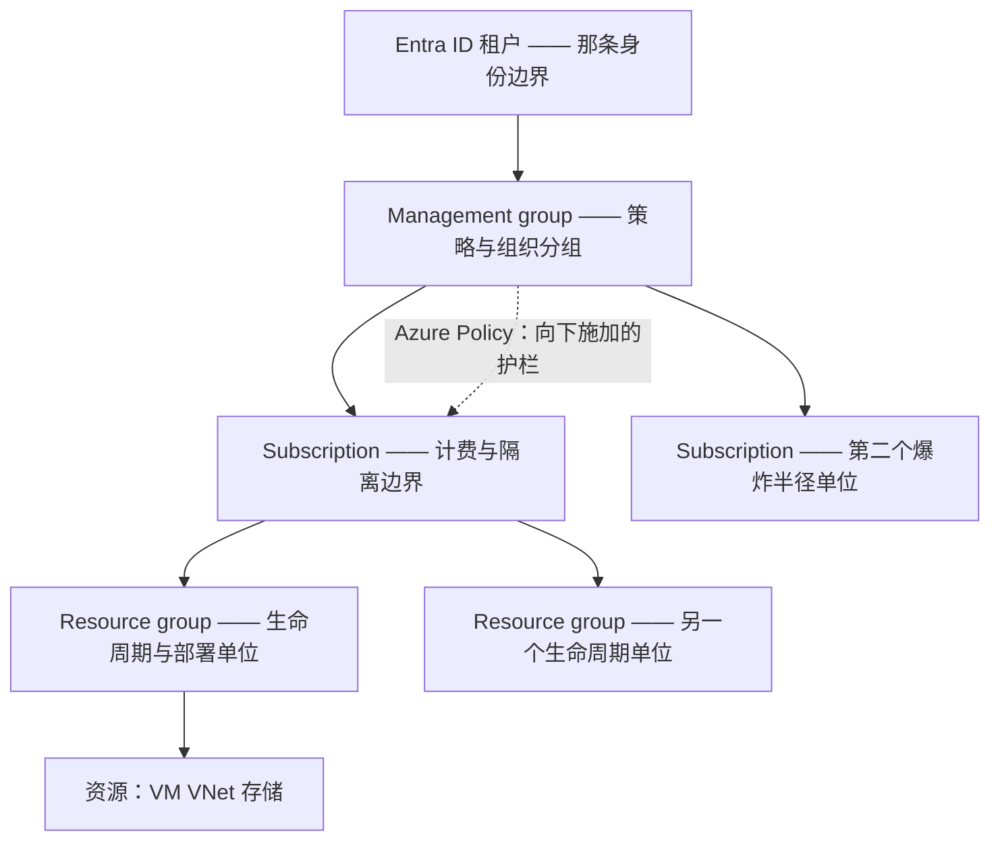
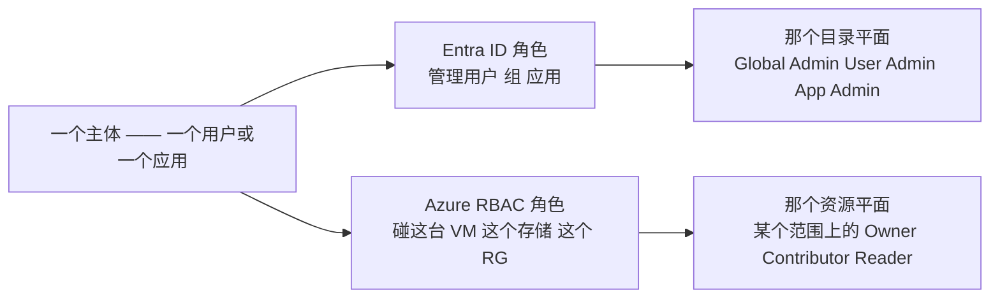
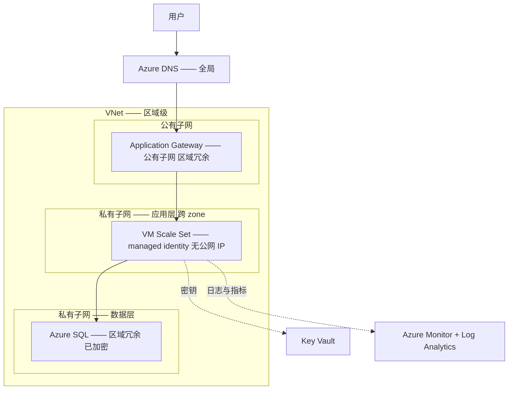

# Azure —— 理解它的架构

> 🌐 **语言：** [English（默认）](../../../../platforms/azure/architecture.md) · **中文**
>
> ⚠️ 本项目**默认语言为英文**，`platforms/azure/architecture.md` 是"事实来源"。本页中文是多语言支持的一部分，可能略滞后于英文版；两者不一致时以英文为准。

---

> [README](README.md) 把 Azure 映射到了那七片面上 —— *那些服务是什么*。这篇笔记是上面那一层：
> *Azure 是怎么组织的*，好让你**顺着**它的架构去设计，而不是跟它打架。把那个管理层级、那份
> region/zone 地理，以及 —— 最要紧的 —— **那两个权限平面**弄对，多数"这个为什么被拒绝"的问题会
> 自己回答自己。

Azure 不是一堆服务；它是一小组组织原则，上面挂着一些服务。学会那些原则，那些服务就变成查表。
承重的有五个 —— 而其中一个，那个身份分野，是抓住每一个从 AWS 过来的人的那个 Azure 特有陷阱。

## 1. 那个管理层级 —— 那个爆炸半径单位

AWS 把**账号**当成它的硬边界，而 Azure 给你一个四级层级，每一级都有一份不同的活。这是 AWS
Organizations 加 SCP 的对应物，而把它搞错就是那个 Azure 爆炸半径错误：

- **subscription 是那条计费与规模边界** —— 最接近一个 AWS 账号的东西。生产和开发放在不同的
  subscription 里，给你真实的隔离和逐 subscription 的成本。把一切堆进一个里，和一个大 AWS 账号是
  同一个错误。
- **resource group 是那个生命周期单位** —— 而且它*在 AWS 里没有干净的对应物*。一切都恰好住在
  一个 RG 里；删掉那个 RG，它的内容就跟着走。这让它成为部署和拆除的天然单位
  （[`iac`](../../cross-cutting/iac-and-config.md)）。
- **management group 加 Azure Policy 是那些护栏** —— 在一个 management group 上施加的策略会向下
  流到它下面每一个 subscription 和每一个资源，让整类动作变得*不可能*（不许有公网 IP、必须加密）。
  这就是 [`the-stack/07`](../../the-stack/07-security.md) 那份策略即代码，也是 Azure 对 SCP 的
  回答。
- **那个心智模型：** resource group 是一间带锁的屋子，subscription 是那栋楼，而 management group
  持有那栋楼的规矩。在给屋子添家具之前先设计屋子 —— RBAC 范围、成本和策略全都以这个层级为键。

## 2. Region、zone 与配对 region —— 你要对着设计的那份地理

这就是 [`the-stack/01`](../../the-stack/01-physical.md) 那个故障域模型，用 Azure 的话说，外加一个
AWS 没有以同样形态提供的概念：

- 一个 **Region**（例如 `eastus`）是一片地理区域 —— 按延迟、数据驻留，以及哪些服务在那儿真的可用
  来挑（不是全都可用）。
- 一个**可用区**是一个或多个物理上分开、有独立供电、制冷和网络的数据中心。**区域冗余就是你怎么
  熬过一次建筑故障；** 本想要区域冗余却做成了单区部署，正是那整个故障域模型存在去防止的那个错误。
- **配对 region** 是 Azure 那个独特的转折：多数 region 是预先配好对的（例如 `eastus` ↔ `westus`），
  用于平台托管的复制和顺序滚动更新 —— 那是一个你要**朝着它**去设计的 DR 原语，而不是 AWS 以同样
  方式暴露出来的东西。

那份设计直觉：**为可用性跨 zone 铺开、刻意地挑 region，并把那个 region 配对当成你的 DR 锚点。**

## 3. 那两个权限平面 —— Azure 的签名式陷阱

这是那个在 AWS 里没有对应物的东西，而它是第一大 Azure 身份错误：
**Azure 有两套分开的权限系统，不是一套。** AWS 有单一的 IAM；Azure 把授权拆在一个目录平面和一个
资源平面上（[`身份`](../../cross-cutting/identity-iam.md)）：

- **Entra ID 角色**管的是那个**目录** —— 谁能创建用户、注册应用、管理组。Global Admin 住在这里。
- **Azure RBAC 角色**管的是**资源** —— 谁能启动这台 VM、读这个存储账号、往这个 resource group 里
  部署。Owner/Contributor/Reader 住在这里，每一个都是*在一个范围上*被分配的（management group /
  subscription / RG / resource）。
- **它们互相不蕴含。** 一个 Entra 里的 Global Admin 可以对一台 VM 有**零**访问权；一个
  subscription Owner 可能没法把一个用户加进一个组。"我的动作被拒绝了而我是管理员"，几乎总是意味着
  你是*另一个平面*上的管理员。
- **范围继承是第二个陷阱：** 一个在 subscription 上的 RBAC 角色会向下流到每一个 RG 和资源。
  把 `Owner` 分配得太高，就是爆炸半径悄悄变成全局的方式。在能把活干完的最窄范围上分配。

给这件事足够的分量：把那两个平面和那个 resource group 层级钉死，Azure 其余的部分就跟上来了
（[`skills-map.md`](skills-map.md)）。

## 4. 共担责任模型 —— 你的工作从哪儿开始

Azure 保障云**本身**；你保障云**里面**的东西 —— 而那条线随服务而动
（[`the-stack/07`](../../the-stack/07-security.md)）：

- **微软那一侧：** 那些物理数据中心、硬件、hypervisor，以及托管服务的内部。
- **你那一侧，永远：** 你的数据、你的身份和角色分配、你的 NSG 和网络配置、你的加密与密钥选择 ——
  而绝大多数故障住在这里（一个公开的 blob 容器、一次过宽的 RBAC 授予），不住在 Azure 失败那边。
- 你在这个栈上走得越高（VM → Azure SQL → Functions），微软处理得越多 —— 但你的数据和访问控制永远
  不会不再是你的。

## Well-Architected 框架 —— 那份设计检查单

微软有它自己的版本 —— **五根支柱**，值得当作一面评审镜子来知道，而不是当作冷知识去背：

- **可靠性** —— zone/region 冗余、故障恢复、测过的备份（[`the-stack/04`](../../the-stack/04-storage.md)）。
- **安全** —— 在**两个**平面上都做最小权限、加密、可审计（[`the-stack/07`](../../the-stack/07-security.md)）。
- **成本优化** —— 承诺与工作负载匹配，没有被遗忘的资源（[`成本`](../../cross-cutting/cost.md)）。
- **卓越运营** —— 你跑得动它、改进得了它吗？（那份 [operations](operations.md) 文档）。
- **性能效率** —— 尺寸合适、用对了服务。

用得好，它就是发布**之前**该问的那组问题 —— 就是这个仓库所教的那份"什么会坏、什么暴露在外、
这要花多少钱"的直觉，被打包成 Azure 自己的检查单。

## 一份参考架构 —— 那些面怎么组合起来

那个典范式的三层 web 应用，以及每一片面出现在哪：

每一片面都在场：**身份**（managed identity，机器上没有密钥）、**网络**（VNet、公有/私有子网、
NSG、App Gateway）、**计算**（跨 zone 的 VM Scale Set）、**存储**（区域冗余、已加密的 Azure SQL）、
**可观测性**（Azure Monitor 加 Log Analytics）、**安全**（Key Vault、加密、分层子网）。读这张图，
你就能看见整张[技能图](skills-map.md)在干同一件活。

## 诚实边界

🧭 **ramp，诚实地说 —— 外加一个在这里很要紧的 🔨 例外。** 那个可迁移的架构模型（爆炸半径思维、
故障域、共担责任、"在添家具之前先设计屋子"）是来自真实基础设施与机队工作的 🔨 手艺，被映射到
Azure 上并对着它的文档验证过 —— 不是一句"多年架构生产 Azure 估算面"的声称，那是 🧭。那个例外是
**身份平面**：Entra ID / Azure AD 的搭建和目录设计是货真价实的亲手做过的地面
（[`身份`](../../cross-cutting/identity-iam.md)），所以那一节讲两个权限平面的内容是从经验里写出来
的，不是从读文档写出来的。这里的声称是：一套扎实的架构模型，加上一条通向 Azure 那些资源面的、
快速且可验证的 ramp —— 而身份是那个已经很深的部分。
