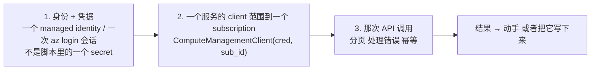
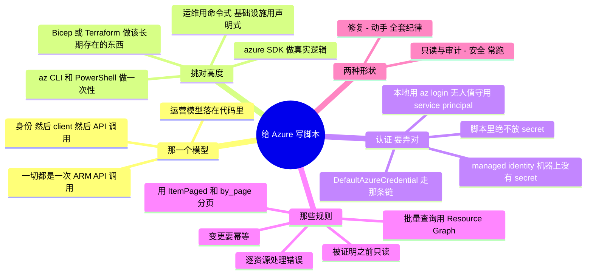

# Azure —— 把 API 写成脚本（从代码去管理与运维）

> 🌐 **语言：** [English（默认）](../../../../platforms/azure/automation.md) · **中文**
>
> ⚠️ 本项目**默认语言为英文**，`platforms/azure/automation.md` 是"事实来源"。本页中文是多语言支持的一部分，可能略滞后于英文版；两者不一致时以英文为准。

---

> [`architecture`](architecture.md) 是 Azure 怎么组织的；[`operations`](operations.md) 是跑它长
> 什么样。这篇笔记是那个*怎么做*：**从代码通过 API 驱动 Azure** —— 也就是
> [运营模型](../../00-the-operating-model.md)第 3 招"通过平台的 API 驱动它并把它写成代码"背后那门
> 具体的手艺。门户是用来看的；脚本和 IaC 是用来做的。

Azure 里的一切都是一次经过 Azure Resource Manager（ARM）的 API 调用。门户、CLI、PowerShell、
Terraform、那些 SDK —— 全都是同一批 ARM 端点的包装。一旦你把这件事内化，"我怎么自动化 X？"就不再
是一次找功能的搜索，而变成*"哪一次 API 调用，用哪个身份，处理哪些故障模式？"* 这一层正是一份脚本加
Linux 的背景（[`foundations/`](../../foundations/README.md)）直接变成云运维技能的地方。

## 那一个模型：一切都是 `(身份) → (client) → (API 调用)`

你对着 Azure 写的每一个脚本，都是[运营模型](../../00-the-operating-model.md)那三招，落在代码里：

把这三样弄对 —— 一个**受限身份**、一个**范围在 subscription 上的 client**，以及一次**被正确调用的
API** —— 你就能自动化 Azure 所暴露的任何东西。有一件 Azure 的事值得先说出来：它同时带一个一等的
CLI **和**一个一等的 PowerShell 故事，所以"从 shell 里做一次性的事"有两个同等受支持的答案，
下面就说。

## 那架工具阶梯 —— 挑对高度

驱动这套 API 的五种方式，从快到耐久。够错了高度是一个常见错误：

| 工具 | 它是什么 | 什么时候去够它 |
| --- | --- | --- |
| **Azure CLI**（`az ...`） | 作为 shell 命令的 API，跨平台 | 一次性检查、快速修复、Bash 脚本里的胶水、探索 |
| **Azure PowerShell**（`Az` 模块） | 作为 PowerShell cmdlet 和对象的 API | 同样的事，当你活在 PowerShell 里 / 在 Windows 上，并且想要对象而不是文本 |
| **Azure SDK**（Python `azure-*`） | 作为一个库的 API | 真实逻辑 —— 循环、分支、数据整形、一个真正的工具 |
| **Bicep** | **声明式**期望态，Azure 原生 | 只在 Azure 上、你想用原生语言写、和 ARM 紧耦合的基础设施 |
| **Terraform** | **声明式**期望态，跨云 | 可复现、被评审、可销毁的基础设施 —— 尤其是多云（[`iac`](../../cross-cutting/iac-and-config.md)） |

那条要紧的分界线：**`az`/PowerShell/SDK 是*命令式*的 —— "现在做这次调用"；Bicep 和 Terraform 是
*声明式*的 —— "这是应该存在的东西。"** 用命令式脚本做*运维*（盘点、修复、一次性查询、编排）；
用 IaC 做*发放*（那些应该长期存在的基础设施）。用一个 SDK 的 `begin_create_*` 脚本而不是
Bicep/Terraform 去建持久的基础设施，是在逆着纹理走 —— 你写了一个更差的、没有 state 的 Terraform。
Bicep 对 Terraform 是那个子选择：**全押 Azure 时用 Bicep，跨云或者已经标准化在它上面时用
Terraform。**

## 认证 —— 把这个弄对，否则别的都不要紧

那条最重要的规则，也是 AI 和教程最常搞错的一条：**绝不要把一个 secret 放进一个脚本。**
那条凭据链，按优先顺序：

- **在一台 VM 上 / 在一个 Function 里 / 在一个容器里** → 一个挂在那个计算资源上的
  **Managed Identity**（system 或 user 分配）。SDK 会自动捡起它；*任何地方都没有 secret*。
  这是 Azure 对一个 AWS instance role 的回答，也是任何跑在 Azure 里的东西的正确默认项。
- **在你笔记本上** → **`az login`**（或 `Connect-AzAccount`），它会缓存一个短寿命、自动刷新的
  会话，SDK 会复用它。磁盘上没有密钥。
- **给 Azure 之外的无人值守自动化** → 一个带证书或联合凭据的 **service principal** —— 不是一个你
  必须手工存储和轮换的 client secret。
- **绝不** → 一个硬编码在脚本里、在一个仓库里，或者在一个你可能会提交的 env 文件里的 client secret
  或账号密钥。那就是 [`operations.md`](operations.md) 里那次泄露凭据的事故，提前提交了。

来自 **`azure-identity`** 包的 `DefaultAzureCredential` 替你走这条链 —— 先 managed identity、
再环境变量、再那个 `az` 会话 —— 和 `boto3.Session()` 完全类比。而这**就是**为什么一个好的 Azure
脚本只构造一个 `DefaultAzureCredential()`、从来不提一把密钥。让那条链去做它的活；你代码里没有凭据，
正是重点。

## 把一个能用的脚本和一把自伤枪分开的那些规则

就是 [`foundations/`](../../foundations/README.md) 那门幂等与错误处理的纪律，落在 Azure 的具体上：

- **分页 —— 永远要。** Azure SDK 返回 `ItemPaged` 迭代器；遍历它们会透明地跟随 continuation token，
  而 `.by_page()` 给你那些原始页。一个只读第一页的脚本会静默地漏掉它之后的一切 ——
  那是手写和 AI 写的 Azure 脚本里同样的第一号 bug。
- **批量查询优先用 Azure Resource Graph。** 要问"每一台没加密的 VM"或者"每一个公开的存储账号"、
  横跨很多 subscription 时，一条 **Resource Graph** 的 KQL 查询胜过逐 subscription 循环管理 API
  —— 更快、更便宜，而且它**就是**那个 Azure 特有的动作。只有在 Graph 回答不了那个问题时，才去够
  逐资源枚举。
- **逐资源处理错误，别让整次运行崩掉。** 一个你没有访问权的 subscription、或者一次被限流的调用，
  应该记录下来然后继续 —— 而不是中止整次盘点。把每一个工作单元包在对 `HttpResponseError` 的
  `try/except` 里。
- **预期会被限流；退避。** ARM 会限速。SDK 默认会重试，但重的脚本仍然需要尊重 `429` 响应 ——
  指数退避，不是一个紧凑的重试循环。
- **变更要幂等。** 一个修复脚本必须能安全重跑：先检查再动手（"这条 NSG 规则已经没了吗？"），
  不是盲目动手。重跑应该收敛，不该重复施加或者崩掉 —— 就是 Bicep 和 Terraform 在结构上强制的同一条
  规则（[`iac`](../../cross-cutting/iac-and-config.md)）。
- **在被证明之前只读。** 先对着 `list`/`get` 调用去开发；只有在逻辑被证明之后才加
  `begin_create_*`/`begin_delete_*`。给任何破坏性的东西加一个 `--dry-run` 参数，是便宜的保险。

## 自动化脚本的两种形状

多数 Azure 运维脚本是两种形状之一：

- **只读/审计脚本** —— 盘点、合规检查、成本/标签报表、"找出每一个违反 Y 的 X"。只读、安全、常跑。
  通过 Resource Graph 做一次 subscription 盘点是那个典范例子；一个合规变体（"每一个公开的容器"、
  "每一个对互联网开放的 NSG"、"每一块未加密的磁盘"）是同一副骨架换一个过滤器。
- **修复/编排脚本** —— 它**动手**：给没打标签的资源打标签、按日程停掉闲置 VM、在 Key Vault 里轮换
  一个 secret、按日程释放一个 scale set。它会变更状态，所以它承担上面那全套纪律 —— 幂等、受限身份、
  先 dry-run、有记录。

要内化的那个递进：**只读脚本安全地把肌肉练出来；修复脚本小心地把它施加出去。** 每一个新的自动化都
从一个"找出那个问题"的只读脚本开始，等你信得过那个发现之后再加上那个修复。

## AI 怎么协助写这些自动化

[运营循环那一节的 AI](operations.md)讲的是故障里的 AI；这里讲的是 AI 写*代码*。确实提速，
而且有具体的陷阱：

- **对骨架很在行：** *"一个 azure-mgmt 脚本，跨这个 subscription、分页地列出每一个开着公开访问的
  存储账号"* —— AI 几秒钟就写出那个形状，而且它在结构上通常是对的。
- **对查 API 很在行：** *"哪个 SDK client 和哪个方法能拿到一个存储账号的公开访问设置？"* ——
  比翻文档更快，*前提是*你去核实它真的存在。
- **AI 会烧到你的地方（验得最狠的地方）：** 它会**发明不存在的 SDK 方法名**（那片面很大，而它靠
  猜）；它会**把包名搞错** —— `azure-*` 这套 SDK 出了名地容易弄混（`azure-mgmt-compute` 对
  `azure-mgmt-network` 对 `azure-storage-blob`，以及更老的 `azure-mgmt-resource` 拆分），所以一个
  幻觉出来的 import 看起来很像，而它只在运行时才失败；它会**忘掉分页**，递给你一个静默少报的脚本；
  而且它会**硬编码或者建议一个 client secret**，而不是用 `DefaultAzureCredential`。这里面每一条
  都是上面的一条规则 —— 而这正是为什么你要**拥有**那些规则，并把 AI 的初稿当成一份等着被审的初筛。
  对着一个沙箱 subscription 只读地跑一遍；错的包或者漏掉的那一页会立刻冒出来。

## 管理纪律（你应该做得到什么）

- 用一个 **managed identity**（或者本地的 `az login`）给一个脚本做认证，代码里没有 secret，并解释
  是那条 `DefaultAzureCredential` 链让它成功的。
- 写一个**分页的、知道 subscription 的、处理了错误的**只读脚本 —— 并证明它看到了一个天真的
  单页脚本会漏掉的资源。
- 用 **Azure Resource Graph** 回答一个批量问题，并知道什么时候该回退到逐资源枚举。
- 把一个只读脚本变成一次**安全的修复** —— 幂等、先 dry-run、有记录 —— 针对一件真实的任务
  （标签强制、释放闲置 VM）。
- 为一件任务在 **`az` 对 SDK 对 Bicep 对 Terraform** 之间做选择，并为那个高度辩护。
- 读懂一条 Azure **API 错误**（`AuthorizationFailed`、`429`、`ResourceNotFound`），并知道每一条
  告诉你接下来该做什么。

## 诚实边界

🔨 **在要紧的地方，而且这里就要紧。** 那门脚本与自动化纪律是亲手做过的 —— Python 和 Bash
（以及做 Windows Server 工作时的 PowerShell）是日常工具、分页/幂等/处理错误的自动化，以及那份建在
真实机队脚本工作之上的"先只读、再动手"的直觉（[`foundations/`](../../foundations/README.md)）。
**身份那一端是双重的 🔨**：managed identity、service principal 和受限的 RBAC，正是我直接做过的
那片 Entra/Azure AD 地面（[`身份`](../../cross-cutting/identity-iam.md)）。Azure API 的那些
**细节**（准确的 `azure-*` client、ARM 的怪癖、Resource Graph 的 schema）是那条 🧭 ramp。
这里的声称是一份很强的自动化地基，加上一条通向 Azure API 面的、可验证的 ramp —— 不是多年的生产
Azure 平台工程。

## Lab（已写规格 —— 构建顺序在 labs README 里）

[Azure 那些 lab](../../../../platforms/azure/labs/)对应 AWS 那一组：一次**受限身份的 subscription
盘点**（一个最小权限 Reader 加一个把结果写成 CSV 的 Resource-Graph / `az` 脚本 —— AWS lab 01 的
Azure 孪生），然后一个用 Terraform 写的、经 Bastion 够得到、不开任何端口的**最小 VNet 加 VM**，
然后 **Key Vault 加 managed identity**，然后一个 **Budget 加 Azure Policy** 护栏。它们会随着这个
模块成熟而落地；每一个都会在只读、最小权限、分页、知道 subscription 的代码里演示上面每一条规则。

## 这篇文档一屏看完

