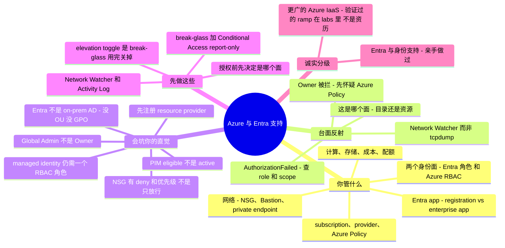

# Azure 与 Entra 支持 —— 运维者的转轨指南

> 🌐 **语言：** [English（默认）](../../../../platforms/azure/support.md) · **中文**
>
> ⚠️ 本项目**默认语言为英文**，`platforms/azure/support.md` 是"事实来源"。本页中文是多语言支持的一部分，可能略滞后于英文版；两者不一致时以英文为准。

---

> [`operations.md`](../../../../platforms/azure/operations.md) 讲的是运营你自己那套 Azure 的**节奏**。本篇讲另一半：**把 Azure 和 Microsoft Entra ID 支持当作一门修/救（break-fix）手艺** —— 真正反复出现的工单、精确的排查落点，以及**一个来自别的方向（AWS、GCP、或 on-prem AD）的强 sysadmin 接手它时，哪些直觉会坑他。** 注意本页守着的诚实分级：**Entra / 身份**那一半是 ✋ 亲手做过（真实租户实战——MFA、Conditional Access、PIM、Entra 初始搭建）；更广的 **Azure IaaS** 是 🧗 ramp。两者都如实标注。

Azure 自己的[平台篇](../../../../platforms/azure/README.md)一句话说清了那个经典错误：*Entra = 你是谁，RBAC = 你能碰什么——把两者混淆是经典错误。* 这句话就是本页存在的全部理由。一个"已经懂云"的运维接手 Azure 支持很快，然后在微软做了不同选择的那几处栽跟头：**两个独立的身份面**（Global Administrator **不是** Owner）、**不是** on-prem AD 的 Entra、你必须注册的 **resource provider**、以及一个连 Owner 都能拦下的治理面（**Azure Policy**）。本篇把职责、反复出现的工单及其诊断面、以及一个自信的云（或 AD）运维反射恰好失灵的那几处一一点名——并显式标出 AWS / on-prem-AD 对比，因为大多数读者是从那儿来的。

## 支持 Azure 与 Entra 让你要为什么负责

映射到 [seven surfaces](../../../../00-the-operating-model.md)，按工单到达顺序：

| Surface | 你要为之负责的事 |
| --- | --- |
| **身份——两个面** | **Entra ID 目录角色**（Global Admin、User Admin——管*租户*）vs **Azure RBAC**（Owner/Contributor/Reader——在 mgmt-group→subscription→RG→resource 层级上管*资源*）。PIM（eligible vs active）、Conditional Access、sign-in/audit 日志、break-glass。**✋** |
| **Entra app 身份** | app registration vs enterprise app（service principal）、delegated vs application 权限 + admin consent、过期 secret、managed identity（system vs user-assigned）。**✋** |
| **subscription 与治理** | resource provider 按 subscription 注册、**Azure Policy** 护栏、配额——那些"不是 RBAC，是 policy/provider"的工单。 |
| **网络** | "为啥 X 到不了 Y？"—— **NSG**（有状态、allow **和** deny、优先级、默认规则）、UDR、Azure Firewall、**Bastion**（无公网 IP）、Private Endpoint DNS、peering。 |
| **计算** | 通过 **Bastion / serial console / run-command** 的 VM 访问、managed disk、VMSS、boot diagnostics。 |
| **存储与数据** | 存储访问经 **RBAC vs SAS vs account key**、public-access、firewall；Azure SQL 连接。 |
| **负载均衡与 TLS** | Load Balancer（L4）vs Application Gateway（L7 + WAF + TLS）、Key Vault 证书、后端健康。 |
| **可观测性** | **Activity Log**（控制面"谁干的"）、Azure Monitor / Log Analytics（**KQL**）、Resource Health、Service Health。 |
| **成本与配额** | Budget、egress、孤儿磁盘/IP；per-subscription、per-region 配额。 |
| **升级给微软** | Network Watcher、sign-in-logs 的 CA 页、以及何时该开 support case。 |

## 常见工单 —— 以及去哪查

Azure 的修/救本质是在门户、两个 CLI（`az`、`Az` PowerShell）、和 **Activity Log** 上做模式识别。你要练成的反射是：**"哪个面/面板能回答这个问题，它又有什么局限？"**

**身份——`AuthorizationFailed`（403），头号工单。** 登录的 principal 在**所选 scope** 上缺这个动作。查 **Access control (IAM) → Role assignments**——**role** *和* **scope** 都要确认——并给**传播（~10–30 分钟）**留时间。`az role assignment list`，与 **Activity Log** 交叉核对。Azure 标志性变体：*"我是 **Global Administrator** 却看不到/管不了这台 VM。"* Global Admin 是 **Entra 目录**角色；它对 Azure 资源**一无所授**。唯一的桥是 **Entra ID → Properties → "Access management for Azure resources" → Yes**，它给那个用户 root scope `/` 上的 **User Access Administrator**——够*分配*角色（break-glass），不够*使用*资源。用完关掉。

**Conditional Access 拦掉合法登录** → `AADSTS53003 (BlockedByConditionalAccess)`。**Entra ID → Sign-in logs → 那次失败事件 → Conditional Access 页**点名具体策略；**Troubleshooting and support** 页给原因。（managed identity 满足不了 MFA / compliant-device 授予。）

**App / service-principal 认证。** 经典：`AADSTS7000215 "Invalid client secret is provided"` = **过期/轮换的 secret**（或你把 secret 的 **ID** 当成了它的 **Value**）——去 **Certificates & secrets** 重建。`AADSTS50105` = principal 没被指派到那个 app。而能修好大多数 app 认证的调试顺序：**delegated vs application 权限 → admin consent（记在 enterprise app / service principal 上，不是 app registration）→ secret 过期 → redirect URI。** 一个**没有 RBAC 角色**的 managed identity 什么都干不了——给它授个角色。

**"这不是 RBAC——resource provider 没注册。"** 部署失败报 `MissingSubscriptionRegistration: The subscription is not registered to use namespace 'Microsoft.X'`——一次性的按-subscription 确认，`az provider register --namespace Microsoft.X`，**不是**权限问题。

**"这不是 RBAC——Azure Policy 拒了它。"** 一个部署不了的 **Owner** 常撞上 `RequestDisallowedByPolicy`——某个 scope 上一条 **Deny-effect 的 Azure Policy**（不许公网 IP、允许的 region、必需 tag）。Policy 管*什么状态能存在*，不看你是谁；Owner 被拦时，先怀疑它、再怀疑 RBAC。

**PIM——"我有角色却被拒。"** 用了 Privileged Identity Management，角色可能是 **eligible**（你必须**激活**，即时申请，有时要 MFA / 理由 / 审批）而非 **active**。下结论说权限坏了之前先查 PIM。

**网络——"到不了我的 VM。"** 记住形状：**NSG** 是**有状态**（不用写反向规则）、有 **allow *和* deny** 规则按**数值优先级**（越低越优先、首个匹配）、有内建**默认规则**（含 deny-all-inbound-from-internet）、按 **subnet 再 NIC** 评估。无公网 IP 的 VM 经 **Bastion** 访问，不是开个公网 SSH 口。*去哪查：* **Network Watcher**——**IP flow verify**（这个包被允许/拒绝、由哪条规则）、**Effective security rules**（subnet+NIC 合并结果）、**Next hop**（UDR 黑洞）、**Connection troubleshoot**、**NSG flow logs**——不是在你碰不到的 fabric 上 `tcpdump`。一个解析不了的 **Private Endpoint** 通常是**私有 DNS zone 没链接到 VNet**。

**存储——403。** 分清 **RBAC vs SAS vs account key vs public-access-disabled vs 网络防火墙**。陷阱：一个 **subscription-scope 的角色不授予 blob/queue 的*数据*访问**——在 account/container 上授个**数据**角色（如 Storage Blob Data Contributor）。优先 **user delegation SAS**（Entra 签）而非 account key。

**配额与成本。** vCPU 的 `QuotaExceeded` 是 **per-subscription、per-region 的两层（Total Regional + per-family）**——在 **My quotas** 里、按 region、在部署**之前**提额。成本惊吓是 egress 和孤儿磁盘/公网 IP；护栏是 **budget**，**Advisor** 标出闲置资源。

## 经验差 —— 一个强 sysadmin 的直觉会错在哪

做过 Azure/Entra 支持的人和没做过的人之间的差距不在门户——而在一组承重假设（从 AWS、GCP、或 on-prem AD 搬来），它们在这里是**错的**，每条都挂着失效模式。

- **两个身份面——"Global Administrator 不是 Owner。"** 微软明说：*默认 Global Administrator 对 Azure 资源没有访问权。* **Entra 目录角色**（Global Admin、User Admin——管用户/app/租户）和 **Azure RBAC**（Owner/Contributor/Reader——在某 scope 管资源）是**两套互不跨越的授权系统**。在一个里无所不能，在另一个里*一无所有*；角色**名字甚至会撞**、含义却不同（"Security Administrator" 在两边是不同角色）。唯一的桥是 **elevation toggle** → root `/` 上的 User Access Administrator（分配，不是使用）——一个 break-glass 工具，不是日常。[lab](../../../../platforms/azure/labs/global-admin-is-not-owner/) 证明这点。
- **Entra ID 不是 on-prem AD。** 没有 **OU**、没有 **GPO**、没有 forest/domain/trust、没有 LDAP 树。它是跑在**扁平目录**上、由 **Microsoft Graph** 查询的 OAuth2/OIDC/SAML；管理按 **administrative unit + RBAC** 划分（不是 OU 委派），设备策略是 **Intune** 而非 Group Policy。你那套 ADUC/GPMC/`gpresult` 的肌肉记忆**不会**迁移。
- **层级向下继承、additive——而且没有日常的用户"deny"。** RBAC 授权挂在 **mgmt-group → subscription → RG → resource** 上、流向所有子级、是**并集**；**没有用户自写的子级 explicit deny**（系统管理的 **deny assignment** 存在，但你很少自己写）。**scope 就是一切**——同一个角色在 `/` vs 一个 RG 是不同的爆炸半径。（GCP 的人：继承直接迁移；AWS 的人：这里没有 `Deny` 语句可用。）
- **subscription 是单位——而 resource provider 起步未注册。** **subscription** 是账单/配额/隔离边界（≈ 一个 AWS account / GCP project）；**management group** 把 subscription 分组给 RBAC + Policy。而每个 **resource provider** 都要**先按 subscription 注册**（GCP 的 API 启用平行物；**AWS 没有对应物**，所以 AWS 迁来的人最容易被打个措手不及）。
- **app registration vs enterprise application（service principal）。** **app registration** 是家租户里的*定义*（client ID、redirect URI、请求的权限、secret）；**enterprise app / service principal** 是你租户里的*实例*，**consent、sign-in 日志、本地授予**都在那儿。**delegated**（作为用户）vs **application**（作为自己、需 **admin consent**）权限，以及 **admin consent 记在 service principal 上**，是头号 app 认证困惑。
- **managed identity 仍然需要一个 RBAC 授权。** system-assigned（绑资源生命周期）vs user-assigned（独立、可复用）省掉了密钥处理——但一个**没有角色分配的 managed identity 什么都干不了**（而且它的角色变更传播可能要**几小时**）。它是 AWS 的 instance-profile / GCP 的 attached-SA 模式；只是记住授权是单独一步。
- **NSG 不是 AWS security group。** 它**有状态**（像 SG）但**有 deny 规则、数值优先级、内建默认规则**（像 NACL）、并挂在 **subnet 和/或 NIC**。一个混血，AWS 哪个对象都不匹配——别以为"只放行"；一条更低优先级号的 explicit deny 会赢。读 **Effective security rules**。
- **Azure Policy 是第三个面。** RBAC = *谁能干*；Policy = *什么状态能存在*。一条 Deny-effect 策略拦掉 **Owner**（`RequestDisallowedByPolicy`）。平行于 AWS SCP / GCP Org Policy，但更广（它还审计和整改）。
- **"谁干的"是 Activity Log——而数据面日志需开启。** **Activity Log** 是控制面审计（≈ CloudTrail 管理事件 / GCP Admin Activity），保留约 90 天；读一个 secret 或一行数据是**资源日志**，**只有**你加了 **diagnostic setting** 才捕获。
- **控制台会撒几分钟谎。** RBAC 变更要 **~10–30 分钟**（managed identity：**几小时**）；*"刚授完就 access denied"* 通常是传播——刷新 token，别反复横跳。而 **soft-delete** 窗口（Key Vault 7–90 天、存储、资源）意味着"删了"不总是没了——重用名字前先知道窗口。
- **配额是 per-subscription、per-region、软的、不自动长**——新 region 起步*低*；大部署会因 vCPU 配额失败，除非你先在那儿提了额。

## 什么可迁移，什么不可

| 强迁移 | 带保留地迁移 | 别带过来 |
| --- | --- | --- |
| Linux / guest-OS 深度——Azure 跑着巨量 Linux | 身份与最小权限*思维*——映射到 RBAC scoping + PIM（可能更好） | on-prem AD 的 **OU/GPO** 直觉——没 OU、没 GPO；AU + RBAC + Intune |
| DNS、TLS/证书、TCP/IP、CIDR | 防火墙/ACL 推理——NSG 有状态**且**有序**且** allow/deny | "Global Admin 无所不能"——为假；Global Admin ≠ Owner |
| 结构化排障——Azure 错误很具体（`MissingSubscriptionRegistration`、`RequestDisallowedByPolicy`） | 层级/继承直觉——从 GCP 迁移；AWS 需为"无 `Deny`"重新校准 | AWS 单-JSON-策略反射——Azure 把 Entra / RBAC / Policy 拆成三个面 |
| 脚本与 IaC（`az`、Bicep、Terraform） | 一致性假设——为 ~10–30 分钟 RBAC 传播（MI：几小时）重新校准 | "security group 只放行"——NSG 有 deny + 优先级 |
| 日志阅读含 **KQL**（SQL 相邻） | "服务就是现成的"——先注册 resource provider | 抓包——用 Network Watcher |
| 变更纪律（report-only、IaC、回滚） | | "Owner 能部署一切"——Azure Policy 连 Owner 都能拒 |

## 第一周 / 前 90 天

**第一周。**
1. **在授权任何东西之前，内化 Entra-角色-vs-Azure-RBAC 的分裂**——每个请求，先决定*目录面*还是*资源面*。别为修一个 Azure 资源问题就发 Global Administrator。
2. **知道 Global Admin ≠ Owner，以及 elevation toggle 在哪**——"Access management for Azure resources" → root `/` 上的 User Access Administrator——只作 break-glass，然后关掉。
3. **给每个 subscription（账单单位）设 budget**，并在部署前**注册 resource provider**。
4. **先学 Network Watcher + Activity Log**，再加 **diagnostic setting** 捕获数据面日志、把 Activity Log 留过约 90 天。

**前 30 天。**
5. **在强制执行前，建 break-glass 账号并让 Conditional Access 跑 report-only**——把 break-glass 排除在所有 CA 策略外、配抗钓鱼 MFA。
6. **调 app 认证前，先搞懂 app-reg vs enterprise-app + consent**——delegated-vs-application、SP 上的 admin consent、再 secret 过期。
7. **给每个 managed identity 授它的 RBAC 角色**（并给传播留几小时）。
8. **当一个 Owner 部署不了时，先怀疑 Azure Policy**（`RequestDisallowedByPolicy`）、再 RBAC。

**前 90 天。**
9. **下结论说权限坏了之前先 PIM 激活**——eligible ≠ active。
10. **在部署前按 region 提额**——默认低且 per-region。
11. **对新授权预期最终一致**（~10–30 分钟；MI 几小时）——刷新，别横跳。
12. **重用名字或宣布数据没了之前，先知道 soft-delete 窗口。**

## AI 辅助的 ramp（Azure/Entra 口味）

- **从你已知的翻译过来——并索要 deltas：** *"我懂 AWS IAM 和 on-prem AD —— 把 Azure 的两个身份面、RBAC scope、和 Entra 映射到它们上，只标出真正的差异。"* Azure 奖励 translate-then-verify 方法，因为它太多是改了名的——但**两个面的分裂和 Azure Policy 没有干净的 AWS 对应物**，所以那些要往死里验证。
- **让它起草 `az`/PowerShell/Bicep，你亲手做最小权限。** AI 在这里很强——而它也会**把 Entra 角色与 Azure RBAC 混为一谈**（你要的是某 scope 的 Reader、它给你 Global Administrator）、**发明角色/权限名**、忘了 resource provider、并提一个 blast radius 是整个 management group 的 scope。对着文档核验、并在一次性 subscription 里跑。同一套"往死里验证"的纪律——见 [`ai-workflow/`](../../../../ai-workflow/) 和[运营环](../../../../platforms/azure/operations.md)。

## 诚实边界

本页守着一条**分割的**诚实线，而且是真实的。

✋ **Entra / 身份那一半是亲手做过的。** 真实租户实战——**Entra ID 初始搭建、租户级 MFA、一条 Conditional Access 策略、privileged 角色的 PIM**、以及身份生命周期——是深度，不是 ramp（与 [`saas-admin.md`](../../../../cross-cutting/saas-admin.md)、[`identity-iam.md`](../../../../cross-cutting/identity-iam.md) 画的是同一条线，也与 [M365 支持篇](../../../../cross-cutting/m365-support.md) 共享，因为 Entra 是两者之下的身份骨干）。Conditional Access、sign-in 日志分诊、break-glass 纪律都是 ✋。

🧗 **更广的 Azure IaaS 是验证过的 ramp。** 资源面机制——RBAC scope 与继承、VNet/NSG、Bastion、Azure Policy、配额/provider 的边——是被映射、对着文档核验、并在可跑的 [lab](../../../../platforms/azure/labs/global-admin-is-not-owner/) 里练过的，由**✋ 可迁移基本功**（Linux、网络、DNS/TLS、身份思维）承载。更深的规模化生产 Azure（landing zone、AKS 平台工程、大型多 subscription 资产）仍在前方，注释如实说明、绝不吹。

## Field kit —— 真实工具与参考

以下指针在 GitHub 上逐个核实存在，按用途分组。Entra-身份 与 Azure-资源 工具已标注；有几个安全工具兼作"认证到底怎么运作"的地图。

**Entra / 身份（✋ 那一半）：**
- [`merill/awesome-entra`](https://github.com/merill/awesome-entra) —— Entra 管理/运维工具最好的起点（由一位 Entra PM 维护）。
- [`maester365/maester`](https://github.com/maester365/maester) —— 基于 Pester 的测试，把"我的租户 / Conditional Access 配对了吗？"变成 pass/fail 检查。
- [`AzureAD/AzureADAssessment`](https://github.com/AzureAD/AzureADAssessment) · [`merill/idPowerToys`](https://github.com/merill/idPowerToys) —— 微软的 Entra 健康评估，和一个 Conditional Access 策略文档器（这次登录为啥被拦？）。
- [`dirkjanm/ROADtools`](https://github.com/dirkjanm/ROADtools) · [`Gerenios/AADInternals`](https://github.com/Gerenios/AADInternals) —— 离线 dump 并图形化租户的角色/app/consent；攻击起源，但是*理解* Entra 认证真实运作的参考。

**Azure 资源与治理（🧗 那一半）：**
- [`Azure/azure-cli`](https://github.com/Azure/azure-cli) · [`Azure/azure-powershell`](https://github.com/Azure/azure-powershell) —— 主检查/修复面；issue tracker 是事实上的排障 KB。
- [`microsoft/ARI`](https://github.com/microsoft/ARI) —— Azure Resource Inventory：任何支持工作的"我们到底有什么"基线。
- [`Azure/Enterprise-Scale`](https://github.com/Azure/Enterprise-Scale) —— landing-zone 的 RBAC/网络/policy 基线；一个金标准，用来 diff 一个出问题的租户。
- [`iann0036/azure.permissions.cloud`](https://github.com/iann0036/azure.permissions.cloud) —— 众包的 RBAC action 参考，用来解 `AuthorizationFailed`。

**姿态与成本（多云，含 Azure）：**
- [`prowler-cloud/prowler`](https://github.com/prowler-cloud/prowler) · [`nccgroup/ScoutSuite`](https://github.com/nccgroup/ScoutSuite) · [`silverhack/monkey365`](https://github.com/silverhack/monkey365) —— 跨两个面的"这个租户哪儿不对"审计。
- [`turbot/steampipe`](https://github.com/turbot/steampipe)（+ Azure 插件）—— 用 SQL 实时查 Azure/Entra，回答临时的配错/库存问题。
- [`mivano/azure-cost-cli`](https://github.com/mivano/azure-cost-cli) · [`infracost/infracost`](https://github.com/infracost/infracost) —— 终端里的 subscription 成本拆解，和 Terraform 的部署前成本。

**值得优先于任何博客收藏的权威文档**：**Microsoft Learn** 的
[Azure 角色 vs Entra 角色](https://learn.microsoft.com/en-us/azure/role-based-access-control/rbac-and-directory-admin-roles)、
[Elevate access（root scope）](https://learn.microsoft.com/en-us/azure/role-based-access-control/elevate-access-global-admin)、
[Network Watcher](https://learn.microsoft.com/en-us/azure/network-watcher/network-watcher-overview)、
以及 [app 对象与 service principal](https://learn.microsoft.com/en-us/entra/identity-platform/app-objects-and-service-principals)。
*（时效：**Azure AD 已改名 Microsoft Entra ID**——错误码仍写 `AADSTS…`；classic 的 subscription-admin 角色到 2026 年已退役——访问只走 RBAC。对着当前文档核实。）*

## Lab —— Global Admin 不是 Owner ✅ 可跑

**亲手证明 Azure 的标志性访问教训。** 一个纯本地、只用 stdlib 的 drill，把 Azure 的**两个身份面**建模：一个 **Global Administrator**（Entra 目录角色）试读一台 VM 被**拒**（没有 Azure RBAC）；一个 **Owner**（Azure RBAC）试建一个用户被**拒**（没有 Entra 角色）；**elevation toggle** 授予 root `/` 上的 User Access Administrator（分配，不是使用）；而真正的修法是一个**带 scope 的 RBAC 分配**——还展示了 scope 继承与隔离。

```bash
python3 platforms/azure/labs/global-admin-is-not-owner/two_planes_drill.py
```

exit `0` 表示教训都成立（兼作 CI 检查）。见 [`labs/global-admin-is-not-owner/`](../../../../platforms/azure/labs/global-admin-is-not-owner/)。

## 一页看全本章


