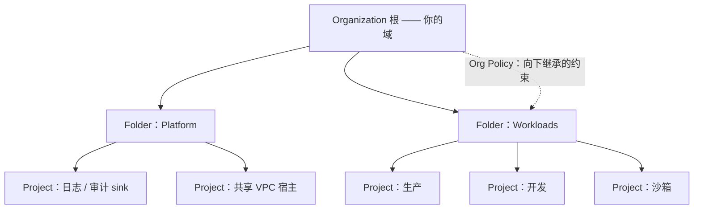
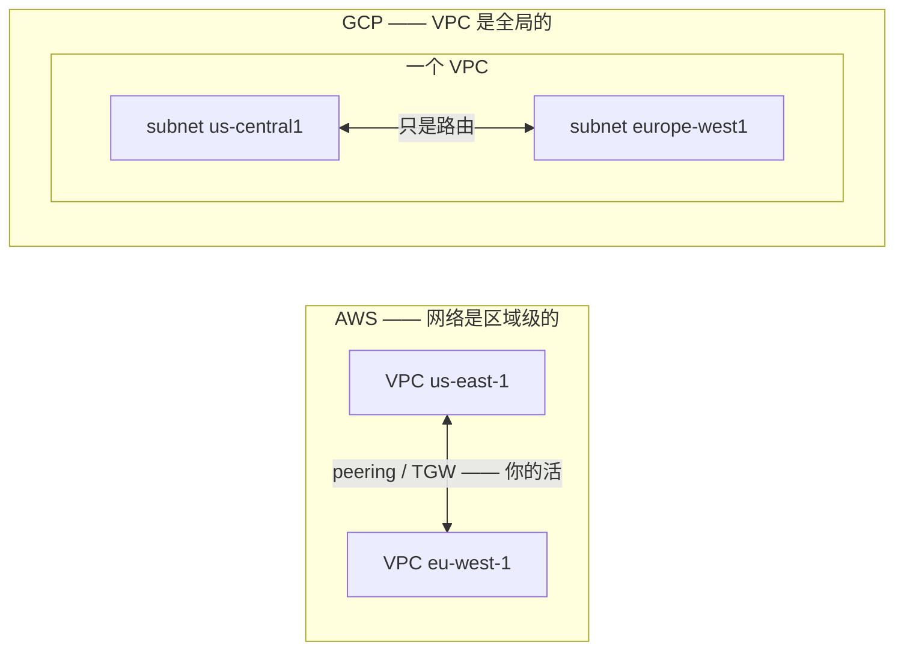
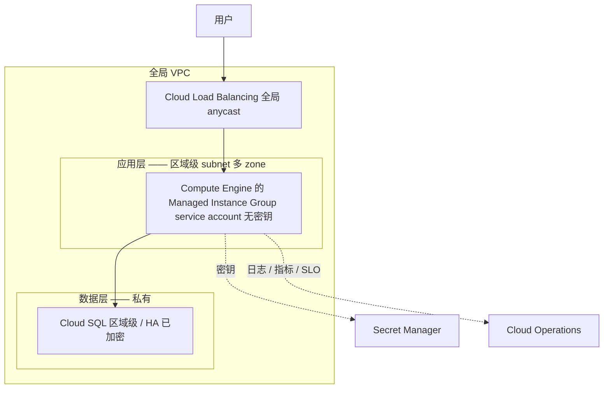

# GCP —— 理解它的架构

> 🌐 **语言：** [English（默认）](../../../../platforms/gcp/architecture.md) · **中文**
>
> ⚠️ 本项目**默认语言为英文**，`platforms/gcp/architecture.md` 是"事实来源"。本页中文是多语言支持的一部分，可能略滞后于英文版；两者不一致时以英文为准。

---

> [README](README.md) 把 GCP 映射到了那七片面上 —— *那些服务是什么*。这篇笔记是上面那一层：
> *GCP 是怎么组织的*，好让你**顺着**它的架构去设计，而不是跟它打架。把那个资源层级、那份
> region/zone 地理，以及那一个真正不同的想法 —— **全局 VPC** —— 弄对，多数"这个为什么不好使"的
> 问题会自己回答自己。

GCP 不是一堆服务；它是一小组组织原则，上面挂着一些服务 —— 而因为那些原则和 AWS 映射得这么干净，
这整份活就是学会 Google 做了不同选择的那四个地方。承重的有四个原则。

## 1. 那个资源层级 —— 那个爆炸半径单位

后果最重的那个 GCP 结构决定不是一个服务 —— 而是你怎么切分那个**资源层级**：
**Organization → Folder → Project → 资源。**

- **Project 是那个基本单位** —— 计费的、隔离的，以及爆炸半径的。它是最接近一个 AWS 账号的对应物：
  一个 project 里的资源够不到另一个的，除非通过显式授予。生产和开发放在*分开的 project* 里是基线，
  不是一次优化。
- **IAM 向下继承。** 一个在 Org 或 Folder 级绑定的 role 会流到它下面每一个 Project —— 很强大，
  也是一把自伤枪：树上高处一次宽泛的授予，就是下面处处都宽泛。这是要盯住的那个 GCP 特有错误
  （见 [`operations.md`](operations.md)）。
- **Org Policy 约束**是那些护栏 —— 组织级的规则，让整类配置错误在某个点之下变得*不可能*
  （[`the-stack/07`](../../the-stack/07-security.md) 那份策略即代码，GCP 对 AWS SCP 的回答）。
- **心智模型：** 一个 Project 是一间带锁的屋子；Folder 把那些屋子分组；Organization 是那栋楼；
  Org Policy 是那栋楼的规矩。在给它添家具之前先设计这个层级 —— 事后重构会很痛。

## 2. Region 与 Zone —— 你要对着设计的那份地理

[`the-stack/01`](../../the-stack/01-physical.md) 那个故障域模型，用 GCP 的话说：

- 一个 **Region**（例如 `us-central1`）是一片地理区域 —— 按到用户的延迟、数据驻留和服务可得性来挑
  （不是每个服务在每个 region 都有）。
- 一个 **Zone**（例如 `us-central1-a`）是一个或多个有独立供电、制冷和网络的离散数据中心。
  **多 zone 就是你怎么熬过一次建筑故障；** 两个副本都在一个 zone 里，正是那个故障域模型存在去防止
  的那个错误。
- GCP 那个更干净的 HA 原语：**区域级资源**（一块 regional Persistent Disk 跨两个 zone 同步复制；
  一个区域级 Managed Instance Group 替你把实例铺开到各 zone）—— 常常是一个比手工跨 zone 布置更好的
  默认项。

## 3. 那个全局 VPC —— GCP 的签名式差别

这是你的 AWS 直觉会主动误导你的那一个地方，所以给它足够的注意力：

- **一个 VPC 横跨整个星球；subnet 是区域级的。** 单个 VPC 可以在每一个 region 里都有 subnet，
  而它们默认就互相路由 —— 不需要 peering、不需要 transit gateway。一件在 AWS 上是个项目的多区域
  设计，在这里"只是路由"（[`the-stack/02`](../../the-stack/02-network.md)）。
- **防火墙规则瞄准 tag 或 service account**，不只是 IP 段 —— 一个和 AWS security group 不同的、
  身份感知的模型。
- 那个陷阱：一个 AWS 管理员在 GCP 上规划区域级 VPC 和 peering，于是建出某个不必要地复杂的东西；
  或者假定了一份全局 VPC 并不提供的隔离。在你画那张图之前先搞懂这个模型。

## 4. 以 service account 为中心的 IAM —— 你的工作从哪儿开始

GCP IAM 把 **role 绑定到资源层级上的 member**，而那个默认的工作负载身份是 **service account**：

- **service account 就是那个"机器上不放密钥"的答案** —— 把一个挂到一台 Compute Engine VM 或者一个
  Cloud Run 服务上，代码就以它的身份认证，而任何地方都没有密钥文件
  （[`身份`](../../cross-cutting/identity-iam.md)）。
- **角色有三个等级：** primitive（owner/editor/viewer —— 对真实用途来说太宽）、predefined
  （那个日常选择），以及 custom（恰好是某件任务所需的那些权限）。在最窄的范围上去够 predefined；
  必须的时候才写 custom。
- **共担责任：** Google 保障那些数据中心、硬件和托管服务的内部；你的数据、IAM、网络配置和加密选择
  永远是你的 —— 而且和处处一样，多数入侵住在那条线你这一侧
  （[`the-stack/07`](../../the-stack/07-security.md)）。

## Architecture Framework —— 那份设计检查单

Google 自己那面"这套架构好不好"的镜子，值得当作一次评审来知道：卓越运营、安全、可靠性、性能与成本
优化 —— 外加那份让 **SLO 成为原生的**、而不是外挂的 SRE 血统
（[`the-stack/06`](../../the-stack/06-observability.md)）。用得好，它就是发布**之前**该问的那组
问题 —— 就是这个仓库所教的那份"什么会坏、什么暴露在外、这要花多少钱"的直觉，装在 Google 的包装里。

## 一份参考架构 —— 那些面怎么组合起来

那个典范式的三层 web 应用，以及每一片面出现在哪：

每一片面都在场：**身份**（挂上去的 service account，没有密钥）、**网络**（全局 VPC、区域级 subnet、
防火墙规则）、**计算**（区域级 MIG）、**存储**（HA 的、已加密的 Cloud SQL）、**可观测性**
（Cloud Operations、原生 SLO）、**安全**（Secret Manager、加密）。读这张图，你就能看见整张
[技能图](skills-map.md)在干同一件活。

## 诚实边界

🧭 **ramp，诚实地说 —— 而且比 AWS 更是。** 这是那个可迁移的架构模型 —— 层级/爆炸半径设计、
故障域、共担责任 —— 被映射到 GCP 上并对着它的文档验证过，而且**不声称任何生产 GCP 运维**
（[README](README.md) 也是这么说的）。底下那些**直觉**（爆炸半径思维、多 zone 布置、最小权限、
"在添家具之前先设计这个层级"）是 🔨 —— 来自真实的基础设施和机队工作
（[`the-stack`](../../the-stack/README.md) 取材于它）—— 但这里每一样 GCP 服务的细节都是那条 ramp。
这里的声称是：一套扎实的架构模型，加上一条通向 GCP 版本的、快速且可验证的 ramp —— 这个仓库诚实的
立场（[`WHY.md`](../../WHY.md)），套到架构上，并把那四个异类（全局 VPC、project、自定义机型、
service account IAM）标出来，作为 AWS 反射失效的地方。
