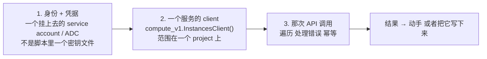
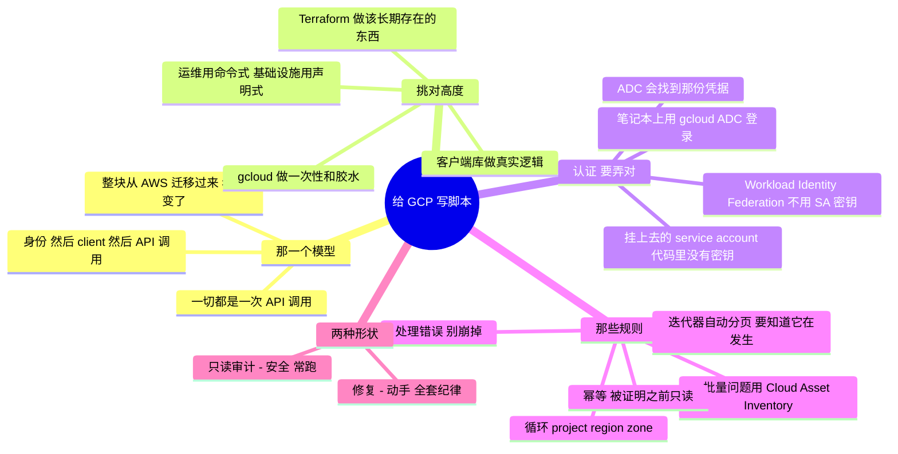

# GCP —— 把 API 写成脚本（从代码去管理与运维）

> 🌐 **语言：** [English（默认）](../../../../platforms/gcp/automation.md) · **中文**
>
> ⚠️ 本项目**默认语言为英文**，`platforms/gcp/automation.md` 是"事实来源"。本页中文是多语言支持的一部分，可能略滞后于英文版；两者不一致时以英文为准。

---

> [`architecture`](architecture.md) 是 GCP 怎么组织的；[`operations`](operations.md) 是跑它长什么
> 样。这篇笔记是那个*怎么做*：**从代码通过 API 驱动 GCP** —— 也就是
> [运营模型](../../00-the-operating-model.md)第 3 招"通过平台的 API 驱动它并把它写成代码"背后那门
> 具体的手艺。控制台是用来看的；脚本和 IaC 是用来做的。

GCP 里的一切都是一次 API 调用。控制台、`gcloud`、Terraform、那些客户端库 —— 全都是同一套 API 的
包装。一旦你把这件事内化，"我怎么自动化 X？"就不再是一次找功能的搜索，而变成*"哪一次 API 调用，
用哪个身份，处理哪些故障模式？"* 这里正是一份脚本加 Linux 的背景
（[`foundations/`](../../foundations/README.md)）直接变成云运维技能的地方 —— 而它整块从 AWS 迁移
过来，只是名字变了。

## 那一个模型：一切都是 `(身份) → (client) → (API 调用)`

你对着 GCP 写的每一个脚本，都是[运营模型](../../00-the-operating-model.md)那三招，落在代码里：

把这三样弄对 —— 一个**受限身份**、一个**知道 project 的 client**，以及一次**被正确调用的 API**
—— 你就能自动化 GCP 所暴露的任何东西。

## 那架工具阶梯 —— 挑对高度

驱动这套 API 的四种方式，从快到耐久；够错了高度是一个常见错误：

| 工具 | 它是什么 | 什么时候去够它 |
| --- | --- | --- |
| **`gcloud` CLI** | 作为 shell 命令的 API | 一次性检查、快速修复、Bash 脚本里的胶水、探索 |
| **客户端库**（`google-cloud-*`，Python） | 作为一个库的 API | 真实逻辑 —— 循环、分支、数据整形、一个真正的工具 |
| **Cloud Shell** | 托管 shell 里的 CLI 加那些库 | 临时运维，不需要本地凭据 |
| **Terraform / Config Connector** | **声明式**期望态 | 任何应该可复现、被评审、可销毁的东西（[`iac`](../../cross-cutting/iac-and-config.md)） |

那条分界线：**`gcloud` 和那些客户端库是*命令式*的 —— "现在做这次调用"；Terraform 是*声明式*的 ——
"这是应该存在的东西。"** 用命令式脚本做*运维*（盘点、修复、一次性查询）；用 IaC 做*发放*
（那些应该长期存在的基础设施）。用一个 `create_*` 脚本而不是 Terraform 去建持久的基础设施，
是在逆着纹理走。

## 认证 —— 把这个弄对，否则别的都不要紧

那条最重要的规则，也是 AI 和教程最常搞错的一条：**绝不要把一个 service account 密钥文件放进一个
脚本或一个仓库。** 那条凭据链 —— GCP 把它叫作 **Application Default Credentials（ADC）** ——
按优先顺序：

- **在一台 Compute Engine VM / Cloud Run / GKE 上** → 一个**挂上去的 service account**。那些客户端
  库会通过 ADC 自动捡起它；*任何地方都没有密钥*。这是任何跑在 GCP 里的东西的正确默认项
  （AWS instance role 的对应物）。
- **在你笔记本上** → `gcloud auth application-default login` —— 短寿命、自动刷新的用户凭据，
  那些库会通过 ADC 找到它。
- **给 GCP 之外的工作负载** → **Workload Identity Federation**，好让一个外部身份（一个 CI 系统、
  另一朵云）拿到短寿命的 GCP token，而**完全没有 SA 密钥**。
- **绝不** → 一份被下载下来、在脚本里被引用、被提交进仓库，或者被烤进一个镜像里的 service account
  **密钥 JSON**。那就是 [`operations.md`](operations.md) 里那次泄露密钥的事故，提前提交了。

那些客户端库替你走 ADC —— 而这**就是**为什么写得好的 GCP 脚本构造 client 时完全不带凭据参数。
你代码里没有密钥，正是重点。

## 把一个能用的脚本和一把自伤枪分开的那些规则

就是 [`foundations/`](../../foundations/README.md) 那门幂等与错误处理的纪律，落在 GCP 的具体上：

- **遍历那些页。** GCP 客户端库返回**自动分页的迭代器** —— 很方便，但要知道它在发生，而且不要把
  一个百万行的结果整个物化进内存。对 `gcloud`，记住 `--page-size`，以及一次默认的 list 可能会被
  截断。
- **循环 project、region 和 zone。** GCP 资源是*逐 project* 存在的，而很多是 **zonal 或 regional**
  的（[`architecture.md`](architecture.md)）。一个从一个 project、一个 region 盘点"一切"的脚本，
  静默地只看到一个切片 —— 那是 AWS 那个"忘了 region" bug 的 GCP 版，往上一层（你还要循环
  *project*）。
- **批量问题去够 Cloud Asset Inventory。** 与其在每个 project 里循环每一个 API，
  **Cloud Asset Inventory** 一次查询就回答"整个组织里类型为 X 的每一个资源" —— 组织级审计的正确
  工具，也是一个 GCP 真正强的角度。
- **逐资源处理错误，别让整次运行崩掉。** 一个你没有权限的 project、或者一次被限流的调用，应该记录
  下来然后继续 —— 而不是中止整次扫描。
- **预期会有配额/速率限制；退避。** GCP 会对 API 限速；重的脚本需要指数退避，不是一个紧凑的重试
  循环。
- **变更要幂等。** 一个修复脚本必须能安全重跑：先检查再动手，不是盲目动手 —— 就是 Terraform 在结构
  上强制的同一条规则（[`iac`](../../cross-cutting/iac-and-config.md)）。
- **在被证明之前只读。** 先对着 `list`/`get` 调用去开发；只有在逻辑被证明之后才加
  `create`/`delete`/`update`，并放在一个 dry-run 参数后面。

## 自动化脚本的两种形状

多数 GCP 运维脚本是两种形状之一：

- **只读/审计脚本** —— 盘点、合规检查、成本/标记报表、"找出每一个违反 Y 的 X"。只读、安全、常跑。
  一个合规变体（"每一个公开的桶"、"每一条对 0.0.0.0/0 开放的防火墙规则"、"每一块未加密的磁盘"）
  是同一副骨架换一个过滤器 —— 而 Cloud Asset Inventory 往往比循环更快地做到。
- **修复/编排脚本** —— 它**动手**：给没标记的资源打标记、按日程停掉闲置实例、轮换一把密钥、
  排空并替换一个节点。它会变更状态，所以它承担上面那全套纪律 —— 幂等、受限身份、先 dry-run、
  有记录。

要内化的那个递进：**只读脚本安全地把肌肉练出来；修复脚本小心地把它施加出去。** 每一个新的自动化都
从一个"找出那个问题"的只读脚本开始，等你信得过那个发现之后再加上那个修复。

## AI 怎么协助写这些自动化

[运营循环那一节的 AI](operations.md)讲的是故障里的 AI；这里讲的是 AI 写*代码*。确实提速，
而且有具体的陷阱：

- **对骨架很在行：** *"一个用 google-cloud-storage 的 Python 脚本，跨一个 project 列出每一个没有
  统一桶级访问的桶"* —— AI 几秒钟就写出那个形状，通常在结构上是对的。
- **对查 API 很在行：** *"哪个客户端库和哪个方法能拿到一个桶的 IAM policy？"* —— 比翻文档更快，
  *前提是*你去核实那个调用真的存在。
- **AI 会烧到你的地方（验得最狠的地方）：** 它会**发明客户端库的方法名**，更糟的是**给出错的
  `google-cloud-*` 包名**（那个包的拆分出了名地容易搞错 —— `google-cloud-compute` 对
  `google-cloud-storage` 对更老的 `google-api-python-client`）；它会**忘掉遍历 project**；
  它会**把 zonal/regional/global** 资源搞混；而且它会**硬编码或者引用一个 SA 密钥文件**，
  而不是用 ADC。这里面每一条都是上面的一条规则 —— 拥有那些规则，并把 AI 的初稿当成一份等着被审的
  初筛。对着一个沙箱 project 只读地跑一遍；漏掉的 project 或者被截断的结果会立刻冒出来。

## 管理纪律（你应该做得到什么）

- 通过 **ADC / 一个挂上去的 service account** 给一个脚本做认证，代码里没有密钥，并解释是那条凭据链
  让它成功的。
- 写一个**遍历过的、知道 project/region 的、处理了错误的**只读脚本 —— 并证明它看到了一个天真的
  单 project 脚本会漏掉的资源。
- 用 **Cloud Asset Inventory** 回答一个组织级问题，而不是去循环每一个 API。
- 把一个只读脚本变成一次**安全的修复** —— 幂等、先 dry-run、有记录。
- 为一件任务在 **`gcloud` 对客户端库对 Terraform** 之间做选择，并为那个高度辩护。
- 读懂一条 GCP **API 错误**（`PERMISSION_DENIED`、`RESOURCE_EXHAUSTED`、`NOT_FOUND`），并知道
  每一条告诉你接下来该做什么。

## 诚实边界

🔨 **在它可迁移的地方，🧭 在它属于 GCP 的地方。** 那门脚本与自动化**纪律**是亲手做过的 ——
Python 和 Bash 是日常工具、遍历/幂等/处理错误的自动化，以及那份建在真实机队脚本工作之上的
"先只读、再动手"的直觉（[`foundations/`](../../foundations/README.md)）—— 而那门纪律整块迁移到
GCP 的 API 上。但 GCP **特有**的那片面（准确的客户端库、ADC 的怪癖、服务的行为）是那条 🧭 ramp，
按这个仓库的方法测绘并验证过，而且**不声称任何生产 GCP**。这里的声称是一份很强的自动化地基，
加上一条通向 GCP API 面的、快速且可验证的 ramp —— 这里每一份 GCP 文档诚实的立场
（[`WHY.md`](../../WHY.md)）。

## 这篇文档一屏看完

