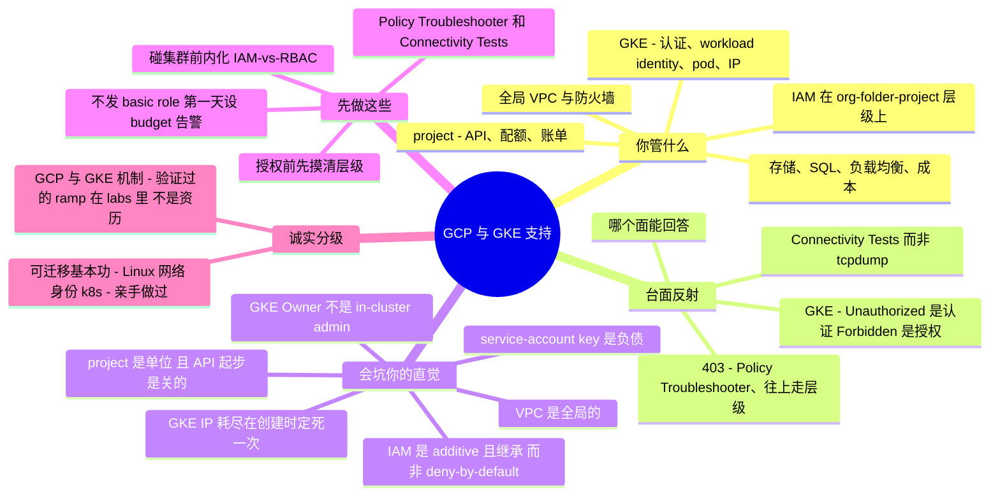

# GCP 与 GKE 支持 —— 运维者的转轨指南

> 🌐 **语言：** [English（默认）](../../../../platforms/gcp/support.md) · **中文**
>
> ⚠️ 本项目**默认语言为英文**，`platforms/gcp/support.md` 是"事实来源"。本页中文是多语言支持的一部分，可能略滞后于英文版；两者不一致时以英文为准。

---

> [`operations.md`](../../../../platforms/gcp/operations.md) 讲的是运营你自己那套 GCP 的**节奏**。本篇讲另一半：**把 GCP 和 GKE 支持当作一门修/救（break-fix）手艺** —— 真正反复出现的工单、精确的排查落点，以及最有用的那点：**一个来自别的方向（尤其 AWS）的强 sysadmin 接手它时，哪些直觉会坑他。** GCP 本身在这里仍是 🧗 ramp；撑起它的可迁移基本功（Linux、网络、身份、Kubernetes 概念、排障）才是那个 ✋ 亲手做过——而这正是本页的意义。

正如[平台篇](../../../../platforms/gcp/README.md)所说，GCP 大体上是*改了名的 AWS/Azure* —— 而这恰恰是陷阱。一个"已经懂云"的运维接手 GCP 支持很快，然后在 Google 做了真正不同设计选择的那几处栽跟头：**additive 且沿层级继承**、而非 deny-by-default 的 IAM；一个**全局 VPC**；作为一切单位的 **project**；以及——连同时懂 AWS *和* Kubernetes 的人都会吃惊的那点——**GKE 的两个独立授权面**。本篇把职责、反复出现的工单及其诊断面、以及一个自信的云运维反射恰好失灵的那几处一一点名——并显式标出 AWS 对比，因为大多数读者是从那儿来的。

## 支持 GCP 与 GKE 让你要为什么负责

映射到 [seven surfaces](../../../../00-the-operating-model.md)，按工单到达顺序：

| Surface | 你要为之负责的事 |
| --- | --- |
| **身份与访问（Cloud IAM）** | "为啥这个被拒 / 为啥这个有权限？"—— role + binding 挂在 **org→folder→project→resource** 层级上、继承、service account、impersonation。最大的时间黑洞。 |
| **project 与 org** | API 按 project 启用、org-policy 约束、配额——那些"不是 IAM，是 project"的工单。 |
| **网络（全局 VPC）** | "为啥 X 到不了 Y？"—— firewall rule（allow **和** deny，有 priority）、**全局** VPC、Cloud NAT、Private Google Access、IAP、Cloud DNS。 |
| **Compute Engine** | 通过 **OS Login / IAP** 的 SSH、serial console、挂载的 service account、磁盘扩容。 |
| **GKE** | 集群认证（`get-credentials` + auth plugin）、**IAM-vs-RBAC 两个面**、Workload Identity、pod 故障、**IP 耗尽**、私有集群。 |
| **存储与数据** | Cloud Storage 的 **uniform bucket-level access** vs ACL、public-access prevention；Cloud SQL 连接（Auth Proxy / private IP / authorized networks）。 |
| **负载均衡与 TLS** | Google-managed SSL 证书（先 DNS、约 1 小时签发）、后端健康、502。 |
| **可观测性** | Cloud Logging（Logs Explorer）、Monitoring，以及 **Cloud Audit Logs**（Admin Activity 常开 vs Data Access 需开启）。 |
| **成本与配额** | Budget、egress、孤儿资源；per-project、per-region 配额。 |
| **升级给 Google** | Policy Troubleshooter、Connectivity Tests，以及何时该开 Cloud Support case。 |

## 常见工单 —— 以及去哪查

GCP 的修/救本质是在一小组控制台、日志、和两个 CLI（`gcloud`、`kubectl`）上做模式识别。你要练成的反射是：**"哪个面能回答这个问题，它又有什么局限？"**

**IAM —— `403 PERMISSION_DENIED`（头号工单）。** 错误读作 `Permission 'x.y.z' denied on resource (or it may not exist)` —— 注意那句 *"or it may not exist"*：资源不存在和权限不足长得一模一样。原因通常是缺 role binding，但也可能是一个挂在**层级上方**的授权（folder 上的 role 级联到它下面的每个 project）、或从某个你在资源上看不到的地方生效的 **org-policy** 或 **IAM deny policy**。*去哪查：* **IAM Policy Troubleshooter**（principal + permission + resource → allow/deny，并给出*决定性*策略），以及 `gcloud projects get-iam-policy` / `get-ancestors-iam-policy` 看继承来的授权。

**"这不是 IAM —— 是 API 没启用。"** 一个很常见的新手 403 是 `SERVICE_DISABLED` / *"API has not been used in project … before or it is disabled."* GCP 给每个 project 起步时几乎一切都**关着**；修法是给*那个* project `gcloud services enable <api>`，不是改 IAM。

**网络 —— "到不了。"** 记住形状：firewall rule 能 **allow 或 deny**、带 **priority**（数值越低越优先；同 priority 时 **deny 压过 allow**）、有**方向**但**有状态**；每个 VPC 自带一条隐式 **deny-all-ingress** 和 **allow-all-egress**（65535）。无外部 IP 的 VM 出网需要 **Cloud NAT**、访问 Google API 需要 **Private Google Access**。*去哪查：* **Connectivity Tests**（Network Intelligence Center —— 模拟数据包路径并点名阻塞规则，GCP 的 reachability analyzer）、以及 **Firewall Rules Logging** 和 **VPC Flow Logs** —— 不是在你碰不到的 fabric 上 `tcpdump`。

**Compute Engine —— SSH。** 经典陷阱：**OS Login 和 metadata SSH key 互斥** —— OS Login 开着时，推上去的 metadata key 会被拒。用 `gcloud compute ssh --troubleshoot`（加 `--tunnel-through-iap`）；**IAP** SSH 要放行从 **`35.235.240.0/20`** 到 tcp:22（无公网 IP、无 bastion）。SSH 和网络都挂时，**serial console** 是救命通道。

**GKE —— 你被叮嘱要在意的那部分。**
- *kubectl 无法认证* → 自 Kubernetes **v1.26** 起你必须装 **`gke-gcloud-auth-plugin`**（内置的 `gcp` provider 被移除）。`gcloud container clusters get-credentials <cluster>` 写 kubeconfig。
- *头号 GKE 工单——"控制台里我有权限，但 `kubectl` 说 Forbidden。"* GKE 有**两个授权面**：**Cloud IAM 认证**你到集群（你光是要够到 API server 就需要 IAM 权限 `container.clusters.get`）、并管集群*基础设施*操作；**Kubernetes RBAC 授权**你在*里面*能干什么（get pods、读 secret、按 namespace）。GKE **先查 RBAC，再回退到 IAM** —— 有*任一*即可。两个词、两种失败：**`Unauthorized`** = 认证（凭据坏/过期、缺 plugin、没 `container.clusters.get`）；**`Forbidden`** = 认证过了、但 RBAC 和 in-cluster IAM 都没授予这个动作。恶心的陷阱：IAM 角色 **"Kubernetes Engine Cluster Admin" 不是 RBAC 的 `cluster-admin`** —— 它让你改集群基础设施、却对*里面*一无所授。你用 **RBAC binding** 修 in-cluster 访问，而不是升级 IAM。（[lab](../../../../platforms/gcp/labs/gke-iam-vs-rbac/) 证明这点；对象模型见 [`cross-cutting/kubernetes.md`](../../../../cross-cutting/kubernetes.md)。）
- *Workload Identity*（Pod → GCP API）失败常因 KSA↔GSA 注解写错、IAM Credentials API 没开、节点池没启用 WI、或 metadata server 被挡——而且它会**悄悄回退到节点的默认 SA**，把配错掩盖掉。
- *Pod 状态*定位故障：**ImagePullBackOff**（名字/tag、registry 不可达、节点 SA 没有 Artifact Registry 拉取权限）、**CrashLoopBackOff**（应用/配置/探针）、**Pending/unschedulable**（`Insufficient cpu`/内存、taint、或 IP 耗尽）、**OOMKilled**（超内存 limit）。用 `kubectl describe pod` / `logs` / `get events` 诊断。
- *`IP_SPACE_EXHAUSTED`* —— 标志性的 GKE 陷阱。VPC-native 集群给 pod **真实的 VPC IP**（来自 alias range），每个节点抓走一整个 **/24**（默认 110 pods/node）—— 于是你的节点上限是 **pod range** 里 `/24` 切片的数量，而非子网原始大小。在创建时把它设小了，新节点就会**静默失败**、pod 卡在 **Pending**、自动扩容悄悄停摆。用 **Network Analyzer** 提前看到；用 discontiguous multi-pod-CIDR、更低的 `--max-pods-per-node`、或重建来修。
- *私有集群 `kubectl` 超时*通常意味着你的源 IP 不在集群的 **authorized networks** 里。

**Cloud Storage —— 403。** 若开了 **uniform bucket-level access**，per-object ACL 被忽略——去授 **bucket IAM**；若一个公开 URL 403，可能是 **public access prevention** 在覆盖某个 `allUsers` 授权。

**Cloud SQL —— 连不上。** 选对模型：**Auth Proxy**（IAM，无 allowlist）、**private IP**（需要 VPC 可达）、或 **authorized networks**（公网 IP）。大多数工单是 private-IP-没可达 或 public-IP-客户端没进 allowlist。

**负载均衡与 managed SSL 证书。** 证书卡在 **`FAILED_NOT_VISIBLE`** 意味着 Google 还看不到你域名的 A/AAAA 指向 LB IP —— LB/DNS 必须**先**存在，签发要**约 60 分钟**（再最多 30 分钟才开始服务）。502 / 后端不健康通常是**缺少放行健康检查段 `130.211.0.0/22` 和 `35.191.0.0/16` 的 firewall rule**、或后端没在监听。

**配额与成本。** `Quota exceeded` 是 **per-project、per-region** 的——在启动**之前**提额。成本惊吓是 egress 和孤儿资源（闲置外部 IP、未挂载磁盘）；护栏是 **budget alert**，**Active Assist / Recommender** 会标出闲置资源。

## 经验差 —— 一个强 sysadmin 的直觉会错在哪

做过 GCP/GKE 支持的人和没做过的人之间的差距不在控制台——而在一组承重假设（很多直接从 AWS 搬来），它们在这里是**错的**，每条都挂着失效模式。

- **IAM 是 additive 且继承的——不是 deny-by-default。** 一个 principal 的访问是 **org → folder → project → resource** 层级上每一级授予的每个 role 的**并集**，而且授权**向下级联**——一个 folder 上的 `Storage Admin` 悄悄作用于它下面每个 bucket，**在你检查那个 bucket 时看不见**。没有一份 per-identity 的策略文档是事实来源（AWS 反射）；你要往*上*走这棵树。经典 allow-policy **不能说"deny"**（**IAM Deny policies** 现在有了，但是一套独立的、较新的系统，只挂在 org/folder/project）。那些 AWS 直觉——*把策略挂到 identity、加一条 explicit Deny、读 identity 的策略就知道它的访问*——全都误导人。
- **GCP 的 "role" 不是 AWS 的 "role"。** 这里你把一个 **role**（一袋权限）授予*给*一个 member；在 AWS 里 role 是你*假设（assume）*的一个 identity。而且 **basic role Owner/Editor/Viewer 危险地宽**——上千权限；把 Owner 当 `AdministratorAccess`。用 **predefined** 或 **custom** role。
- **project 是单位——而且 API 起步是关的。** **project** 是账单、配额、IAM 范围、API 面的原子（比"别处叫 project 的东西"更接近一个 *AWS account*）。每个服务的 API 都要**按 project 显式启用**——`SERVICE_DISABLED` 的 403 不是 IAM bug。
- **VPC 是全局的——忘掉 regional-VPC 反射。** 一个 VPC 跨所有 region；**subnet 是 regional 的**（一个 subnet 覆盖它 region 里的每个 zone——与 AWS 把 subnet 钉在一个 AZ 相反）。同一个 VPC 里不同 region 的 VM 私网互通，**无需 peering、VPN、或 transit gateway**。在这里重建一套 AWS 的多 VPC / 按 region / Transit-Gateway 设计，是在把 GCP 白送你的管线重新接一遍。
- **firewall rule 有 deny + priority + direction——但有状态。** 一个混血：像 NACL 的表达力（allow *和* deny、数值 priority、ingress-或-egress），加上像 security group 的有状态（回程自动放行）。"SG 只放行"的反射会读漏它。
- **service account 是一等公民，它的 key 是负债。** 一个 SA **既是 identity 又是 resource**（你把*impersonate 它*的权限授予别人）。导出的 **SA JSON key 是 GCP 的长期密钥问题**——优先 **attached SA + Application Default Credentials**、**impersonation / 短时 token**、GKE 里用 **Workload Identity**。
- **Org Policy 是第二个控制面。** **Constraint** 约束*能部署什么 / 资源如何配置*（限制位置、禁建 SA key、要求 OS Login），挂在层级上向下继承——与 AWS **SCP** 平行、但与 IAM 的"谁能干"是*不同的轴*。别把两者混为一谈。
- **GKE 的两个授权面。** 上面和 lab 里讲过——对同时懂 AWS *和* Kubernetes 的人来说是最高价值的陷阱。"project Owner" **不会**自动让 `kubectl get secrets` 生效；in-cluster 的权力来自一个 **RBAC** binding，而 `Unauthorized`（认证）≠ `Forbidden`（授权）。
- **GKE IP 耗尽没有同等强度的 AWS-脑对应物。** 那个 `/24`-每节点、创建时定死一次的陷阱，事后几乎修不了——一个在它变成终局故障前几周就做下的决定。
- **控制台会撒几秒钟谎（最终一致）。** IAM 变更要 **~2 分钟、最多 7+**（组成员更久）；启用 API、managed SSL 证书也滞后。*"我授了、还是 403"* 常常是传播延迟——别反复横跳。
- **"谁干的"被拆开了。** **Admin Activity** 审计日志常开且免费；**Data Access** 日志（谁*读*了数据）**需开启且花钱**——如果你以为完整的读取历史默认就有，那儿有个洞。
- **配额是 per-project、per-region、软的、不自动长。** 一个 region 的高配额不带到另一个；自动扩容撞墙时会**静默地建不出 VM**。在事件**之前**提额。

## 什么可迁移，什么不可

| 强迁移 | 带保留地迁移 | 别带过来 |
| --- | --- | --- |
| Linux / guest-OS 深度——guest OS 一样，是你那一侧 | 身份与最小权限*思维*——原则成立，机制是*反的*（并集/继承 vs deny-override） | AWS IAM 直觉——挂到 identity、explicit Deny、读策略知访问，全都误导 |
| DNS、TLS/证书、TCP/IP、**CIDR 算术**（你要手算 pod range） | 防火墙/ACL 推理——重学 deny+priority+direction-但有状态 | regional-VPC / 按 region 设计——GCP 的 VPC 是全局的 |
| **Kubernetes 概念**（RBAC、namespace、Deployment、HPA）——GKE 是真上游 k8s | "account 就是 blast radius"——单位是 **project**，org/folder 策略级联进来 | "security group 白名单"反射——GCP 防火墙有 deny + priority |
| 结构化排障、日志阅读、脚本 | 一致性假设——为 IAM/API/证书传播延迟重新校准 | 抓包——用 Connectivity Tests + Flow Logs |
| 变更纪律（试点 / IaC / 回滚）——这里*更*重要 | | "Owner = 集群里无所不能"——对 GKE in-cluster 动作为假 |

## 第一周 / 前 90 天

**第一周。**
1. **在授权任何东西之前，摸清资源层级和有效 IAM**——这个 project 在哪个 folder 下、org/folder 上已经授了什么会级联进来？用 **Policy Troubleshooter** 回答访问问题，别猜。
2. **绝不把 basic role（Owner/Editor/Viewer）当捷径发**——只用 predefined 或 custom。
3. **设 budget + 账单告警**——花钱没有自动刹车。
4. **早点学两个工具：IAM Policy Troubleshooter 和 Connectivity Tests + Network Analyzer**——它们替代你的抓包/策略检查习惯。

**前 30 天。**
5. **在碰任何 GKE 集群之前，内化 IAM-vs-RBAC 的分裂**——Owner ≠ in-cluster admin；`Unauthorized` = 认证、`Forbidden` = 授权；用 RBAC binding 修 in-cluster 访问。
6. **认出 `SERVICE_DISABLED`**——给那个 project 启用 API；别当 IAM 追。
7. **用 IAP + OS Login，别用公网 IP + bastion 和静态 key**——SSH 变成 IAM 管控、可即时吊销；只放行 `35.235.240.0/20`。
8. **GKE 里优先 Workload Identity 而非 SA key**；别处用 attached SA + ADC / impersonation。

**前 90 天。**
9. **在集群创建时把 pod CIDR 设大**——110 pods/node 时 `max_nodes ≈ 2^(24 − pod_prefix)`；事后几乎修不了。
10. **打开你真正需要的审计日志**——对敏感服务的 Data Access 日志（花钱）要有意识地决定。
11. **在启动 / 迁移 / 自动扩容事件之前，按 region 提额。**
12. **建立传播耐心**——IAM 改动后等最多 ~7 分钟再下结论说它坏了。

## AI 辅助的 ramp（GCP/GKE 口味）

- **从你已知的翻译过来——并索要 deltas：** *"我懂 AWS IAM、VPC、和 Kubernetes RBAC —— 把 GCP IAM、全局 VPC、和 GKE 认证映射到它们上，只标出真正的差异。"* GCP 是本仓库 translate-then-verify 方法最纯的案例，因为它太多是改了名的。
- **让它起草 `gcloud`/`kubectl`/Terraform，你亲手做最小权限。** AI 在这里很强——而它也会**发明 role 和权限**、在有 predefined 时伸手去拿 **basic role**、把 **IAM role 与 RBAC 混为一谈**、并提一个 blast radius 是整个 folder/org 的防火墙或 IAM 改动。对着文档核验、并在一次性 project 里跑。同一套"往死里验证"的纪律——见 [`ai-workflow/`](../../../../ai-workflow/) 和[运营环](../../../../platforms/gcp/operations.md)。

## 诚实边界

**GCP 在本仓库里是个 🧗 验证过的 ramp，本页也守着这条线。** 承重的是那些**✋ 可迁移、且真实**的基本功：**Linux** 与 guest-OS 运维、**网络 / DNS / TLS**（[`the-stack/02`](../../../../the-stack/02-network.md)）、**身份与最小权限思维**（[`identity-iam.md`](../../../../cross-cutting/identity-iam.md)）、以及 **Kubernetes 对象模型**（[`cross-cutting/kubernetes.md`](../../../../cross-cutting/kubernetes.md)）—— GCP/GKE 支持里那些*本来就是*这些技能、只是换了 Google 名字的部分。GCP 特有的机制（additive-继承的 IAM、全局 VPC、GKE 两个面、计费与配额的边）是被映射、对着文档核验、并在可跑的 [lab](../../../../platforms/gcp/labs/gke-iam-vs-rbac/) 里练过的——**不是**声称成多年生产资历。更深、规模化的生产 GKE（大型多租户集群、mesh、平台工程）仍在前方，注释如实说明、绝不吹。

## Field kit —— 真实工具与参考

以下指针在 GitHub 上逐个核实存在，按用途分组。通用 Kubernetes 工具直接适用于 GKE；GCP 专属的已标注。

**GCP 专属诊断与基线：**
- [`GoogleCloudPlatform/gcpdiag`](https://github.com/GoogleCloudPlatform/gcpdiag) —— 一个 CLI，对常见 GCP/GKE/IAM/网络配错跑自动检查。最接近一手支持工具。
- [`GoogleCloudPlatform/cloud-foundation-fabric`](https://github.com/GoogleCloudPlatform/cloud-foundation-fabric) —— org/IAM/网络地基的参考 Terraform；一条金标准路径，用来 diff 一个坏掉的环境。
- [`darkbitio/gcp-iam-role-permissions`](https://github.com/darkbitio/gcp-iam-role-permissions) · [`RhinoSecurityLabs/GCP-IAM-Privilege-Escalation`](https://github.com/RhinoSecurityLabs/GCP-IAM-Privilege-Escalation) —— "哪个 role 授予权限 X" 以及哪些 role 组合危险。

**GKE / Kubernetes 分诊（直接用于 GKE）：**
- [`derailed/k9s`](https://github.com/derailed/k9s) —— 实时集群分诊的终端 UI。
- [`k8sgpt-ai/k8sgpt`](https://github.com/k8sgpt-ai/k8sgpt) —— 扫描集群、用大白话解释失败的 pod/资源。
- [`ahmetb/kubectx`](https://github.com/ahmetb/kubectx) —— 在多集群间跳转时快速切 context/namespace。
- [`stern/stern`](https://github.com/stern/stern) —— 多 pod 日志 tail，用于事件调试。
- [`derailed/popeye`](https://github.com/derailed/popeye) —— 只读的集群 sanitizer，标出配错/死掉的资源。

**姿态与成本（多云，含 GCP）：**
- [`prowler-cloud/prowler`](https://github.com/prowler-cloud/prowler) · [`nccgroup/ScoutSuite`](https://github.com/nccgroup/ScoutSuite) —— "这个 project 哪儿不对"的安全/配置审计。
- [`turbot/steampipe`](https://github.com/turbot/steampipe)（+ GCP 插件）—— 用 SQL 实时查 GCP，回答临时的配错/库存问题。
- [`cloud-custodian/cloud-custodian`](https://github.com/cloud-custodian/cloud-custodian)（GCP provider）· [`infracost/infracost`](https://github.com/infracost/infracost) —— 治理/整改，以及部署前成本。
- [`aquasecurity/kube-bench`](https://github.com/aquasecurity/kube-bench) —— 集群的 CIS 加固检查。

**值得优先于任何博客收藏的权威文档**：**Google Cloud** 的
[IAM allow 策略与继承](https://cloud.google.com/iam/docs/allow-policies)、
[Policy Troubleshooter](https://cloud.google.com/iam/docs/troubleshoot-policies)、
[GKE access control（IAM + RBAC）](https://cloud.google.com/kubernetes-engine/docs/concepts/access-control)、
以及[避免 `IP_SPACE_EXHAUSTED`](https://cloud.google.com/blog/products/containers-kubernetes/avoiding-the-gke-ip_space_exhausted-error/)。
*（时效：`gke-gcloud-auth-plugin` 自 Kubernetes v1.26 起必需；IAM Deny policies 和 Workload Identity Federation for GKE 是与经典路径并存的较新路径——按你的版本对着当前文档核实。）*

## Lab —— GKE 有两个授权面 ✅ 可跑

**亲手证明头号 GKE 支持教训。** 一个纯本地、只用 stdlib 的 drill，把 GKE 授权建模：一个 principal 必须**认证**（Cloud IAM：`container.clusters.get` 才能够到 API server）*并且*在里面被**授权**（先 Kubernetes RBAC、再 IAM 回退）。它展示 `Unauthorized`（认证）vs `Forbidden`（授权）是不同的失败，证明 IAM "Cluster Admin" 角色**不**授予 in-cluster 资源访问，而修法是一个 **RBAC binding**——不是升级 IAM。

```bash
python3 platforms/gcp/labs/gke-iam-vs-rbac/gke_authz_drill.py
```

exit `0` 表示教训都成立（兼作 CI 检查）。见 [`labs/gke-iam-vs-rbac/`](../../../../platforms/gcp/labs/gke-iam-vs-rbac/)；Kubernetes 对象模型见 [`cross-cutting/kubernetes.md`](../../../../cross-cutting/kubernetes.md)。

## 一页看全本章


