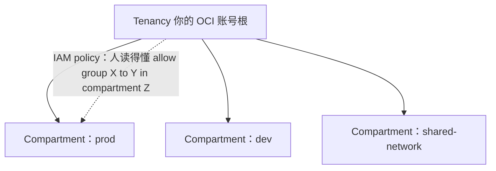

# Oracle Cloud Infrastructure（OCI）—— 最年轻的那个超大规模云

> 🌐 **语言：** [English（默认）](../../../../platforms/oci/README.md) · **中文**
>
> ⚠️ 本项目**默认语言为英文**，`platforms/oci/README.md` 是"事实来源"。本页中文是多语言支持的一部分，可能略滞后于英文版；两者不一致时以英文为准。

---

> 和 [AWS](../aws/README.md) 同样的四段式模板：**它是什么 → 管理技能图 → AI 辅助 ramp → lab**
> —— 外加更深的 **[architecture](architecture.md) · [operations](operations.md) ·
> [automation](automation.md)** 三件套。诚实标记是 **🧭 ramp** —— 从 AWS/Azure/GCP 那个模型测绘
> 并验证过，没有在生产里跑过。OCI 是那[七平台对比](../../the-stack/README.md)里的第四朵公有云，
> 而它作为最年轻的那个设计，在几处刻意的、与管理员相关的差别上显了出来。

## 1. OCI 是什么

Oracle Cloud Infrastructure 是 Oracle 对 AWS 的回答 —— 一朵完整的公有云，建得比那三大家晚，
并用那份后见之明做了一些不同的工程选择。其中两个从第一天起就对一个操作者要紧：**离机的网络虚拟化**
（网络 I/O 在宿主机之外处理，所以 hypervisor 税很低、性能可预测），以及**把裸金属实例做成一等产品**
（一朵公有云最接近"把真正那台服务器交给你"的形态 —— 天然契合 [self-host](../self-host/README.md) 和
[vSphere](../vsphere/README.md) 那种思路）。它另一个刻意的打法是**极其便宜的出网**，这让它成为那些
在别处被[出网计费表](../../the-stack/02-network.md)惩罚的备份、归档和数据密集型工作负载所偏爱的
目标。

映射到那[七片面](../../00-the-operating-model.md)上：

| 面 | OCI 对它的叫法 | 那一句话 |
| --- | --- | --- |
| **身份与访问** | **IAM** —— compartment、policy、dynamic group、instance principal | compartment 是那个组织/隔离单位；policy 是人读得懂的语句。 |
| **计算** | **Instance**、**弹性 shape**、**裸金属 shape** | 拨 OCPU 加内存；一个 **OCPU 是一个完整物理核**，不是一个超线程。 |
| **网络** | **VCN**（区域级）、security list **以及** NSG、FastConnect | 两套重叠的过滤机制 —— 挑一个并把它标准化。 |
| **存储** | **Block Volume**、**File Storage**、**Object Storage**（加 Archive） | 意料之中的三件套；取回/出网按设计就便宜。 |
| **发放与配置** | **Resource Manager**（托管 Terraform）、cloud-init | Terraform 是那条一等的 IaC 路径；Linux 上 cloud-init 是标准。 |
| **可观测性** | **Monitoring**、**Logging**、**APM** | 意料之中的那套栈，比三大家的更年轻、更浅。 |
| **安全与合规** | IAM、**Cloud Guard**、**Security Zones**、Vault、Budgets | Cloud Guard 是姿态加威胁；Security Zones 是预防性护栏。 |

那句与管理员相关的标题：**compartment 是 OCI 的爆炸半径单位**（一个 AWS 账号或一个 GCP project 的
对应物 —— 可嵌套，而且是 IAM policy 所对之定范围的那样东西），而且**它的 IAM 策略语言读起来像句子**
—— `Allow group Admins to manage instances in compartment Prod` —— 那确实比 JSON 好。

## 2. 管理技能图

具体的、可勾选的清单在 **[`skills-map.md`](skills-map.md)** 里。那些标题级能力，并把 OCI 特有的
差量点出来：

- **Compartment 与 policy** —— 设计那个 compartment 层级（爆炸半径）、写最小权限的 policy 语句，
  并用 **instance principal** 让一台 VM 不用密钥就能认证（那个工作负载身份的故事）。
- **一个你自己设计的 VCN** —— 区域级、subnet、各种网关；而且**在 security list *或* NSG 之间挑一个
  并标准化**，而不是把两个缠在一起。
- **计算尺寸** —— 弹性 shape（把 OCPU/内存拨到准确数值），并且在和其他云的 vCPU 比较时记住
  **一个 OCPU = 一个完整核**。
- **合适时用裸金属** —— OCI 那些一等的金属 shape，用于按核授权或者性能敏感的工作负载
  （[它以金属开路的原因](../../the-stack/01-physical.md)）。
- **存储加那个出网优势** —— 把 Object Storage/Archive 当成一个取回便宜的备份目标
  （[`the-stack/04`](../../the-stack/04-storage.md)）。
- **经 Resource Manager 做 IaC** —— OCI 那个托管的 Terraform，或者你自己的。
- **安全并且在预算内** —— Cloud Guard、Security Zones，以及**先设一条预算告警**
  （[`成本`](../../cross-cutting/cost.md)）。

## 3. 通往胜任的那条 AI 辅助路径

方法在 **[`ai-ramp.md`](ai-ramp.md)** 里。用一段话说：

OCI 是那套 ramp 方法一个很强的案例：一个懂 AWS/Azure/GCP 的管理员已经把那七片面映射过了，所以 OCI
就是*"Oracle 管它叫什么，以及那个刻意的差别是什么？"* 用 AI 去翻译 —— *"把 OCI 的 compartment、
VCN、shape 和 IAM 映射到它们的 AWS 对应物上，并标出那些真正的差别（OCPU 对 vCPU、security list 对
NSG、那门策略语言）"* —— 然后对着当前文档核实，并在一个 Always Free 层的 tenancy 里跑它。上面那四个
差别正是"OCI 不就是 AWS"这个反射失效的地方；其余的一切都是改名。

## 4. Lab

一条**三段式 CLI lab arc**（受限身份加盘点 → VCN 加实例 → 对象存储加预算）在
**[`labs/`](../../../../platforms/oci/labs/)** 里，配真实的 `oci` 命令，对应
[AWS 那些 lab](../aws/README.md) 的形状：一个受限身份（一条最小权限 IAM policy 加一个 compartment）
的盘点脚本，然后一个经 Resource Manager 用 Terraform 写的最小 VCN 加实例。OCI 那个 **Always Free
层**让这件事真的能零成本跑起来 —— 正是这个平台的 ramp 所需要的那个预算安全的一次性 tenancy。

## 5. 往深里走 —— architecture、operations、automation 与 support

四篇姊妹笔记把 OCI 带过"那些服务是什么"，对应 AWS 那一组：

- **[`architecture.md`](architecture.md)** —— OCI 是怎么**组织**的：把 tenancy → compartment 层级
  当成爆炸半径单位、region → AD → **fault domain**、那**四个刻意的差别**（compartment、
  OCPU 对 vCPU、security list 对 NSG、那门人读得懂的策略语言），以及一份参考三层架构。
- **[`operations.md`](operations.md)** —— day-2：那些运维笔记（公开的桶、泄露的密钥对
  instance principal、security list 对 NSG 的拒绝、那个 OCPU 成本意外）、**按节奏**的那些反复出现
  的活，以及运营循环里的 AI（并指出 AI 在 OCI 上产生**更多**幻觉 —— 更年轻、训练数据更薄）。
- **[`automation.md`](automation.md)** —— `oci` CLI 加 SDK：那个身份 → client → API 的模型、
  **instance principal** 优于 API 密钥、遍历 compartment，以及先只读。
- **[`support.md`](support.md)** —— 修/救：那些反复出现的工单和它们准确的诊断面
  （把 `NotAuthorizedOrNotFound` 当成一个 policy 问题、security list **与** NSG 的并集、
  instance principal 的两个半边）、那道跨车道的**经验落差**（是 compartment 不是账号、是动词句子
  不是 JSON、两种情况都返回 404、`OCPU`=2`vCPU`、单 AD region），以及一个可跑的
  [`labs/a-compartment-is-not-an-account/`](../../../../platforms/oci/labs/a-compartment-is-not-an-account/)
  演练。

## 诚实边界

🧭 **诚实的 ramp —— 而且被那样标着。** 不声称任何生产 OCI 运维：这个模块把那套可迁移的运营模型
（AWS/Azure/GCP 的那些面加上本地的深度）映射到 OCI 的名字上，并对着当前文档验证 —— 就是
[`WHY.md`](../../WHY.md) 所论证的那套 ramp 方法。底下那些**直觉**（经由 compartment 的爆炸半径
思维、最小权限，以及从真实的 [vSphere](../vsphere/README.md) 和
[self-host](../self-host/README.md) 经验里来的裸金属与故障域判断）是 🔨；OCI 服务的那些细节是那条
ramp。值得一提：OCI 那份裸金属优先、出网便宜的设计，异乎寻常地契合那些货真价实的亲手强项 ——
这缩短了那条 ramp —— 但那句声称仍然诚实：一套可迁移的模型，加上一条快速、可验证的 ramp，
不是多年 OCI。
