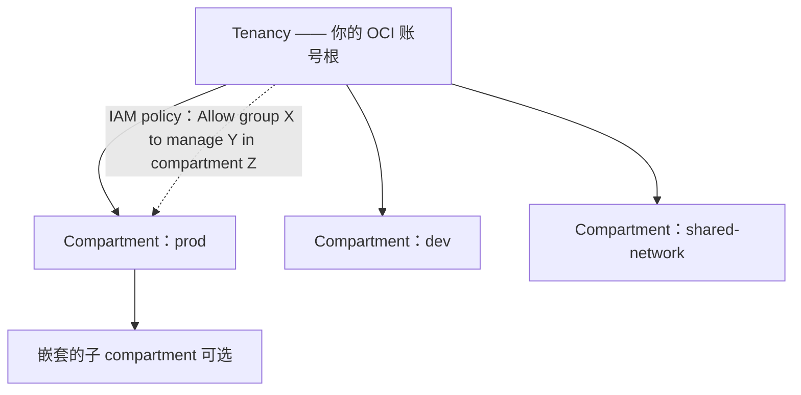
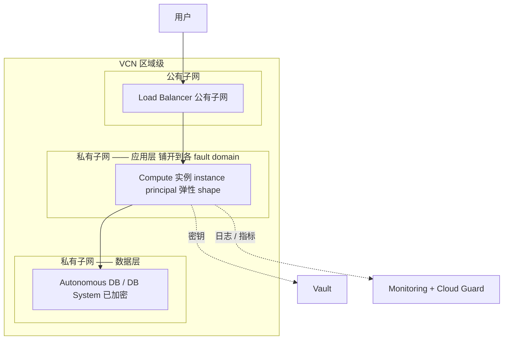

# OCI —— 理解它的架构

> 🌐 **语言：** [English（默认）](../../../../platforms/oci/architecture.md) · **中文**
>
> ⚠️ 本项目**默认语言为英文**，`platforms/oci/architecture.md` 是"事实来源"。本页中文是多语言支持的一部分，可能略滞后于英文版；两者不一致时以英文为准。

---

> [README](README.md) 把 OCI 映射到了那七片面上 —— *那些服务是什么*。这篇笔记是上面那一层：
> *OCI 是怎么组织的*，好让你顺着它的架构去设计，而不是跟它打架。因为 OCI 借用了三大家的形状，
> 这整份活就是 Oracle 刻意建进去的那**四个差别** —— 把那些弄对，其余的就是改名。

## 1. tenancy → compartment 层级 —— 那个爆炸半径单位

OCI 后果最重的那个结构决定是 **compartment** —— 一个 AWS 账号或一个 GCP project 的对应物，
也是 IAM policy 所对之定范围的那样东西：

- **compartment 是那个隔离与爆炸半径单位** —— 可嵌套，而且是每一个资源所住的那条边界。生产和开发
  放在*分开的 compartment* 里是基线，不是一次优化（[`the-stack/01`](../../the-stack/01-physical.md)）。
- **那门 IAM 策略语言读起来像句子** —— `Allow group Admins to manage instances in compartment
  Prod` —— 确实比 JSON 好，而且不同到需要刻意去学（[`身份`](../../cross-cutting/identity-iam.md)）。
- **instance principal** 让一台 VM 以它自己的身份认证、不用任何密钥 —— 那条工作负载身份的
  "机器上不放密钥"规则，用 OCI 的话说。

## 2. Region → Availability Domain → Fault Domain

OCI 那个[故障域](../../the-stack/01-physical.md)模型，比多数家又细一层：

- 一个 **Region** 是地理的；有些 region 只有**一个 Availability Domain（AD）**，有些有三个。
  一个 AD 是一条数据中心级的故障边界（独立供电、制冷、网络）。
- 每个 AD 又被细分成三个 **Fault Domain** —— 那是一份你被期望**刻意**去用的反亲和性：把副本铺开到
  各个 fault domain 上，好让一个 AD 内部一次机架级的故障不会把两个都带走。在一个单 AD 的 region
  里，fault domain 是你唯一的区域内铺开手段 —— 在设计 HA 之前先搞清楚你手上是哪一种。

## 3. 计算 —— OCPU，以及裸金属作为一等公民

两个改变尺寸与成本算术的 OCI 特有事实：

- **一个 OCPU 是一个完整物理核**，不是一个超线程。同样的"2 个 CPU"是别处那个超线程 vCPU 的
  **两倍**算力 —— 漏掉这一点，你的尺寸估算和跨云成本对比就差了 2 倍。
- **弹性 shape** 让你把 OCPU 加内存拨到准确数值；**裸金属 shape** 是一等产品（一朵公有云最接近
  "把那台服务器交给你"的形态）—— 天然契合按核授权，以及 [self-host](../../../../platforms/self-host/README.md)/
  [vSphere](../../../../platforms/vsphere/README.md) 那种思路。离机的网络虚拟化让 hypervisor 税保持很低。

## 4. 网络与那个安全过滤的选择

- **VCN**（Virtual Cloud Network）是区域级的，带 subnet、各种网关和 route table —— AWS VPC 的形状
  （[`the-stack/02`](../../the-stack/02-network.md)）。
- **那个 OCI 特有的陷阱：security list *和* NSG 是两套重叠的包过滤机制。** 挑一个并标准化；
  把两个缠在一起，就是"这条连接为什么被拒绝"变成一个下午的方式。在规模上，NSG（挂在资源上）
  通常是更干净的那个选择。
- **出网按设计就便宜** —— [第 02 章](../../the-stack/02-network.md)那块锁定计费表在这里刻意更温和，
  这让 OCI 成为那些被其他云出网费惩罚的数据所偏爱的备份/归档目标。

## 共担责任模型

标准的云上分野（[`the-stack/07`](../../the-stack/07-security.md)）：Oracle 保障那些数据中心、硬件
和托管服务的内部；你的 compartment、IAM policy、网络配置和加密选择永远是你的 —— 而且和处处一样，
多数入侵住在那条线你这一侧。

## 一份参考架构 —— 那些面怎么组合起来

每一片面：**身份**（instance principal、范围在 compartment 上的 policy）、**网络**（VCN、NSG）、
**计算**（弹性 shape、跨 fault domain 铺开）、**存储**（已加密的数据库）、**可观测性**
（Monitoring）、**安全**（Vault、Cloud Guard）—— 那张[技能图](skills-map.md)在干同一件活。

## 诚实边界

🧭 **ramp，诚实地说。** 这把那个可迁移的架构模型 —— 经由 compartment 的爆炸半径、故障域、
共担责任 —— 映射到 OCI 上并对着当前文档验证，而且**不声称任何生产 OCI 运维**
（[README](README.md) 也是这么说的）。底下那些**直觉**（compartment 的爆炸半径思维、从真实的
[vSphere](../../../../platforms/vsphere/README.md) 和 [self-host](../../../../platforms/self-host/README.md) 工作里来的裸金属与 fault
domain 判断、最小权限）是 🔨；OCI 服务的那些细节是那条 ramp。那四个刻意的差别（compartment、
OCPU 对 vCPU、security list 对 NSG、那门策略语言）被标出来，恰恰因为它们正是"OCI 不就是 AWS"这个
反射失效的地方。这里的声称是一套扎实的模型加上一条快速、可验证的 ramp —— 不是多年 OCI。
