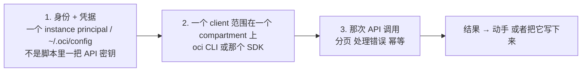
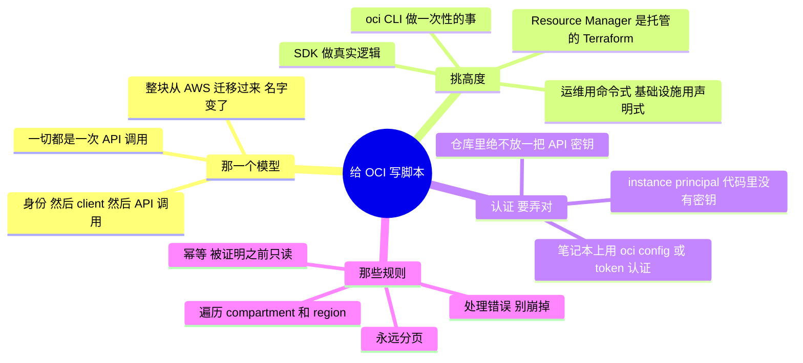

# OCI —— 把 API 写成脚本（从代码去管理与运维）

> 🌐 **语言：** [English（默认）](../../../../platforms/oci/automation.md) · **中文**
>
> ⚠️ 本项目**默认语言为英文**，`platforms/oci/automation.md` 是"事实来源"。本页中文是多语言支持的一部分，可能略滞后于英文版；两者不一致时以英文为准。

---

> [`architecture`](architecture.md) 是 OCI 怎么组织的；[`operations`](operations.md) 是跑它长什么
> 样。这篇笔记是那个*怎么做*：**从代码驱动 OCI** —— [运营模型](../../00-the-operating-model.md)
> 的第 3 招，也是那套 ramp 方法一个很干净的案例，因为那个 API 模型整块从 AWS/GCP 迁移过来，
> 只有名字变了。

OCI 里的一切都是一次 API 调用 —— 控制台、`oci` CLI、Terraform、SDK 都是同一套 API 的包装。所以
"我怎么自动化 X？"变成*"哪一次调用，用哪个身份，处理哪些故障模式？"* —— 而一份
[脚本](../../foundations/README.md)背景在这里直接变成 OCI 运维能力。

## 那一个模型：`(身份) → (client) → (API 调用)`

把这三样弄对 —— 一个**受限身份**、一个**知道 compartment 的 client**，以及一次**被正确调用的 API**
—— 你就能自动化 OCI 所暴露的任何东西。

## 那架工具阶梯 —— 挑高度

| 工具 | 它是什么 | 什么时候去够它 |
| --- | --- | --- |
| **`oci` CLI** | 作为 shell 命令的 API | 一次性的事、快速检查、Bash 里的胶水 |
| **那个 SDK**（Python 等） | 作为一个库的 API | 真实逻辑 —— 循环、分支、做工具 |
| **Cloud Shell** | 托管 shell 里的 CLI 加 SDK | 临时运维，不需要本地凭据 |
| **Terraform / Resource Manager** | **声明式**期望态 | 任何要可复现的东西（[`iac`](../../cross-cutting/iac-and-config.md)） |

和处处同样的那条分界线：**CLI 和 SDK 是命令式的**（运维）；**Terraform / Resource Manager 是
声明式的**（那些常驻的基础设施）。Resource Manager 是 OCI 那个**托管的** Terraform ——
state 和运行都替你处理好了。

## 认证 —— instance principal 优于密钥文件

那条最重要的规则，也是 AI 最常搞错的一条：**绝不要把一把 API 签名密钥放进一个脚本或一个仓库。**

- **在一台计算实例 / OKE 上** → 一个 **instance principal**（或 dynamic group）：那台 VM 以它自己
  的身份认证，任何地方都没有密钥 —— 一个 AWS instance role 的对应物，也是任何跑在 OCI 里的东西的
  正确默认项。
- **在你笔记本上** → 由 `oci setup config` 生成的 `~/.oci/config`，用一把你留在本地的密钥
  （或者更好，用基于 token 的 `oci session authenticate`）。
- **绝不** → 把那把 API 私钥提交进仓库或者烤进一个镜像 —— 那次[泄露密钥](operations.md)的事故，
  提前提交了（[`身份`](../../cross-cutting/identity-iam.md)）。

你运行中的代码里没有密钥，正是重点 —— instance principal 存在的意义，就是让根本没有东西可泄露。

## 把一个能用的脚本和一把自伤枪分开的那些规则

[foundations](../../foundations/README.md) 那门幂等与安全纪律，落在 OCI 的具体上：

- **分页 —— 永远要。** OCI 的 list 调用会分页；CLI 的 `--all` 和 SDK 的分页助手存在的意义，就是
  让你不至于静默地漏掉第一页之后的一切。
- **遍历 compartment（以及 region）。** 资源是*逐 compartment* 存在的；一个从一个 compartment 盘点
  "一切"的脚本只看到一个切片。循环那棵 compartment 树，并为区域资源循环 region。
- **逐资源处理错误** —— 一个你没有访问权的 compartment，不该中止整次运行。
- **变更要幂等** —— 先检查再动手、能安全重跑 —— 就是
  [Terraform](../../cross-cutting/iac-and-config.md) 在结构上强制的同一条规则。
- **在被证明之前只读** —— 先对着 `list`/`get` 调用去开发；只有在逻辑被证明之后才加
  `create`/`delete`/`update`，并放在一个 dry-run 参数后面。

## 自动化脚本的两种形状

- **只读/审计脚本** —— 盘点、一次合规检查（公开的桶、过宽的策略、未加密的卷）、一份成本/标签报表。
  只读、安全、常跑 —— 那个[盘点 lab](labs)在 OCI 上恰好就是这个。
- **修复/编排脚本** —— 它**动手**：给没打标签的资源打标签、停掉闲置实例、轮换一个 secret。
  它会变更状态，所以它承担那全套纪律 —— instance principal / 受限身份、先 dry-run、幂等、有记录。

## AI 怎么协助写这些自动化

- **对骨架和查 API 很在行** —— *"一条 `oci` CLI 命令，列出这个 compartment 里每一个开着公开访问的
  桶"* —— 几秒钟出那个形状，*前提是*你去核实那个调用真的存在。
- **AI 会烧到你的地方（验得最狠）：** OCI **更年轻、训练数据更薄，所以 AI 发明 `oci` 子命令、参数
  和 IAM 策略动词，比在 AWS 上更放得开**；它会**忘掉遍历 compartment**；它会**把 OCPU/vCPU 混为
  一谈**；而且它会**引用一把 API 密钥**而不是一个 instance principal。对着一个沙箱 compartment
  只读地跑一遍；漏掉的 compartment 或者被截断的结果会立刻冒出来。

## 诚实边界

🔨 **在它可迁移的地方，🧭 在它属于 OCI 的地方。** 那门脚本与自动化**纪律**是亲手做过的 ——
Python/Bash、分页/幂等/处理错误的自动化、先只读（[`foundations/`](../../foundations/README.md)）
—— 而它整块迁移到 OCI 的 API 上。但 OCI **特有**的那片面（准确的 CLI/SDK、instance principal 的
配置、服务的怪癖）是那条 🧭 ramp，测绘并验证过，而且**不声称任何生产 OCI**。那句声称：一份很强的
自动化地基，加上一条通向 OCI API 的、快速且可验证的 ramp —— 这里每一份 OCI 文档诚实的立场
（[`WHY.md`](../../WHY.md)）。

## 这篇文档一屏看完

