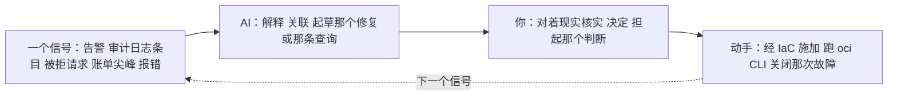

# OCI —— 跑它（day-2 的现实）

> 🌐 **语言：** [English（默认）](../../../../platforms/oci/operations.md) · **中文**
>
> ⚠️ 本项目**默认语言为英文**，`platforms/oci/operations.md` 是"事实来源"。本页中文是多语言支持的一部分，可能略滞后于英文版；两者不一致时以英文为准。

---

> [README](README.md) 是 *OCI 是什么*；[architecture](architecture.md) 是*它怎么组织*；
> 这篇笔记是**跑它长什么样** —— 那份简报、什么会把你叫醒、按节奏的那些运维活，以及运营循环里的
> AI。OCI 是一条 🧭 ramp，所以这里是那门可迁移的运维纪律被映射到 OCI 的工具上，不是生产 OCI 经验。

## 那份简报 —— "运维 OCI"意味着什么

和任何一朵云同一个形状：你通过声明意图来运维，并让结果保持健康、安全、负担得起。那三个 day-2
问题：

- **它健康吗？** —— Monitoring 告警接好了吗，而你会在一位用户之前知道吗？
- **它安全吗？** —— compartment policy 是最小权限的吗、Cloud Guard 干净吗、没有不该公开的东西
  公开着吗？
- **它负担得起吗？** —— 预算设了吗、没有被遗忘的资源吗、OCPU/出网那笔算术对吗？

## 运维笔记 —— 在 OCI 上什么会把你叫醒

- **那个公开的 Object Storage 桶** —— 私有数据被一次配置错误弄成了公开；那次典范式的云上入侵。
  一条有人**真的去读**的 Cloud Guard 发现（[`the-stack/07`](../../the-stack/07-security.md)）。
- **那把泄露的 API 密钥 / 被滥用的 instance principal** —— 一把被提交进仓库的 API 签名密钥，
  或者一个过宽的 instance principal。这**就是**为什么 OCI 推 instance principal 而不是密钥文件
  （[automation](automation.md)）；一把在 git 里的密钥就是一次故障。
- **security list 对 NSG 的困惑** —— 一条连接被拒绝，因为两套重叠的过滤机制互相不同意
  （[architecture](architecture.md)）；那个每日网络故障的 OCI 口味版，压在那架
  [调试梯子](../../the-stack/02-network.md)之上。
- **那个 OCPU 成本意外** —— 有人拿一台"2 OCPU"的机器对比了一台"2 vCPU"的机器，然后把算术算差了
  2 倍（[architecture](architecture.md)、[成本](../../cross-cutting/cost.md)）。
- **单 AD 与 fault domain 的布置** —— 一个"高可用"的服务，两个副本都在一个 fault domain 里
  （或者在一个没有跨 AD 选项的单 AD region 里），而它是在那次它本该熬过的故障当中被发现的。
- **那个"出网便宜"的优势，被用对了** —— 这不是一次呼叫，而是那份设计上的胜利：把备份/归档路由到
  OCI Object Storage，因为取回很便宜。

## 那些运维活，拆开来看

按**节奏**，用 OCI 的原生工具：

| 节奏 | 任务 | 面 | 它为什么要紧 |
| --- | --- | --- | --- |
| **持续（自动）** | 对健康、错误、预算的 Monitoring 告警；Cloud Guard 的发现 | 可观测性、安全 | 是系统把你叫醒，不是一位用户。 |
| **持续（自动）** | instance pool 自愈/扩缩不健康的实例 | 计算 | 牲口，不是宠物。 |
| **每日** | 分诊 Cloud Guard 的发现加那些告警；对真的那些动手 | 安全 | 那些发现只有在有人动手时才有用。 |
| **每日** | 回答"这个为什么被拒绝"（security list 对 NSG）和"这是谁干的"（Audit） | 网络、身份 | 那两个最基本的故障与审计问题。 |
| **每周** | 复审 compartment policy：过宽的授予、没用过的 dynamic group | 身份 | 最小权限会衰减；compartment 的范围让爆炸半径保持很小。 |
| **每周** | 成本复审：异常、没打标签的花费、OCPU 的 rightsizing | 成本 | 在发票之前抓住那个被遗忘的资源。 |
| **每月** | 从利用率给弹性 shape 做 rightsizing；重新审视承诺/preemptible | 成本、计算 | 多数实例配得过大，因为没人看过。 |
| **每月** | 刷新自定义镜像；滚一遍 instance pool | 计算、安全 | 关掉已知 CVE 的暴露面（[`the-stack/03`](../../the-stack/03-compute-and-images.md)）。 |
| **每季** | 从 Object/Archive 对一份备份做恢复测试；核实 RPO/RTO | 存储 | 一份没测过的备份是一个希望（[`the-stack/04`](../../the-stack/04-storage.md)）。 |
| **每季** | 访问再认证；复审 Security Zones 护栏 | 身份、安全 | 证明那些护栏还守着；审计要证据。 |
| **有故障时** | 检测 → 遏制 → 根除 → 恢复 → 复盘 | 全部 | 那门[故障纪律](../../cross-cutting/incident-response.md)。 |
| **有变更时** | 一切走 IaC 加评审，不走控制台 | 发放 | 控制台是用来看的（[`iac`](../../cross-cutting/iac-and-config.md)）。 |

和每一朵云同样的两条真相：**多数例行工作是自动的 —— 人的活是分诊、复审和判断**；以及
**那个复审节奏（每周策略、每周成本、每季恢复）是团队会跳过、然后后悔的那部分。**

## AI 怎么协助运维工作

和那条[学习 ramp](ai-ramp.md) 不同 —— 这是日常循环里的 AI：

- **故障副驾 / 写查询** —— 把那条审计条目、那条 `oci` 报错、一个 Logging 查询需求贴进去：
  *"这是什么意思，你会查什么？"* 一个你去测的快速假设。
- **把修复起草成代码** —— 一条策略语句、一条 NSG 规则、一次 Terraform 变更 —— 作为一份走正常
  IaC 闸门的、可评审的初稿。
- **AI 会烧到你的地方（验得最狠）：** OCI **更年轻、在训练数据里被代表得更少，所以 AI 在这里产生
  的幻觉*更多*，不是更少** —— 发明出来的服务名、CLI 参数，以及不存在的 IAM 策略动词。它还会在成本
  推理里**把 OCPU 和 vCPU 混为一谈**。那道护栏就是这个仓库那条规则 —— **AI 碰信号和初稿；你碰
  生产** —— 而在 OCI 上你要比在 AWS 上验得更狠。

## 诚实边界

🧭 **ramp。** 那门运维**纪律**是 🔨 —— 分诊、故障方法、复审节奏、最小权限复审、恢复测试、把成本
当成信号 —— 从真实的基础设施工作里带过来。但每一样 OCI 服务的细节（哪个控制台、哪条发现、哪条
告警）都是那条 ramp，按这个仓库的方法测绘并验证过，不被声称成为一片生产 OCI 估算面值过班。
那句声称：一份可迁移的运维纪律，加上一条通向 OCI 那套工具的、快速而诚实的 ramp —— 而上面那条
AI 辅助的循环，就是那条 ramp 怎么被施加，而不假装那份判断是从机器那儿来的。
