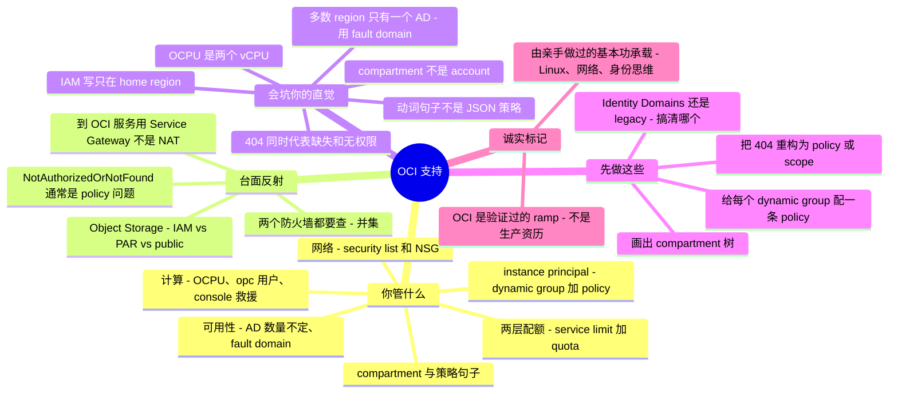

# OCI 支持 —— 运维者的转轨指南

> 🌐 **语言：** [English（默认）](../../../../platforms/oci/support.md) · **中文**
>
> ⚠️ 本项目**默认语言为英文**，`platforms/oci/support.md` 是"事实来源"。本页中文是多语言支持的一部分，可能略滞后于英文版；两者不一致时以英文为准。

---

> [`operations.md`](../../../../platforms/oci/operations.md) 讲的是运营你自己那套 Oracle Cloud Infrastructure 的**节奏**。本篇讲另一半：**把 OCI 支持当作一门修/救（break-fix）手艺** —— 真正反复出现的工单、精确的排查落点，以及**一个来自别的方向（AWS、Azure、GCP、或 on-prem）的强 sysadmin 接手它时，被这家最年轻的 hyperscaler 刻意做的那些不同选择坑在哪。** 诚实分级先说清：本篇整体是 **🧗 ramp** —— 从 AWS/Azure/GCP 模型映射、对着 Oracle 自家文档核对、并在可跑的 [lab](../../../../platforms/oci/labs/a-compartment-is-not-an-account/) 里练过 —— 由 ✋ 可迁移基本功（Linux、网络、DNS/TLS、身份思维）承载，而非 OCI 上的生产资历。

OCI 自己的[平台篇](../../../../platforms/oci/README.md)一句话说清了标题：*compartment 是 OCI 的爆炸半径单位……而它的 IAM 策略语言读起来像句子。* 这就是本页存在的全部理由。一个"已经懂云"的运维接手 OCI 很快，然后正好在 Oracle（造得更晚、带着后见之明）做了不同选择的那几处栽跟头：**用 compartment 而非每个隔离一个 account/subscription/project**、一门**由动词而非 JSON 组成的 IAM 策略语言**、一个**意思是"或者你没权限看它"的 404**、一个**等于两个 vCPU 的 OCPU**、**可能只有一个 availability domain 的 region**、以及**两个同时生效的防火墙（security list *和* NSG）**。本篇把职责、反复出现的工单及其诊断面、以及一个自信的跨方向反射恰好失灵的那几处一一点名——并显式标出 AWS/Azure/GCP 对比，因为大多数读者是从那儿来的。

## 支持 OCI 让你要为什么负责

映射到 [seven surfaces](../../../../00-the-operating-model.md)，大致按工单到达顺序：

| Surface | 你要为之负责的事 |
| --- | --- |
| **身份——compartment + 策略句子** | **compartment 树**（隔离/爆炸半径单位，*在同一个 tenancy 内*）、**group** / **dynamic group**、以及**写成句子的 policy**—— `Allow group G to <verb> <resource-type> in compartment C`。动词层级 **`inspect ⊂ read ⊂ use ⊂ manage`**、policy **沿树向下继承**、所有 IAM 写操作的 **home region**、以及这个 tenancy 是 **Identity Domains** 还是 legacy IAM。 |
| **工作负载身份** | **instance principal** / resource principal（机器上不放密钥）——需要**两半**：一个规则能匹配到实例的 **dynamic group**，*外加*一条授予该 dynamic group 的 **policy**。 |
| **网络** | "为啥 X 到不了 Y？"—— **security list**（subnet 级）**和** **NSG**（VNIC 级），两者*都*生效；route table；**Internet Gateway** / **NAT Gateway** / **Service Gateway**（私网到达 OCI 服务）/ **DRG**；公/私 IP；stateless 规则的回程流量。 |
| **计算** | 实例（VM **和** bare metal）、**flexible shape**（拨 `OCPU` + 内存）、**在启动时**注入的 **`opc`** 用户 + SSH key、**instance/serial console** 救援、`OCPU` = 2 `vCPU` 的算法。 |
| **可用性设计** | **AD 数量不定（每 region 1 或 3 个）**；一个 AD 内有 **3 个 fault domain** 做反亲和。HA = 有多 AD 就跨 AD，否则跨 FD。 |
| **存储与数据** | **Object Storage** 访问经 **IAM vs pre-authenticated request (PAR) vs public bucket**；bucket 在 tenancy namespace 里；Autonomous DB / DB systems（wallet）。 |
| **provisioning** | **Resource Manager**（托管 Terraform —— OCI 替你存 state）、Cloud Shell、`oci` CLI。 |
| **治理与配额** | **两层**：Oracle 设的 **service limit**（per tenancy/region）*外加*你自己的 **compartment quota**。**OCID** 作为每个资源无歧义的句柄。 |
| **成本** | Universal Credits、Cost Analysis、**budget**——但 **egress 便宜/免费**（每月 10 TB 免费）意味着远没有 AWS 那种 egress 恐慌。 |
| **可观测性** | **Audit**（跨 API 调用的"谁干的"，默认 90 天 / 最长 365 天）、**Logging**、**Monitoring**、**Search**。 |
| **升级给 Oracle** | service-limit 提额和很多问题走 **My Oracle Support / Open Support Request**。 |

## 常见工单 —— 以及去哪查

OCI 的修/救是在 Console（那个常驻的 **compartment 选择器**和 **region 切换器**）、**`oci` CLI**、和 **Audit** 日志上做模式识别。要练成的反射是：*"哪个面能回答这个问题——它又刻意不告诉我什么？"*

**身份——`NotAuthorizedOrNotFound`（HTTP 404），头号工单。** OCI 对"资源不存在"*和*"你没权限看它"返回**同一个 404**——一个刻意的信息不泄露选择，让调用者无法探测什么存在。实际上 **"not found" 通常意味着"没有 policy 授予你访问"**（或你在错的 compartment 或 region）。按顺序排查根因：没有 policy 授予该动作；**错的 compartment**；**动词太弱**（该 `manage` 却给了 `read`）；一条**匹配不到实例**的 **dynamic-group 规则**；一次**在 home region 之外发起的 IAM 写**；或 **Identity-Domains-vs-legacy** 混淆（少了 `<domain>/` 限定符——省略时默认 `Default/`）。*去哪查：* **Policies** 页、`oci iam policy list`、**compartment 选择器**、dynamic-group 的匹配规则，并确认你对准的是 **home region**。先把 404 当 policy/scope 问题，再当资源不存在。

**网络——"到不了我的实例。"** 记住 OCI 的形状：**两个**过滤机制同时生效——subnet 的 **security list** *和* 该 VNIC 所属的每个 **NSG**——而有效规则集是**并集**（*任一*放行就通；组合只会更宽松）。所以原因几乎总是**缺一条 allow**，不是有 deny。规则可**有状态或无状态**，而 **stateless** 规则要显式放行回程。然后是常见嫌疑：**没有 Internet/NAT Gateway**、**route table 缺一条**去网关的规则、VNIC 上**没有公网 IP**。*去哪查：* VCN 的 **route table**、**security list**、**NSG**、和 **VNIC 详情**——**两个**防火墙面都要看，因为一个放行就够、一个拦着不算数。

**工作负载身份——"我的 instance principal 被拒。"** 两半，缺的那半通常是 policy。一个有匹配规则但**没有 policy 的 dynamic group 什么都不授予**；一条针对 dynamic group、但该组**规则匹配不到实例**（compartment OCID / tag 不对）的 policy 也什么都不授予。这是上面 `NotAuthorizedOrNotFound` 的头号来源。*去哪查：* dynamic-group 的**匹配规则**，以及把该 dynamic-group 当 subject 的 **policy**。

**计算——"我 SSH 不进去。"** 你以 **`opc`** 登录（不是 root），而 SSH **公钥在启动时注入**——没有 console 密码重置。经 **instance（serial）console connection**、**Run Command**（经 Oracle Cloud Agent、以 root 跑、无需 SSH）、或 boot-volume 救援腾挪来找回丢/坏的 key。用 **`OCPU` = 2 `vCPU`** 来算尺寸——一个 "4 OCPU" 的 shape ≈ 别处的 8 vCPU 机器。

**存储——Object Storage 403。** 分清三条访问路径：**IAM**（需 policy）、**PAR**（临时签名 URL——过期*或*创建者失去访问时失效）、和 **public bucket**（`ObjectRead` / `ObjectReadWithoutList`；默认 `NoPublicAccess`）。403 意味着*你用的那条路*对该调用者其实没被授予。Oracle 建议 **PAR 优先于 public bucket**；私有实例应经 **Service Gateway** 到达 Object Storage，而非 NAT 网关。

**治理——"You have reached your service limit."** 两层。若是 Oracle 设的 **service limit**（per tenancy/region），经 **Open Support Request** 提额。若是你设的 **compartment quota**，改 quota policy——quota *细分*且不能超过 tenancy limit。大部署**之前**两个都查。

**成本。** 通常轻——**egress 每月 10 TB 免费然后很便宜**，所以 AWS 那种 "egress 会让我破产" 的恐慌基本不适用。但仍要设 **budget**、盯闲置的 flex-shape OCPU/内存和孤儿 block/boot volume。

## 经验差 —— 一个强 sysadmin 的直觉会错在哪

做过 OCI 支持的人和没做过的人之间的差距不在 Console——而在一组承重假设（从 AWS、Azure、GCP、或 on-prem 搬来），它们在这里是**错的**，每条都挂着失效模式。

- **compartment 是隔离单位——不是 account/subscription/project。** "开个新 account（AWS）/ subscription（Azure）/ project（GCP）来隔离一个负载"的反射是错的：OCI 用**同一个 tenancy 内的 compartment** 做隔离。它们组成一棵**树**（可深 6 层）、是**全局的**（一个 compartment 横跨所有已订阅 region）、资源可在其间**移动**、而且——承重的那点——compartment 是**主要的 policy scope 和安全边界**。[lab](../../../../platforms/oci/labs/a-compartment-is-not-an-account/) 证明这点。
- **IAM policy 是动词句子，不是 JSON / RBAC / binding。** **没有 JSON 策略文档**（AWS）、**没有某 scope 上的角色分配**（Azure）、**没有 role binding**（GCP）。你写 `Allow group G to <verb> <resource-type> in compartment C`，四个动词是**累积的聚合 `inspect ⊂ read ⊂ use ⊂ manage`**（`use` 能操作已有资源但一般**不能 create/delete**；`manage` 是全部）。policy 挂在 compartment/tenancy 上并**沿树向下继承**。你的 JSON-策略 / 角色分配肌肉记忆迁移不过来——但*最小权限思维*迁移得过来。
- **404 不代表"没了"。** OCI 对缺失资源和缺权限**都返回 `NotAuthorizedOrNotFound`（404）**——故意的。AWS/Azure 那套 `403`=拒绝 / `404`=缺失的分裂没了；这里 "not found" *最常是 policy/compartment/region 问题*。去追一个其实只是"你看不见"的"被删"资源，是经典时间黑洞。
- **IAM 全局，但只在 home region 写。** user、group、dynamic group、**policy**、compartment 都**在 tenancy 的 home region 里主控**、只读复制到别处；你**只能在那儿创建/更新**它们，而且改动要**几分钟**才传播。"IAM 是全局的，我在哪个 region 都能编辑" 会坑多 region 的运维。
- **`OCPU` ≠ `vCPU`——每次算尺寸/成本都会差 2 倍。** **1 OCPU = 一个物理核 = 2 vCPU**（x86）。用 **4 OCPU** 去对标一台 8-vCPU 的 EC2，不是 8；把两者当相等的成本对比会差一倍。
- **availability-domain 数量不定——"处处 3 个 AZ"的反射会崩。** **大多数 OCI region 只有一个 availability domain。** "跨 3 个 AD 铺副本做 HA" 在单-AD region 里*失败*。正确的 AD 内原语是 **fault domain**——每个 AD 有 **3** 个，给硬件反亲和。"3 个 AZ" → 在多数 OCI region 里变成 "**3 个 fault domain**"。（AWS 没有真正的 fault-domain 对应物。）
- **两个防火墙同时生效。** **security list**（subnet 级）**和** **NSG**（VNIC 级）*都*管一个 VNIC，有效规则集是**并集**。不同于 AWS（security group 只在 ENI 上），*任一*处的 allow 就够——所以当流量意外被放行时，你得查**两处**。规则也可以是 **stateless**（回程你自己放行）。
- **到 OCI 服务用 Service Gateway，不是 NAT 网关。** 要让**私有**实例私网到达 Object Storage（和其他 OCI 服务），你加一个 **Service Gateway**——流量走 Oracle 骨干、绝不上互联网、且**不计 egress**。反射性地加个 NAT 网关"好让它够到存储"是错的（也更贵）。
- **一个没有 policy 的 dynamic group 什么都不干。** instance-principal 故事有**两半**必需——dynamic-group 的*规则*和点名它的 *policy*。建了 dynamic group 只做了一半；缺的 policy 就是经典的"没密钥，也没访问"。
- **配额有两层。** Oracle 设的 **service limit** *外加*自助的 **compartment quota**（不能超过 limit）。一次部署可能因*任一*层而失败——AWS/Azure 只给你那个供应商设的层。
- **一切都有 OCID。** 资源经一个长长的 **`ocid1.<type>.<realm>…`** 标识引用——在 policy、CLI、Terraform、和支持工单里。调试或升级时抓 **OCID**，不是显示名。
- **Identity Domains vs legacy IAM——搞清这个 tenancy 是哪个。** OCI 把 IDCS 并入 IAM 成了 **identity domain**；一个 tenancy 可能在任一模型上，这改变了 *user/group/policy 住在哪* 和 policy 限定符（`<domain>/<group>`；默认 `Default/`）。跟错模型的文档白费几小时——在推理身份之前先确定它。
- **egress 便宜——OCI 少有的更*轻松*之处。** 每月 10 TB 免费然后低价；AWS 运维纯为躲 egress 表而做的那些扭曲，在这里基本没必要。

## 什么可迁移，什么不可

| 强迁移 | 带保留地迁移 | 别带过来 |
| --- | --- | --- |
| Linux / guest-OS 深度——OCI 计算就是 VM 和 bare metal | 身份与最小权限*思维*——映射到动词 + compartment scoping | account/subscription/project 每隔离一个——OCI 用同一 tenancy 内的 **compartment** |
| DNS、TLS/证书、TCP/IP、CIDR——VCN 是 VPC 形状 | 防火墙/ACL 推理——但**两个**面（security list **和** NSG）、并集、有时 stateless | JSON-策略 / RBAC-分配 / role-binding 反射——OCI 是**动词句子** |
| 结构化排障——OCI 错误很具体（`NotAuthorizedOrNotFound`、service-limit） | 层级/继承直觉——policy 沿 compartment 树**向下**继承 | "`403`=拒绝，`404`=缺失"——OCI **两者都返回 404** |
| 脚本与 IaC（`oci` CLI、Terraform / Resource Manager） | "vCPU 是 CPU 单位"——用 **OCPU** 设计（= 2 vCPU） | "处处 3 个 AZ"——多数 region 只有 **1 个 AD**；用 **fault domain** |
| 日志阅读——Audit ≈ CloudTrail，加 Logging/Monitoring | 工作负载身份概念——instance principal，但 **dynamic group + policy** 两者都要 | "安全在一个防火墙对象上"——security list **和** NSG **都**生效 |
| 变更纪律（IaC、state、回滚） | "IAM 全局，随处编辑"——写只在 **home region** | "加个 NAT 网关来够存储"——用 **Service Gateway** |
| 成本意识 | "egress 会让我破产"——在 OCI 上基本不成立 | 假设只有一层配额——有**两层**（service limit + compartment quota） |

## 第一周 / 前 90 天

**第一周。**
1. **先把 compartment 树画出来**——学清层级、谁装在哪个 compartment 里，并在授权任何东西*之前*内化**动词模型（`inspect/read/use/manage`）**。
2. **确定身份模型**——这个 tenancy 在 **Identity Domains** 还是 legacy IAM？它改变 user/group/policy 住哪和 policy 限定符。搞错了，你跟的每篇文档都是错的那篇。
3. **找到并记下 home region**——所有 IAM 创建/更新都在那儿做，测别处前留几分钟传播。
4. **把 `NotAuthorizedOrNotFound` 重构为** *通常是 policy / 错 compartment / 错 region* 的问题，而非"资源没了"。

**前 30 天。**
5. **设计 HA 前，先查你 region 的 AD 数量**——单-AD → 跨 **3 个 fault domain** 设计，而非"3 个 AZ"。
6. **算尺寸或报成本前，内化 `OCPU` = 2 `vCPU`。**
7. **调可达性时，永远查*两处***——subnet 的 security list **和** VNIC 上的每个 NSG——有效策略是并集，规则可能 stateless。
8. **给每个 dynamic group 配一条 policy**——光有 dynamic group 什么都不授予。

**前 90 天。**
9. **立一个 Service Gateway** 做私网 OCI-服务访问（Object Storage 等），而非去找 NAT/Internet 网关。
10. **大部署前查*两层*配额**——Oracle **service limit** *和* **compartment quota**。
11. **在 policy、工单、自动化里用 OCID 引用资源**——显示名会有歧义之处它不会。
12. **吃 egress 便宜的红利**——别把 AWS 的 egress 恐慌架构继承过来；为延迟和局部性设计，不为 egress 账单。

## AI 辅助的 ramp（OCI 口味）

- **从你已知的翻译过来——并索要 deltas：** *"我懂 AWS IAM 和 VPC —— 把 OCI 的 compartment、动词化策略语言、security-lists-vs-NSG、和 instance principal 映射到它们上，只标出真正的差异。"* OCI 奖励 translate-then-verify，因为它太多是改了名的对应物——但 **compartment 即安全边界、动词层级、404-两者皆是、单-AD region 没有干净的 AWS 映射**，所以那些要往死里验证。
- **让它起草 `oci` CLI / Terraform，你亲手做最小权限。** AI 在这里很强——而它也会**写一份 OCI 上不存在的 JSON IAM 策略**、**发明动词或资源类型**、**忘了 home-region 约束**、**在该用 Service Gateway 的地方建议 NAT 网关**、并在你要一个 compartment 时提一个 scope 到整个 tenancy 的 policy。对着文档核验、并在一次性 compartment 里跑。同一套"往死里验证"的纪律——见 [`ai-workflow/`](../../../../ai-workflow/) 和[运营环](../../../../platforms/oci/operations.md)。

## 诚实边界

本篇是 **🧗 ramp，而且明说** —— 从 AWS/Azure/GCP 模型映射、对着 Oracle 自家文档核对、并在可跑的 [lab](../../../../platforms/oci/labs/a-compartment-is-not-an-account/) 里练过，**不是**在生产里跑过。承载它的是真的：**✋ 可迁移基本功**——Linux 与 guest-OS 深度、网络、DNS/TLS、以及身份/最小权限*思维*（与 [`identity-iam.md`](../../../../cross-cutting/identity-iam.md) 和与 [self-host](../../../../platforms/self-host/) 相邻的 Linux 深度画的是同一条线）。上面那些 OCI 特有机制——compartment、动词策略语言、security-lists-vs-NSG、instance principal、fault domain、两层配额——是映射并文档核验过的，不是资历。更深的生产 OCI（大型多 compartment 资产、OKE 平台工程、FastConnect/DRG 拓扑、规模化 Autonomous DB 运营）仍在前方；注释如实说明、绝不吹。OCI 在本仓库里的诚实标记是单一、一致的 **🧗 ramp**——见[平台篇](../../../../platforms/oci/README.md)。

## Field kit —— 真实工具与参考

以下指针在 GitHub 上逐个核实存在，按用途分组。OCI 的 OSS 生态明显小于 AWS/Azure——这是诚实、不掺水的一组，某个类别确实薄就直说。

**IAM / policy 与"我们到底有什么"基线：**
- [`oracle/oci-cli`](https://github.com/oracle/oci-cli) · [`oracle/oci-python-sdk`](https://github.com/oracle/oci-python-sdk) —— 主检查/修复面；SDK 的 [`examples/showoci`](https://github.com/oracle/oci-python-sdk/tree/master/examples/showoci) 是事实上的 tenancy 库存/成本/配置报告器（任何支持工作从这儿起步）。
- [`NetSPI/oci-lexer-parser`](https://github.com/NetSPI/oci-lexer-parser) —— 把 OCI policy 语句和 dynamic-group 规则解析成 JSON；最接近 policy 分析器的东西，用来发现过宽或无效的语句。*（小但专用。）*
- [`oci-landing-zones/terraform-oci-modules-iam`](https://github.com/oci-landing-zones/terraform-oci-modules-iam) —— CIS 对齐的 IAM 模块（compartment、group、policy、dynamic group）——一个正确结构参考，用来 diff 一个乱掉的 tenancy。

**网络、IaC 与拓扑：**
- [`oracle/terraform-provider-oci`](https://github.com/oracle/terraform-provider-oci) —— IaC 骨干；它的 issue tracker 是事实上的排障 KB（如 `NotAuthorizedOrNotFound` 那些帖）。
- [`oracle/oci-designer-toolkit`](https://github.com/oracle/oci-designer-toolkit)（OKIT）—— 可视化 VCN/架构设计器；OCI 生态缺的那个网络可达性工具的实用替身。
- [`oci-landing-zones/terraform-oci-modules-networking`](https://github.com/oci-landing-zones/terraform-oci-modules-networking) —— CIS 对齐的 VCN/subnet/security-list/NSG 模块。
- [`oracle-devrel/cd3-automation-toolkit`](https://github.com/oracle-devrel/cd3-automation-toolkit) —— 把一个**已有 tenancy 导出**成 Excel + Terraform——逆向工程和记录一份继承来的资产的利器。

**姿态、审计与成本（带已验证 OCI provider 的多云工具）：**
- [`prowler-cloud/prowler`](https://github.com/prowler-cloud/prowler)（`oraclecloud` provider）· [`nccgroup/ScoutSuite`](https://github.com/nccgroup/ScoutSuite)（`oci` provider）—— 跑 OCI 安全/合规检查并出一份离线姿态报告；两者兼作"这个 tenancy 哪儿配错了"。
- [`oci-landing-zones/oci-cis-landingzone-quickstart`](https://github.com/oci-landing-zones/oci-cis-landingzone-quickstart) —— 权威的 CIS OCI Foundations landing zone；用来 diff 的安全基线。
- [`turbot/steampipe-plugin-oci`](https://github.com/turbot/steampipe-plugin-oci) —— 用 SQL 查 OCI（"给我看每个 public bucket / 开放的 NSG"），不用写 SDK 代码；[`steampipe-mod-oci-thrifty`](https://github.com/turbot/steampipe-mod-oci-thrifty) 标出闲置/浪费的资源。
- [`cloud-custodian/cloud-custodian`](https://github.com/cloud-custodian/cloud-custodian)（`c7n_oci`）—— 用 YAML 规则跨 OCI 管成本 + 治理。
- [`hitrov/oci-arm-host-capacity`](https://github.com/hitrov/oci-arm-host-capacity) —— *（已归档）* 应对臭名昭著的 Always-Free ARM "Out of host capacity" 错误的参考绕法——仍是 OCI 单一最常被问的支持痛点最常被链接的答案。

**精选清单，以及值得优先于任何博客收藏的权威文档**——最好维护的
[`neitsab/awesome-oracle-cloud-free-tier`](https://github.com/neitsab/awesome-oracle-cloud-free-tier)，
以及 **Oracle 自家文档**：
[Policy 语法](https://docs.oracle.com/en-us/iaas/Content/Identity/Concepts/policysyntax.htm) ·
[动词（inspect/read/use/manage）](https://docs.oracle.com/iaas/Content/Identity/policyreference/policyreference_topic-Verbs.htm) ·
[Managing regions（home region）](https://docs.oracle.com/en-us/iaas/Content/Identity/Tasks/managingregions.htm) ·
[Security rules（SL + NSG 并集）](https://docs.oracle.com/en-us/iaas/Content/Network/Concepts/securityrules.htm) ·
[Service Gateway](https://docs.oracle.com/en-us/iaas/Content/Network/Tasks/servicegateway.htm)。
*（时效：**IDCS 现已成为并入 IAM 的 "identity domains"**——一个 tenancy 可能在任一模型上；**egress 定价**是那个唯一易变的事实（每月 10 TB 免费是有文档的基线；去核实实时定价页）。对着当前文档核实。）*

## Lab —— 一个 compartment 不是一个 account ✅ 可跑

**亲手证明 OCI 的签名级访问教训。** 一个纯本地、只用 stdlib 的 drill，把 OCI IAM 建模：一个**没有 policy** 的用户拿到 **`NotAuthorizedOrNotFound`（一个 404，不是 403）**——资源是*不可见*，不是"被拒"；一条 **`read` policy** 授予 get/list 但**不**授予 delete（**`inspect ⊂ read ⊂ use ⊂ manage`** 层级）；一条 **`use` policy** 能操作已有实例但**不能 create**；一条 **`manage`** 什么都能做并包含下位动词；一条挂在**父 compartment** 的 policy **向下继承**到子级；而一条 scope 到某个 compartment 的 policy **在兄弟里什么都不干**——scope 就是边界。

```bash
python3 platforms/oci/labs/a-compartment-is-not-an-account/verb_and_compartment_drill.py
```

exit `0` 表示每条教训都成立（兼作 CI 检查）。见 [`labs/a-compartment-is-not-an-account/`](../../../../platforms/oci/labs/a-compartment-is-not-an-account/)。

## 一页看全本章


