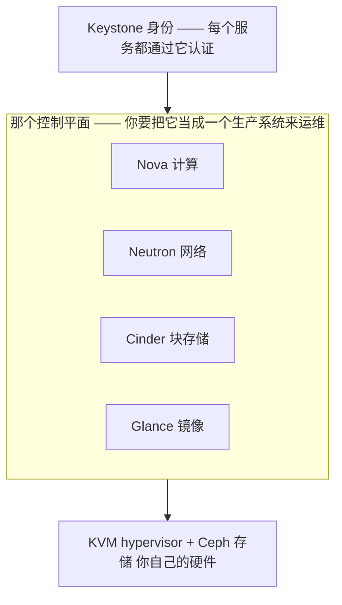

# OpenStack —— 自己造一朵云

> 🌐 **语言：** [English（默认）](../../../../platforms/openstack/README.md) · **中文**
>
> ⚠️ 本项目**默认语言为英文**，`platforms/openstack/README.md` 是"事实来源"。本页中文是多语言支持的一部分，可能略滞后于英文版；两者不一致时以英文为准。

---

> 和 [AWS](../aws/) 同一套四段模板：**它是什么 → 管理员技能图 → AI 辅助的 ramp → lab**
> —— 再加上更深的 **[架构](architecture.md) · [运营](operations.md) ·
> [自动化](automation.md)** 三件套。诚实标记是 **🧭 ramp** —— 在架构上理解过、并且紧邻真实的
> KVM/Proxmox 经验，但没有在生产里跑过。OpenStack 是这个仓库里唯一一个*你自己造那朵云*的平台，
> 而单是这一件事，就塑造了运维它的一切。

## 1. OpenStack 是什么

OpenStack 是一套开源工具集，用来**在你自己的硬件上**造一朵像 AWS 那样的云 —— 也就是一些大型组织
和电信运营商拿来替代公有云、或者与之并行的那种私有云/主权云。AWS 递给你一朵造好的云，OpenStack
递给你那些*组件*，然后让你自己去组装和运维它们。这既是它的吸引力（完全控制、没有厂商、你自己的
数据中心），也是它的代价：**那个控制平面现在是一个你自己拥有的生产系统**
（[`the-stack/01`](../../the-stack/01-physical.md) 反复给出的那个警告 —— 和自己跑 Kubernetes 或者
Ceph 是同一个形状）。

映射到那[七个面](../../00-the-operating-model.md)上 —— 注意每一个面都是一个你要部署并运维的具名
*项目*：

| 面 | OpenStack 管它叫什么 | 一句话 |
| --- | --- | --- |
| **身份与访问** | **Keystone** | 那个认证/授权服务 —— token、project（租户）、role；那道正门。 |
| **计算** | **Nova**（通常跑在 **KVM** 上） | 在你的 hypervisor 上调度并运行 VM；flavor 是那张尺寸菜单。 |
| **网络** | **Neutron** | 租户网络（通常是 VXLAN overlay）、路由器、floating IP、security group。 |
| **存储** | **Cinder**（块）、**Swift**（对象）、**Glance**（镜像） | 块卷、对象存储和镜像目录 —— 三者底下常常都是 **Ceph**。 |
| **发放与配置** | **Heat**（编排）、cloud-init、**Ironic**（裸金属） | 声明式的 stack；cloud-init 管首次启动；Ironic 把裸金属当云一样交付。 |
| **可观测性** | **Ceilometer / Gnocchi / Aodh**（+ Prometheus/Grafana） | 遥测与告警 —— 加上所有人最终都收敛过去的那套开源栈。 |
| **安全与合规** | Keystone、security group、**Barbican**（密钥） | 最小权限和密钥，跑在一片你还要在物理上保护的基础设施上。 |

要带走的那一件事：**OpenStack 就是你可能已经懂的 KVM，外面裹了一个你现在必须去跑的云控制平面。**
它的 API 挂掉是一次你自己承担的故障 —— 而这是叠在自托管的每一项硬件责任之上的。

## 2. 管理员技能图

那份具体的、可勾选的清单在 **[`skills-map.md`](skills-map.md)** 里。头部能力：

- **那个组件模型** —— Keystone / Nova / Neutron / Cinder / Glance 各自做什么，以及一次
  `server create` 请求是怎么流过它们的。
- **project、flavor 和配额** —— 那个多租户模型，以及你怎么切分容量。
- **Neutron 网络** —— 租户网络、路由器、floating IP、security group —— 运维者最常点名的那个
  会呼你的组件。
- **靠 Ceph 做存储** —— Cinder/Glance/Swift 跑在 Ceph 上，以及 **Ceph 本身就是一个要去运维的
  平台**这件事（健康度、再平衡、placement group）。
- **那个控制平面的现实** —— 一个卡死的消息队列或数据库会让 API 停摆，而那些在跑的 VM 照样嗡嗡地
  转；在它教会你**之前**就知道这个故障模式。
- **从代码驱动它** —— `openstack` CLI、SDK、Heat/Terraform —— 和任何一朵云都一样的
  [那三招](../../00-the-operating-model.md)。

## 3. 通往能力的 AI 辅助路径

那个方法 —— 从"懂 KVM + 那个运营模型"走到"能对运维 OpenStack 做推理" —— 在
**[`ai-ramp.md`](ai-ramp.md)** 里。一段话说完：

OpenStack 既是 ramp 方法的一个有力案例，*也是*它局限的一个有力案例。那些概念干净地迁移过来 ——
*"我懂 KVM、VLAN、Ceph 式的存储和 IAM；把 Nova/Neutron/Cinder/Keystone 映射到我懂的东西上"* ——
而 AI 把这次映射压缩到几分钟。但 OpenStack 那份来之不易的知识是**运维性的**（控制平面里什么会坏、
凌晨三点怎么调试 Neutron），而那来自跑它，不来自读它。AI 把你 ramp 到*有能力做推理*；这个平台上
的生产能力是它交不出来的那部分 —— 这也正是下面那个诚实标记是 🧭 的原因。

## 4. Lab

一条**三节的命令行弧**（Keystone 身份 + 盘点 → Neutron 网络 + Nova 实例 → 控制平面故障演练）在
**[`labs/`](labs)** 里，用的是真实的 `openstack` 命令。它建在
**DevStack**（一个单节点的一体化 OpenStack）上，跑在一台 VM 里，创建一个 project + flavor +
租户网络，用 cloud-init 拉起一个实例，然后 —— 真正的那个教训 —— 刻意把一个控制平面服务弄卡住，
看着那些在跑的实例活下来、而 API 挂掉。DevStack 是不需要一个数据中心就能认识 OpenStack 那套管路的
诚实方式。

## 5. 往深里走 —— 架构、运营与自动化

三篇伴随笔记把 OpenStack 带过"那些组件是什么"，与 AWS 那一套对应：

- **[`architecture.md`](architecture.md)** —— 它是怎么*搭起来*的：那条组件流
  （Keystone → Nova/Neutron/Cinder/Glance 跑在 KVM+Ceph 上）、**控制平面即产品的那个现实**
  （云是你在跑）、project/domain，以及放置（AZ / host aggregate）。
- **[`operations.md`](operations.md)** —— day-2：那些运维笔记（**那个卡死的控制平面服务 ——
  API 挂了，VM 还在**；Neutron 会呼你；Ceph 健康度；配额耗尽）、**按节奏**排的那些复现工作 ——
  在这里你监控的是那个*平台本身* —— 以及回路里的 AI（帮你*用*它，对*跑*它那份负担则沉默）。
- **[`automation.md`](automation.md)** —— 那个统一的 `openstack` CLI：`source openrc` 拿凭据、
  用 application credential 而不是密码、遍历 project、先只读。

## 诚实边界

🧭 **诚实的 ramp —— 明确标出。** OpenStack 是**在架构上理解过的**（Nova/Neutron/Cinder/Glance/
Keystone 跑在 KVM 上，以及控制平面即产品的那个现实），并且*紧邻*真实的 🔨 地面 —— **KVM** 和
**Proxmox VE** 在 lab 和内部环境里是亲手跑过的，包括 GPU 直通
（[`the-stack/01`](../../the-stack/01-physical.md)）。所以底下那个 *hypervisor* 是 🔨；OpenStack
那个*控制平面*是那条 🧭 ramp，不被声称为生产运维。贯穿这个模块的那个控制平面即产品的警告不是理论
—— 它来自真实的平台运维经验（一片 vSphere 估算面、机队基础设施），被施加到 OpenStack 的设计上。
这份声称是一份扎实的架构把握加上一条可验证的 ramp，并且诚实地承认：生产 OpenStack 运维是只有跑过
才会有的那部分。
