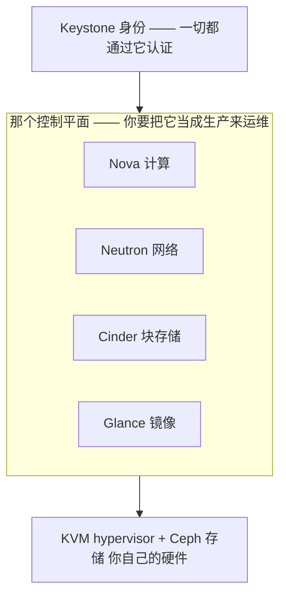
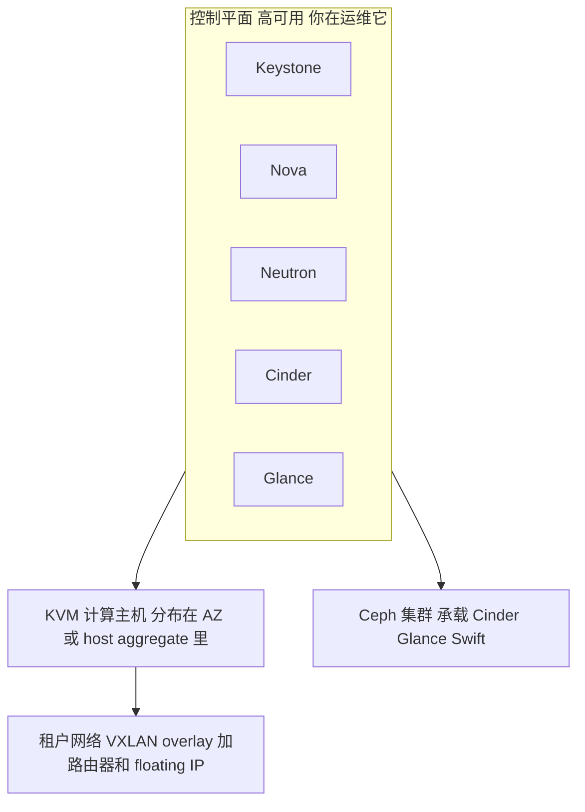

# OpenStack —— 理解它的架构

> 🌐 **语言：** [English（默认）](../../../../platforms/openstack/architecture.md) · **中文**
>
> ⚠️ 本项目**默认语言为英文**，`platforms/openstack/architecture.md` 是"事实来源"。本页中文是多语言支持的一部分，可能略滞后于英文版；两者不一致时以英文为准。

---

> [README](README.md) 把 OpenStack 映射到那七个面上 —— *那些组件是什么*。这篇笔记是上面一层：
> *OpenStack 是怎么搭起来的*，以及那个塑造了一切的事实 —— **这朵云是你组装的，所以它的控制平面
> 是一个由你运维的生产系统。** 那一句真话就是整套架构。

AWS 递给你一朵造好的云，OpenStack 递给你那些组件、然后让你自己去跑它们。理解这个结构，就是理解
这些零件怎么连起来，*以及*让它们一直转着要付出什么。

## 1. 组件架构 —— 一次请求怎么流过去

OpenStack 是一组具名的服务，每个拥有一个面，彼此通过 **Keystone** 对话：

一次 `server create` 会走遍整个平面：**Keystone** 给你认证，**Nova** 调度那台 VM、从 **Glance**
拉它的镜像、挂上一个 **Cinder** 卷，并把它接到一个 **Neutron** 网络上 —— 全都落在 **KVM** 主机上、
（通常）跑在 **Ceph** 存储之上。学会那条流，"我的实例为什么没拉起来？"就有了一个起点
（[`the-stack/05`](../../the-stack/05-platform-services.md)）。

## 2. 控制平面即产品的那个现实 —— 那个定义性的事实

这是把 OpenStack 和每一朵托管云区分开的那句架构真话：

- **那个控制平面是一个你自己拥有的生产系统。** 它的 API 挂掉是*你的*故障 —— 而且是叠在
  [自托管](../self-host/)的每一项硬件责任之上的。一个卡死的消息队列或者一个卡住的数据库会让
  API 停摆，而那些已经在跑的 VM 毫发无损地继续嗡嗡转（一个值得在它教会你**之前**就内化掉的
  故障模式）。
- 这和自己跑 [Kubernetes](../../cross-cutting/kubernetes.md)、自己跑
  [Ceph](../../the-stack/04-storage.md)，以及
  [the-stack/01](../../the-stack/01-physical.md) 那条 OpenStack 笔记是同一个警告：
  **这需要一支平台*团队*，不是一个管理员。** 那份吸引力（完全控制、你自己的数据中心、没有厂商）
  和那份代价（云是你在跑）是同一件事。

## 3. 租户模型 —— project 与 domain

OpenStack 的多租户，也就是那个[爆炸半径](../../the-stack/01-physical.md)模型：

- 一个 **project**（租户）是那个隔离与配额单位 —— 资源属于一个 project，而配额给每个 project 能
  消耗多少封顶。它对应 AWS 的一个账号 / OCI 的一个 compartment。
- **domain** 为更大的组织把 project 和 user 分组。**Keystone** 的 role 把 user 绑到 project 上 ——
  也就是那门[最小权限](../../cross-cutting/identity-iam.md)纪律，用 OpenStack 的词说出来。

## 4. 放置 —— region、AZ、host aggregate

你怎么操纵一台 VM *落在哪儿*（[`the-stack/01`](../../the-stack/01-physical.md)）：

- **region** 是完全独立的部署；**availability zone** 在一个 region 内部把算力分区以做故障隔离；
  **host aggregate** 按能力给主机分组（比如 GPU 主机、SSD 主机），好让 Nova 调度器把工作负载放到
  对的硬件上。
- 放置在这里是你的活，而在一朵托管云上不是 —— 你拥有的是那个调度器的输入，不只是那个请求。

## 那条责任共担线 —— 全部，而且是双份的

这里没有提供商：**控制平面**是你在跑，底下那些**硬件**也是你在跑
（[`the-stack/07`](../../the-stack/07-security.md)）。它是[自托管](../self-host/)加上一个你同样要
运维的云 API —— 这个仓库里最"全归你"的那条责任共担线，而这恰恰是那个控制平面警告为什么这么要紧。

## 一份参考架构 —— 这些面怎么组合起来

每一个面：**身份**（Keystone）、**计算**（Nova 跑在 KVM 上）、**网络**（Neutron 的 overlay）、
**存储**（Ceph 坐在 Cinder/Glance/Swift 之下），以及那个你要让它活着的控制平面 ——
[技能图](skills-map.md)在干同一件活。

## 诚实边界

🧭 **ramp —— 明确标出。** OpenStack 是**在架构上理解过的**（那条组件流、控制平面即产品的那个现实、
那些租户与放置模型），并且*紧邻*真实的 🔨 地面：**KVM** 和 **Proxmox VE** 在 lab 和内部环境里是
亲手跑过的（含 GPU 直通 —— [`the-stack/01`](../../the-stack/01-physical.md)）。所以底下那个
**hypervisor**（KVM）是 🔨；那个 **OpenStack 控制平面**是 🧭 ramp，不被声称为生产运维。定义了这套
架构的那个控制平面即产品的警告不是理论 —— 它来自真实的平台运维经验（一片 [vSphere](../vsphere/)
估算面、[机队](../self-host/)基础设施），被施加到 OpenStack 的设计上。那份声称是：一份扎实的架构
把握加上一条可验证的 ramp，并且诚实地承认生产 OpenStack 运维是只有跑过才会有的那部分。
