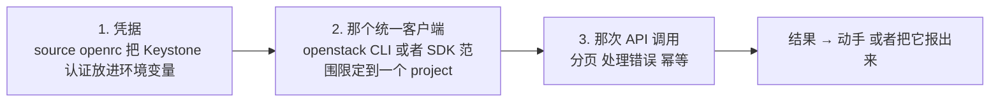
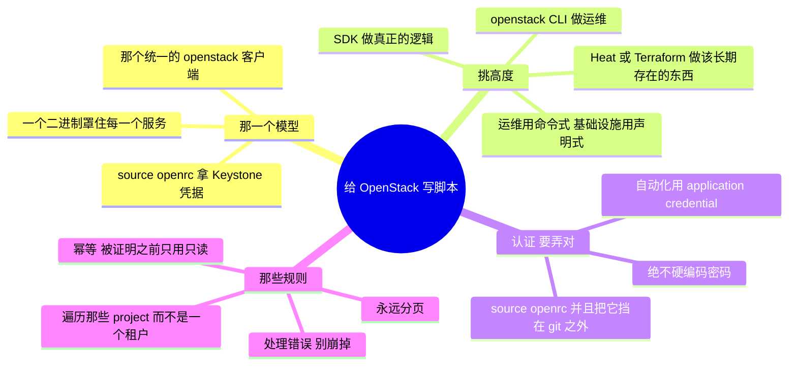

# OpenStack —— 把 API 写成脚本（从代码管理与运维）

> 🌐 **语言：** [English（默认）](../../../../platforms/openstack/automation.md) · **中文**
>
> ⚠️ 本项目**默认语言为英文**，`platforms/openstack/automation.md` 是"事实来源"。本页中文是多语言支持的一部分，可能略滞后于英文版；两者不一致时以英文为准。

---

> [`architecture`](architecture.md) 是 OpenStack 怎么搭起来；[`operations`](operations.md)
> 是跑它长什么样。这篇笔记是那个*怎么做*：**从代码驱动 OpenStack** ——
> [运营模型](../../00-the-operating-model.md)的第 3 招，通过那个罩住每一个服务的统一
> `openstack` 客户端。GUI（Horizon）是用来看的；命令行是用来运维的。

OpenStack 里的每一件事都是一次 API 调用，而那个**统一的 `openstack` CLI** 是驱动这一切的日常方式
—— 一个二进制罩住 Keystone、Nova、Neutron、Cinder、Glance 和其余的一切。一份
[脚本](../../foundations/)背景在这里直接变成 OpenStack 运维能力；同样那三招，装在一个客户端里。

## 那一个模型：`(凭据) → (客户端) → (API 调用)`

把这三样弄对 —— **环境里的 Keystone 凭据**、那个**限定到 project 的客户端**，以及一次**安全的
API 调用** —— 你就能从一个终端运维整朵云。

## 那架工具阶梯 —— 挑高度

| 工具 | 它是什么 | 什么时候去够它 |
| --- | --- | --- |
| **`openstack` CLI** | 罩住每一个服务的那个统一客户端 | 一次性的事、检查、租户操作、胶水 |
| **那个 SDK**（openstacksdk，Python） | 作为一个库的 API | 真正的逻辑和工具 |
| **Heat** | OpenStack 原生的声明式编排 | 用 OpenStack 的方式做可复现的 stack |
| **Terraform（openstack provider）** | *声明式*、跨云 | 那些常驻的基础设施，和别的云共用同一个工具 |

同一条分界线：**CLI 和 SDK 是命令式的**（运维）；**Heat 和 Terraform 是声明式的**（那些常驻的基础
设施 —— [`iac`](../../cross-cutting/iac-and-config.md)）。

## 认证 —— 把凭据 source 进来，别硬编码

- **`source openrc`** —— 那个标准做法：一个 RC 文件把 Keystone 凭据（auth URL、project、用户名，
  以及一个密码或 token）导出到你的环境里，而 CLI/SDK 从那里读。把那个 RC 文件挡在 git 之外。
- **application credential** —— 一份给自动化用的、受限且可吊销的凭据，比嵌一个用户密码好；这是
  OpenStack 对"脚本里不放长寿命用户密钥"的答案
  （[`身份`](../../cross-cutting/identity-iam.md)）。
- **绝不**在一个 `.py`/`.sh` 里硬编码密码 —— 整个仓库反复说的那同一条规则。

## 把一个能用的脚本和一把自伤枪分开的那些规则

那门 [foundations](../../foundations/) 纪律，OpenStack 版：

- **分页 —— 永远分页。** `openstack ... list` 在大规模的云上可能被截断；搞清楚那些分页参数和
  SDK 的迭代方式。
- **遍历那些 project。** 资源是逐 project 存在的；`--all-projects`（以管理员身份）或者一个在
  project 上的循环，才是你看见整朵云的方式，而不是一个租户的一个切片。
- **逐资源处理错误** —— 一个你够不到的 project 不该让整次运行中止。
- **变更要幂等** —— 先检查再动手，能安全重跑 ——
  也是 [Heat/Terraform](../../cross-cutting/iac-and-config.md) 在结构上强制的同一条规则。
- **在被证明之前只用只读** —— 先对着 `list`/`show` 去开发；只有在逻辑被证明之后才加
  `create`/`delete`/`set`，而且要挡在一次 dry run 后面。

## 自动化脚本的两种形状

- **只读/审计脚本** —— 跨 project 的盘点、一次合规检查（公开的 security-group 规则、未加密的卷）、
  一份配额/容量报表。只读、安全、常跑 ——
  那个[盘点 lab](labs)恰好就是这个（`openstack ... list`）。
- **修复/编排脚本** —— 它**动手**：回收孤儿资源、重新平衡配额、立起一个租户网络 + 实例。它会变更
  状态，所以它承担那全套纪律 —— application credential、先 dry run、幂等、有记录。

## AI 怎么协助写这些自动化

- **对骨架和 CLI 查询很在行** —— *"创建一个 project、一个带路由器的网络，然后拉起一个实例的
  `openstack` 命令"* —— 几秒钟出那个形状，*前提是*你去验证那些命令真的存在。
- **AI 会烧到你的地方（验得最狠）：** 它会**发明 `openstack` 子命令和选项**，而且 —— 在这里最糟的
  是 —— 它会很自信地**把各个 OpenStack release 和 API microversion 混起来**（这个项目在各个
  release 之间会动，而 AI 把不同年代掺在一起）。它还会**低估那份控制平面负担**，乐呵呵地给*用*它
  写脚本，却对*跑*那个平台保持沉默。对着你自己部署的那个 release 去验证，并且先在一个沙箱 project
  （或者 DevStack）上只读地跑。

## 诚实边界

🔨 **在能迁移的地方，🧭 在属于 OpenStack 的地方。** 那门脚本与自动化*纪律*是亲手做过的 ——
Python/Bash、会分页/幂等/处理错误的自动化、先只读（[`foundations/`](../../foundations/)）——
而它迁移到那个 `openstack` 客户端上。底下的 **KVM** 是 🔨。但 OpenStack *特有*的那片面（那个统一
客户端的广度、release/microversion 的具体差异、对着一个真实控制平面去跑它）是那条 🧭 ramp，在
DevStack 上测绘并验证过，不被声称成生产工具工程。那份声称是：一份扎实的自动化底子，加上一条通往
OpenStack API 的可验证 ramp —— 并且诚实地承认生产运维只来自跑它。

## 这篇文档一屏看完

