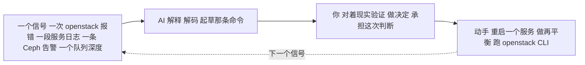

# OpenStack —— 运维它（day-2 的现实）

> 🌐 **语言：** [English（默认）](../../../../platforms/openstack/operations.md) · **中文**
>
> ⚠️ 本项目**默认语言为英文**，`platforms/openstack/operations.md` 是"事实来源"。本页中文是多语言支持的一部分，可能略滞后于英文版；两者不一致时以英文为准。

---

> [README](README.md) 是 *OpenStack 是什么*；[architecture](architecture.md) 是*它怎么搭起来*；
> 这篇笔记是**跑它长什么样** —— 而这里的 day-2 故事有一个托管云没有的转折：**控制平面是你在运维，
> 所以它的健康就是你的健康。** OpenStack 是一条 🧭 ramp；这里是那门运维纪律被映射到它的现实上，
> 而底下的 KVM 是那块 🔨 地面。

## 简报 —— "运维 OpenStack"是什么意思

你让一朵*你自己造的*云一直跑着 —— 那个控制平面、那些 hypervisor、那些存储 —— 而租户在消费它。
那三个 day-2 问题多了第四个、也是独有的一个：

- **它健康吗？** —— 租户的 VM 在跑，*而且那个控制平面本身在跑吗？*
- **它安全吗？** —— Keystone 的最小权限、租户隔离，还成立吗？
- **它负担得起吗？** —— 容量和配额在各个 project 之间平衡吗？
- **那个平台活着吗？** —— 一朵托管云从来不会逼你去问的那个问题。

## 运维笔记 —— 在 OpenStack 上什么会呼你

- **那个卡死的控制平面服务 —— OpenStack 的标志性事故。** 一个满掉的消息队列（RabbitMQ）或者一个
  卡住的数据库会让 **API** 停摆，而每一台已经在跑的 VM 都毫发无损地继续嗡嗡转。"云挂了但 VM 还在"
  是那个要在它教会你**之前**就内化掉的故障模式 —— 而它意味着要监控那个控制平面本身，不只是那些
  租户（[architecture](architecture.md)）。
- **Neutron** —— 问运维者什么会呼他们，他们第一个点名的组件。租户网络、overlay、路由器和
  floating IP 强大而精细；[那架调试阶梯](../../the-stack/02-network.md)适用，而且梯级更多。
- **Ceph 健康度** —— 坐在 Cinder/Glance/Swift 之下那层存储本身就是一个平台：健康度、再平衡和
  placement group 调优是它自己的一门学问
  （[`the-stack/04`](../../the-stack/04-storage.md)）。一个降级的 Ceph 是一场慢放的存储事故。
- **配额耗尽** —— 一个 project 撞到它的上限，然后拉起动作带着一个让人困惑的报错失败；容量是逐
  project 切分的，而得有人去平衡它。
- **升级** —— OpenStack 的发布节奏，以及把许多服务协调着升上去，是一个货真价实的运维项目，不是
  一个按钮。

## 把那份运维工作拆开

按**节奏** —— 注意那个反复出现的主题：**你监控的是那个平台本身**：

| 节奏 | 任务 | 面 | 为什么要紧 |
| --- | --- | --- | --- |
| **持续（自动化）** | 监控那个**控制平面**（API、RabbitMQ、DB）+ 租户健康度 | 可观测性 | 它的故障就是你的故障 —— 一朵托管云从来不会让你看这个。 |
| **持续（自动化）** | Ceph 健康度 + 再平衡；Nova 调度器健康度 | 存储、计算 | 那些存储和那个调度器归你去让它们活着。 |
| **每天** | 分诊控制平面 + 租户告警；查队列深度、数据库、Ceph 状态 | 可观测性 | 在一个队列卡住 API 之前抓住它。 |
| **每天** | 回答"这东西为什么拉不起来 / 连不上" —— Neutron、配额、调度器 | 网络、计算 | 那个家常便饭的事故，而且是 Neutron 重的。 |
| **每周** | 复审 Keystone 的 role/project；逐 project 的配额 + 容量平衡 | 身份、容量 | 隔离和公平分配两个都会漂。 |
| **每月** | 打补丁/刷新镜像（Glance）；主机 + hypervisor 打补丁 | 安全 | 在你自己的硬件上把那些 CVE 关掉。 |
| **每季度** | 恢复演练；Ceph 容量 + 故障域复审 | 存储 | 一份没测过的备份是一个愿望；Ceph 需要余量。 |
| **每季度** | 规划一次跨服务协调的 **OpenStack 升级** | 生命周期 | 一个真正的项目 —— 那个控制平面必须活着穿过它。 |
| **出事时** | 发现 → 缓解 → 解决 → 复盘 —— 常常是一个控制平面服务 | 全部 | 那门[事故纪律](../../cross-cutting/incident-response.md)，深到平台层。 |

这件事让什么变得可见：**运维 OpenStack 是运维一个平台，不是消费一个平台** —— 人的那份活是让那个
控制平面、Ceph 和那个调度器活着，而这是叠在每一项面向租户的责任之上的。那就是"云是你造的"的成本
那一侧（[`the-stack/05`](../../the-stack/05-platform-services.md)那道自建对租用的选择题，被活出来
的样子）。

## AI 怎么协助这份运维工作

和那条[学习 ramp](ai-ramp.md) 不同 —— 这里是日常回路里的 AI：

- **事故副驾 / 日志解码** —— 把那条 `openstack` 报错、一段 Nova/Neutron 服务日志、一条 Ceph 的
  `HEALTH_WARN` 贴进去：*"这指向什么？"* 一个你要去验证的快速假说。
- **AI 在哪儿帮得上、又在哪儿沉默：** 对*用* OpenStack（CLI 命令、租户操作）AI 是真有用的 ——
  但它**对*跑*那个控制平面的运维负担保持沉默**（那个队列、那个数据库、Ceph 健康度），而那才是真正
  难的部分。它还会很自信地**把各个 OpenStack release 混起来**。那条护栏：
  **AI 碰信号和草稿；你碰生产。**

## 诚实边界

🧭 **ramp，而那个 hypervisor 是 🔨 地面。** 那门运维*纪律* —— 分诊、事故方法、容量思维、控制平面
即产品的那份直觉 —— 是 🔨，从真实的平台工作里带过来的（[vSphere](../vsphere/)、
[机队](../self-host/)），而底下的 **KVM** 是亲手跑过的。但**跑一个生产 OpenStack 控制平面**
（规模上的 Neutron、Ceph 运维、协调升级、凌晨三点那次控制平面事故）是那条 🧭 ramp，在架构上理解过
并测绘过，不被声称为生产运维。这个平台上的生产能力，恰恰就是只有跑过它才会有的那部分 —— 而这篇
笔记把这一点说出来了。
