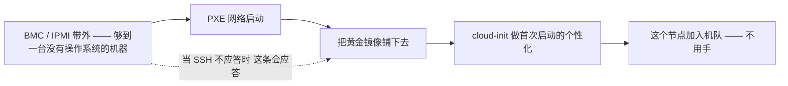

# 自托管 / 裸金属 —— 抽象到此为止

> 🌐 **语言：** [English（默认）](../../../../platforms/self-host/README.md) · **中文**
>
> ⚠️ 本项目**默认语言为英文**，`platforms/self-host/README.md` 是"事实来源"。本页中文是多语言支持的一部分，可能略滞后于英文版；两者不一致时以英文为准。

---

> 和 [AWS](../aws/) 同一套四段模板：**它是什么 → 管理员技能图 → AI 辅助的 ramp → lab**
> —— 再加上更深的 **[架构](architecture.md) · [运营](operations.md) ·
> [自动化](automation.md)** 三件套。诚实标记是 **🔨 亲手做过的深度** —— 这是整个栈的地面层，
> 在机队规模上运维过（累计发放 10 万+ 台设备），也是这个仓库里每一朵云*之上*所抽象的那一层。

## 1. 自托管是什么

自托管就是把服务跑在*你自己*拥有的硬件上 —— 没有 hypervisor 池、没有控制平面、没有提供商。只有
服务器、硬盘、网卡、交换机、电，和那个把它们上架、让它们启动起来的人。它是最老的那种基础设施形态，
而它从未离开：稳态规模上的成本、数据主权、气隙合规和 GPU 供应，至今仍把工作负载推回这里
（[`the-stack/01`](../../the-stack/01-physical.md) 那些选型因素）。这个仓库里别的每一个平台 ——
vSphere 把它池化、OpenStack 把它云化、AWS 把它租出去 —— 都是建在你在这里徒手做的事情之上的一层。

映射到那[七个面](../../00-the-operating-model.md)上 —— 注意在这里*你就是*每一个面的实现：

| 面 | 自托管的版本 | 一句话 |
| --- | --- | --- |
| **身份与访问** | AD / **OpenLDAP**、SSH key、sudo、PAM | 目录是你在跑；最小权限就是 Linux 的用户、组和 key。 |
| **计算** | 裸金属服务器、**KVM / Proxmox** | 那个物理盒子，或者你自己跑在它上面的 VM —— 除非你自己造一个，否则没有调度器。 |
| **网络** | VLAN、**BIND**（DNS）、DHCP、防火墙、交换机 | underlay 和 overlay 都归你（[`the-stack/02`](../../the-stack/02-network.md)）。 |
| **存储** | **SAN / NAS**、RAID、本地盘、MinIO/Ceph | 用金属做出来的块/文件/对象（[`the-stack/04`](../../the-stack/04-storage.md)）。 |
| **发放与配置** | **PXE + 镜像 + cloud-init**、Ansible | 把一台空白机器网络启动成一台能干活的机器，不用手，还能上规模。 |
| **可观测性** | Prometheus/Grafana、ELK、**IPMI/BMC** | 监控是你在跑 —— 而且要从它自己之外去监控它。 |
| **安全与合规** | 加固/CIS、全盘加密、打补丁、物理访问 | 既要护住那个盒子，*也要*护住它所在的那个房间；那条责任共担线整条都是你的。 |

让自托管成为*工程*而不是*搬服务器*的那样东西：那条**发放流水线**。一个拿着 U 盘的人上不了规模；
PXE → 镜像 → cloud-init 可以。把那个建起来，裸金属就变成了牛群
（[`the-stack/03`](../../the-stack/03-compute-and-images.md)）。

## 2. 管理员技能图

那份具体的、可勾选的清单在 **[`skills-map.md`](skills-map.md)** 里。头部能力：

- **够到一台死机** —— BMC/IPMI/iLO/iDRAC 带外，以及*为什么*带外管理本身就是一套要去维护的系统。
- **那条发放流水线** —— PXE 启动、每个硬件世代一个黄金镜像、cloud-init 首次启动、规模上纳管的
  全盘加密 —— 从空白金属到机队成员，全程不用手。
- **那些你设计出来的故障域** —— 机柜、TOR 交换机、PDU、供电；把副本摆好，让一个机柜死掉不等于一个
  服务死掉（[`the-stack/01`](../../the-stack/01-physical.md)）。
- **那些你在跑的核心服务** —— DNS/BIND、DHCP、LDAP、NTP —— 整个网络都默认它们在，而没人会注意到
  它们，直到它们坏掉。
- **活得过硬盘的存储** —— RAID、多路径，以及那个重建窗口；还有那句真话：RAID 不是备份
  （[`the-stack/04`](../../the-stack/04-storage.md)）。
- **一切皆代码** —— 用 Ansible 管配置，PXE/镜像流水线纳入版本管理；和任何一朵云同样的那门幂等
  纪律（[`iac`](../../cross-cutting/iac-and-config.md)）。
- **带交付周期的容量规划** —— 硬件有采购延迟；你得在撞上那堵墙之前先看见它
  （[`成本`](../../cross-cutting/cost.md)）。

## 3. AI 辅助的路径 —— 以及它够不到的地方

那个方法在 **[`ai-ramp.md`](ai-ramp.md)** 里。一段话说完：

自托管是这样一层：AI 在*软件*上帮得上（起草那个 Ansible playbook、那份 BIND zone 文件、那份
PXE/kickstart 配置、那条 udev 规则 —— 然后对着真实那台机器去验证），而在*物理*上帮不上（一根不
稳的内存条、一根插错口的线、一个不应答的 BMC）。它同时也是 AI 那些自信而错误的 shell 命令最危险的
一层，因为裸金属上没有撤销，也没有一个提供商把你回滚回去 —— 每一条生成出来的命令都要按"你马上就要
用 root 去跑它"的方式来读，因为你就是（[`foundations/`](../../foundations/)）。

## 4. Lab

一条**三节的命令行弧**（盘点机队 → 不用手地发放一个节点 → 故障域 + RAID 演练）在
**[`labs/`](../../../../platforms/self-host/labs/)** 里，用的是真实的
`virsh`/`ipmitool`/`ansible` 命令，而它和整个栈里最有质感的那次演练重叠：在一台开了嵌套虚拟化的
机器上（Proxmox 或者 Workstation/Fusion），用一台 PXE 服务器搭出一个小小的虚拟"机队"，不用手地
网络启动并装机一个节点，定义两个"机柜"然后干掉一个，看着故障域真的起作用 ——
那份 [`the-stack/01` 的 lab 规格](../../the-stack/01-physical.md)，也就是*这个*平台的 lab。那个可
跑的[备份演练](../../../../the-stack/labs/04-backup-not-snapshot/)是自托管纪律里另一块纯本地的拼图。

## 5. 往深里走 —— 架构、运营与自动化

三篇伴随笔记把自托管带过"你在跑什么"，与 AWS 那一套对应 —— 而且是从机队规模的生产里写出来的，
不是一条 ramp：

- **[`architecture.md`](architecture.md)** —— 那个物理层级（机柜/TOR/PDU 作为**你设计出来的故障
  域**）、那个 **BMC/IPMI 带外平面**（云上那个串口控制台租的就是它）、那条把金属变成牛群的
  **PXE → 镜像 → cloud-init 流水线**，以及那些核心服务（DNS/BIND/DHCP/LDAP/NTP）。
- **[`operations.md`](operations.md)** —— day-2：故障是物理的（机队规模上的硬盘/内存条、一台
  TOR 带走一个机柜、容量到得太晚、固件浪潮）、**按节奏**排的那些复现工作，以及 AI 在哪儿帮得上
  （配置/解码报错）对上它干脆做不到的地方（物理层；裸金属上没有撤销）。
- **[`automation.md`](automation.md)** —— 给机队写脚本：那个 盘点 → 传输 → 幂等变更 的模型
  （Ansible/SSH/ipmitool/virsh/PXE）、用 key 不用密码，以及**那条裸金属规则：没有撤销** ——
  每一条破坏性命令都读两遍。

## 诚实边界

🔨 **亲手做过的深度 —— 这个仓库里最深的那条根。** 这是整个项目立足的那块地面：一套从零建起来、
并在机队规模上跑过的**多操作系统 PXE 与镜像化部署平台**（累计发放 10 万+ 台设备）、规模上的
**全盘加密**、**DNS/BIND/DHCP/LDAP** 与核心服务管理、**RAID/SAN/NAS** 存储、**KVM/Proxmox**
（含 GPU 直通），以及那份 BMC/IPMI/带外的肌肉记忆 —— 云上那个"串口控制台"不过是把它租给你。它直接
连着 [`foundations/`](../../foundations/)、[`endpoint/`](../../endpoint/) 和
[`the-stack`](../../the-stack/) 那些章节 —— 它们全都取自这份经验。这里没有值得标出的 🧭：自托管
正是这个仓库其余部分施加到别的平台上的那份判断被*挣到*的地方。这份声称不带任何限定 —— 多年跑裸金属
机队，以及那份让它上面每一层抽象都变得可读的直觉。
