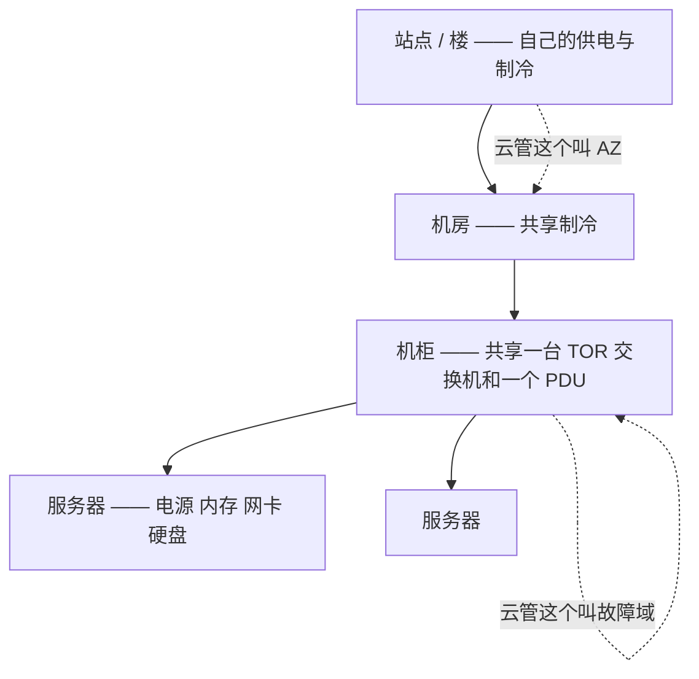
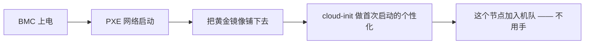

# 自托管 / 裸金属 —— 理解它的架构

> 🌐 **语言：** [English（默认）](../../../../platforms/self-host/architecture.md) · **中文**
>
> ⚠️ 本项目**默认语言为英文**，`platforms/self-host/architecture.md` 是"事实来源"。本页中文是多语言支持的一部分，可能略滞后于英文版；两者不一致时以英文为准。

---

> [README](README.md) 把自托管映射到那七个面上 —— *你在跑什么*。这篇笔记是上面一层：*一片裸金属
> 估算面是怎么搭起来的*，因为在这里**那套云直接递给别人的架构，是你自己设计的** —— 那些故障域、
> 那条发放流水线、那个带外平面。这是坐在运维者椅子上的
> [`the-stack/01`](../../the-stack/01-physical.md)，而且是从在机队规模上真的建过它写出来的。

这里没有一个提供商替你画那些边界；下面每一个结构性决定都是你做的。有四个承着重量。

## 1. 那个物理层级 —— 你*设计*出来的那些故障域

在云上 AZ 和故障域是被递给你的（[`the-stack/01`](../../the-stack/01-physical.md)）。在这里你用金属
把它们建出来，而把那个容纳关系弄对就是全部的胜负手：

- 一个**机柜**共享一台架顶交换机和一个 PDU —— 所以一个机柜就是一个**故障域**：丢掉那台 TOR 或者
  那个 PDU，整个机柜跟着一起走。把任何东西的两个副本都放在一个机柜里，正是云那个故障域概念存在着
  要防止的那个错误 —— 只不过在这里，是*你*不能犯它。
- **供电和制冷是真实的约束**，不是账单上的条目：一个机柜有它的功率预算，而 GPU 时代又让这件事变回
  物理的了 —— 你可以把服务器买回来，然后发现没有瓦数去跑它们。
- 那份设计直觉和每一个云的章节都一样，只是这次实现者是你：**把副本铺开到多个机柜；把机柜、TOR
  和 PDU 当成那个爆炸半径。**

## 2. 那个带外平面 —— 够到一台没有操作系统的机器

自托管有、而一个只管笔记本的管理员永远学不到的那个最重要的东西：**带外管理。**

- **BMC / IPMI / iLO / iDRAC** —— 主板上一台一直开着的小电脑，挂在它自己的网络上，能给主机断电重
  上电、挂载虚拟介质，并且*在主操作系统死掉或者根本不存在的时候*给你一个控制台。你就是靠它去装
  一台走不到跟前的无头服务器、去恢复它、去重启它。
- **云上那个"串口控制台"就是把它租给你**
  （[`the-stack/03`](../../the-stack/03-compute-and-images.md)）—— 同一份活，同一个需要它的时刻。
  懂那个 BMC，就是懂那个云控制台在替什么站台。
- 带外本身就是一套要去保护和维护的系统：一个管理网络、它自己的凭据，以及会出 CVE 的固件。你最需要
  够到的那台机器上有一个死掉的 BMC，那本身就是一次事故。

## 3. 那条发放流水线 —— 把金属变成*牛群*的那套系统

这是架构上的中心件，也是把"搬服务器"变成工程的那样东西
（[`the-stack/03`](../../the-stack/03-compute-and-images.md)）：

- 一个拿着 U 盘的人上不了规模；**PXE → 镜像 → cloud-init** 可以。把这条流水线建起来，一台空白机器
  就在没有任何人碰它的情况下，变成一个能干活的、个性化过的机队成员 —— 这就是一只你手工装的宠物和
  一群你重装镜像的牛之间的差别。
- 云藏起来的那个难处：**硬件多样性** —— 那个镜像必须在你拥有的每一个服务器世代上都启动起来，带着
  对的驱动，每一次都是。一个镜像、十二个型号，其中一个死活吃不进那个网卡驱动。

## 4. 那些核心服务 —— 所有东西都默认它们在

一片自托管估算面要跑那些云无形中提供的服务，而它们正是没人会注意到、直到它们坏掉的那些：

- **DNS（BIND）**、**DHCP**、**LDAP**（那个[目录](../../cross-cutting/identity-iam.md)）和
  **NTP** —— 名字解析、寻址、身份和时间。当 DNS 或者时间漂了，*所有东西*都会以让人困惑的方式行为
  异常（[`the-stack/02`](../../the-stack/02-network.md)）。
- **存储**以 SAN/NAS/RAID 的形式出现（[`the-stack/04`](../../the-stack/04-storage.md)） ——
  用金属做出来的块和文件，用 RAID 熬过硬盘故障，外加那句真话：**RAID 不是备份**。

## 那条责任共担线 —— 没有这条线

这个仓库里别的每一个平台都和某个人分担那份负担：一个提供商、一个控制平面。在这里那条线被一路画到
最底下 —— **那个盒子、那个网络、那个 hypervisor、那些数据，*还有它坐落的那个房间*，都是你在护。**
硬件故障呼的是你的机；物理访问控制是你的活；整张[责任共担图](../../the-stack/07-security.md)是
一个颜色。正是这份彻底的所有权，才让这里成为这个仓库其余那份判断被挣到的地面。

## 诚实边界

🔨 **亲手做过的深度 —— 这个仓库里最深的那条根，而这篇笔记完全是从它里面写出来的。** 一套从零建
起来、并在机队规模上跑过的**多操作系统 PXE + 镜像化部署平台**（累计发放 10 万+ 台设备）；规模上的
**全盘加密**；**DNS/BIND、DHCP、LDAP、NTP** 核心服务；**RAID/SAN/NAS** 存储；**KVM/Proxmox**
（含 GPU 直通）；以及云控制台租的那份 **BMC/IPMI 带外**肌肉记忆。那套故障域设计、那条发放流水线、
那个带外平面 —— 全都是活出来的。这里基本上**没有 🧭 需要标出**：裸金属正是这个仓库其余部分施加到
别的平台上的那份判断被*挣到*的地方，而它直接连着 [`foundations/`](../../foundations/)、
[`endpoint/`](../../endpoint/) 和 [`the-stack`](../../the-stack/)。
