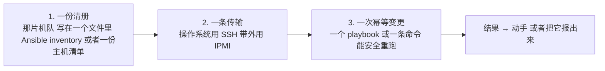
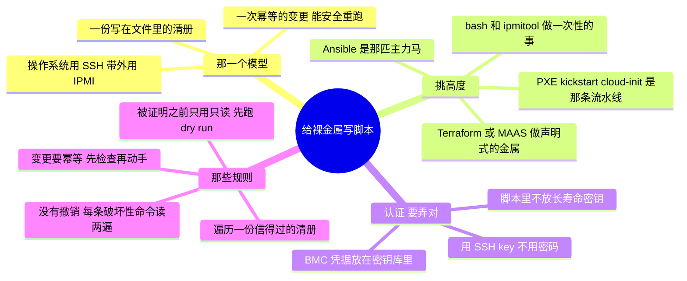

# 自托管 / 裸金属 —— 给机队写脚本

> 🌐 **语言：** [English（默认）](../../../../platforms/self-host/automation.md) · **中文**
>
> ⚠️ 本项目**默认语言为英文**，`platforms/self-host/automation.md` 是"事实来源"。本页中文是多语言支持的一部分，可能略滞后于英文版；两者不一致时以英文为准。

---

> [`architecture`](architecture.md) 是一片裸金属估算面怎么搭起来；[`operations`](operations.md)
> 是跑它长什么样。这篇笔记是那个*怎么做*：**从代码驱动一片机队** —— Ansible、SSH、`ipmitool`、
> `virsh`，以及那条 PXE/kickstart 流水线。它是[运营模型](../../00-the-operating-model.md)的第 3 招，
> 落在那个自动化从来不是可选项的平台上：在机队规模上，"用手"这个选项不存在。

这里没有控制台 API —— 那个"API"是 SSH 到一片机队、IPMI 到那个带外平面，以及一条不用手就把机器装好
镜像的启动流水线。这是一份[脚本](../../foundations/)背景*就是*这个平台的地方：一切都是一个脚本、
一份清册，或者一份启动配方，而让它保持安全的那门纪律，和 [foundations](../../foundations/) 教的是
同一门 —— 只多加一条规则，因为裸金属没有撤销。

## 那一个模型：`(清册) → (传输) → (幂等变更)`

把这三样弄对 —— 一份**当前的清册**、**对的那条传输**（有操作系统时用 SSH，没有的时候用 IPMI），
以及一次**幂等的变更** —— 你就能从一个终端运维一片机队，而不是一整柜 KVM 切换器。

## 那架工具阶梯 —— 挑高度

| 工具 | 它是什么 | 什么时候去够它 |
| --- | --- | --- |
| **bash + ssh / ipmitool** | 跨机队的临时操作 | 一次性的事、健康度扫一遍、带外的电源/控制台 |
| **Ansible** | 走 SSH 的无 agent 配置 + 编排 | 那匹主力马 —— 配置、补丁浪潮、滚动变更 |
| **virsh / virt-install** | 本地 KVM/libvirt 的 VM 生命周期 | 你自己主机上的那些 VM |
| **PXE + kickstart/preseed + cloud-init** | 作为代码的那条发放流水线 | 不用手地把空白金属变成机队成员 |
| **Terraform / MAAS** | *声明式*的裸金属发放 | 把金属当云一样管，而且可复现 |

和处处一样的那条分界线：**bash/Ansible 是命令式的**（现在做这件事 —— 运维）；**那条 PXE 流水线和
Terraform/MAAS 偏声明式**（一台发放好的主机*是*什么）。运维是 Ansible；那片常驻的机队是那条流水线
（[`iac`](../../cross-cutting/iac-and-config.md)）。

## 认证 —— 用 key，不用密码

- 操作系统那个平面用 **SSH key** —— 一个 agent 或者一把管理密钥，绝不把密码撒遍整片机队
  （[`身份`](../../cross-cutting/identity-iam.md)）。
- 带外那个平面用 **IPMI/BMC 凭据** —— 放在一个密钥库里，绝不在脚本里硬编码一个 `-P hunter2`；
  BMC 能给一台主机断电重上电、还能重装它，所以它的凭据和 root 一样敏感。
- 整个仓库反复说的那条规则：**不要有长寿命密钥坐在一个脚本或者一个仓库里。**

## 那些规则 —— foundations 那门纪律，外加一条裸金属规则

- **刻意地遍历那份清册** —— 一次施加到"所有"上的变更，必须建在一份你信得过的清册上；一份错的或者
  过期的清册，就是一次全队规模的错误。
- **变更要幂等** —— foundations 那一课，被 Ansible 产品化了：一个 playbook 说"这个包应该在"，
  检查，然后继续。重跑会收敛，绝不会翻倍。
- **在被证明之前只用只读** —— 先对着 gather-facts 和 `--check`（Ansible 的 dry run）去开发，然后
  才真正 apply；先扫一遍健康度，再做修复。
- **那条裸金属规则：没有撤销。** 在云上一次错误的 `terraform destroy` 还算勉强能恢复；在这里，
  对着错误的目标 `mkfs`/`dd`/`rm -rf` 就是*没了*，没有提供商、也没有快照来救你。每一条破坏性命令
  都要按"它正在错误的那台主机上以 root 跑着"的方式来读 —— 因为那才是那个故障模式
  （[`foundations/`](../../foundations/)）。

## 自动化脚本的两种形状

- **清册/审计脚本** —— 一次机队健康度扫描、一份固件版本报表、一次带外的电源/传感器检查。只读、
  安全、常跑 —— 那个[盘点 lab](labs)恰好就是这个
  （`ansible ... -m setup`、`ipmitool ...`）。
- **修复/发放脚本** —— 它**动手**：一个打补丁的 playbook、一次滚动重启、一条立起一个节点的
  `virt-install`、一次把裸金属装上镜像的 PXE/kickstart。它会变更状态，所以它承担那全套纪律 ——
  信得过的清册、先 `--check`、幂等、有记录，而且要读两遍，因为没有撤销。

## AI 怎么协助写这些自动化

- **对配置和胶水很在行** —— 一份 BIND zone、一份 `dhcpd.conf`、一份 kickstart、一个 Ansible
  playbook、一条 `udev` 规则：AI 把那些样板起草得飞快，而因为你懂这个系统，你会抓到那条写错的
  指令。
- **AI 会烧到你的地方（验得最狠）：** 它会**发明参数、把 GNU 和 BSD 的工具语法混起来**；它会
  **假定一个不是你那套的发行版/init**；而且 —— 在这里最危险的是 —— 它会在一个没有撤销的平台上
  **递给你一条不带任何护栏的破坏性命令**。只读地跑它、每个 playbook 都 `--check`，而且在你亲手
  确认过那个目标之前，绝不让一条生成出来的 `mkfs`/`dd`/`rm` 跑起来。

## 诚实边界

🔨 **亲手做过的深度 —— 最深的那条根。** Ansible/bash/SSH 的机队自动化、`ipmitool` 的带外操作、
`virsh`/KVM 的 VM 生命周期，以及在机队规模上（10 万+ 台设备）运维过的 **PXE + kickstart +
cloud-init 流水线** —— 也就是整个仓库所教的那份自动化直觉，被施加在它被挣到的地方。它建在那份 🔨
的 [foundations](../../foundations/) 脚本纪律之上（幂等、先只读、不放明文密钥），并把那条由经验烤
进去的额外裸金属规则带上：没有撤销。唯一那条 🧭 的边：规模上最新的 **MAAS/Terraform 裸金属**发放
—— 测绘并验证过，不被声称成主力工具。

## 这篇文档一屏看完

