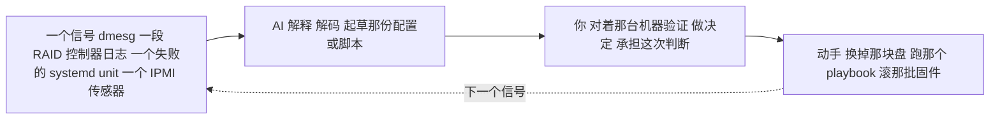

# 自托管 / 裸金属 —— 运维它（day-2 的现实）

> 🌐 **语言：** [English（默认）](../../../../platforms/self-host/operations.md) · **中文**
>
> ⚠️ 本项目**默认语言为英文**，`platforms/self-host/operations.md` 是"事实来源"。本页中文是多语言支持的一部分，可能略滞后于英文版；两者不一致时以英文为准。

---

> [README](README.md) 是*自托管是什么*；[architecture](architecture.md) 是*它怎么搭起来*；
> 这篇笔记是**跑它到底长什么样** —— 那份简报、什么会呼你（硬件，在机队规模上，不停地）、按节奏
> 排的那些运维工作，以及 AI 在哪儿帮得上、又在哪儿干脆做不到。它是从运维一片裸金属机队里写出来
> 的 —— 在那里呼机是真的，故障是物理的。

## 简报 —— "运维裸金属"是什么意思

你让硬件活着、被发放好、可恢复，同时让跑在它上面的那些服务保持在线 —— 而每一层都归你，因为你下面
没有提供商。那三个 day-2 问题：

- **它健康吗？** —— 主机在跑，硬盘和内存条没在悄悄坏掉，那些核心服务（DNS/DHCP/LDAP/NTP）在
  应答，而且你会在用户之前知道吗？
- **它安全吗？** —— 加固过、打过补丁、加密过，而且那个房间在物理上锁好了吗？
- **它高效吗？** —— 容量走在需求前面吗，考虑到硬件有一个你没法凭空愿掉的采购交付周期？

## 运维笔记 —— 什么会呼你（在这里故障是物理的）

- **硬盘和内存条故障 —— 在机队规模上是持续不断的。** 机器一多，永远有东西在坏；那门纪律是把备件
  当成**耗材**来对待 —— 备着货架、有一套更换流程 —— 而不是当成意外事故。RAID 给你买来更换的时间
  （[`the-stack/04`](../../the-stack/04-storage.md)）；重建*当中*的第二次故障，正是那些 RAID 级别
  存在着要去框住的那个噩梦。
- **一台 TOR 交换机干掉整个机柜** —— 这正是为什么机柜是一个[故障域](architecture.md)；这次故障的
  爆炸半径，恰好就是你设计出来（或者没设计出来）的那个容纳边界。
- **容量到得比需求晚** —— 那个安静的杀手。硬件有几周到几个月的采购交付周期；余量用光了，可没有一个
  `terraform apply` 来救你。带交付周期的容量规划，正是云让人们忘掉的那份活。
- **需要整队重启的固件 CVE** —— 一个 BIOS/BMC 漏洞意味着分批滚过整片机队，把主机疏散掉再重启，而
  不让服务中断。
- **你最需要的那台机器上有一个死掉的 BMC** —— 带外本身也是一套会坏的系统；它坏的时候，你就得走去
  数据中心了。
- **那条发放流水线坏掉** —— PXE、那个镜像或者 cloud-init 失败，意味着没有新容量能不用手地上线；
  那条流水线是生产基础设施，不是一个便利设施。

## 把那份运维工作拆开

一个裸金属管理员那些复现的工作，按**节奏**排：

| 节奏 | 任务 | 面 | 为什么要紧 |
| --- | --- | --- | --- |
| **持续（自动化）** | 硬件健康度监控（硬盘、内存条、电源、经 IPMI 读的温度）；服务告警 | 可观测性 | 在机队规模上永远有东西在坏；你是被呼到，而不是被吓到。 |
| **每天** | 分诊硬件告警；确认那些核心服务（DNS/DHCP/LDAP/NTP）在应答 | 可观测性、网络 | 所有东西都默认它们在，而它们一漂就会以让人困惑的方式失败。 |
| **每天** | 在你自己拥有的硬件上回答"X 为什么够不到 Y" —— [那架调试阶梯](../../the-stack/02-network.md) | 网络 | 那个家常便饭的事故，而且没有提供商可以怪。 |
| **每周** | 备件盘点：按这个故障率，货架上备够了吗？ | 计算 | 备件是耗材，不是事故。 |
| **每周** | 用 Ansible 处理补丁/配置漂移；复审那条发放流水线的健康度 | 发放、安全 | 漂移和一条坏掉的流水线，都会一直藏到咬你为止。 |
| **每月** | 固件/BIOS 的 CVE 浪潮 —— 分批滚动地疏散、更新、重启主机 | 安全 | 在不造成全队故障的前提下关掉硬件层的洞。 |
| **每月** | 带采购交付周期的容量复审 —— 在撞墙之前下单 | 容量 | 硬件变不出来；要提前几个月看见那堵墙。 |
| **每季度** | 对一份备份做恢复演练；真的去验证 RPO/RTO | 存储 | 一份没测过的备份是一个愿望（[`the-stack/04`](../../the-stack/04-storage.md)）。 |
| **每季度** | 故障域演练；物理访问 + BMC 凭据复审 | 安全 | 证明丢掉一个机柜是活得下来的；把那个带外平面护住。 |
| **出事时** | 发现 → 缓解 → 解决 → 复盘，常常还带着一次物理更换 | 全部 | 那门[事故纪律](../../cross-cutting/incident-response.md)，落在金属上。 |

这件事让什么变得可见：**人的那份活是物理的和规划的** —— 更换、备件、固件浪潮，以及带交付周期的
容量 —— 而那些软件（流水线、配置、监控）是自动化的。那个复审节奏（备件、恢复、容量、故障域演练）
就是这片估算面一旦被跳过就会开始腐烂的地方。

## AI 怎么协助 —— 以及它在哪儿干脆做不到

和那条[学习 ramp](ai-ramp.md) 不同：这里是日常回路里的 AI，而且是在你懂得最深的那个平台上，所以
**AI 起草软件；物理和决定归你。**

- **AI 在哪儿挣得了它的饭钱** —— 起草配置（BIND zone 文件、kickstart/preseed、Ansible playbook、
  `udev` 规则）和解码报错（`dmesg` 尾巴、RAID 控制器日志、一个卡住的 unit）：一个你要对着真实硬件
  去验证的快速假说。
- **AI 帮不上的地方** —— 那个**物理层**：一根不稳的内存条、一根插错口的线、一块背板故障、一个不
  应答的 BMC。没有一样是一次提问就能解决的；这份工作的这一半彻底留给人。
- **AI 危险的地方** —— **裸金属上没有撤销。** 对着错误的设备 `mkfs`、或者 `dd` 到错误的盘，就是
  *没了*，而且没有提供商把你回滚回去。AI 会自信地起草破坏性命令，而且不带你凭直觉会加上的那道
  护栏。每一条都按"你正在用 root 跑它"的方式来读，因为你就是
  （[`foundations/`](../../foundations/)）。

## 诚实边界

🔨 **亲手做过的深度 —— 最深的那条根，而这篇笔记就是那份机队工作被写下来。** 规模上的硬盘/内存条
更换、备件即耗材的那门纪律、固件 CVE 浪潮、带采购交付周期的容量规划、核心服务运维
（DNS/DHCP/LDAP/NTP）、把发放流水线当成生产基础设施，以及 BMC/IPMI 带外恢复 —— 全都是在机队规模
上活出来的。这不是一条 ramp；这是这个仓库其余部分带到别的每一个平台上的那门运维手艺，而在这里
呼机是真的，故障是你能拿在手里的东西。
