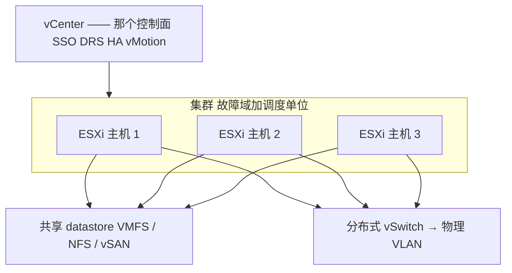

# VMware vSphere / vCenter —— 那匹私有云的驮马

> 🌐 **语言：** [English（默认）](../../../../platforms/vsphere/README.md) · **中文**
>
> ⚠️ 本项目**默认语言为英文**，`platforms/vsphere/README.md` 是"事实来源"。本页中文是多语言支持的一部分，可能略滞后于英文版；两者不一致时以英文为准。

---

> 和 [AWS](../aws/README.md) 同样的四段式模板：**它是什么 → 管理技能图 → AI 辅助 ramp → lab**
> —— 外加更深的 **[architecture](architecture.md) · [operations](operations.md) ·
> [automation](automation.md)** 三件套。但诚实标记在这里**翻转**了：vSphere 是
> **🔨 亲手做过的深度**，不是一条 ramp。这是企业的私有云，也是这个仓库里写自最直接生产经验的那个
> 平台 —— 作为一名区域 vCenter 管理员运维过，持 VCP6-DCV / VCP6-NV 认证。

## 1. vSphere 是什么

vSphere 是企业在"云"成为一个产品**之前**，把一机架一机架的服务器变成一池算力的方式 ——
而它至今仍然跑着世界上很大一部分私有基础设施。**ESXi** 是每台物理主机上的 hypervisor；
**vCenter** 是那个把许多主机变成一个被管理集群的控制面。管理员的工作和任何一朵云是同一个形状 ——
声明意图、让它保持健康、安全、高效 —— 只不过硬件是**你的**
（[`the-stack/01`](../../the-stack/01-physical.md)）：vSphere 改变的是*你怎么调度*它，
不是*谁去换那条内存*。

映射到那[七片面](../../00-the-operating-model.md)上：

| 面 | vSphere 对它的叫法 | 那一句话 |
| --- | --- | --- |
| **身份与访问** | vCenter **SSO**、角色与权限、AD/LDAP 集成 | 谁能在 vCenter 里管什么 —— 角色被限定到对象上，最好经由 AD 组。 |
| **计算** | **ESXi** 主机、**VM**、资源池、**DRS** | VM 跑的地方；DRS 在各主机之间做均衡；集群是那个单位。 |
| **网络** | 标准与**分布式 vSwitch**（DVS）、port group、**NSX** | VM 被桥接到物理 VLAN 上；NSX 再加上一整套 SDN overlay。 |
| **存储** | **datastore**（VMFS / NFS / **vSAN**）、VMDK | VM 磁盘住的地方；vSAN 把本地盘变成一个分布式 datastore。 |
| **发放与配置** | **模板**、克隆、内容库、cloud-init、PowerCLI | 从黄金镜像而不是从安装程序造 VM（[`the-stack/03`](../../the-stack/03-compute-and-images.md)）。 |
| **可观测性** | vCenter 告警、性能图表、**vROps / Aria Operations** | 这个集群健康吗，争用在哪？ |
| **安全与合规** | 角色/权限、**lockdown 模式**、VM/vSAN 加密、加固 | 把这个集群保护好；最小权限在这里和在云上完全一样适用。 |

那几项让 vSphere 成其为 vSphere 的签名能力：**vMotion**（把一台运行中的 VM 在主机之间移动、
零停机）、**DRS**（自动均衡负载）、**HA**（把一台故障主机上的 VM 在别处重启），以及作为它们底下
那个共享存储池的 **datastore**。搞懂这四样，你就明白这个平台替你买到了什么。

## 2. 管理技能图

一份具体的、可勾选的清单，列出一个 vSphere 管理员必须**做得到**什么。带分层的完整清单在
**[`skills-map.md`](skills-map.md)** 里。那些标题级能力：

- **一个你自己设计的集群** —— ESXi 主机接进 vCenter、一个开着 **DRS 加 HA** 的集群，以及那些让
  副本彼此分开的布置规则（反亲和性）（[`the-stack/01`](../../the-stack/01-physical.md)）。
- **vMotion 及其前提** —— 共享存储、兼容的 CPU、给它用的网络 —— 以及当其中一样缺失时
  *一次迁移为什么失败*。
- **datastore 做对** —— VMFS/NFS/vSAN、容量余量，以及一个**满掉的 datastore** 所造成的那次故障
  （它把它上面每一台 VM 一起带下去）。
- **网络** —— 标准与分布式 vSwitch、port group 与 VLAN，以及（在有的地方）NSX 分段和那个分布式
  防火墙。
- **从模板发放** —— 一台黄金 VM → 模板 → 克隆/定制、跨站点的内容库、用 cloud-init 做首次开机
  个性化。
- **生命周期与打补丁** —— vCenter/ESXi 升级、主机维护模式加疏散，以及不停机地滚一遍机队。
- **安全且可观测** —— 经 AD 组的角色、lockdown 模式、加密，以及用 vCenter 告警 / vROps 看健康与
  容量。

## 3. 那条 AI 辅助路径 —— 反过来的，因为这是一项强项

在公有云上，AI 把那些*未知的未知*压掉。在 vSphere 上这个模型翻转了：**判断已经在这儿了，所以
AI 的活更窄** —— 见 [`ai-ramp.md`](ai-ramp.md)。用一段话说：

AI 在 vSphere 上有三个具体的地方挣到饭钱：**PowerCLI** 自动化（它很快起草那个脚本；而你知道它什么
时候错了）、**变了什么** —— 更新版本里以及 Broadcom 授权动荡之下的变化（值得对着当前文档核实，
因为这恰好是那种 AI 会记错的移动细节），以及**交叉映射** —— *"我跑 vSphere 的 DRS/HA/vMotion 和
datastore；AWS / Azure 的对应物是什么，以及这个类比在哪儿断掉？"* 最后那一个，把一份很深的
vSphere 地基变成一条通向各朵云的快速 ramp —— 那个运营模型反着跑。

## 4. Lab

读 vMotion 和做 vMotion 是两种不同的技能 —— 但诚实的提示是：这个平台的 lab **已经跑过了**，
在生产里，跑了很多年。一条**三段式 CLI lab arc**（连接加盘点 → 从模板发放 → 看着 HA 把一台 VM
重启）在 **[`labs/`](labs)** 里，配真实的 **PowerCLI** ——
一次嵌套 ESXi 或者实验室集群的走查，强制制造一次主机故障来看 HA 把它重启起来，也就是
[`the-stack/01`](../../the-stack/01-physical.md)那条故障域教训，在它出身的那个平台上被摸得着。

## 5. 往深里走 —— architecture、operations 与 automation

三篇姊妹笔记把 vSphere 带过"那些零件是什么"，对应 AWS 那一组 —— 写自生产经验，不是一条 ramp：

- **[`architecture.md`](architecture.md)** —— 把 vCenter → 集群 → 主机 → VM 那个层级当成故障域
  单位（N+1）、把 datastore 当成那层共享底质，以及那些 **HA/DRS/vMotion 的区分**（每一样做什么、
  以及**不**做什么），外加一份参考集群架构。
- **[`operations.md`](operations.md)** —— day-2：那些运维笔记（满掉的 datastore = 集体故障、
  HA 事件、把争用读成 CPU ready / ballooning / datastore 延迟）、**按节奏**的那些反复出现的活，
  以及运营循环里的 AI（起草 PowerCLI）。
- **[`automation.md`](automation.md)** —— **PowerCLI**：那个 connect → 对象 → 操作的模型、
  那架高度阶梯（PowerCLI / govc / Terraform 的 vsphere provider）、凭据处理，以及在被证明之前
  只用 `Get-*`、并给每一次变更都加 `-WhatIf`。

## 姊妹篇

[`vcenter-and-proxmox.md`](vcenter-and-proxmox.md) —— 实际差在哪，按这个问题到来的方式来回答：
从一次迁移的内部。每个控制面住在哪、它死掉时你失去什么、那四个真正分岔的面，以及
[`vm-migration-assess`](../../toolbox/vm-migration-assess/) 所施加的那套规则 —— 而它那些硬发现是
存储抽象和客户机驱动支持，从来不是那个 hypervisor 本身。

## 诚实边界

🔨 **亲手做过的深度 —— 这个仓库里最深的之一。** 作为**区域 vCenter 管理员**运维过（维护并升级过
VM 基础设施与服务），持 **VCP6-DCV**（数据中心虚拟化）和 **VCP6-NV**（网络虚拟化）认证，
并在实验室与内部环境里有相邻的亲手 **KVM** 和 **Proxmox VE** 经验（包括物理 GPU 直通）
（[`the-stack/01`](../../the-stack/01-physical.md) 取材于此）。这不是一条 ramp —— 它是这个仓库其余
那些故障域与 hypervisor 材料所立足的那片生产虚拟化地面。凡是属于 ramp 而不是深度的地方，是那些
**最新**的 vSphere/NSX 功能以及后 Broadcom 时代的授权格局 —— 被标成 🧭 并核实过，不是虚张。
这里的声称是真的：**多年运行一片生产 vSphere 估算面**，外加那份让这个仓库里其他每一个平台都学得
更快的可迁移直觉。
