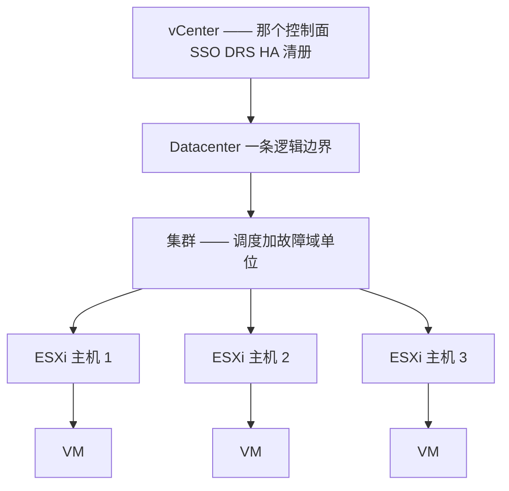
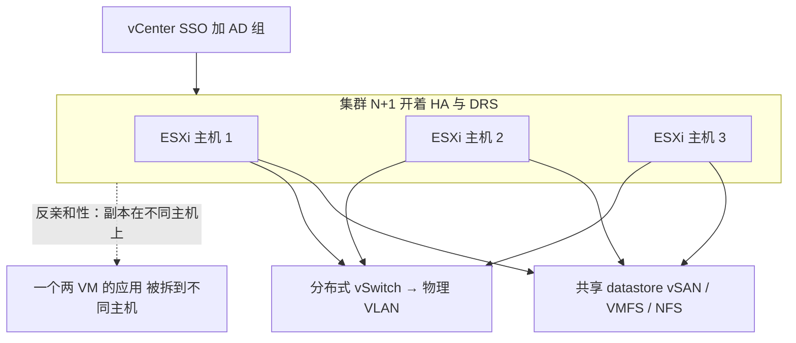
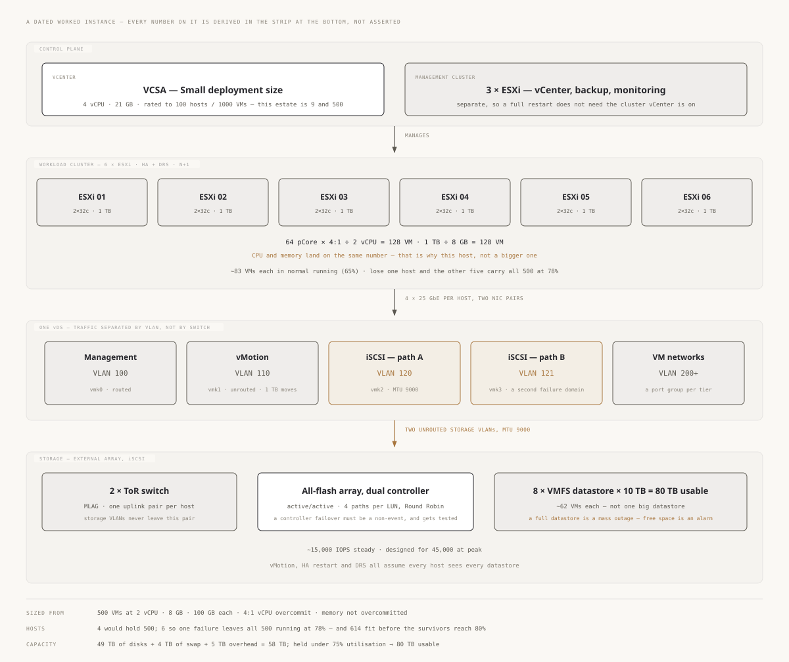
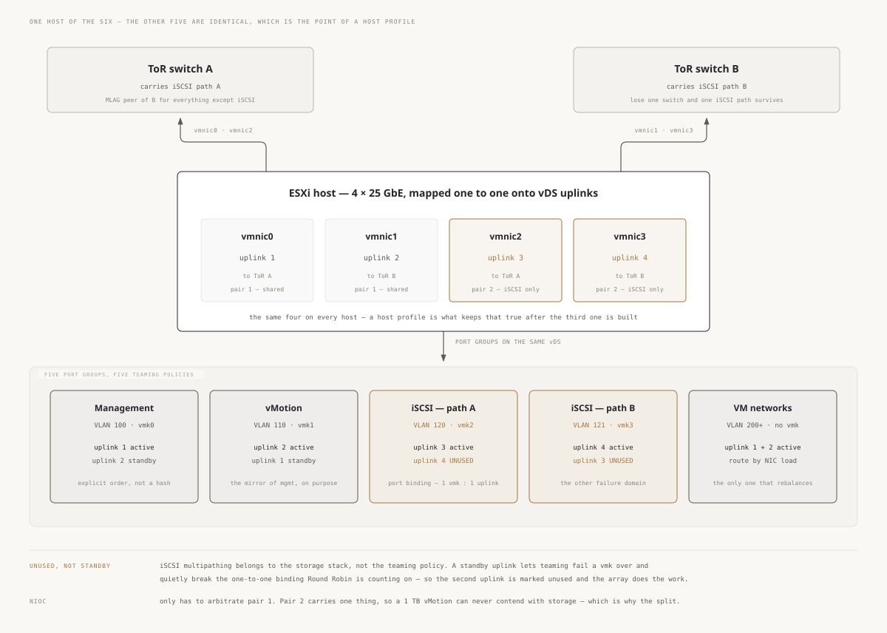

# vSphere —— 理解它的架构

> 🌐 **语言：** [English（默认）](../../../../platforms/vsphere/architecture.md) · **中文**
>
> ⚠️ 本项目**默认语言为英文**，`platforms/vsphere/architecture.md` 是"事实来源"。本页中文是多语言支持的一部分，可能略滞后于英文版；两者不一致时以英文为准。

---

> [README](README.md) 把 vSphere 映射到了那七片面上 —— *那些零件是什么*。这篇笔记是上面那一层：
> *vSphere 是怎么组织的*，好让你设计出一个熬得过故障、并且自己调度自己的集群。而且和那些云模块
> 不同，这一篇是从真的跑过它写出来的：下面那套结构是生产地面，不是一条 ramp。

vSphere 是一小组组织性的对象，其余一切都挂在它们上面。承重的有四个 —— 而第一个正是每一份好设计
开始的地方。

## 1. vCenter → 集群 → 主机 → VM 那个层级

vSphere 的整套结构是一个套娃，而**集群**是那个要紧的单位：

- **ESXi** 是每台物理主机上的 hypervisor；**vCenter** 是那个把许多主机变成一套被管理系统的大脑。
  丢了 vCenter，那些 VM 照样跑 —— 但在它回来之前你失去 vMotion、DRS 和集中管理，所以 vCenter
  自己的可用性是要紧的。
- **集群是那个故障域单位**（[`the-stack/01`](../../the-stack/01-physical.md)）：按 **N+1** 的余量
  给它定尺寸，好让一台主机能死掉、而它的 VM 在幸存者上重启起来。一个没有备用容量的集群是一个
  容不下一次故障的集群 —— 恰恰就是那个故障域模型存在去防止的反模式。
- **反亲和性规则**让副本待在不同主机上；两个数据库副本在同一台 ESXi 主机上，是一个明晃晃藏着的
  单点故障。

## 2. Datastore —— 那层共享存储底质

只有在每台主机都看得见同一批盘的时候，算力池才成立，而 **datastore** 就是那个共享池
（[`the-stack/04`](../../the-stack/04-storage.md)）：

- **VMFS**（块，在 SAN/iSCSI 上）、**NFS**（文件），或者 **vSAN**（把跨主机的本地盘汇成一个分布式
  datastore —— 超融合，不需要单独的 SAN）。
- 一台 VM 的磁盘是 datastore 上的一个 **VMDK** 文件；因为那个 datastore 是共享的，vMotion 能在主机
  之间移动一台运行中的 VM 而不用移动它的磁盘。
- **那个要对着设计的故障模式：一个满掉的 datastore 是一次集体故障** —— 它上面每一台 VM 同时停掉。
  剩余空间是一条一等告警，不是一次月度检查。

## 3. HA、DRS、vMotion —— 那些可用性原语（搞清楚每一样**不**做什么）

那三项让 vSphere 不只是"跑在服务器上的 VM"的能力 —— 以及那些把一个*配置过*它们的管理员和一个
*理解*它们的管理员分开的区分：

- **vMotion** —— 把一台*运行中*的 VM 在主机之间移动，零停机。前提：共享存储、兼容的 CPU，以及一个
  vMotion 网络。它就是你怎么为维护疏散一台主机而不造成故障。
- **DRS**（分布式资源调度器）—— 通过自动在主机之间 vMotion 那些 VM 来**均衡**负载。它**不会**把你
  从一个容量问题里扩出去；它重新分配你已有的东西。尺寸不足的集群不会被 DRS 救回来。
- **HA**（高可用）—— 把一台故障主机上的 VM 在幸存主机上**重启**。它**不会**防止停机 ——
  那些 VM 确实会下去、再起来（一次重启量级的中断）；HA 限住的是爆炸半径，不是把它消除。要零停机，
  你需要 Fault Tolerance（一个 lockstep 的影子 VM）或者应用级的 HA。

把这三样搞清楚，既是那个面试的分水岭，也是那个凌晨三点的分水岭："HA 把我的 VM 重启了"是成功；
指望 HA 意味着"没有停机"，才是那个把一次被处理好的故障变成一次意外的误解。

## 4. 那个权限模型 —— vCenter SSO、对象上的角色

vSphere 里的身份，就是[最小权限](../../cross-cutting/identity-iam.md)被套到一棵清册树上：

- **vCenter Single Sign-On** 与 Active Directory / LDAP 集成；你把**角色**（一组特权）授予
  **AD 组**，在**清册对象**（一个文件夹、一个集群、一个资源池）上。
- 那门纪律就是这个仓库处处的那条规则：经由**组**授予，不是逐用户；限定到能干活的最窄对象上；
  而且绝不要把 Administrator 角色当捷径发出去。ESXi 主机上的 **lockdown 模式**和加固过的 SSO 是那条
  [安全](../../the-stack/07-security.md)基线。

## 那条共担责任线 —— 全都是你的

和一朵云不同（[`the-stack/07`](../../the-stack/07-security.md)），这里没有厂商。那些物理主机、
那些存储、那个网络、那个 hypervisor，**以及**那些 VM，全都是你的 —— 硬件故障是你的传呼，
而那个房间的安全是你的活。vSphere 改变的是你怎么**调度**硬件；它从不改变谁去**换那条内存**。
那就是 [self-host](../../../../platforms/self-host/README.md) 那条真相，往上一层抽象。

## 一份参考架构 —— 那些面怎么组合起来

每一片面都在场：**身份**（SSO 加 AD 组）、**计算**（那个被 DRS 均衡的集群）、**网络**
（DVS 接到 VLAN 上）、**存储**（共享 datastore）、**可用性**（HA 加反亲和性）——
那张[技能图](skills-map.md)在干同一件活。

### 同一个形状，定了尺寸 —— 500 台 VM

上面那张图说的是哪些面存在。这一张说的是当这片估算面是一个真实尺寸时它们的代价，而它上面每一个
数字都是被推导出来的、不是被断言的 —— 底部那条带展示那套算术。

<picture>
  <source media="(prefers-color-scheme: dark)" srcset="../../../../site/assets/diagrams/vsphere-500vm.dark.svg">
  
</picture>

上面有三件事是决定而不是算术，而它们正是值得去争的那三件：

- **六台主机，不是四台。** 四台装得下 500 台 VM。六台才是那个"让一台主机故障、而全部 500 台在
  78% 上继续跑"的配置 —— 而 admission control 才是让那件事成为一份保证、而不是一个希望的东西。
- **一个独立的管理集群。** 把 vCenter 放在它所管理的那个集群上，是一个你只会在整站重启时才遇到的
  引导问题，而那是遇到它最糟的时刻。
- **八个 datastore，不是一个。** 两种做法容量一样；爆炸半径不一样，而上面第 2 节说了为什么。

那台主机本身是这样挑的：让 CPU 和内存同时用完 —— 64 个物理核按 4:1，以及 1 TB 内存按每 VM 8 GB，
两者都落在 128 台 VM 上。一台其中一样远早于另一样先到头的主机，是一台你付了两遍钱的主机。

### 一台主机的上联，放大看

上面那张图说了哪些 VLAN 存在。它没有说是什么让那两条 iSCSI 路径**互相独立**，而那是一次绑定、
不是一个 VLAN —— 所以它需要自己的一张图。

<picture>
  <source media="(prefers-color-scheme: dark)" srcset="../../../../site/assets/diagrams/esxi-host-network.dark.svg">
  
</picture>

**值得读两遍的那一行是 `UNUSED`，不是 `standby`。** 这里其他每一个 port group 都想要一条 standby
上联，因为故障切换正是一个 team 的全部意义。那两个 iSCSI port group 不要：多路径是存储栈的活，
由 Round Robin 在它看得见的那些路径上完成，而只有当每个 `vmk` 都被钉在恰好一条上联上时它才看得见
它们。把第二条上联留成 standby，那个 teaming 层总有一天会替你把一个 `vmk` 挪走，静默地把两条路径
坍缩成一条 —— 那个阵列仍然报告两条，而在你现在单归属的那台交换机重启之前，什么都不会告警。

这张图其余的部分是同一个想法、用更便宜的方式：管理和 vMotion 取相反的活动上联，好让它们在正常
运行时不在同一根线上；而把四块网卡拆成两对的全部理由是，NIOC 于是只需要仲裁第一对 —— 一 TB 的
vMotion 没法和那些不与它共享网卡的存储争抢。

## 诚实边界

🔨 **亲手做过的深度 —— 这个仓库里最深的之一，而这整篇笔记就是从它写出来的。** 作为**区域 vCenter
管理员**运维过（维护并升级过 VM 基础设施与服务），持 **VCP6-DCV**（数据中心虚拟化）和
**VCP6-NV**（网络虚拟化）认证，并有相邻的亲手 **KVM** 与 **Proxmox VE** 经验（含物理 GPU 直通）。
那份集群设计、那些 HA/DRS/vMotion 的区分、那次 datastore 满掉的故障、那个权限模型 —— 都是活过的，
不是读来的。这不是一条 ramp；它是这个仓库那些[故障域](../../the-stack/01-physical.md)与 hypervisor
材料所立足的那片生产虚拟化地面。唯一值得标出来的 🧭：那些**最新的 vSphere 8 / NSX 功能**，以及
**后 Broadcom 时代的授权格局** —— 那些移动很快的细节，是对着当前文档核实过的，不是虚张的。
