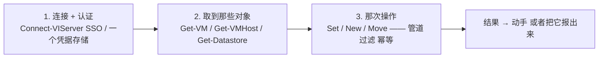
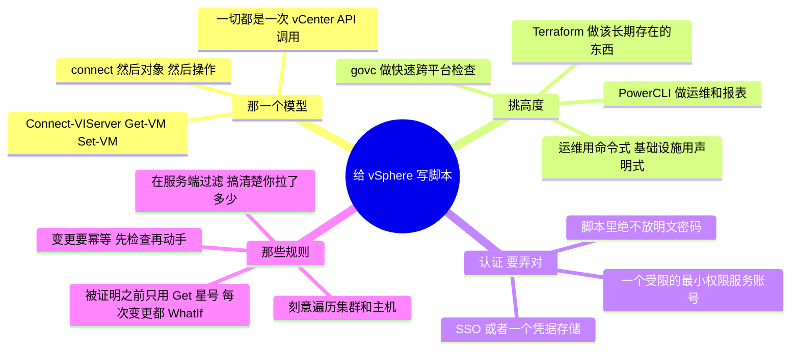

# vSphere —— 把 API 写成脚本（PowerCLI 与 vSphere API）

> 🌐 **语言：** [English（默认）](../../../../platforms/vsphere/automation.md) · **中文**
>
> ⚠️ 本项目**默认语言为英文**，`platforms/vsphere/automation.md` 是"事实来源"。本页中文是多语言支持的一部分，可能略滞后于英文版；两者不一致时以英文为准。

---

> [`architecture`](architecture.md) 是 vSphere 怎么组织的；[`operations`](operations.md) 是跑它长
> 什么样。这篇笔记是那个*怎么做*：**从代码驱动 vSphere** —— 因为在机队规模上你不会点着鼠标穿过
> 200 台 VM，你会给它们写脚本。这是[运营模型](../../00-the-operating-model.md)的第 3 招，落在这位
> 作者自动化面真实存在的那个平台上：PowerCLI。

vCenter 做的每一件事都是一次 API 调用，而 **PowerCLI** —— VMware 那个 PowerShell 模块 ——
是驱动它的日常方式。GUI 用来做一次性的事和看；PowerCLI 用来运维一片机队，而它正是一份
[脚本](../../foundations/README.md)背景直接变成 vSphere 运维能力的地方。和任何平台同样的三招，
用 PowerShell。

## 那一个模型：`connect → 对象 → 操作`

把这三样弄对 —— 一个**认证过的会话**、**你过滤到的那些对象**，以及一次**安全的操作** ——
你就能自动化 vCenter 所暴露的任何东西。每一个 PowerCLI 脚本都是这个形状。

## 那架工具阶梯 —— 挑高度

| 工具 | 它是什么 | 什么时候去够它 |
| --- | --- | --- |
| **PowerCLI** | 作为 PowerShell cmdlet 的 vSphere API | 一次性的事、报表、机队操作、维护脚本 |
| **govc**（Go CLI） | 一个轻量的跨平台 CLI | 从一个非 Windows shell 里做快速检查、Bash 里的胶水 |
| **pyVmomi / SDK** | 作为一个库的 API | 建工具和集成 |
| **Terraform（vsphere provider）** | **声明式**期望态 | 那些应该可复现的 VM/网络（[`iac`](../../cross-cutting/iac-and-config.md)） |

那条分界线，和处处一样：**PowerCLI 和 govc 是命令式的**（"现在做这件事" —— 运维那条车道）；
**Terraform 是声明式的**（"这个应该存在" —— 发放那条车道）。报表、修复和维护是 PowerCLI；
那片常驻的 VM 机队是 Terraform。

## 认证 —— 脚本里不放明文密码

- **交互式 / SSO** —— `Connect-VIServer -Server vcenter.lab` 会提示，或者用你的 SSO 会话；
  对一个坐在控制台前的人来说没问题。
- **无人值守** —— 一个 **PowerCLI 凭据存储**（`New-VICredentialStoreItem`）或者一个密钥管理器，
  绝不是硬编码在 `.ps1` 里的 `-Password 'hunter2'`。一份放在能重配整片估算面的脚本里的凭据，
  就是那次[泄露密钥](operations.md)的事故，vSphere 版
  （[`身份`](../../cross-cutting/identity-iam.md)）。
- **一个受限的服务账号** —— 那个自动化账号在它所碰的对象上拿到一个最小权限角色，不是
  Administrator。

## 把一个能用的脚本和一把自伤枪分开的那些规则

[foundations](../../foundations/README.md) 那门幂等与安全纪律，落在 PowerCLI 上：

- **在服务端过滤，然后再动手。** `Get-VM | Where-Object {...}` 在一片大估算面上会先把每一台 VM
  拉下来、再在本地过滤；在 cmdlet 支持的地方优先用服务端过滤。搞清楚你到底拉了多少。
- **刻意地遍历那份清册** —— 横跨集群、主机和 datastore；一个从一个集群报告"一切"的脚本，静默地
  只看到一个切片。
- **变更要幂等。** 一个修复脚本必须能安全重跑：先检查再动手（"这台 VM 已经关掉了吗？"），不是盲目
  动手 —— 就是 [Terraform](../../cross-cutting/iac-and-config.md) 在结构上强制的同一条规则。
- **在被证明之前只用只读的 `Get-*`。** 先对着 `Get-*` cmdlet 去开发和测试；只有在逻辑被证明之后
  才加 `Set-*`/`New-*`/`Remove-*`，而且在真正跑之前，对任何破坏性的东西都先用 `-WhatIf`
  （PowerShell 那个 dry run）。
- **`-Confirm:$false` 是一把上了膛的枪** —— 它把"你确定吗？"那个提示压掉；只有在你 `-WhatIf`
  过、并且信得过那个目标集合之后才用它。

## 自动化脚本的两种形状

- **只读/报表脚本** —— 盘点、一份快照年龄报表、一个孤儿 VMDK 查找器、一份容量报表。只读、安全、
  常跑 —— 那个[盘点 lab](labs)在 vSphere 上恰好就是这个。
- **修复/维护脚本** —— 它**动手**：合并旧快照、把一台主机置入维护模式并疏散它、把一份配置滚过整片
  机队。它会变更状态，所以它承担那全套纪律 —— 受限账号、先 `-WhatIf`、幂等、有记录。

## AI 怎么协助写这些自动化

- **对 PowerCLI 骨架很在行** —— *"一个 PowerCLI 脚本，按集群报告每一台没在跑 VMware Tools 的 VM"*
  —— 几秒钟出那个形状，通常在结构上是对的，而你（懂 vSphere）会抓住那个错的 cmdlet。
- **AI 会烧到你的地方（验得最狠）：** 它会**发明 cmdlet 名和参数**（那个模块很大，而它靠猜）；
  它会**记错版本相关的对象属性**；而且它会**递给你一个带 `-Confirm:$false`、没有 `-WhatIf` 的
  破坏性 `Remove-*`**。只读地跑它、给每一次变更加 `-WhatIf`，并把它当成马上就要对着生产跑那样去读
  —— 因为它就是。

## 诚实边界

🔨 **亲手做过的深度。** PowerCLI 是一片生产 vCenter 估算面真实的那个自动化面 —— 报表、机队操作和
维护脚本 —— 建在那份 🔨 的 [foundations](../../foundations/README.md) 脚本纪律之上（幂等、先只读、
受限凭据）。这不是一条 ramp；它是那份自动化直觉被真的施加过的那个平台。那条 🧭 的边：
**Terraform 的 vsphere provider** 和规模上的 **pyVmomi** 工具，以及最新版本的 cmdlet 变化 ——
测绘并验证过，不被声称成生产的工具工程。

## 这篇文档一屏看完

