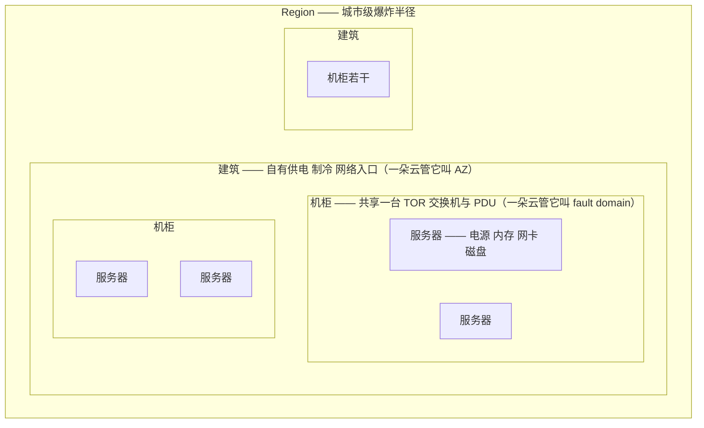
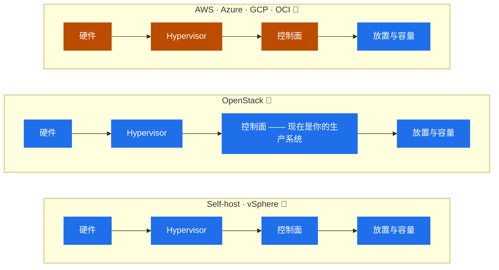
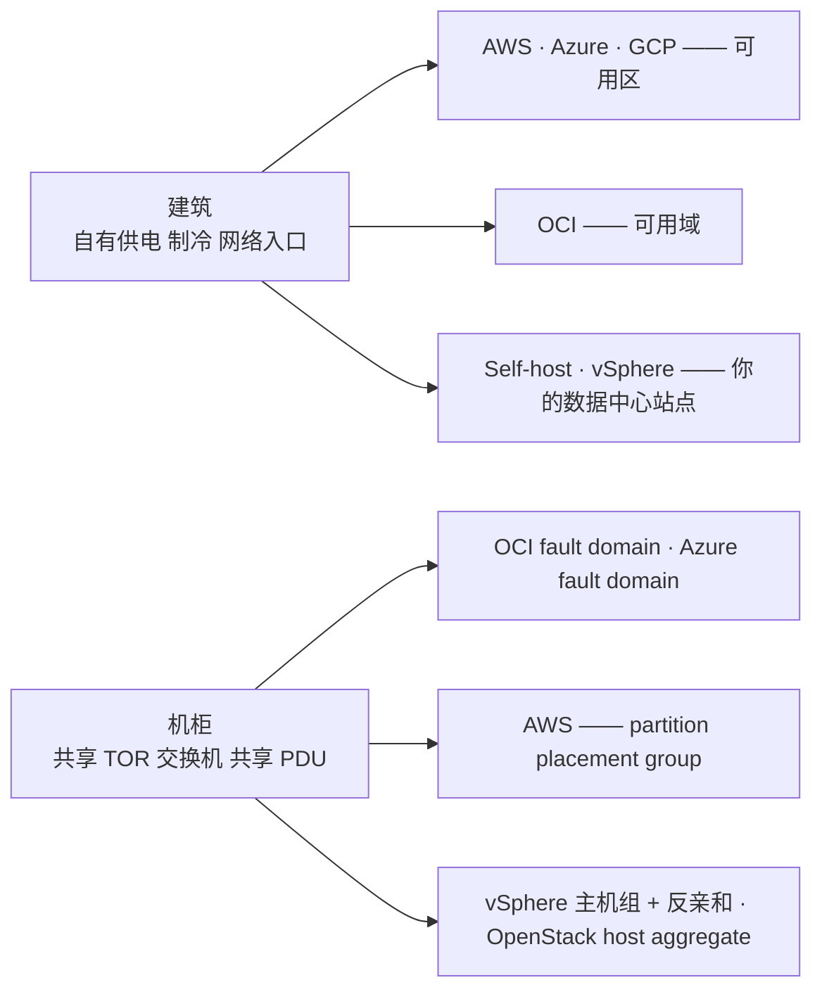
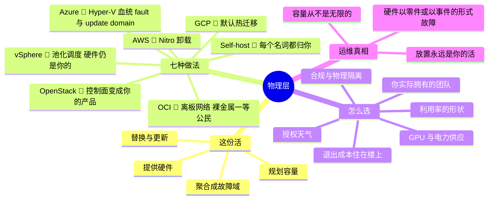

# 01 —— 物理层

> 🌐 **语言：** [English（默认）](../../../the-stack/01-physical.md) · **中文**
>
> ⚠️ 本项目**默认语言为英文**，`the-stack/01-physical.md` 是"事实来源"。本页中文是多语言支持的一部分，可能略滞后于英文版；两者不一致时以英文为准。

---

> 每一朵云都是某个人的数据中心。唯一的问题是一块盘坏掉时谁的传呼机响 —— 以及你看不看得见
> 它发生。从这里开始，这副栈的其余部分就不再是魔法了。

现在没人教物理层了，因为我们这七个平台里有四个你根本碰不到它。而这恰恰是它值得占一章的原因：
物理层是**责任共担线被划下的地方**、是**故障域诞生的地方**，也是每一个"奇怪的"云行为 ——
实例回收、容量报错、维护事件、热迁移 —— 渗漏出来的地方。如果你从未拥有过这一层，那些就是要
背的冷知识。如果你拥有过，它们是显然的。

## 这一层做什么（处处如此，永远如此）

剥掉品牌，物理层只有一份工作说明：

- **提供**计算、存储和网络硬件 —— 服务器、磁盘、网卡、交换机 —— 以及运行它们所需的供电与
  制冷。
- 把那些硬件**聚合**成**故障域**：一块盘单独坏，一台服务器单独坏，一个机柜连同它的架顶交换机
  和 PDU 一起坏，一个房间连同它的制冷一起坏，一栋楼连同它的市电进线一起坏。
- **替换**坏掉的、**更新**老化的，并**先于需求做容量规划** —— 因为硬件有交付周期，而需求不
  等它。
- 把上述一切通过一个虚拟化层**向上暴露**，好让上面那些层可以假装硬件是可互换的。它不是；这
  一层正是那个假装被维持住的地方。

故障域是整章（以及半部云架构）所悬挂其上的那个概念，所以这里把那张包含关系图明确地画一次：



一个方框里的一切共享那个方框的命运。放置两个副本，就是选择它们**不**可以共享哪个方框 ——
在这一层上，"高可用"的全部就是这个。

上面那些活由谁来做 —— 你还是提供方 —— 就是这七个平台之间的全部差别。

## 建造它的七种做法

**自建裸金属 🔨** —— 上面工作说明里的每一个名词都归你。机柜、架顶交换机、BMC/IPMI 带外管理、
PXE 引导基础设施、固件、备件库存、功率预算。机队规模的发放意味着一条镜像与引导流水线，而不是
一个拿着 U 盘的人：


完全的控制，完全的责任，以周到月计的采购交付周期。（记住那张流水线图 —— 它在第 03 章会以
Packer 和黄金镜像的形式回来，而那是同一条流水线。）

**VMware vSphere 🔨** —— 假装你的硬件是一个池子的企业标准。ESXi 是每台主机上的 hypervisor；
vCenter 是控制面；vMotion 在主机之间移动运行中的 VM；DRS 均衡负载；HA 从一台死掉的主机上重启
VM。硬件仍然是你的 —— vSphere 改变的是**你怎么调度**它，不是**谁去换那根内存条**。集群成为
你的故障域单位，主机反亲和成为你的放置工具。

**OpenStack 🧭** —— 你在自己的硬件上建一朵真正的云：Nova（计算）、Neutron（网络）、Cinder
（块）、Glance（镜像）、Keystone（身份），通常跑在 KVM 上，如果你想像云那样交付裸金属还要
加上 Ironic。关键的心智转变是：**控制面现在是一个你要运维的生产系统。** 你这朵云的 API 挂掉
是一次**你**拥有的故障，压在自建的每一项硬件职责之上。那个人力配置的现实 —— 你需要一个平台
团队，而不是一个管理员 —— 是每一份 OpenStack 宣传里被低估得最厉害的那一行。

**AWS 🧭** —— 物理层消失在 **Region** 和**可用区（AZ）**背后（每个 AZ = 一个或多个具有独立
供电、制冷和网络的离散数据中心）。VM 底下坐着 **Nitro 系统**：网络、存储和安全被卸载到定制
板卡上，只留下一个极简 hypervisor —— 再往上还有 Graviton（ARM）CPU。你从不见到一台服务器；
你见到的是实例族、placement group，以及偶尔一封"实例已被安排回收"的邮件 —— 而那是一次你从
外面读到的硬件故障。

**Azure 🧭** —— Hyper-V 血统的 hypervisor，带自己的卸载硬件（Azure Boost）；region 里（多数
而非全部 region）有可用区，外加一个别家没有的概念：单个数据中心内部带 *fault domain* 和
*update domain* 的**可用性集** —— 那是"机柜与维护窗口"的一块可见化石，而它与一个自建者已经
懂的东西一一对应。

**Google Cloud 🧭** —— 基于 KVM 的 hypervisor，跑在 Google 的内部织构之上（Jupiter 网络、
Borg 调度血统、Titan 安全芯片）。它在物理层上的标志性行为是：**默认热迁移** —— 与其给你寄一封
回收通知，GCP 会把你运行中的 VM 从故障中或待维护的硬件上挪走。你多半是事后在日志里才发现的。

**Oracle Cloud（OCI）🧭** —— 四朵云里最年轻的设计，而这体现在两处：**离板网络虚拟化**（网络
I/O 在主机之外处理，所以 hypervisor 税很低）以及**把裸金属实例做成一等产品** —— 这是一朵公有云
所能达到的、最接近直接把那台服务器交给你的程度。Region 里包含**可用域（AD）**（有些 region
只有一个），每个又细分为三个 **fault domain** —— 而你被期待刻意去使用这份反亲和。

## 责任线坐在哪儿

三个家族，归约成谁运行什么。蓝色是你要运行的；橙色是提供方的问题 —— 并且注意那个处处都保持
蓝色的东西：



**放置和容量从来不会不再是你的活。** 云会去换内存条；而除了你之外没有人决定你的副本住在哪，
也没有人注意到你快要撑破配额了。

## 对比表

| 维度 | Self-host 🔨 | vSphere 🔨 | OpenStack 🧭 | AWS 🧭 | Azure 🧭 | GCP 🧭 | OCI 🧭 |
| --- | --- | --- | --- | --- | --- | --- | --- |
| **硬件归谁** | 你 | 你 | 你 | 提供方 | 提供方 | 提供方 | 提供方 |
| **Hypervisor** | KVM/Proxmox（典型） | ESXi | KVM（典型） | Nitro（KVM 衍生，已卸载） | Hyper-V 血统 + Boost | 基于 KVM | 基于 KVM + 离板网络 |
| **你据以放置的故障域单位** | 机柜 / PDU / TOR（你来设计） | 集群 + 主机规则 | host aggregate / AZ（你来设计） | AZ；placement group | AZ；可用性集（fault/update domain） | zone；spread placement | AD + fault domain |
| **硬件故障看起来是什么样** | BMC 告警；你去换件 | HA 重启 VM；你去换件 | 类 HA（你自己建的）；你去换件 | 回收通知 / degraded 事件 | 维护事件 / redeploy | （基本上）透明的热迁移 | 维护 / 重启迁移 |
| **容量模型** | 采购（数周到数月） | 采购 + 集群余量 | 采购 + 超配策略 | 配额 + AZ 容量 | 配额 + region 容量 | 配额 + zone 容量 | 配额 + AD 容量 |
| **你往下看的可见度** | 完全（到每一颗螺丝） | 主机级 | 主机级 | 实例元数据 + 事件 | 实例元数据 + 事件 | 元数据 + 迁移日志 | 元数据 + 事件；裸金属 = 主机 |
| **成本形状** | CapEx + 电力/场地/人 | CapEx + 授权 | CapEx + 平台团队 | OpEx，按量 / 承诺 | OpEx，PAYG / 预留 | OpEx，PAYG / CUD | OpEx，PAYG / 弹性承诺 |

那个让它变得可迁移的改名练习是：**一个机柜是一个 fault domain 是一个可用性集是一条放置约束。**
一旦你看到 "AZ" 就想到"一栋有自己供电和制冷的建筑"、看到 "fault domain" 就想到"别把两个副本
放进同一个机柜" —— 你就已经知道怎么在这全部七个平台上放置工作负载了。



## 怎么选 —— 真正决定它的那些因素

- **利用率的形状。** 平稳、可预测、高利用率的负载，是在 3–5 年周期上"自有硬件在原始成本上
  胜出"的地方；突发的、尖峰的、快速变化的负载，才是云的弹性**存在的目的**。多数真实估算面是
  两者的混合 —— 而这正是为什么混合不是一种妥协，它是那个诚实的答案。
- **团队，而不只是技术。** 自建需要能走进数据中心的手。OpenStack 需要一个把控制面当产品对待
  的平台**团队**。vSphere 两样都不需要 —— 而这正是它征服企业市场的原因。云把需求从硬件的手
  转移到成本与架构的判断力上。选那个你实际的团队运维得了的平台。
- **合规、主权与物理隔离。** 有些数据不能离开那栋楼，而有些楼不能有互联网连接。那个决定是替
  你做好的。
- **供应。** GPU 时代让这件事重新变得物理：云上的 GPU 排队和配额争夺，对上自己买、然后去找
  **电**来跑它们。容量规划回来了，无论你站在哪一边。
- **授权天气。** 平台经济学可能在你脚下改变 —— vSphere 收购后的授权变更，让一批在稳定多年后
  的公司重新评估。除非它自上而下都是开源的，否则拥有整个栈并不能让你免于别人的定价决定。
- **退出成本。** 在这一层上它是温和的（计算就是计算）—— 真正的锁定住在楼上的数据引力和出网
  费里，而那是 [`02-network.md`](README.md) 的开场论证。

## 运维笔记 —— 每个家族里什么会把你叫醒

- **Self-host / vSphere：** 磁盘和内存故障（在机队规模上是持续发生的 —— 把备件当消耗品规划，
  而不是当事故）、一台 TOR 交换机干掉整个机柜（这就是它为什么是一个故障域）、你最需要够到的
  那台机器上一个死掉的 BMC（带外访问本身就是一个要维护的系统）、需要分批重启整个机队的固件
  CVE，以及那个慢慢杀死你的安静杀手：**容量到得比需求晚。**
- **OpenStack：** 上面全部，**外加**控制面故障 —— 一个塞满的消息队列或一个卡住的数据库会让
  API 停摆，而每一台已经在跑的 VM 毫发无伤地继续哼着运转。在这个故障模式教育你之前先学会它。
- **那些云：** 硬件故障以**要去响应的事件、而不是要去换的零件**抵达你 —— 回收通知、维护事件、
  实例降级警告。那份纪律是"接到通知就自动排空并替换节点"的自动化。**容量报错是真实的**（一个
  zone 确实可能用光你那个实例类型）；多 AZ / 多实例族的回退现在就是你的备件库存。而放置仍然
  是你的活：云给了你故障域，它不会拦着你把两个数据库副本放进同一个里面。

## 管理纪律（你应该做得到什么）

- 够到一台没人 SSH 得进去的服务器 —— **BMC/IPMI/iLO/iDRAC** —— 并说清楚带外管理为什么存在。
- 把 **PXE → 镜像 → cloud-init** 解释成一条流水线，以及为什么机队发放是一个镜像问题而不是一个
  安装器问题。
- 为任何交到你手上的平台画出**故障域** —— 自建机柜或云 AZ —— 并把一个双副本工作负载正确地
  跨它们放置。
- 用一句话说出 **Nitro、ESXi 和 KVM** 各自是什么，以及"卸载到定制芯片"买到了什么。
- 用自动化而不是一条日历提醒，去响应一次**实例回收/维护事件**。
- 跑一次**容量复审**：当前利用率、增长率、交付周期（采购或配额提升），以及你什么时候会撞墙。

## AI 辅助的 ramp（物理层口味）

物理层是文档稀薄、营销浓厚的老知识 —— 一个既完美地能让 AI 加速你、又完美地能烧到你的地方。

- **从你拥有的东西翻译过去：** *"我跑过 vSphere 集群和裸金属 Linux 机队。把我的故障域与容量
  规划直觉映射到 AWS 的 AZ、placement group 和配额上 —— 并标出真正不同的地方。"*
- **盘问那个硬件叙事：** *"Nitro 系统实际卸载了什么，它当初解决的是什么问题？和 OCI 的离板
  网络虚拟化对比一下。"* 跟着引用走；工程博客比营销页好得多。
- **AI 会烧到你的地方（验得最狠的地方）：** 它会自信地发明 **AZ 数量、region 事实和实例族的
  硬件规格**（这些每月都在变 —— 永远去查当前文档）；它会**把营销宣称当作工程事实**复述；它会
  在各朵云之间**把 fault domain、update domain 和 AZ 的区分搅混**。任何你会据以设计一份拓扑的
  东西，都要拿今年日期的提供方文档去核验。

## 诚实边界

这一章里的 🔨 是真的：在前雇主那里多年的亲手机队工作 —— 上架与布线、BMC/IPMI、数万台设备规模
的 PXE 与镜像发放流水线、区域 vSphere 管理、以及 lab 与内部环境里的 KVM 和 Proxmox（含 GPU
直通）。🧭 同样是真的：AWS/Azure/GCP/OCI 的物理层是从公开工程材料研究并用 AI ramp 出来的，
不是刷卡进去过的 —— 那几家公司之外没有人运维那一层，**而这恰恰是这一章的要点**：在超大规模云
上你运维的是物理层**之上**，但如果你知道它底下在做什么，你会运维得**更好**。OpenStack 被标为
🧭：在架构上被评估和理解过，没有在生产里跑过 —— 那句"控制面即产品"的警告，来自那份**确实是
🔨** 的平台运维经验，被施加到 OpenStack 的设计上。

## 这一章一屏看完



## Lab（✅ 可跑 —— [`labs/01-failure-domains/`](../../../the-stack/labs/01-failure-domains/)）

**故障域，做得可触摸** —— 而这一个能跑，纯 Python，零云：

```bash
python3 the-stack/labs/01-failure-domains/failure_domains.py
```

它把一个机队建模成若干机柜（每个是一个故障域），用两种方式放置一个双副本服务，杀掉一个机柜，
然后检查三条教训：(1) **同处一地的副本共享命运** —— 两个都在一个机柜里意味着服务随它一起死；
(2) **跨故障域的反亲和**才是"高可用"实际的意思；(3) **N 个副本跨 N 个域**能容忍丢掉一个域。
退出码 `0` 意味着教训成立。完整的嵌套虚拟化版本（PXE 引导一个"机队"、免手工装好一个节点、然后
杀掉一个机柜）是那个 [self-host lab](../../../platforms/self-host/labs/)；这一个是它的放置那
一课，做成纯本地的。
