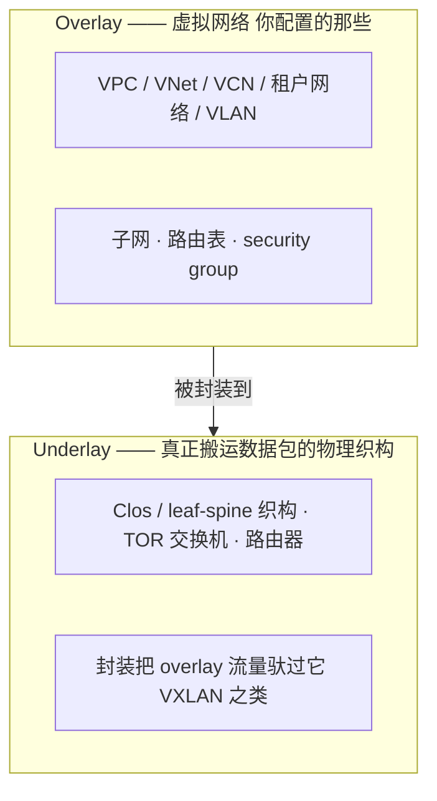
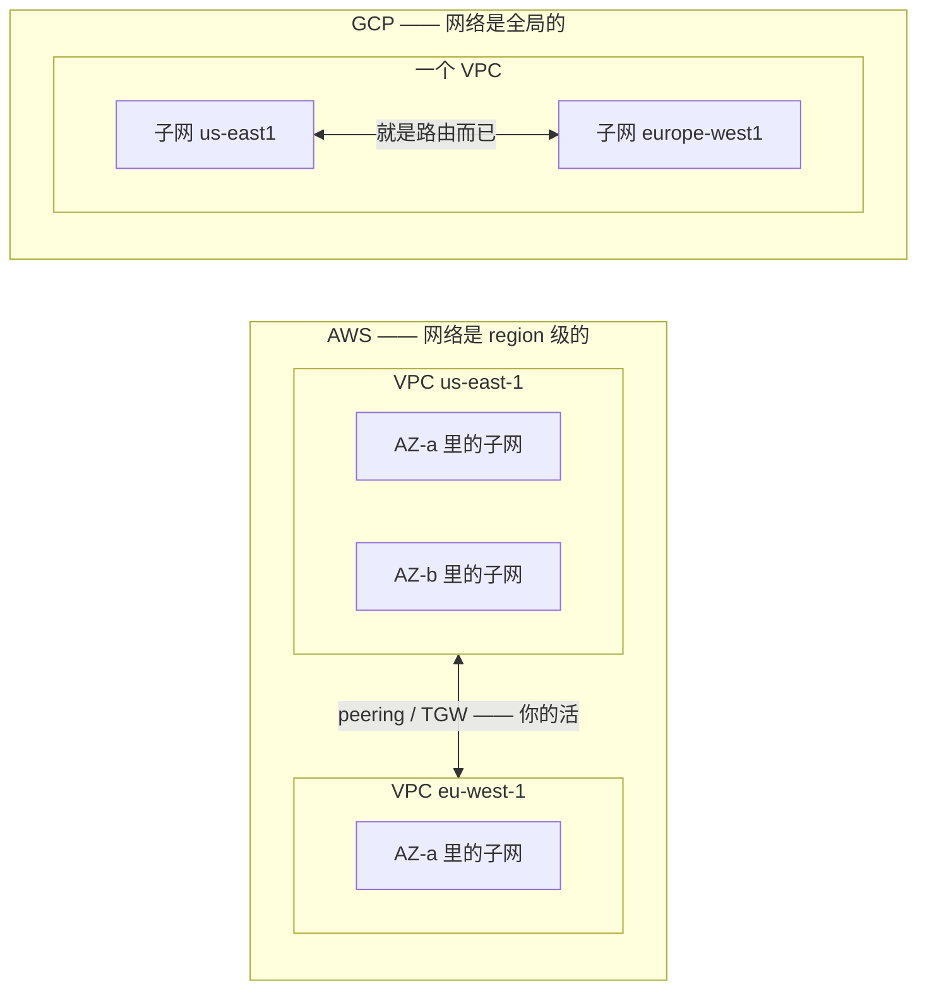
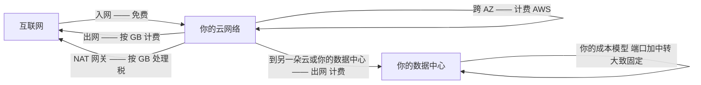
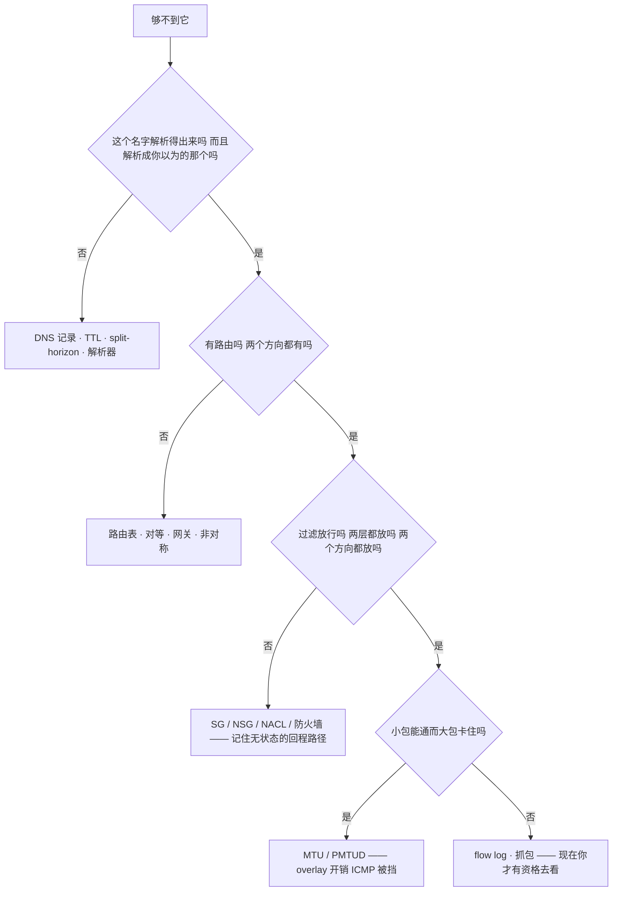
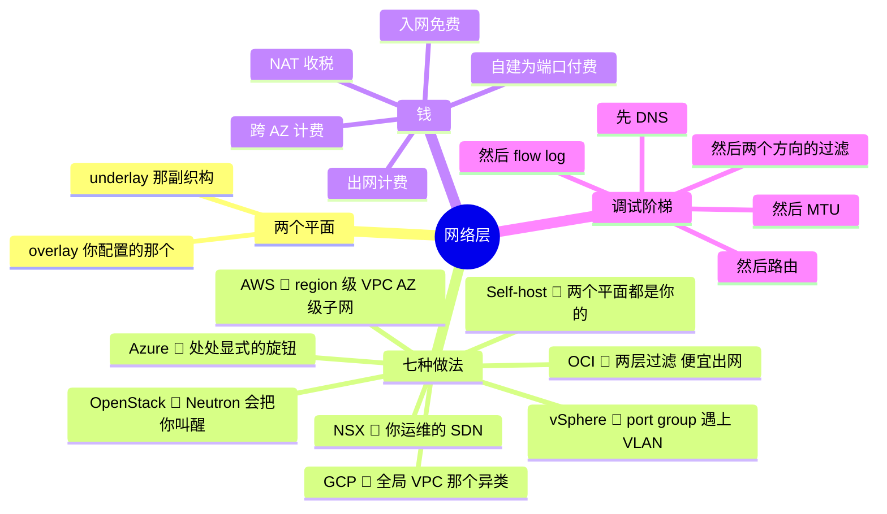

# 02 —— 网络层

> 🌐 **语言：** [English（默认）](../../../the-stack/02-network.md) · **中文**
>
> ⚠️ 本项目**默认语言为英文**，`the-stack/02-network.md` 是"事实来源"。本页中文是多语言支持的一部分，可能略滞后于英文版；两者不一致时以英文为准。

---

> 第 01 章以一个承诺结尾：真正的锁定住在这上面。网络层是这七个平台差别最大的地方、是钱悄悄
> 漏走的地方，也是"永远是 DNS"这句话被一个已经查过两遍 DNS 的人造出来的地方。

物理层给了我们一栋栋装满硬件、分在故障域里的楼。这一层的活是让它们全都能对话 —— 安全地、
快速地，而且（在云上）**仿佛**那种共享并没有发生。网络也是一份自建背景在往上爬这副栈的路上
回报最大的地方：下面每一个云的构造，都是一个你已经为它压过网线的东西被改了名字。

## 这一层做什么（处处如此，永远如此）

- **编址** —— 给每个工作负载一个位置：IP 规划、子网、DNS 名字。
- **连接** —— 在工作负载、楼、站点和互联网之间搬运数据包：交换、路由、对等、隧道。
- **隔离** —— 把租户、层级和团队分开：VLAN、VRF、虚拟网络、分段。
- **过滤** —— 决定哪些包被允许：防火墙、security group、ACL。
- **分发** —— 分散负载并挺过故障：负载均衡器、anycast、DNS。
- **观测** —— 看见实际发生了什么：flow log、抓包、计数器。

> **这一章刻意在哪里停住。** 上面每一个动词都陈述在"某个人必须做出并且负责的决策"这个海拔
> 上。它底下坐着一层这个仓库在任何地方都不覆盖的东西 —— 一台主机在线上实际怎么解析一个邻居、
> 一个 ARP 缓存里装着什么以及一条表项什么时候过期、在没有 DNS 服务器可问的时候是什么回答了
> 一个名字、一个帧怎么从一个交换机端口找到另一个。
>
> 那处缺席是一条边界而不是一次疏忽，而它的推理与 [`build-out/GAPS.md`](../build-out/GAPS.md)
> 里那张 Boundaries 表是同一套。这份材料的有用程度，恰恰取决于它保持狭窄，而它所做的那件狭窄
> 的事，是决策及其后果。协议机制是另一个海拔、面向另一类读者，而同时承载两者会让两者都付出
> 代价。
>
> 这值得被点名，而不是留给某个人去撞见。**会运维一个网络和会说出线上正在发生什么，是两种不同
> 的能力，而这个仓库只训练前一种。**

## 在七个之前，先两个概念

### underlay 与 overlay

一旦你把这一层拆成两个平面，它上面的一切就都说得通了：

- **自建：** 两个平面**都**是你建的。overlay 可能只是 underlay 上的 VLAN —— 或者如果这家公司
  够现代，是 EVPN-VXLAN。
- **那些云：** 提供方完全拥有 underlay；你住在 overlay 里，通过一个 API 配置它。这就是"软件
  定义网络"在运维上的意思：**你的网络现在是提供方数据库里的若干行**，由他们的织构具现出来。
- **OpenStack / NSX：** SDN 那套机械由你自己运行 —— overlay 是你的，underlay **也**是你的，
  而这既是它的吸引力也是它的账单。

### 双栈，因为那次迁移从未发生

IPv6 已经"即将到来"了二十五年，而关于它在运维上重要的事实**不是**地址怎么写。而是
**人们一直预测的那次迁移没有发生，而双栈不再是一个过渡态。** 它就是终点。规划过一次切换的
估算面还在等；规划过同时跑两套的估算面已经同时跑了十年。

由此有三件事，而它们正是会出现在工单里的那部分：

- **你现在到每一个目的地都有两条路径，而它们独立地故障。** 一个同时有 `A` 和 `AAAA` 记录的
  名字，把一个选择交给客户端，而客户端偏好 IPv6。如果 v6 路径坏了而 v4 路径好着，症状就是
  *"这个站点很慢"*或者*"有些人能用"* —— 客户端试 v6、等待、然后回退。Happy Eyeballs 把这件事
  对用户和对你都藏了起来，而这恰恰是它为什么那么难被找到。**`AAAA` 被发布了，因此 `AAAA` 必须
  能用**，这是那份纪律；乐观地发布它是常见的自伤式故障。
- **没有 NAT 可以躲，而那是一次过滤上的改变，不是一次编址上的改变。** 每一台主机都有一个全球
  可路由的地址，意味着防火墙现在要干的活，是 IPv4 的地址短缺曾经顺带干掉的。一个开了 v6 却
  没写 v6 规则的估算面，有了第二条不受过滤的互联网路径 —— 而它的 v4 规则集看起来是完整的。
- **地址分配是一个不同的模型，不是一种不同的写法。** SLAAC、DHCPv6 以及两者的相互作用，正是
  运维上的意外所在，还有那些改变了你日志含义的隐私地址。*你的哪些系统记录了它看到的地址，
  而你明天还能把它映射到一个人吗？*

在这个维度上那些云的分歧，比下面那张表里几乎任何其他维度都大 —— 双栈并非处处可用，而在可用
的地方机制也不同。逐个平台去查，不要带着一个假设跨过去。

## 建造它的七种做法

**自建 🔨** —— 用 VLAN 做分段、边缘一对防火墙、自己运行的 DNS/DHCP（BIND 之类）、用
HAProxy/keepalived 或一台设备做负载均衡、站点之间用 site-to-site VPN 或专线。故障模式是物理的
（一根成环的网线仍然能毁掉一层楼），而限制是诚实的：那些盒子能做什么，你就能做什么。

**vSphere 🔨** —— 标准与分布式 vSwitch 把 VM 桥接到物理 VLAN 上；网络团队的世界和 VM 团队的
世界在一个 port group 上相遇。**NSX 🧭** 在其上加了一整套 overlay（segment、分布式防火墙、
虚拟路由器）—— vSphere 用户恰恰在 VLAN 蔓延和东西向过滤超出物理网络的时候采用它。

**OpenStack 🧭** —— Neutron 提供租户网络（通常是 VXLAN overlay）、路由器、浮动 IP 和 security
group。强大，而且对自己的管道很诚实 —— 也就意味着你**一定**会遇到那些管道：当被问到什么会把
他们叫醒时，Neutron 一直是运维者最先点名的那个组件。

**AWS 🧭** —— **VPC**：一个 region 级的网络，你把它切成**AZ 范围的子网**。每个子网一张路由表、
一个 Internet Gateway 做南北向、NAT Gateway 做私有出网、**security group（有状态，挂在实例上）**
加上 **NACL（无状态，子网级）**。这个心智模型就是一张经典的三层数据中心图 —— 而且是刻意如此。

**Azure 🧭** —— **VNet**：region 级，子网跨越可用区。**NSG** 挂在子网**或**网卡上；
**用户定义路由**覆盖系统路由；Private Endpoint 把 SaaS 穿进你的地址空间。Azure 网络喜欢显式
—— 在同一层上比 AWS 有更多旋钮，而那是把双刃剑。

**GCP 🧭** —— 那个结构性的异类：**VPC 是全局的**，子网是 **region 级的**，而防火墙规则住在
VPC 层、以标签或服务账号为目标。一个网络可以横跨整个星球，region 之间不需要任何对等 ——
优雅，而且是一个真正不同的、需要为之做规划的拓扑：

**OCI 🧭** —— **VCN**：region 级，（最好）配 region 级子网；子网上的 **security list** **加上**
每个资源的 **NSG** —— 两套重叠的过滤机制，选一条道并统一它。互联和出网定价是刻意激进的；
OCI 追求的恰恰是那些被出网计费表咬到的工作负载。

## 对比表

| 维度 | Self-host 🔨 | vSphere (+NSX) | OpenStack 🧭 | AWS 🧭 | Azure 🧭 | GCP 🧭 | OCI 🧭 |
| --- | --- | --- | --- | --- | --- | --- | --- |
| **虚拟网络** | VLAN / EVPN-VXLAN | port group / NSX segment | Neutron 租户网 | VPC（region 级） | VNet（region 级） | **VPC（全局）** | VCN（region 级） |
| **子网范围** | 每 VLAN，你来设计 | 每 port group | 每租户网 | **每 AZ** | 跨可用区 | **region 级** | region 级（推荐） |
| **有状态过滤** | 防火墙 / iptables | NSX DFW | security group | security group | NSG | 防火墙规则（VPC 级） | NSG |
| **第二层过滤** | 交换机上的 ACL | —— | —— | NACL（无状态） | ASG 分组 NSG | 分层策略 | security list（子网） |
| **南北向** | 边缘防火墙对 | 边缘 / NSX 网关 | Neutron 路由器 + 浮动 IP | IGW / NAT GW | LB / NAT GW | Cloud NAT / 全局 LB | IGW / NAT GW |
| **跨站点** | VPN / 专线 | 同上 + NSX 联邦 | VPN-as-a-service | Direct Connect | ExpressRoute | Interconnect | FastConnect |
| **LB signature** | HAProxy / keepalived / F5 | NSX LB | Octavia | ALB / NLB | Azure LB / App GW / Front Door | **全局 anycast LB** | LB / NLB |
| **IPv6** | 双栈，由你规划 | port group 上双栈 | 每租户网双栈 | 双栈 VPC，egress-only IGW | 双栈 VNet | 双栈，外部/内部 | 双栈 VCN |
| **DNS** | 你自己跑的 BIND 🔨 | ——（你的） | Designate | Route 53 | Azure DNS / 私有区 | Cloud DNS | OCI DNS |

## 怎么选 —— 以及那块出网计费表

四朵云之间多数二三层能力上的差别都是边际的。够得上选型级别的差别是这几个：

- **拓扑模型。** GCP 的全局 VPC 对上其他所有人的 region 级网络，从根本上改变了多 region 的
  设计 —— 在别处需要对等和中转的东西，在那里"就是路由而已"。
- **出网计费表 —— 真正的锁定。** 流量**进来**是免费的；流量**出去**要计费；在 AWS 上，
  **跨 AZ** 的流量也要计费，而 NAT Gateway 在此之上再加一笔按 GB 的处理税。数据引力不是一个
  比喻 —— 它是一笔按每 GB 计的、只要你想离开就要付的出场费：

  自建把这个模型反了过来：你为**端口和中转容量**付费，大致是固定的，不管你搬多少。这一个差别
  决定的混合架构比任何功能清单都多 —— 而它是 OCI 选中的战场（激进得多的便宜出网），也是那些
  "回迁"故事几乎总是带宽密集型工作负载的原因。
- **合规拓扑。** 到 SaaS 的私有连接（private endpoint）、强制隧道穿过检查、本地互联 —— 如果你
  的流量必须被检查、或者绝不能碰互联网，在选定**之前**先验证那个模式存在。
- **还是团队。** NSX 和 OpenStack Neutron 是你**运维**的 SDN 系统。云 VPC 是你**消费**的 SDN
  系统。这两者之间的技能差是真实的。

## 运维笔记 —— 什么会把你叫醒

- **永远是 DNS** —— 陈旧的记录、split-horizon 的困惑、某个人设成一天的 TTL、一个在 VPC 内外
  答得不一样的解析器。**先**查 DNS，然后在你怪过别的东西之后再查一遍。
- **不是 DNS 的时候，就是 MTU** —— overlay 会偷字节（VXLAN 拿走约 50）、云会带非显然的默认值、
  而路径 MTU 发现会安静地死在那些丢弃 ICMP 的 security group 后面。症状：小请求能用，大传输
  卡住。
- **有状态与无状态只在一个方向上咬人** —— security group 自动放行回程流量；NACL 和交换机 ACL
  不会。"请求到了，响应消失了"意味着某个人忘了那条临时端口的回程路径。
- **非对称路由** —— 两条出路、中间一个防火墙，conntrack 丢掉那个它从没见过的半连接。在每一个
  平台上（包括自建）的双网卡和多路由表配置里都是经典。
- **conntrack / 连接表耗尽** —— NAT 网关、LB 和 Linux 机器都保持状态；所有这些状态都有天花板；
  而所有天花板都是在生产里被发现的。
- **VPN 隧道会抖；BGP 会话不撒谎** —— 监控那个路由会话，不要监控 ping。

那个有条理的版本 —— 值得内化成反射的调试阶梯：

## 管理纪律（你应该做得到什么）

六件事，其余都是细节：在任何交到你手上的平台上**从代码起一个三层网络**；解释**有状态与无状态**
过滤，并指出每个平台把那个无状态层藏在哪；**不跳级地**跑上面那把**调试阶梯**，并读一份
**flow log** 来证明是哪一级；在第一个子网存在之前就写出一份**能挺过五年的 IP 规划** ——
之后去合并两个重叠的 `10.0.0.0/16` 是一个有名字的项目；**刻意而不是意外地**配置 split-horizon
DNS；以及把一份**出网账单**读到能说出那些 GB 是在哪里跨过一条计费边界的。

这一切的可核对版本 —— 十一节共 63 格，按每项技能能走多远而不是按平台分层 —— 在
[`cross-cutting/skills-maps/networking.md`](../cross-cutting/skills-maps/networking.md)。

## AI 辅助的 ramp（网络口味）

- **从你拥有的东西翻译过去：** *"我懂 VLAN、BIND、iptables 和企业防火墙。把它映射到 AWS 的
  VPC 构造上 —— 并且明确说出哪一层是有状态的、哪一层是无状态的。"*
- **做设计评审，不是做设计：** 让 AI 起草那份三层 Terraform，然后逐条规则问"这个为什么是开
  的？"。AI 默认走宽松的 quick-start 模式（它替你写的 security group 里，0.0.0.0/0 没有任何
  正当理由）。
- **AI 会烧到你的地方（验得最狠的地方）：** 它会**发明规则语法和配额数字**；它会**说出训练年份
  的 MTU 默认值和出网价格**（两者都在变 —— 永远去查当前值）；它会忘掉 **GCP 的全局 VPC** 而在
  那里给你 region 模型的建议；它会搅混 **OCI 上的 security list 与 NSG**、以及 **Azure 上的
  NSG 与 ASG**。任何过滤流量或者花钱的东西，都要拿提供方当前的文档核过。

## 诚实边界

这里的 🔨 是那套经典的企业栈：多年亲手做过的 DNS/DHCP/BIND、VLAN、防火墙、VPN 和 TCP/IP 调试，
横跨办公室与数据中心，带着 CCNP 级别的路由交换底子和真正运维过的 vSphere 网络。🧭 是两样东西，
而第二样此前是被略去未提而不是被声称过的。第一样是现代 SDN 层：每朵云的 VPC 细节、NSX 和
EVPN-VXLAN 织构，都是用上面那套方法 ramp 出来的 —— 扎实的概念映射，对着当前文档核验过，没有
声称过多年的日常 BGP 对等或 NSX 生产运维。第二样是**无线**：密度规划、信道与功率策略、RF 勘测
实践和接入点选型，是被测绘和验证过的，不是在一层楼上设计出来并在之后与它共同生活过的。它在这里
被点名，是因为上面那份 🔨 清单已经深到读者会合情合理地把无线也折进去，而那份沉默会做一件证据
支撑不了的事。设计方法写在
[`cross-cutting/site-network-design.md`](../cross-cutting/site-network-design.md)，在同一
个地方标着 🧭。不过那把调试阶梯是与平台无关的、也是被伤疤检验过的：它是在硬件上学会的，而它在
别人运行的 overlay 上一模一样地管用。

## Guided run（规格）

**这是一次 [guided run](../CONTEXT.md)，不是一个 lab。** 它需要一个真实环境，所以这里没有任何
东西能断言你做过它，而 CI 也跑不了它。那就是全部的区分，而且它不是降级 —— 一次 guided run 够
得到真实的延迟、真实的报错和真实的账单，而那是没有模型做得到的。

**同一个网络，三种做法。** 一份三层设计（公网 LB / 私有应用 / 隔离数据 + NAT 出网），建三遍：

1. **在 AWS 上用 Terraform**，然后**在 GCP 上用 Terraform** —— 同一套拓扑，并写下全局 VPC 模型
   改变了你代码的每一个地方。
2. 本地跑 **DevStack（OpenStack）** —— 用 Neutron 建同一个租户网络，并见一见那些云替你藏起来
   的管道。
3. **那次演练：** 把每一个都用四种方式弄坏（干掉一条路由、挡住一条回程路径、投毒 DNS、掐死
   MTU），然后只用那把调试阶梯去修 —— 不许猜。

## 这一章一屏看完

