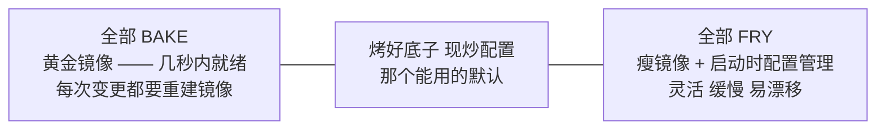
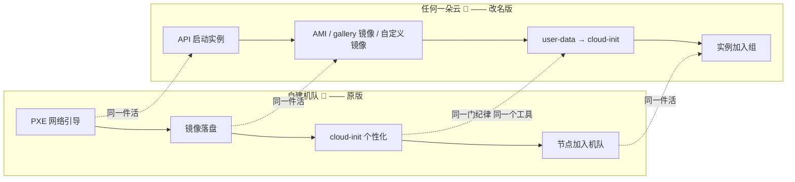
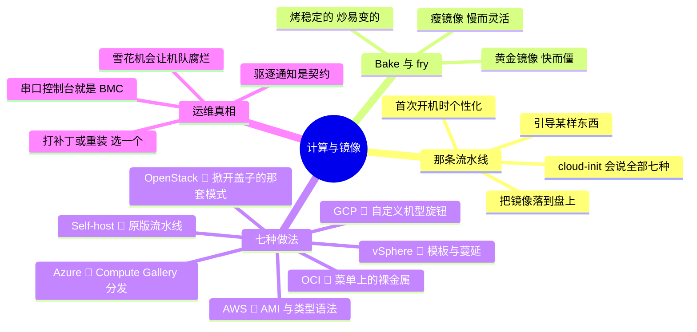

# 03 —— 计算与镜像

> 🌐 **语言：** [English（默认）](../../../the-stack/03-compute-and-images.md) · **中文**
>
> ⚠️ 本项目**默认语言为英文**，`the-stack/03-compute-and-images.md` 是"事实来源"。本页中文是多语言支持的一部分，可能略滞后于英文版；两者不一致时以英文为准。

---

> 一台 VM 只是一台租来的服务器。耐久的那份资产 —— 值得去做工程的那样东西 —— 是那条把一台空白
> 机器变成一台能干活的机器、且不需要动手的流水线。拥有那条流水线，这七个平台就变成了七个引导
> 目标。

第 01 章建起了硬件；第 02 章让它能对话。这一章跑起工作负载 —— 而这正是一份机队发放背景不再
是"背景"、而成为整个剧情的地方。每个平台的计算叙事都归约成同一条三拍流水线，而这位作者在十万
台设备的规模上跑过它：**引导某样东西 → 把一个镜像落到盘上 → 在首次开机时个性化它。**

（容器和 serverless 被刻意推迟到第 05 章 —— 它们是这一层的消费者，而且值得有自己的拆解。）

## 这一层做什么（处处如此，永远如此）

- 把计算**塑形**成可租用/可分配的单位：裸金属、VM，配上一份 CPU/内存/加速器组合的菜单（或者
  一个旋钮）。
- 从一个**镜像**把那些单位**引导**起来 —— 那是对"它第一次醒来时盘上有什么？"这个问题的、
  打包好且带版本的答案。
- 在首次开机时**个性化**：主机名、密钥、用户、配置、agent —— 那一步把**一个**实例变成
  **你的**实例。
- **扩缩与替换**：一组一模一样的实例、基于健康检查的替换、按需增长。
- 在整个生命周期里**打补丁或重装** —— 而你的组织先伸手去够这两个动词里的哪一个，说明了它
  成熟度的一切。

## 在七个之前，先一个概念：bake 与 fry

每一份发放设计都坐在一根轴上的某处 —— 多少是**烤进镜像里的（bake）**、多少是**在启动时现炒
的（fry）**：

机队经验会把你推向中间：把慢而稳定的东西烤进去（OS、agent、加固），把每实例特有且易变的东西
现炒（身份、端点、密钥）。抓住这根轴；下面每一个平台都只是这根轴上某一点的工具。

## 那条流水线，旧世界与新世界

这个系列的标志性图 —— 同一条流水线，画两遍：

**cloud-init 是这七个平台的最大公约数。** 它在自建机队上做首次开机个性化，它对 OpenStack 是
原生的（它就是在那儿长大的），而且它是 AWS、Azure、GCP 和 OCI 的 Linux 镜像上标准的首次开机
机制。（Windows 玩的是同一个游戏，只是换了演员：cloudbase-init、unattend.xml、发放 agent。）
如果你已经会说 cloud-init，你就已经会说这个系列里每一个平台上的首次开机。

## 建造它的七种做法

**自建 🔨** —— 上面那条流水线，外加云替你藏起来的一切：硬件多样性（镜像必须能在你拥有的每一
个代际上启动）、驱动兼容性、全盘加密登记，以及一天装几百台机器的仓库现实。镜像**就是**产品；
流水线是它的工厂。

**vSphere 🔨** —— 用模板和克隆代替 PXE：黄金 VM → 模板 → 克隆 + 定制规范（或者通过 VMware 对
cloud-init 的支持）。内容库把模板分发到各站点。那个经典的故障模式是 **VM 蔓延** —— 克隆太便宜
了，以至于难的问题变成了盘点纪律，而不是发放。

**OpenStack 🧭** —— 把盖子掀开的那套云模式：**Glance** 存镜像，**Nova** 按 **flavor**（那份
规格菜单）调度实例，cloud-init 做个性化，而 **Ironic** 为裸金属跳同一支舞 —— 包括 PXE，这让它
成为最接近自建机队流水线的云类比。

**AWS 🧭** —— 实例类型是一锅有语法的字母汤（字母 = 族：通用/计算/内存/加速；数字 = 代际）、
**AMI** 作为镜像产物（region 级 —— 到处拷贝它是你的活）、**user data** 喂给 cloud-init、
**Auto Scaling Group** 从一个启动模板替换掉生病的实例，以及 **Spot** 以折扣租用闲置容量，而
驱逐是一个被设计进去的事件。

**Azure 🧭** —— VM 规格像 AWS 那样分族；镜像通过 **Azure Compute Gallery** 分发（带版本、可
复制、有 RBAC —— 四家里最完备的镜像分发叙事）；Linux 上是 cloud-init，Windows 上是发放 agent；
**VM Scale Set** 做分组；第 01 章的可用性集在放置时重新浮现。

**GCP 🧭** —— 规格上的那个异类：预定义机型**加上**  **自定义机型** —— 你想要多少 vCPU/内存就
拨多少，而不是从一份菜单里挑。实例模板喂给**托管实例组**；镜像是全局的（没有跨 region 拷贝
这项杂活）；第 01 章的热迁移意味着维护基本上碰不到你。

**OCI 🧭** —— **shape**，包括**弹性 shape**（拨 OCPU 和内存 —— 而且注意：一个 OCPU 是一个完整
物理核，不是一个超线程；同样这个 "vCPU" 词在别处只有一半的分量）、自定义镜像、cloud-init 是
标准，以及第 01 章那个签名被带上了栈：**裸金属 shape 是菜单上的一等条目**，不是一个异类。

## 对比表

| 维度 | Self-host 🔨 | vSphere 🔨 | OpenStack 🧭 | AWS 🧭 | Azure 🧭 | GCP 🧭 | OCI 🧭 |
| --- | --- | --- | --- | --- | --- | --- | --- |
| **计算单位** | 那台服务器 | VM | 实例（flavor） | 实例（type） | VM（size） | 实例（machine type） | 实例（shape） |
| **规格模型** | 你买了什么 | 你分配什么 | flavor 菜单（你的） | 固定菜单 | 固定菜单 | 菜单 + **自定义旋钮** | 菜单 + **弹性旋钮** |
| **镜像产物** | 你的镜像 + PXE | 模板 / 内容库 | Glance 镜像 | AMI（region 级） | Compute Gallery 镜像 | 镜像（全局） | 自定义镜像 |
| **首次开机个性化** | cloud-init | 定制规范 / cloud-init | cloud-init（原生） | user data → cloud-init | cloud-init / agent | cloud-init（经元数据） | cloud-init |
| **扩缩组** | 你自己的工具 | DRS 集群（放置，不是扩缩） | Heat / Senlin | Auto Scaling Group | VM Scale Set | 托管实例组 | 实例池 |
| **廉价可中断** | —— | —— | —— | Spot | Spot | Spot（原 preemptible） | preemptible |
| **裸金属** | 全部 | 全部 | Ironic | metal 实例类型 | 有限 | 有限 | **一等 shape** |
| **最后手段的控制台** | BMC / IPMI 🔨 | vSphere 控制台 | Nova 控制台 | EC2 串口控制台 | 串口控制台 | 串口控制台 | 串口控制台 |

最后那一行是第 01 章的回报：**云的串口控制台就是你已经认识的那个 BMC** —— 同一件活、同一个
需要它的时刻，不需要门禁卡。

## 怎么选 —— 真正决定它的那些因素

- **rightsizing 就是成本这场游戏的全部。** 菜单与旋钮的差别（GCP/OCI 是旋钮，AWS/Azure 是菜单）
  比不上**测量**并匹配这份纪律要紧。机队真相：多数实例配得过大，因为上线日之后没人再看过。
- **承诺是一道光谱，不是一张价目表：** 按需 → 承诺/预留 → spot/preemptible，恰好映射到这个
  工作负载有多可预测 —— 而那就是第 01 章那个利用率形状的问题，在实例粒度上被再问一遍。
- **宠物需要 vSphere 式的工具；牲口需要镜像流水线。** 一个就地打补丁、登录进机器、害怕重启的
  组织，会和每一个牲口形状的平台打架。**技术**选择是简单的；**组织**的准备度才是真正的闸门。
- **授权跟着核数走。** 按核收费的商业授权（数据库是经典）能让裸金属或专用主机比共享 VM 更
  便宜 —— 而这也是 OCI 以裸金属开路的一个主要原因。
- **GPU 的现实检查**（来自第 01 章）：如果容量不在那儿，规格菜单毫无意义。加速实例的配额、
  可得性和中断行为，值得在架构假设它们**之前**去核实。

## 运维笔记 —— 什么会把你叫醒

- **打补丁是一个岔路口：** 就地打（宠物 —— 快、易漂移、雪花机累积）对上重装并替换（牲口 ——
  黄金镜像永远是最新的，但你必须真的去重建并推它）。刻意地选；飘进"两者都做、而且不一致"，
  就是机队腐烂的方式。
- **镜像漂移与那台雪花服务器** —— 那台没人能重建的机器，因为它的状态除了它自己身上哪儿都不
  存在。值得在它跑你之前先跑一遍的那个测试：*你现在能不能删掉任意一台实例，然后从代码把它重建
  出来？*
- **启动失败从串口控制台开始调试** —— 云上还是裸金属，顺序都一样：控制台输出 → 内核起没起来
  → cloud-init 跑没跑 → `/var/log/cloud-init.log` 说了什么。那个日志文件在全部七个平台上都一样，
  这让它成为这一章里最可迁移的单一调试习惯。
- **容量以实例族的粒度回来** —— 一个 zone 可能没有**你那个**实例类型了，而其他类型满满当当。
  回退族和多 AZ 铺开，又一次就是那层备件货架。
- **中断事件是契约：** spot 驱逐通知、维护事件、回收邮件 —— 每个平台都给你一条预警通道和一个
  截止时间。那份纪律是订阅那条通道的自动化，不是一个读邮件的人。
- **agent 动物园** —— SSM agent、waagent、guest tools、监控 agent —— 每一个都是你现在装进镜像
  里的软件，而且必须像别的一切一样打补丁。

## 管理纪律（你应该做得到什么）

- **从代码构建一个黄金镜像**（Packer 或等价物），并用同一份 cloud-init 个性化把它在两个不同
  平台上引导起来。
- 为某个给定工作负载论证 **bake 与 fry** 的划分，并为你划线的位置辩护。
- **从串口控制台和 cloud-init 日志**调试一次失败的首次开机，不用 SSH —— 因为那台起不来的机器
  没有 SSH。
- **从数据做 rightsizing**：拉出利用率，点出配得最过大的三台实例，并说出它们应该是什么。
- 用一套你能演示的自动化处理一次 **spot 驱逐/维护事件**，而不是一份你会手动照着做的 runbook。
- **从代码重建你拥有的任意一台实例** —— 并且真的做一遍来证明它。

## AI 辅助的 ramp（计算口味）

- **翻译那条流水线：** *"我跑一条 PXE + 镜像 + cloud-init 的机队流水线。把每一段映射到 AWS 上：
  什么取代了 PXE、我的镜像住在哪、cloud-init 怎么拿到它的数据？"* —— 然后对 Azure/GCP/OCI 问
  同样的问题，并对比那些答案。
- **解码那些菜单：** *"解释 AWS 实例类型的命名语法，并给我一条内存密集型数据库的决策路径"* ——
  AI 在语法上确实很好；把它最后落到的那个具体类型对着当前文档核验。
- **AI 会烧到你的地方（验得最狠的地方）：** 它会**发明实例类型和规格**（菜单每月都在变；任何
  你会去采购的东西都要核过）；它会引用**训练年份的价格和 spot 行为**；它会假设 **cloud-init
  模块在各处行为一致**（顺序和数据源的怪癖不同 —— 在真实平台上测）；而且它会很乐意递给你一个
  **已废弃的镜像 ID**。把那个东西启动起来；启动日志不会产生幻觉。

## 诚实边界

这一章里的 🔨 是这个系列里最深的：在十万台设备规模上设计并运行一条镜像与发放流水线 —— PXE、
自定义镜像构建、cloud-init 个性化、全盘加密、硬件多样性处理 —— 外加多年的 vSphere 模板与克隆
运维。那正是这一章所泛化的那门纪律。🧭 是每朵云自己的那套机械：ASG/VMSS/MIG 的生产运维、
Packer 作为一个具体工具（它所编码的那门**纪律**是 🔨；工具本身是一条 ramp），以及每个平台的
镜像分发细节 —— 全部用上面那套方法测绘，并通过构建而不是通过阅读来验证。

## Guided run（规格）

**这是一次 [guided run](../CONTEXT.md)，不是一个 lab。** 它需要一个真实环境，所以这里没有任何
东西能断言你做过它，而 CI 也跑不了它。那就是全部的区分，而且它不是降级 —— 一次 guided run 够
得到真实的延迟、真实的报错和真实的账单，而那是没有模型做得到的。

**一个镜像，两朵云，不动手。**

1. **Packer** 构建一个 Linux 黄金镜像（加固与 agent 烤进去，配置现炒），同时以本地 KVM **和**
   一朵公有云为目标。
2. 用**同一份 cloud-init user-data** 把两个都引导起来；证明个性化是一模一样的。
3. **那次演练：** 破坏那个镜像（一条坏的 fstab 条目），看着它启动失败，然后只用串口控制台和
   救援模式恢复它 —— 那份 BMC 的肌肉，云上版。

## 每个平台把这一层放在哪里

这一章负责对比；平台目录负责运维。七个中的任何一个，结构在它的 `architecture.md` 里，day-2 的活
在它的 `operations.md` 里：[AWS](../platforms/aws/architecture.md) · [Azure](../platforms/azure/architecture.md) · [GCP](../platforms/gcp/architecture.md) · [OCI](../platforms/oci/architecture.md) · [vSphere](../platforms/vsphere/architecture.md) · [OpenStack](../platforms/openstack/architecture.md) · [self-host](../platforms/self-host/architecture.md) —— 同样七个在 [`platforms/`](../platforms/) 下面还有
operations 和 automation 两篇配套。

## 这一章一屏看完

