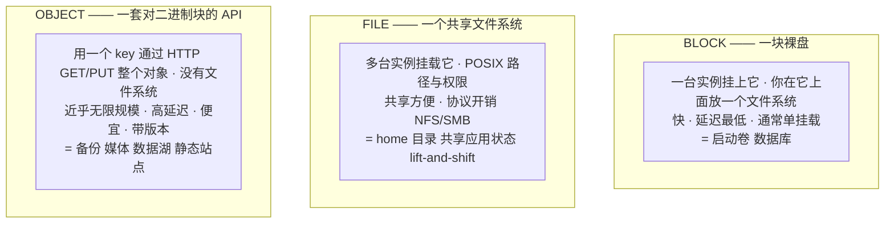
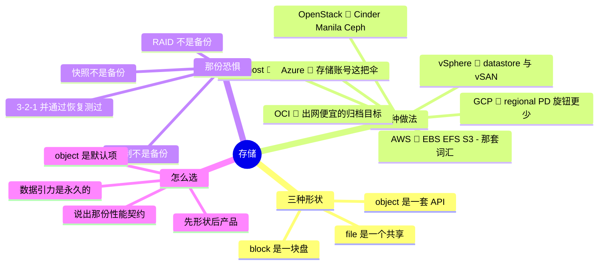

# 04 —— 存储

> 🌐 **语言：** [English（默认）](../../../the-stack/04-storage.md) · **中文**
>
> ⚠️ 本项目**默认语言为英文**，`the-stack/04-storage.md` 是"事实来源"。本页中文是多语言支持的一部分，可能略滞后于英文版；两者不一致时以英文为准。

---

> 计算是可丢弃的；存储才是恐惧住的地方。第 03 章里的任何一台实例你都能在几分钟内重建出来 ——
> 但它上面的数据是唯一一样没有任何流水线能重新造出来的东西。这一层就是"删掉再重新发放"不再是
> 一个耸肩、而开始成为一次改简历事件的那一层。

第 03 章把实例变成了牲口。存储就是那群牲口仍然需要一道围栏的原因。这里的一切都围着同一个不对称
转：**在一个为无状态和复数而建的世界里，状态是珍贵而单数的。** 把三种存储形状和它们的故障模式
弄对，其余的 —— 备份、持久性、出网计费表的再次登场 —— 就会跟上来。

## 这一层做什么（处处如此，永远如此）

- 让状态**存续**得比任何单台实例的寿命更久。
- 把那份状态**呈现**成三种形状之一 —— block、file 或 object —— 每一种都是性能、共享和规模之间
  一笔不同的交易。
- **保护**它：用复制换持久性、用快照换时间点、用备份换"那栋楼/那个账号没了"。
- 按一份契约**发挥性能**：你真的说得出口的 IOPS、吞吐和延迟。
- **证明**它：加密、访问控制，以及那条说清谁碰了什么的审计轨迹。

## 在七个之前，先一个概念：三种形状

每个平台上的每一个存储产品，都恰好是三种形状之一。学会这些形状；产品只是改名。



要记住的那句话：**block 是一块盘，file 是一个共享，object 是一套 API。** 伸手去够错的形状，你
就会永远和这个平台打架 —— 把对象存储挂载成文件系统是那个经典的自伤伤口。

## 建造它的七种做法

**自建 🔨** —— 用金属做出来的那些形状：block 是 **SAN**（Fibre Channel / iSCSI LUN）或本地盘；
file 是一台 **NAS**（NFS/SMB filer）；object 是 **MinIO/Ceph**（如果你跑它的话），或者你干脆
没有真正的对象存储、并且感受得到它的缺席。用 RAID 熬过磁盘故障，用控制器和多路径换可用性。
容量规划归你，一块盘死掉之后那个重建窗口归你（存储里最吓人的那几个小时 —— 重建期间的第二次
故障，正是 RAID 各级别存在去为之设界的那场噩梦），还有那条真相：**RAID 不是备份**。

**vSphere 🔨** —— **datastore** 把底下的 SAN/NAS 抽象成一个池子供 VM 取用；**VMDK** 是那些
block 卷；**vSAN** 把跨主机的本地盘变成一个分布式 datastore（超融合，不需要单独的 SAN）。
故障模式就是上面那些物理故障，往上抬一层抽象 —— 而 datastore 满了，是那场把它上面每一台 VM
一起带下去的故障。

**OpenStack 🧭** —— 换了云名字的那些形状：**Cinder**（block）、**Manila**（file）、**Swift**
或者经 **RadosGW** 的 Ceph（object），底下通常是 **Ceph** 一手包办三件。很强大，而 Ceph 是一个
货真价实、要去运维的平台 —— 它的健康、再平衡和 placement group 调优自成一门纪律，又一条"控制面
即产品"的账目。

**AWS 🧭** —— 那套所有人都拿来被对比的参考词汇：**EBS**（block，锁在 AZ 里 —— 一个卷住在一个
AZ 里，这个事实塑造你的整套 HA 设计）、**EFS**（NFS file）、**FSx**（托管 file，有好几种口味），
以及 **S3**（object —— 实际上就是这个行业对对象存储的定义，带着从热到冰川的存储类别，以及自动
把数据往下层挪的生命周期规则）。

**Azure 🧭** —— 一把 **Storage Account** 的伞，罩住 **Blob**（object）、**Files**（SMB/NFS）
和 **Queues/Tables**，外加 **Managed Disks** 做 block。存储账号即容器这个模型，以及它的命名和
限额，是 Azure 特有的、需要去学的那样东西；**访问层**（hot/cool/cold/archive）对应 S3 的类别。

**GCP 🧭** —— **Persistent Disk** 和 **Hyperdisk**（block，而且值得注意是**zonal 或 regional**
—— regional PD 跨两个 zone 同步复制，比锁在 AZ 里的 block 是一个更干净的 HA 原语）、
**Filestore**（file），以及 **Cloud Storage**（object，一个全局命名空间加存储类别）。产品比
AWS 那一摊更少、更正交。

**OCI 🧭** —— **Block Volume**、**File Storage**（NFS）和 **Object Storage**（带一个 Archive
层），意料之中的三件套 —— 并把第 02 章那个签名带了上来：**取回时的出网按设计就便宜**，而这
恰恰是 OCI 作为一个"数据生在另一朵云上"的备份与归档目标之所以有吸引力的原因。

## 对比表

| 形状 | Self-host 🔨 | vSphere 🔨 | OpenStack 🧭 | AWS 🧭 | Azure 🧭 | GCP 🧭 | OCI 🧭 |
| --- | --- | --- | --- | --- | --- | --- | --- |
| **Block** | SAN / iSCSI / 本地盘 | datastore 上的 VMDK / vSAN | Cinder | EBS（**锁在 AZ**） | Managed Disks | PD / Hyperdisk（**zonal 或 regional**） | Block Volume |
| **File** | NAS（NFS/SMB） | （经由 guest） | Manila | EFS / FSx | Files | Filestore | File Storage |
| **Object** | MinIO / Ceph 或者没有 | —— | Swift / RadosGW | **S3** | Blob | Cloud Storage | Object Storage |
| **HA 原语** | RAID + 多路径 | vSAN / SAN 复制 | Ceph 副本 | 多 AZ（你自己设计） | ZRS / GRS | **regional PD** | 副本 + AD 铺开 |
| **分层** | 手动 | 手动 | 手动 / pool | S3 类别 + 生命周期 | 访问层 | 存储类别 | 层 + Archive |
| **快照** | 阵列 / LVM | VM 快照 | Cinder 快照 | EBS 快照 → S3 | 磁盘快照 | PD 快照 | 卷备份 |
| **那个坑** | RAID ≠ 备份 | datastore 满 = 集体故障 | Ceph 是一份工作 | 快照 ≠ 备份（同一个账号） | 存储账号限额 | 旋钮更少，学会它们 | 出网便宜 = 好的归档目标 |

## 怎么选 —— 先形状，再平台

- **先挑形状，再挑产品。** 数据库 → block。跨 N 台机器共享的 POSIX 状态 → file。备份/媒体/
  日志/任何你按 key GET 的东西 → object。这个决定与平台无关，而且是**最先**做的；产品是随后
  那次查表。
- **对新状态来说，对象存储是默认项** —— 最便宜、最持久、最可扩展 —— **除非**某样东西需要一个
  文件系统或者低延迟的 block。"这个能不能是一个对象？"是那个正确的开场问题，不是一个事后
  才想到的补丁。
- **性能是一份你必须说出口的契约。** IOPS、吞吐和延迟是不同的轴；为其中一个调优的卷会饿死
  另外两个。"快的存储"不是一份规格 —— 3,000 IOPS 且亚毫秒延迟才是。
- **出网计费表回来了**（第 02 章）：把数据读回来、跨 region 复制，以及从一个遥远的层做恢复，
  全都跨越计费边界。存着便宜、读出来贵（冰川层）是一场赌你永远不会急着要它的赌博 —— 给那次
  恢复定价，不只是给存储定价。
- **数据引力决定架构。** 计算会挪到数据已经在的地方，因为挪数据要花钱花时间。你最先把状态放
  在哪，你的计算最后就住在哪 —— 把存储位置当成永久的来规划，因为在经济上它就是永久的。

## 运维笔记 —— 什么会把你叫醒（以及什么会终结职业生涯）

- **RAID 不是备份。快照不是备份。复制不是备份。** 这三样都能熬过**硬件**故障；没有一样熬得过
  `rm -rf`、勒索软件，或者一次手滑的 `DROP TABLE` —— 那些东西会忠实地把这场破坏复制/快照下来。
  备份意味着**一份独立的拷贝，在一个分开的故障域/账号里，并且通过恢复测过。** 3-2-1 规则
  （三份拷贝、两种介质、一份异地）比云更早出现，而且现在仍然管着它。
- **你从没恢复过的那份备份是一个希望，不是一份备份。** 未经测试的备份恰好在需要它的时候失败
  —— 范围错了、漏了一个依赖、格式读不出来、凭据过期了。恢复演练是唯一的证明；把它排进日程。
- **快照蔓延与那份无声的成本** —— 快照做起来便宜、忘起来容易；它们累积成本，而更糟的是累积
  一份虚假的信心（"我们有快照"≠"我们恢复得了"）。
- **把卷填满会把上面一切一起带走** —— 一个满掉的 datastore、一块满掉的启动盘、一个被失控日志
  撑满的 `/var`。把剩余空间当成一等告警来监控，不是当成一条事后复盘里的发现。
- **卸载/挂载与那个 AZ 陷阱** —— 锁在 AZ 里的 block（EBS）跨不了 zone；一次跨 AZ 恢复意味着
  快照并还原，不是卸下来搬过去。在故障切换**之前**知道这件事，不是在切换当中。
- **加密密钥的保管才是真正的那项控制** —— 丢了密钥就等于丢了数据，和丢了盘一样确凿。谁持有
  密钥、谁能轮换它、轮换时会发生什么，这些是存储问题，不是安全团队的事后补丁。

## 管理纪律（你应该做得到什么）

- 为一个工作负载在 **block/file/object** 之间做出选择，并论证为什么另外两个是错的。
- 在任一平台上设计一份**满足 3-2-1** 的备份，并说出那份异地拷贝住在哪个分开的故障域里。
- **从那份备份恢复** —— 真的做一遍，掐表 —— 并说出你的 RPO（你会丢多少数据）和 RTO（恢复要
  多久）。
- 解释为什么 **RAID/快照/复制各自都不是备份**，并说出每一样确实覆盖和确实不覆盖的那种故障。
- 按一份**说得出口的性能契约**（IOPS + 吞吐 + 延迟）给一个卷定容量，而不是"快"。
- 读懂一份**存储账单**，并把存储成本和**取回/出网**成本分开 —— 这两样才是让人意外的。

## AI 辅助的 ramp（存储口味）

- **翻译那些形状：** *"我跑 SAN block、NAS file，而且我懂 RAID。把这些映射到 AWS 的 EBS/EFS/S3
  上 —— 并标出 AZ 锁定，以及 S3 不是一个文件系统这件事。"*
- **设计那份备份，然后攻击它：** 让 AI 提出一套备份架构，然后一直问 *"这套架构熬不过哪种
  故障？"*，直到它承认同账号快照和未测试恢复这两个缺口。
- **AI 会烧到你的地方（验得最狠的地方）：** 它会引用**训练年份的持久性数字、IOPS 上限和每 GB
  价格**（全都在漂 —— 去查当前值）；它会在默认架构里**把快照和备份混为一谈**（这是最危险的
  单一存储幻觉 —— 它会自信地递给你一份其实只是同账号快照的"备份"）；它会忘掉 **AZ/zone 锁定**；
  而且它会低估归档层的**取回/出网**费用。任何保护数据的东西都要核过，而那次恢复要测过 ——
  你没验证的那条持久性声称，就是会失败的那一条。

## 诚实边界

这里的 🔨 是真的运维过的那套本地存储栈：SAN/NAS、iSCSI、RAID、多路径、vSphere datastore 与
VMDK 生命周期，外加在它上面跑关系数据库（一套 PostgreSQL 撑起的生产盘点系统）—— 所以"数据库
底下那块 block 存储"这个故事是活过的，不是读来的。🧭 是云上的那层对象与托管存储：S3 存储类别、
EBS/EFS/FSx 及各云上的同侪、Ceph 运维 —— 用上面那套方法测绘，而那些**纪律**（3-2-1、恢复
测试、形状选择、性能契约化）是原封不动迁移到任何平台产品名之上的那部分 🔨。

## Lab（✅ 已建成 —— [`labs/04-backup-not-snapshot/`](../../../the-stack/labs/04-backup-not-snapshot/)）

**证明那份备份，弄坏那块盘** —— 而这一个是真的跑得起来的，零云、零依赖（只要 Python 3.8+，
所以 CI 也跑得了）：

```bash
python3 the-stack/labs/04-backup-not-snapshot/backup_drill.py
```

这个 drill 播一个数据库的种、"复制"它、取一份独立的时间点备份、再写**更多**数据，然后
`DROP` 掉那张表 —— 并检查三条教训：

1. **那份副本也被毁了** —— 复制会忠实地拷贝一个 `DROP`（复制 ≠ 备份）。
2. 只有**那份独立的保险库备份**把数据救了回来 —— 独立性才是救你的那个性质。
3. **RPO 是一个数字：** 备份之后写下的那些行没了，并被精确计数；那次恢复被掐了表（你的 RTO）。
   退出码 `0` 意味着每一条教训都成立。

三条命令的手动验证见 [lab README](../../../the-stack/labs/04-backup-not-snapshot/README.md)
（看着主库**和**副本都回答"没有这张表"，而保险库回答出一个行数）。

## 这一章一屏看完


