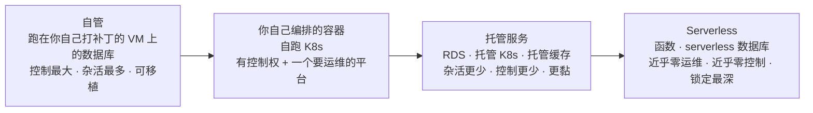
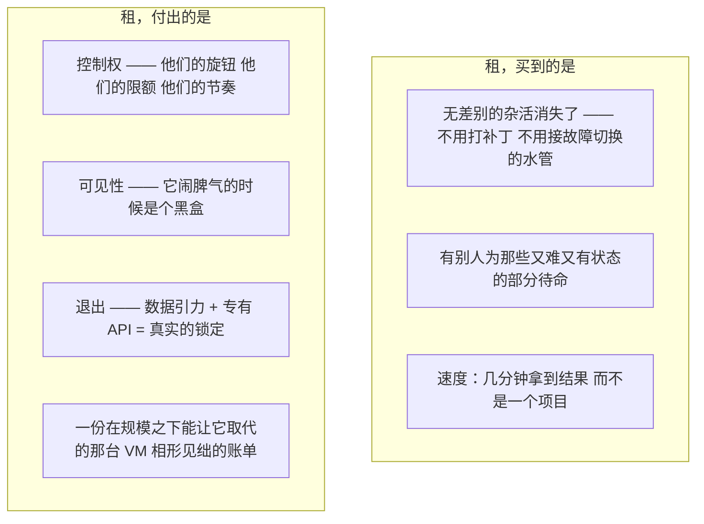
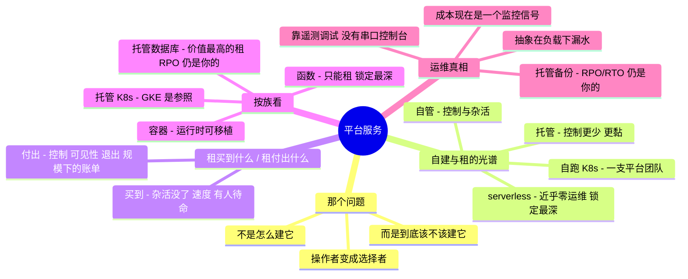

# 05 —— 平台服务

> 🌐 **语言：** [English（默认）](../../../the-stack/05-platform-services.md) · **中文**
>
> ⚠️ 本项目**默认语言为英文**，`the-stack/05-platform-services.md` 是"事实来源"。本页中文是多语言支持的一部分，可能略滞后于英文版；两者不一致时以英文为准。

---

> 下面那几层问的是*我该怎么建它？* 这一层问一个更锋利的问题：*我到底该不该建它？* 容器、
> serverless 和托管数据库，是你停止管理基础设施、开始租用结果的地方 —— 也是系统管理员这份
> 工作悄悄从**操作者**变形成**选择者**的地方。

这是这个栈的顶端，也是这个系列诚实的终点。它下面的一切你都能自己跑；这里的一切你越来越
*不该*自己跑。被考的那项技能不再是"你能不能运维它"—— AI 和那个托管服务都默认你能 —— 而变成
"当你让别人来运维它时，你知不知道**你放弃了什么**，以及这笔交易值不值？"那份判断，是没有哪个
模型、也没有哪个托管服务会递给你的部分。

## 这一层做什么（处处如此，永远如此）

- **编排**容器：调度、自愈、扩缩，并把许多小工作负载连起来（Kubernetes 及其托管形态）。
- 把服务器彻底**抽象掉**：跑代码或处理事件，而没有一台实例要打补丁（serverless / 函数 /
  托管运行时）。
- **租用有状态的结果**：数据库、队列、缓存、搜索 —— 那些又难又有状态的东西，由别人来运维。
- **用控制权换杠杆**：这里的每一个服务都是同一笔交易换了一身戏服 —— 要跑的更少、要调的更少、
  看得见的更少、要离开更难。

## 这一整层关乎的那一个问题：自建还是租

这里的每一个服务都坐在一根从*你什么都跑*到*你什么都不跑*的光谱上，而挑一个点就是这份实际的
工作：

往右：杂活更少、控制更少、锁定更深，而账单的增长方式也不一样。**没有一个正确的点 —— 只有一个
对*这个工作负载和这个团队*而言正确的点。** 高级的动作是把那笔交易大声说出来，而不是默认跟着
潮流走、或者跟着上一份工作用过的东西走。

## 你在其间做交易的那两股力

两栏都要抓住。绝大多数糟糕的平台决策都来自只看见其中一栏 —— 什么都自建的团队淹死在杂活里；
什么都租的团队某天醒来发现被锁死并且账单超标。把两边都说出来，就是这门纪律的全部。

## 七种做法 —— 按服务族拆解

这一层没法像下面那几层那样干净地映射到七个平台上 —— 诚实的切法是**按服务族切，并注明每个平台
落在哪。**（而诚实标记在这里挣够了自己的饭钱：这是这个系列里 🧭 最多的一章。）

### 容器与编排

**自建 / 本地 🔨🧭** —— 一台主机上的 Docker 是 🔨（你构建并发布过镜像，第 03 章）；
**自己跑 Kubernetes** 是 🧭，而且它自成一份"控制面即产品"的承诺 —— etcd、API server、升级，
以及网络/存储的 CNI/CSI 水管全都变成你的了。OpenStack 和 Ceph 的那条教训重演：*自跑的编排是
一支平台团队，不是一个部署目标。*

**托管 Kubernetes 🧭** —— **EKS / AKS / GKE / OKE**：厂商跑控制面，你跑工作负载（以及，视情况，
那些节点）。**GKE 被广泛当成参照** —— Kubernetes 就是 Google 自己的血脉。托管形态拿掉了 etcd
与升级那些杂活，但没有拿掉真正理解 Kubernetes 的必要；一出问题，那层抽象立刻漏水。

### Serverless 与函数

**函数 🧭** —— **Lambda / Azure Functions / Cloud Functions / OCI Functions**：事件驱动的代码、
没有服务器要打补丁、能缩到零、按调用付费。这笔交易在这里最极端 —— 近乎零运维换近乎彻底的锁定
（事件模型、那些触发器，以及周边那些服务全是专有的），加上一个全是日志和 trace 的调试故事，
因为根本没有一台机器可以登进去。自建没有真正的对应物，而这本身就是重点：**这是一项你只能租
的能力。**

### 托管数据库

**托管关系型 🧭（建在 🔨 的地基上）** —— **RDS / Aurora / Azure SQL / Cloud SQL /
Autonomous DB**：你认识的那个引擎（Postgres、MySQL），而备份、故障切换、打补丁和复制由别人
替你运维。这常常是*整层里价值最高的那笔租* —— 数据库是最难跑好的有状态东西，而被拿掉的那些
杂活是真实且危险的杂活。第 04 章那些纪律仍然适用：你仍然必须知道自己的 RPO/RTO，仍然要测恢复，
仍然要明白*他们的*备份，只在你对它的理解所及的范围内才算好。

**托管的其余一切 🧭** —— 队列（SQS/Service Bus/Pub-Sub）、缓存（托管 Redis）、搜索、流。同一笔
交易，范围更窄：租下那个有状态的难点，接受那些专有的边角。

## 对比表

| 服务族 | Self-host | AWS | Azure | GCP | OCI | 那笔交易 |
| --- | --- | --- | --- | --- | --- | --- |
| **容器运行时** | Docker 🔨 | ECR + 运行时 | ACR + 运行时 | Artifact Registry | OCIR | 可移植 —— 这里最不黏的一样 |
| **托管 Kubernetes** | 自跑 K8s 🧭 | EKS | AKS | **GKE**（参照） | OKE | 控制面租来的；工作负载还算可移植 |
| **Serverless 容器** | —— | Fargate / App Runner | Container Apps | Cloud Run | Container Instances | 没有节点要管；被平台塑形 |
| **函数** | ——（只能租） | Lambda | Functions | Cloud Functions | Functions | 便利最大，锁定最深 |
| **托管关系型** | 跑在 VM 上的数据库 🔨 | RDS / Aurora | Azure SQL | Cloud SQL | Autonomous DB | 价值最高的那笔租；RPO/RTO 仍然是你的 |
| **托管缓存 / 队列** | Redis / Rabbit 🔨 | ElastiCache / SQS | Cache / Service Bus | Memorystore / Pub-Sub | Cache / Streaming | 租下那个有状态的难点 |
| **锁定梯度** | 最低 | → | → | → | → | 在每一行内从左向右上升 |

横穿这张表的那个规律：**运行时是可移植的，编排是半可移植的，而你越往函数和专有托管服务里
走，退出成本就越高。** 那道梯度 —— 而不是任何单一功能 —— 才是你实际在选的东西。

## 怎么选 —— 那套高级算式

- **租那些无差别的，自己拥有那些有差别的。** 如果"把它跑好"不是你的竞争优势（对一个数据库
  引擎来说几乎从来都不是），那就租。把你稀缺的运维注意力花在真正让你的服务成为你的那部分上。
- **托管数据库通常是值的。** 被拿掉的那些杂活是这个栈上最危险的杂活（第 04 章那份恐惧），
  而那个引擎标准到锁定还算温和。这是绝大多数团队都应该接下的那笔租。
- **函数是一项能力，**也**是一份承诺。** 用来粘事件、扛尖峰、做小自动化时非常出色；把整个
  系统建在里面就是一个锁定陷阱。用它们干它们独一无二擅长的那件事，睁着眼用。
- **自跑 Kubernetes 需要一支平台团队，句号。** 如果你没有，托管 Kubernetes 或 serverless 容器
  就不是一个妥协 —— 它就是那个正确答案。（和第 01 章那条 OpenStack 警告同一个形状：控制面是
  一个必须有人拥有的产品。）
- **按规模定价，不要按演示定价。** 在演示时免费的按调用和按 GB 计价，在生产量级下能让一台
  预留 VM 相形见绌 —— 而那个交叉点恰好是没人再回头核对的地方。在承诺之前按真实负载给账单
  建模。
- **先掂量退出成本。** 专有 API 加上数据引力（第 04 章）让其中一些实际上是永久的。刻意选的
  话没问题；事后才发现就是个陷阱。

## 运维笔记 —— 什么会把你叫醒（以及什么变了）

- **抽象在负载之下漏水** —— 托管不等于不存在。连接数限额、限流、冷启动、控制面速率限制，以及
  吵闹邻居效应，全都恰好在你最忙的时候浮出水面，而你没法登进那台机器去看。
- **调试从机器搬到了遥测上** —— 没有 SSH，没有串口控制台（第 03 章那份肌肉够不到这儿）。要么
  是日志、trace 和厂商的指标，要么什么都没有。可观测性不再是锦上添花，而变成**唯一**的入口
  —— 这也正是这个仓库接下来要建的东西。
- **你的 RPO/RTO 仍然是你的** —— 一个托管数据库按一份*你*必须理解的计划做备份，以及一次*你*
  必须测过的恢复。"它是托管的"终结掉的数据故事比它拯救的更多；第 04 章那门纪律不会转移给
  厂商。
- **成本现在是一个运维信号** —— 一个失控的 Lambda 循环或一个热分区，是以一份**账单**而不是
  一张 CPU 图把你叫醒的。成本异常告警在这一层变成了真正的监控。
- **版本和废弃走的是厂商的钟，不是你的钟** —— 托管运行时和引擎版本按厂商的日程到期；被强制的
  升级以你定不了的截止时间形式到来。
- **配额是新的容量规划** —— 并发上限、吞吐上限和账号配额，取代了第 01 章那种硬盘与内存条的
  容量。同一门纪律（在撞上之前看见那堵墙），换了单位。

## 管理纪律（你应该做得到什么）

- 把一个给定的工作负载放到**自建-租用光谱**上并为那个点辩护 —— 说出你得到了什么*以及*放弃了
  什么。
- 在**托管 Kubernetes** 上跑一个容器，并且另外讲清楚自跑 K8s 会给你的运维负担加上什么。
- 为某个任务在**函数与一个小型常驻服务**之间做出选择，并从运维、规模下的成本*以及*锁定三方面
  为它辩护 —— 三项都要。
- 拿一个**托管数据库**，仍然说得出它的 RPO/RTO 并证明一次恢复 —— 因为"托管"没有把那份责任
  挪走。
- 给一个服务在**生产规模下的成本**建模，找出租赢过自有（或者反过来）的那个交叉点，并设一个
  **成本异常告警**。
- 在采用任何一个托管服务之前，说出它的**退出成本**。

## AI 辅助的 ramp（平台服务口味）

这一层是这个仓库整套论点展示得最充分的地方：AI 能让你在几天之内**在操作上**胜任这里的任何一个
服务 —— 所以你增添的价值，恰恰是 AI 供不出来的那份判断。

- **让 AI 干机械活，判断留给自己：** *"把这个部署到 Cloud Run 和 Lambda 上"* —— AI 在"怎么做"
  上非常出色。*"现在论证该选哪一个，前提是尖峰流量、一支小团队和一个五年视野"* —— 那一段由
  你来主导，AI 当陪练，不当决策者。
- **把那笔交易逼到明面上：** 让 AI 为它推荐的任何一个托管服务列出**你放弃了什么** —— 控制、
  可见性、退出。它默认推荐方便的那个；你让它给这份方便定价。
- **AI 会烧到你的地方（验得最狠的地方）：** 它会**引用训练年份的限额、配额、冷启动数字和
  按调用/按 GB 的价格**（全都在漂，而且它们恰好是你的架构所倚靠的那些数字 —— 每一个都要
  核过）；它会**低估锁定**，因为训练文本是由卖它的那些厂商写的；而且它会自信地把一份
  **托管备份呈现得好像它免除了你的 RPO/RTO 义务** —— 它没有。抽象越高，你就要验得越狠，
  因为你没法看进去自己抓那个错。

## 诚实边界

这是这个系列里 🧭 最多的一章，而把这一点说出来*本身*就是重点。底下那份 🔨 是真实的，而且是那
份判断赖以立足的地基：在规模上交付过的 Docker 与镜像构建（第 03 章）、在自管基础设施上运维过的
生产关系数据库（第 04 章），以及那份确实属于**测试环境范围**的容器/Kubernetes 工作 —— 就那样
标着，没有被抬成生产平台的所有权。这一章声称的不是"多年在生产里跑 EKS"；它声称的是**在这一层
上做好选择的那份可迁移判断** —— 自建与租的算式、对锁定的觉察、那门在"托管"这个词之后仍然存活
的 RPO/RTO 纪律 —— 外加那套让你在任何一个具体服务上快速具备操作能力的、经过验证的 ramp 方法。
在一个由*租用结果*所定义的层上，知道你换掉了什么才是那项耐久的技能，而它正是这整个仓库所论证
的那一项。

## Guided run（规格）

**这是一次 [guided run](../CONTEXT.md)，不是一个 lab。** 它需要一个真实环境，所以这里没有任何
东西能断言你做过它，而 CI 也跑不了它。那就是全部的区分，而且它不是降级 —— 一次 guided run 够
得到真实的延迟、真实的报错和真实的账单，而那是没有模型做得到的。

**同一个应用，光谱上的两个点。**

1. 把一个小的无状态服务部署到**托管 Kubernetes**（任一厂商）和 **serverless 容器**
   （Cloud Run / App Runner / Container Apps）上 —— 用第 03 章那同一个镜像。
2. 把它的状态放进一个**托管数据库**；说出并测试它的 RPO/RTO（第 04 章那门纪律，托管版）。
3. **那次演练：** 给两套部署在 10 倍和 100 倍流量下的成本建模，找出那个交叉点，并写下那一段
   你愿意对着一位架构师去辩护的自建-与-租建议 —— 那才是这一层真正的交付物。

## 这一章一屏看完

