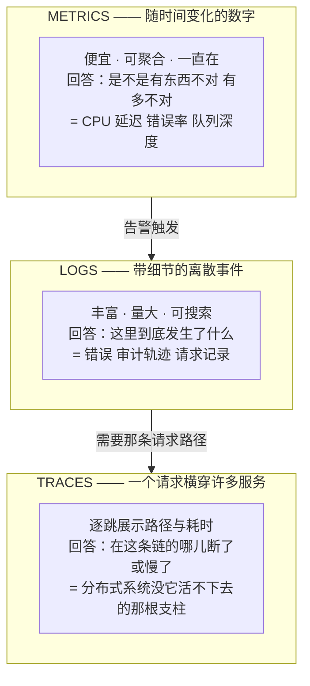
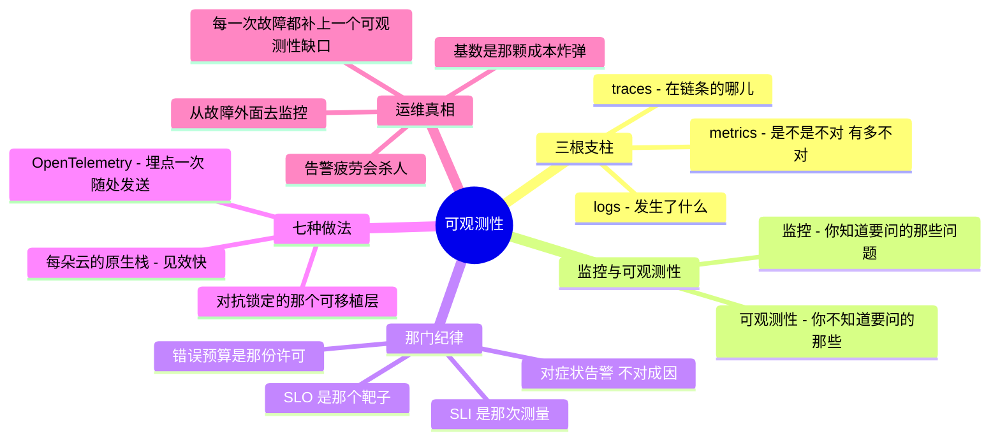

# 06 —— 可观测性

> 🌐 **语言：** [English（默认）](../../../the-stack/06-observability.md) · **中文**
>
> ⚠️ 本项目**默认语言为英文**，`the-stack/06-observability.md` 是"事实来源"。本页中文是多语言支持的一部分，可能略滞后于英文版；两者不一致时以英文为准。

---

> 这趟自底向上的攀爬，终止在你 SSH 不进去的那些平台服务上。这一章讲的是你怎么看见*其中任何
> 一样* —— 就是那个把"它很慢而我不知道为什么"变成一个有答案的问题的层。第 01–05 章建起了这个
> 栈；可观测性是你搞清楚它实际在干什么的方式。

底下每一层都指向这里。第 02 章那道调试阶梯见底于"flow log —— 现在你有得看了"。第 03 章那个串口
控制台是你最后一处还能登进一台机器的地方；第 05 章连那个都拿走了。第 01 章警告过容量到得比需求
晚 —— 可观测性就是你看见那堵墙正在过来的方式。这就是运营模型里那个**"它健康吗，我怎么知道？"**
的面，而在一个现代栈上它不是可选的埋点 —— 它是唯一的入口。

## 这一层做什么（处处如此，永远如此）

- **发信号** —— 把系统正在做什么发出来：metrics、logs、traces、events。
- **收集** —— 把那些信号运到某个地方，让它们活得比产生它们的那台实例更久（机器是牲口；它的
  遥测不能跟着它一起死）。
- **存储与查询** —— 留存下来，并让你能跨时间和跨服务提问。
- **告警** —— 在人注意到**之前**、并且最好在客户注意到之前，把"有东西不对"变成一次呼叫。
- **理解** —— 让你在一次故障当中，快速回答一个你没有预先计划过的问题。最后这一条 ——
  未知的未知 —— 才是把**可观测性**和单纯的**监控**分开的东西。

## 在七个之前，先一个概念：三根支柱

现代可观测性立在三种信号类型上。搞清楚每一种是**用来干什么**的；那些工具只是改名。

那些箭头所编码的工作流：**一个 metric 告诉你它*确实*坏了，一条 log 告诉你*什么*坏了，一条
trace 告诉你在调用链的*哪里*。** 多数团队有前两样，然后在一个分布式系统的故障当中发现，他们
迫切地需要第三样。

## 监控与可观测性（面试官会考的那个区分）

- **监控** —— 盯着*已知的*故障模式：为你预料到的条件（盘满、CPU 高、服务挂了）做仪表盘和
  告警。这是那份 🔨 纪律 —— 被盯了几十年的基础设施信号：UPS、PDU、环境、网络设备、服务器日志。
- **可观测性** —— 能够在*不发布新代码*的前提下向一个系统提出*新的*问题，去解释你没有预料到的
  行为。它是监控加上足够丰富的信号（高基数 metrics、结构化 logs、分布式 traces），好去调试
  那个未知的未知。

一句话：**监控回答那些你知道要问的问题；可观测性让你能问那些你不知道要问的。** 两个都需要 ——
第一个保住灯不灭，第二个带你熬过那场没人预料到的凌晨三点故障。

## 让它真正要紧的那门纪律：SLI / SLO / 错误预算

没有目标的信号，只是你花钱存起来的噪声。把遥测变成决策的那套框架：

- **SLI**（指标）—— 那次*测量*："本周 99.7% 的请求在 200 ms 内成功。"
- **SLO**（目标）—— 那个*靶子*："99.9% 在 200 ms 内成功。"就是"没事"和"该呼叫了"之间的那条线。
- **错误预算** —— 那份*许可*：允许 0.1% 失败。把它花在发布速度上；把它烧穿了，规则就变
  （冻结功能、修可靠性）。它把"要多可靠？"从一场争论变成一个数字。

这里是可观测性不再是一个工具问题、而变成一个**运营**问题的地方 —— 而它也是这一章诚实的边缘
（见下面的边界）：SLO/错误预算这门纪律属于现代 SRE 实践，和那份亲手做过的基础设施信号监控是
两回事。

## 七种做法 —— 原生栈与自带栈

和第 05 章一样，这一层是按**模式**而不是一个平台一条来切的：每个平台都给你一套原生遥测栈，
而那套开源栈（Prometheus/Grafana/OpenTelemetry）骑在它们全部之上。

**自建 🔨🧭** —— 整条流水线由你跑：agent/exporter → **Prometheus**（metrics）→
**Grafana**（仪表盘）→ **Alertmanager**，外加一套 **ELK/Loki** 做日志，以及越来越多的
**OpenTelemetry** collector 喂给一个 tracing 后端（Jaeger/Tempo）。那份 🔨 是真实的 ——
基础设施信号监控和服务端监控运维过多年；而现代的 OTel/Prometheus/tracing 那套组装是 🧭 那条
ramp。留存、基数成本，以及那条真相 —— **你的监控在一次故障当中挂掉，本身就是一次故障** ——
都归你（从别的地方去监控这个监控）。

**vSphere 🔨** —— **vCenter** 的指标和告警、**vROps**（Aria Operations）做容量与健康。成熟、
以基础设施为中心，而且恰好就是那个监控（而不是可观测性）的形状 —— 在"这台主机/datastore/VM
健不健康"上很棒，不是为跨服务追一个请求而建的。

**OpenStack 🧭** —— **Ceilometer/Gnocchi/Aodh**（Telemetry 项目），通常搭配所有人最后都会汇聚
过去的那同一套 Prometheus/Grafana。又一组要你去运维的组件 —— OpenStack 那个反复出现的主题。

**AWS 🧭** —— **CloudWatch**（metrics/logs/alarms）作为原生主干、**X-Ray** 做 tracing、
CloudWatch Logs Insights 做查询。原生、集成很深，而且它按 metric/log/query 计费的方式会在规模
之下让人吃惊 —— 第 04 章那条存储成本教训，套到遥测上。

**Azure 🧭** —— **Azure Monitor** 这把伞：**Application Insights**（APM/traces）、带 **KQL** 的
**Log Analytics**（一门确实很强、值得学的查询语言），指标和告警统一在一起。原生栈里 APM 故事
最完整的那一个。

**GCP 🧭** —— **Cloud Operations**（原 Stackdriver）：Monitoring、Logging 和 **Cloud Trace**
—— 而 Google 的 SRE 血统在这里露了出来，SLO 工具是内建在产品里的，不是外挂上去的。在上面那门
纪律上最有主张的原生栈。

**OCI 🧭** —— **Monitoring**、**Logging** 和 **APM** —— 意料之中的三件套，比前三家的更年轻、
更浅，而且（第 02 章的签名）把遥测运来运去不带出网罚金。

## 对比表

| 关注点 | Self-host 🔨🧭 | vSphere 🔨 | OpenStack 🧭 | AWS 🧭 | Azure 🧭 | GCP 🧭 | OCI 🧭 |
| --- | --- | --- | --- | --- | --- | --- | --- |
| **Metrics** | Prometheus | vCenter / vROps | Gnocchi / Prom | CloudWatch | Azure Monitor | Cloud Monitoring | Monitoring |
| **Logs** | ELK / Loki | vRLI | ELK / Prom | CloudWatch Logs | Log Analytics（**KQL**） | Cloud Logging | Logging |
| **Traces** | Jaeger / Tempo（OTel） | —— | Jaeger（OTel） | X-Ray | App Insights | Cloud Trace | APM |
| **仪表盘** | Grafana | vROps | Grafana | CloudWatch | Azure Monitor / Grafana | Cloud Monitoring | dashboard |
| **告警** | Alertmanager | vCenter alarm | Aodh | CloudWatch Alarms | Monitor alert | alerting policy | alarm |
| **SLO 工具** | 自己建 | —— | 自己建 | 自己建/CloudWatch | 自己建/Monitor | **原生 SLO** | 自己建 |
| **可移植层** | **OpenTelemetry 骑在这些全部之上** → | → | → | → | → | → | → |

最后一行是那个战略动作：**OpenTelemetry 是那条埋点一次、随处发送的厂商中立路径。** 用 OTel
埋点，后端就变成一个可替换的选择而不是一次锁定 —— 这是唯一一根让这一层不至于像第 05 章那些
托管服务一样黏的杠杆。

## 怎么选 —— 原生还是中立，以及那个成本陷阱

- **原生见效最快，OTel 离开最便宜。** 厂商那套栈集成好、零组装；OpenTelemetry 的埋点在它们
  之间都可移植。那个高级模式是：**用 OTel 埋点，用手边原生的东西做可视化** —— 现在拿价值，
  以后留退路。
- **基数是那颗成本炸弹。** 每一个唯一的标签组合都是一条被存下来的序列；一个 user-ID 或
  request-ID 标签能把指标量炸成一份比它所盯的东西还大的账单。这是可观测性特有的陷阱，AI 和
  新人都会踩进去 —— 高基数放进 *logs/traces*，不放进 *metrics*。
- **留存是一个刻意的分层，不是一个默认值。** 热的、可查的、贵的，对上冷的、归档的、便宜的
  —— 就是第 04 章那个存储分层决定，戴了顶遥测的帽子。去定它；不要继承它。
- **对症状告警，不要对成因告警。** 为"用户看到错误 / 延迟越过 SLO"（症状）呼叫，不要为每一次
  CPU 尖峰（成因）呼叫 —— 成因告警是告警疲劳的来源，而告警疲劳就是那次真正的呼叫被漏掉的
  方式。
- **不要从你所监控的那个东西内部去监控它。** 你的可观测性栈需要活过那场它本该解释的故障 ——
  外部视角、独立故障域（第 01 章，最后一次）。

## 运维笔记 —— 什么会把你叫醒（以及什么应该）

- **告警疲劳是那个无声的杀手** —— 告警太多会训练团队忽略它们，而那条要紧的会滚过去。每一条
  告警都应该是可行动且紧急的；两者都不是的话，它是一块仪表盘，不是一次呼叫。
- **没人看的那块仪表盘** —— 建好一次、然后在故障当中从没被打开过的仪表盘是装饰品。那个测试
  是：着火的时候它回答了那个问题吗？
- **基数爆炸** —— 那份悄悄超过基础设施账单的指标账单；那台因为有人按 request ID 打标签而
  OOM 掉的 Prometheus。像第 04 章盯磁盘那样去盯序列数。
- **时钟漂移毁掉相关性** —— 跨机器的 trace 和 log 只有在时钟对齐时才对得上；NTP 纪律是一项
  可观测性前提，而人们都是吃了苦头才发现的。
- **你在凌晨三点找到的那个缺口** —— 缺失的那行日志、没埋点的那个服务、你没发出来的那个指标。
  每一次故障真正的交付物，就是把它暴露出来的那个可观测性缺口补上，好让*下一次*更快。
- **采样藏起那次罕见的失败** —— trace/log 采样省钱，也可能恰好丢掉你需要的那 0.1%。在采样吃掉
  你的证据之前，先搞清楚你的采样策略。

## 你能监控一切吗？

被问得够频繁，值得一个直接的答案：**不能 —— 而理由不是预算，这正是它值得写下来的原因。** 四堵
墙，按你撞上它们的顺序。

**1. 你只能监控那些会发信号的东西。** 一片真实估算面里有很大一部分不发出任何有用的东西，而且
没法被弄成发。在[参考办公室](../the-reference-office.md#why-these-numbers)里那就是那段打不了
补丁的部分 —— 大约二十六台门禁控制器、打印机、会议室系统和电话亭设备，跑着厂商的固件、按厂商的
日程。你能看它答不答 ping。你看不到它在做什么，而且没有哪笔采购能改变这件事。
**第一道限制不在你的工具，而在对面那一端。**

**2. 你只能监控那些你知道存在的东西。** 你数得出来的那片估算面，小于实际存在的那片，而这个
仓库已经从两个方向给这个缺口标了数字：SaaS 那一侧，IT 叫得出名字的服务大约是十个，而
[实际存在的数目不是任何人手上的一个数](../the-reference-office.md#parameters)；以及设备那一侧，
两套系统都能报出九十七，而[三条记录仍然是错的](../../../cross-cutting/labs/asset-reconciliation/)。
监控覆盖率是对着一份清册来度量的。**如果那份清册是一个子集，那个覆盖率百分比就是一句关于这个
子集的陈述**，而它会读作百分之九十八，同时坏掉的那样东西在它之外。

**3. 每一个被监控的东西都要花掉一份凭据。** 一个 agent 或一个集成需要一个身份，而那个身份没有
入职日期、没有主管、也没有最后一天 —— 那是参考办公室在你把恢复密钥算进去之前就有的
[四十个非人身份](../the-reference-office.md#why-these-numbers)。全覆盖意味着一切上面都有一个
agent，也就意味着那套监控系统持有通往一切的凭据。**在全覆盖之下，可观测性平台是你拥有的权限
最高的那套系统**，而几乎没有人把它当成那样来设计。

**4. 覆盖不是检测。** 你可以收集一切、却检测不到任何东西。这里的天花板是人：一条没人去动的
告警就是一块仪表盘，而上面那些*运维笔记*把告警疲劳点名为那个无声的杀手，恰恰是因为这个。在
不加倍响应能力的情况下加倍收集，只是把失败从*我们没看见它*挪成*我们看见了但它滚过去了*，而
后者更糟，因为它看起来像是覆盖。

**所以把目标换掉。** *监控一切*做不到，而且更有用的是，它不可证伪 —— 没有任何一项检验能说你
到了。**知道你没在监控什么**是做得到的、可核查的，而且是凌晨三点真正帮得上忙的那样东西。它把
覆盖率从一个愿景变成一次减法：这是那片被数出来的估算面，这是会报数的部分，而中间这份清单就是
故障会变慢的那一块，是刻意的，而且这里给出了每一行的理由。

那份清单才是那个交付物。它也是这一章里唯一一件熬得过工具更替的产物。

**而恢复受同一道限制管着，这一点值得注意，因为它是从另一个方向走过来的。**
[参考办公室](../the-reference-office.md#parameters)发现，公司信息住在五个类别里，而
**五个里有四个能被赋予一个恢复目标** —— 第五个不能，而写下来的理由不是预算也不是力气：
*你没法为一个你没有盘点过的系统设定恢复目标。* 那就是这一节的第二堵墙，换了身衣服。监控覆盖率
是对着那份清单量的；恢复目标是对着那份清单定的；而两者都不会告诉你那份清单在哪里到头。
**一个 IT 职能所做出的两项最昂贵的保证，都停在同一条边缘上**，所以一片把自己清册做好的估算面，
是一次把两件事同时做好 —— 而这也是一次枯燥的对账练习之所以排在"再买一个平台"前面的唯一理由。

## 管理纪律（你应该做得到什么）

- 用**三根支柱**给一个服务埋点，并说出每一根回答的是什么问题。
- 写一条挂在 **SLO** 上的**基于症状的告警**，并论证为什么它该呼叫、而一次 CPU 尖峰不该。
- 为一个真实服务定义 **SLI/SLO/错误预算**，并解释预算被花完时会发生什么。
- **用一条 trace 调试一个分布式延迟问题** —— 找出那个慢的跳，而不是那个慢的猜测。
- 把**基数和留存**控制住，并读懂一份遥测账单里那些量是从哪来的。
- 用 **OpenTelemetry** 埋点，好让后端一直是一个选择，而不是一个笼子。
- 确保**监控活得过那场故障** —— 外部的、独立的、测过的。

## AI 辅助的 ramp（可观测性口味）

- **从监控翻译到可观测性：** *"我跑过基础设施监控 —— UPS、网络、服务器日志、仪表盘、告警。
  把这些映射到三根支柱上，并让我看看分布式 tracing 加了什么我以前没有的东西。"*
- **让 AI 写查询，SLO 归你：** AI 在 PromQL / KQL / CloudWatch Insights 语法上非常出色 ——
  确实提速。但测量*什么*、以及守住*什么目标*，是判断：*"这是那个服务和它的用户 —— 帮我挑出
  能反映他们实际感受的 SLI。"*
- **AI 会烧到你的地方（验得最狠的地方）：** 它会**写出看起来合理、却微妙地错了的 PromQL/KQL**
  （一个 rate() 窗口偏了、一个百分位在错误的维度上算的 —— 在相信那张图之前，拿已知数据去测那条
  查询）；它会**无视基数成本**，并欢快地建议那些会让你破产的高基数指标标签；它会**引用训练
  年份的留存默认值和每指标价格**；而且它会**过度告警**（默认对成因呼叫）。一条看起来对、却在
  撒谎的查询，比没有查询更糟 —— 拿你已经理解的数据去验它。

## 诚实边界

这里的 🔨 是货真价实且具体的：多年真正运维过的**基础设施监控** —— 在 Varian 为可靠性盯着 UPS、
PDU、环境、网络设备、服务器日志和数据中心信号，外加在字节跳动对那套部署平台做的**服务端监控**
以及**日志/审计数据对账脚本**。那是监控的深度 —— 这一章"已知故障模式"的那一半 —— 而且是亲手
做过的。🧭 是那套**现代可观测性栈与 SRE 实践**：Prometheus/Grafana/OpenTelemetry 的组装、分布式
tracing，尤其是 **SLI/SLO/错误预算工程** —— 用上面那套方法测绘，ramp 过并验证过，不是被声称成
多年的生产 SRE。那套个人 harness 有一份真实的遥测契约（结构化的 stdout-JSON、事件日志），但它
明确是**单人操作的，不是公司级 SLO，也没有 on-call** —— 它出现在哪儿就在哪儿被这样标着。那句
可迁移的声称是：一份很深的监控地基，加上一条快速而诚实的、通向现代可观测性的 ramp —— 而不是
"十年的 SLO 工程"。

## Guided run（规格）

**这是一次 [guided run](../CONTEXT.md)，不是一个 lab。** 它需要一个真实环境，所以这里没有任何
东西能断言你做过它，而 CI 也跑不了它。那就是全部的区分，而且它不是降级 —— 一次 guided run 够
得到真实的延迟、真实的报错和真实的账单，而那是没有模型做得到的。

**看见那个请求，而不只是那台机器。**

1. 对着第 05 章那个小服务把 **Prometheus + Grafana** 立起来；把它的黄金信号（延迟、流量、错误、
   饱和度）做成仪表盘。
2. 用 **OpenTelemetry** 给它埋点，并查看一条横跨至少两跳的 **trace** —— 靠看而不是靠猜，找出
   一个被注入的慢依赖。
3. 定义一个 **SLO** 和一条挂在它上面的**基于症状的告警**；然后故意把错误预算烧穿，看着那条
   告警触发 —— 并证明你的监控是从它所盯的那个东西*外面*报出来的。

## 这一章一屏看完

