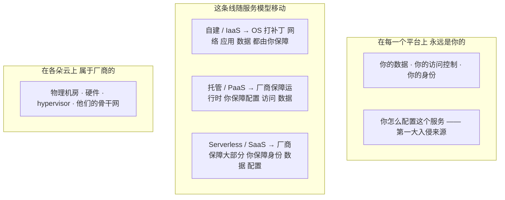
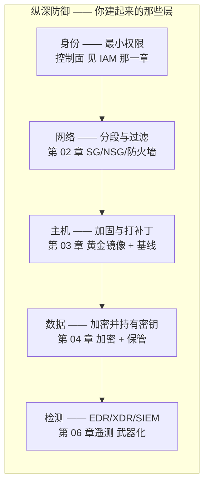
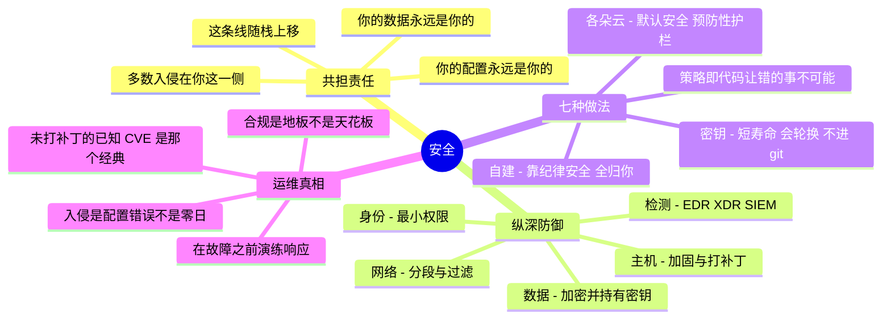

# 07 —— 安全

> 🌐 **语言：** [English（默认）](../../../the-stack/07-security.md) · **中文**
>
> ⚠️ 本项目**默认语言为英文**，`the-stack/07-security.md` 是"事实来源"。本页中文是多语言支持的一部分，可能略滞后于英文版；两者不一致时以英文为准。

---

> 可观测性是那层**看得见**整个栈的层；安全是那层**守护**它的层。两者都是横切的 —— 它们骑在
> 第 01–05 章之上，而不是坐在其中某一层里面。而安全有一个别的层都没有的性质：
> **它是唯一一层有一个智能对手在主动对抗你的设计的层。** 在别的地方，失败是熵；在这里，失败
> 有意图。

安全不是一个你在最后拴上去的组件 —— 它是底下每一层的一个性质，而系统管理员的工作是让每一层都
守得住。这一章跨同样那七个平台测绘这片安全面，并且（像可观测性那样）**按域组织，而不是一个平台
一条**，因为一份好的安全姿态，就是那寥寥几门纪律被施加到你已经建好的这个栈的每一层上。

## 这一层做什么（处处如此，永远如此）

- **划出那条责任线** —— 准确知道平台保障什么、你保障什么。搞错这一条是云上入侵最常见的单一
  成因。
- **把攻击面最小化** —— 更少的开放端口、更少的权限、更少的密钥、更少在跑的东西。你拿掉的每
  一个，都是一个你永远不必去守的。
- **把防御分层** —— 没有哪一项单一控制会被信任到能扛住；纵深防御意味着任何一处的失败不等于
  处处被攻破。
- **保护数据** —— 传输中和静态的加密，以及那些让它有意义的密钥的保管权。
- **检测与响应** —— 假设预防最终会失败，并且在它失败时看得见、动得了。
- **证明它** —— 审计轨迹与合规证据：你演示不出来的安全，是监管者（以及一次事故复盘）不会认账
  的安全。

## 在七个之前，先一个概念：那条共担责任线

每个平台都在**它**保障什么和**你**保障什么之间划一条线，而这条线随着你往栈上走而移动。读错这
条线，就是"云是安全的"变成一次入侵的方式：

你从第 01 章爬到第 05 章，这条线向右移（厂商担得更多）—— 但**你的数据、你的访问控制和你的
配置，在每一个平台上、每一层，都是你的。** 绝大多数云上入侵不是厂商失败；它们是那条线客户
那一侧一个配错的桶、一个过宽的角色，或者一把泄露的密钥。第 04 章的存储和第 01 章的身份纪律
都是安全控制；这一章就是那件事被挑明的地方。

## 那几门纪律（同样寥寥几门，施加到每一层上）

跨全部七个平台的安全，归约成一小组动作，每一个都映射到你已经建好的某一层上：

把那条链读一遍，整个仓库就咔嗒一声拼上了：**安全不是一套新技能 —— 它就是你已经会的那些层，
每一层都被弄得守得住，再在顶上铺一层检测。** 断掉一环，其余的仍然立着；这就是纵深的意义。

- **最小权限** —— 身份那一章的全部游戏，现在被框成一项安全控制：最紧的授予、最窄的范围、最短
  的时间。多数入侵都是通过某个人本不需要的权限提上去的。
- **分段与过滤** —— 第 02 章那些安全组和防火墙，被用来收住爆炸半径：一个被攻陷的 web 层不该
  直接够得到数据库。
- **加固与打补丁** —— 第 03 章那个黄金镜像就是基线（CIS benchmark）被烤进去的地方，而补丁合规
  是那门不光鲜的纪律，它在已知的洞被用之前把它们堵上。未打补丁的已知 CVE 仍然是现实世界里最
  常见的攻陷方式。
- **加密并持有密钥** —— 第 04 章那份加密，重点在*密钥保管*：加密的强度只等于谁控制那把钥匙、
  以及它怎么轮换。
- **检测与响应** —— 第 06 章那份遥测，指向对手：终端上的 EDR/XDR、一套关联信号的 SIEM，以及
  一份在预防失败时（不是"如果"）用的响应计划。

## 七种做法 —— 按安全域

**云姿态与护栏 🧭** —— 每朵云都有一条原生的安全主干：**AWS**（Security Hub、GuardDuty、
IAM Access Analyzer、Config）、**Azure**（Defender for Cloud、Sentinel 作 SIEM）、
**GCP**（Security Command Center）、**OCI**（Cloud Guard、Security Zones）。处处同一个形状：
一个标出错误配置的姿态扫描器、一个威胁检测服务，以及那些**阻止**坏配置而不只是对它告警的策略
护栏。策略即代码（SCP、Azure Policy、Org Policy、OPA）是它成熟的形态 —— 那种让错的事情变得
不可能、而不仅仅是可见的护栏。

**自建 / vSphere 🔨🧭** —— 那份姿态由你自己建：加固基线（CIS）、一条打补丁流水线、防火墙上的
网络分段，以及一套由你部署并运维的 EDR/SIEM。这里的 🔨 是真实的 —— 在一整片机队上部署并迁移过
终端防护、在规模上做过全盘加密登记、把设备安全配置与网络准入合规检查当成每日运维在跑。没有哪个
厂商护栏会替你抓错；这门纪律完全是你的。

**密钥管理 🧭（建在 🔨 的直觉上）** —— 身份那一章那条"机器上不放密钥"的规则，被落到实处：
自建的 **HashiCorp Vault**，或者那些原生管理器（AWS Secrets Manager / Parameter Store、
Azure Key Vault、GCP Secret Manager、OCI Vault）。这门纪律与平台无关 —— 短寿命、会轮换、
绝不进 git、运行时注入 —— 而它和"用平台托管的工作负载身份取代静态密钥"背后是同一个直觉。

**终端与 EDR 🔨🧭** —— 那个机队安全域：EDR/XDR agent（Defender for Endpoint、SentinelOne、
CrowdStrike）的部署、迁移，以及从它们的控制台做运维；磁盘加密；由 MDM 强制执行的合规基线。
这是这个系列里亲手支撑最深的那个安全域。

**合规框架 🧭** —— SOC 2、ISO 27001、FedRAMP、PCI-DSS、HIPAA：同样那些技术控制（加密、访问
复审、审计日志、变更管理），映射到某个具名框架的证据要求上。技术活是你熟悉的运维纪律；框架
是铺在它上面的那套词汇和那份审计师的清单。

## 对比表

| 域 | Self-host 🔨 | vSphere 🔨 | AWS 🧭 | Azure 🧭 | GCP 🧭 | OCI 🧭 |
| --- | --- | --- | --- | --- | --- | --- |
| **姿态 / CSPM** | 自己建（CIS 扫描） | 自己建 | Security Hub / Config | Defender for Cloud | Security Command Center | Cloud Guard |
| **威胁检测** | 你自己跑的 IDS + SIEM | 你自己跑 | GuardDuty | Defender | SCC threat | Cloud Guard |
| **SIEM** | 你自己跑的 ELK/Splunk | 你自己跑 | Security Lake + 合作伙伴 | **Sentinel** | Chronicle | 合作伙伴 |
| **策略即代码护栏** | OPA / 你的流水线 | —— | SCP | Azure Policy | Org Policy | Security Zones |
| **密钥** | Vault 🔨🧭 | Vault | Secrets Manager | Key Vault | Secret Manager | Vault（OCI） |
| **密钥管理** | 你的 KMS / HSM | 你的 KMS | KMS | Key Vault | Cloud KMS | KMS |
| **终端 EDR** | Defender/SentinelOne 🔨 | 同上 | （agent） | Defender | （agent） | （agent） |
| **加密默认值** | 你去打开它 | 你去打开它 | 常常默认开 | 常常默认开 | **默认开** | 默认开 |

那个规律：**各朵云越来越把安全的那个选项做成默认、把护栏做成预防性的**（加密默认开、策略即
代码挡住坏配置），而自建把这里面每一样都变成一件你必须明确去选、去建、去维护的事。那个差别
—— 默认安全对上纪律安全 —— 才是云与本地之间真正的安全故事。

## 怎么选 —— 安全的力气花在哪

- **先修配置，再买工具。** 那些入侵是配置错误，不是稀奇的零日。一个 CSPM 扫描器加上照着它去
  动手的纪律，胜过再买一个检测产品。先把基本功做对。
- **预防 > 检测 > 响应，但三样都要留预算。** 一个让错的事情不可能发生的护栏（策略即代码），
  比一条告诉你它已经发生了的告警更值钱 —— 但仍然要假设预防会失败，并且照样为检测和一份响应
  计划出钱。
- **托管挪动那条线，但抹不掉你的活。** 沿着第 05 章那条自建-与-租的光谱每往上一步，就把更多
  安全交给厂商 —— *而你的数据、身份和配置仍然稳稳是你的。*"它是托管的"保障的是那个运行时，
  不是你的桶策略。
- **合规是地板，不是天花板。** 一纸框架认证证明的是审计当天达到了某条基线；它和"是安全的"不是
  一回事。把 SOC 2 / FedRAMP 当作最低门槛和一份结构化的证据，而不是目标。
- **加密密钥的保管才是那个真正的决定。** 厂商托管的密钥很省事；客户托管的密钥（CMK/BYOK）是
  控制权，也是负担。谁能解密、谁能轮换、轮换时什么会坏 —— 这个问题活得比那个勾选框长。

## 运维笔记 —— 什么会把你叫醒（以及什么会把你攻破）

- **那个配错的存储桶** —— 该私有的时候是公开的，那次典范式的云上入侵。第 04 章的存储加上这一章
  的访问纪律；一次 CSPM 扫描抓得到它，*前提是*有人去读那条发现。
- **git 里泄露的那把凭据** —— 一把被提交进仓库的密钥，被扫描器（他们的，还有攻击者的）找到。
  这就是为什么"机器上/代码里不放密钥"是一条规则，不是一个偏好。CI 里的密钥扫描是基本盘。
- **那个未打补丁的已知 CVE** —— 不是什么精妙的攻击；是一个公开的 exploit 打在一个你还没推的
  补丁上。补丁合规很枯燥，而它就是这份工作。
- **过宽的 IAM，在它被滥用的那一天** —— 那个常驻的管理员角色、那条通配符策略、那个什么都能干的
  服务账号。最小权限之所以是一项安全控制，恰恰因为权限就是攻击者用来提权的东西。
- **告警疲劳，安全版** —— 第 06 章那个杀手，赌注更高：一套 SIEM 叫得太凶，以至于那次真正的入侵
  滚了过去。要么是调过的、可行动的检测，要么 SOC 就淹了。
- **那份没人演练过的响应计划** —— 一份在故障*当中*才第一次被执行的事故响应 runbook，是一个
  希望。在你需要它之前先做桌面推演。

## 管理纪律（你应该做得到什么）

- 对一个给定服务说出那条**共担责任线**，并点名哪些是你的。
- 跑一次**姿态扫描**（CSPM 或 CIS 基线），读那些发现，并修掉最高风险的那几条 —— 而不只是生成
  那份报告。
- 为一个工作负载设计**纵深防御**：身份 + 网络 + 主机 + 数据 + 检测，并解释在它前面那层失败时，
  每一层各自收住了什么。
- **正确地管理一个密钥**：短寿命、会轮换、在代码之外、运行时注入 —— 并解释为什么一个 env 文件
  里的静态密钥不是这回事。
- 通过黄金镜像强制执行一条**基线**（CIS），并证明某台主机是合规的。
- 把一组技术控制映射到某个**具名合规框架**的证据要求上。
- 走一遍**事故响应**流程：检测 → 遏制 → 根除 → 恢复 → 学习。

## AI 辅助的 ramp（安全口味）

安全是使用 AI 时赌注最高的地方，因为这里的产物是对抗性的，而一个"看起来合理但错了"的答案是一个
漏洞，不是一个 bug。

- **从你所强制执行的东西翻译：** *"我跑 FDE、补丁合规、EDR 和设备合规检查。把这些映射到 AWS
  的安全服务上，并让我看看一个 CSPM 护栏比我的手工基线多了什么。"*
- **生成得紧，然后验得更紧：** *"恰好只做这件事的那条最小权限策略"* —— 然后手动核对每一条
  权限，因为 AI 起草时偏宽松，而它顺手塞进去的一个通配符就是一片攻击面。
- **用 AI 攻击你自己的设计：** *"这是我的架构 —— 你会从哪儿打它，缺了哪一层纵深防御？"*
  AI 是一个有用的红队陪练，恰恰因为它读过那些攻击模式。
- **AI 会烧到你的地方（验得最狠的地方）：** 它会**发明不存在的 IAM action、策略语法和安全服务
  功能**；它在自己搭的任何东西里都**默认偏宽松**（0.0.0.0/0、通配符 action）；它会**说出训练
  年份的合规要求**（框架在更新 —— 对着当前的控制集去核）；而且它会**自信地宣布一份配置是
  "安全的"，而它只是能用而已。** 在安全里，一次幻觉的代价是一次入侵 —— 每一条生成出来的控制
  都要对着当前文档核过，并且最好用一次拒绝访问的探测去测过。

## 诚实边界

这一章里的 🔨 是在机队规模上做过的运维安全，而且很具体：在一大片终端机队上登记过的
**全盘加密**、当作每日运维的**补丁合规**、例行在跑的**设备安全配置与网络准入合规检查**
（对现实世界的故障模式有很宽的视野）、在整片机队上部署并迁移过的**终端防护**
（Defender for Endpoint → SentinelOne，两个控制台都运维过），以及在一套严格的多人审批、最小
权限模型里做过的**访问治理**。那是货真价实的"强制执行并运维"的安全深度。🧭 是那层现代云安全
与安全项目：**CSPM、SIEM 运维、策略即代码护栏、像 Vault 这样的密钥平台、零信任架构，以及具名
框架合规（SOC 2 / FedRAMP / ISO 27001）** —— 用上面那套方法测绘，ramp 过并验证过，不是被声称成
一段安全工程师或 GRC 审计师的职业生涯。那句可迁移的声称是：一份亲手做过的运维安全地基（终端、
加密、补丁、合规检查、最小权限），加上一条快速而诚实的、通向云安全姿态与安全项目工作的 ramp
—— 而不是"十年的安全工程师"。

## Guided run（规格）

**这是一次 [guided run](../CONTEXT.md)，不是一个 lab。** 它需要一个真实环境，所以这里没有任何
东西能断言你做过它，而 CI 也跑不了它。那就是全部的区分，而且它不是降级 —— 一次 guided run 够
得到真实的延迟、真实的报错和真实的账单，而那是没有模型做得到的。

**打破那个安全默认值，然后自己抓住自己。**

1. 在一朵云上，故意把第 04 章那个存储桶配错成公开的，然后跑那个原生的**姿态扫描器**
   （Security Hub / Defender / SCC / Cloud Guard），并在那些发现里找到你自己犯的错。
2. 写一条**策略即代码护栏**（SCP / Azure Policy / Org Policy），让那种错误配置变得*不可能*，
   并证明它挡住了那次坏的变更。
3. **那次演练：** 把一个假密钥提交进仓库，看着密钥扫描抓到它，然后把它做对 —— 密钥放进一个
   管理器、运行时注入、不进 git —— 并轮换它一次来证明保管权。

## 往深里走 —— 越过系统管理员那条防御基线

这一章是从**操作者**的座位上看的安全：那条共担责任线、纵深防御、加固、EDR/CSPM/SIEM、密钥，
以及一个系统管理员每天在跑的那些纪律。那就是这个仓库诚实的范围 —— 每一个基础设施工程师都要
担起的那条防御基线，而不是一条安全**专家**的赛道。

如果你想**转进**安全去做专精 —— 威胁狩猎、恶意软件分析、数字取证、红队、映射到
**MITRE ATT&CK / D3FEND** 和 **NIST CSF** 的检测工程 —— 那是一门比这一章所声称的更深、也不
一样的手艺。有一个值得知道的大型外部库：

- **[Anthropic-Cybersecurity-Skills](https://github.com/mukul975/Anthropic-Cybersecurity-Skills)**
  （作者 Mahipal Jangra，Apache-2.0）—— 约 800 个从业者工作流安全 skill，横跨约 29 个域，用的是
  同样的 [agent-skill](../../../.claude/skills/) 格式，并映射到 MITRE ATT&CK / D3FEND / ATLAS
  和 NIST 框架。
  > ⚠️ *社区项目 —— 尽管名字如此，**它并非 Anthropic 的关联项目，也未获其背书**。其中很大一部分
  > 是攻击性/双用途的技艺：**仅限授权、合法使用。***

对那门 🔨/🧭 纪律的诚实表述是：那个库是一套**专家的**工具集，不是系统管理员的基线 —— 如果你
引用或使用它，就把那条边界担起来。**这个**仓库覆盖的，是一个基础设施操作者真正要负责、并且
能凭经验讲得出来的那份安全。

## 每个平台把这一层放在哪里

这一章负责对比；平台目录负责运维。七个中的任何一个，结构在它的 `architecture.md` 里，day-2 的活
在它的 `operations.md` 里：[AWS](../platforms/aws/architecture.md) · [Azure](../platforms/azure/architecture.md) · [GCP](../platforms/gcp/architecture.md) · [OCI](../platforms/oci/architecture.md) · [vSphere](../platforms/vsphere/architecture.md) · [OpenStack](../platforms/openstack/architecture.md) · [self-host](../platforms/self-host/architecture.md) —— 同样七个在 [`platforms/`](../platforms/) 下面还有
operations 和 automation 两篇配套。

## 这一章一屏看完

