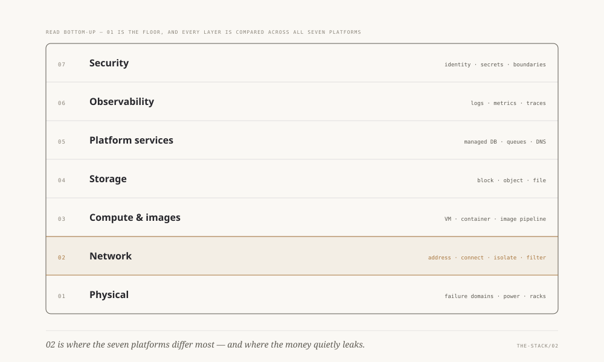
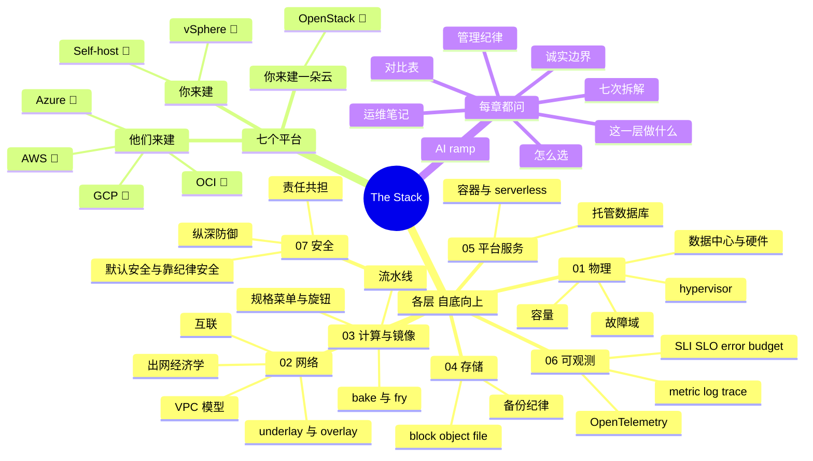

# The Stack —— 同一副栈，七种做法

> 🌐 **语言：** [English（默认）](../../../the-stack/README.md) · **中文**
>
> ⚠️ 本项目**默认语言为英文**，`the-stack/README.md` 是"事实来源"。本页中文是多语言支持的一部分，可能略滞后于英文版；两者不一致时以英文为准。

---

> 这个仓库的第三条轴。`platforms/` 一次读一朵云；`cross-cutting/` 横跨它们读一个主题。
> 这个系列读的是**栈本身，一层一层地** —— 而且在**每一层**上对比**建造同一样东西的七种
> 做法**：AWS、Azure、Google Cloud、Oracle Cloud、VMware vSphere、OpenStack，以及自建
> 裸金属。

<picture>
  <source media="(prefers-color-scheme: dark)" srcset="../../../site/assets/diagrams/stack-layers.dark.svg">
  
</picture>

*这副栈的形状，以及它唯一的那个焦点层。[系列一屏看完](#系列一屏看完)下面那张 mindmap 是另
一个视图 —— 讲的是每一层里面装着什么，而不是各层怎么叠。*

## 为什么按层优先

多数云材料是**从控制台往下**写的 —— 这是一个服务、这是一个按钮、这是一个定价页。这个系列
是**从机房往上**写的，因为那正是作者实际学会它的方向：上架服务器、PXE 引导机队、在碰云控制
台很久之前就在跑 vSphere 和裸金属 Linux。

自底向上地读这副栈，买到两样控制台给不了你的东西：

1. **你知道那层抽象藏了什么。** 一个 AZ 不再是一个下拉选项，而变回它本来的样子 —— 某个人
   的一栋楼，背后是某个人的故障域、供电和备件。每一个"奇怪的"云行为（实例回收、容量报错、
   维护事件）在你拥有过它渗漏出来的那一层之后，都是显然的。
2. **对比成为可能。** 平台之间差别最大的地方在**某一层内部**，而营销恰恰藏起那些差别。把
   同一层的七种实现并排放在一起，权衡 —— 以及选型逻辑 —— 就自己掉出来了。

## 七个，分三个家族

| 家族 | 平台 | 硬件归谁 | 诚实标记 |
| --- | --- | --- | --- |
| **你来建** | [自建裸金属](../platforms/self-host) · VMware [vSphere](../platforms/vsphere) | 你 | 🔨 亲手做过的深度 |
| **你来建一朵云** | [OpenStack](../platforms/openstack) | 你（外加一个你现在得运维的控制面） | 🧭 ramp（与 KVM 邻接的 🔨） |
| **他们来建** | [AWS](../platforms/aws/) · [Azure](../platforms/azure/) · [GCP](../platforms/gcp/) · [OCI](../platforms/oci/) | 提供方 | 🧭 ramp |

**七个全部**现在都有一个专门的 **[`platforms/`](../platforms/)** 模块（"端到端运维
这一个"的视图）；这个系列是"逐层对比它们"的视图。

🔨/🧭 标记遵循仓库的规则（[`WHY.md`](../WHY.md)）：亲手做过的深度只在它确实存在的地方声称；
其余一切都标为 ramp —— 以 AI 为副驾完成并验证过，而这本身就是这个仓库所教的方法。

## 系列一屏看完

## 固定骨架（每一章，同样的顺序）

1. **这一层做什么** —— 与平台无关的模型，一页。
2. **建造它的七种做法** —— 每个平台的简短拆解。
3. **对比表** —— 这一章的核心产物。
4. **怎么选** —— 真正的选型因素：规模经济、团队、合规、退出成本。
5. **运维笔记** —— 凌晨三点真正会把你叫醒的东西，按家族分。
6. **管理纪律** —— 你应该**做得到**什么，可核对。
7. **AI 辅助 ramp** —— 怎么快速学会这一层，以及 AI 在哪里会烧到你。
8. **诚实边界** —— 这一章里哪些是 🔨 深度、哪些是 🧭 ramp。

## 各章

| 章 | 状态 |
| --- | --- |
| [`01-physical.md`](01-physical.md) —— 物理层：数据中心、硬件、hypervisor、故障域 | ✅ |
| [`02-network.md`](02-network.md) —— underlay/overlay、VPC 模型、出网计费表、调试阶梯 | ✅ |
| [`03-compute-and-images.md`](03-compute-and-images.md) —— 计算形态、镜像流水线、bake vs fry、处处 cloud-init | ✅ |
| [`04-storage.md`](04-storage.md) —— block/file/object、SAN/NAS 的现实 vs 云盘、备份的恐惧 | ✅ |
| [`05-platform-services.md`](05-platform-services.md) —— 容器、serverless、托管数据库、自建与租用的那条线 | ✅ |
| [`06-observability.md`](06-observability.md) —— 三支柱、监控 vs 可观测、SLI/SLO/error budget、OTel | ✅ |
| [`07-security.md`](07-security.md) —— 责任共担、纵深防御、CSPM/EDR/SIEM/secret、合规 | ✅ |

**这副栈已经完整：自底向上五层（01–05），加上骑在它们全部之上的那两个横切层 —— 可观测
（06，你怎么**看见**它）和安全（07，你怎么**守住**它）。** 01–05 章是按它实际被运维的方向
往上爬的 —— 硬件在先，租来的结果在后。第 07 章合上这个闭环，展示安全并不是一套新的技能：
它就是你已经建好的每一层，被做成可防守的，再在上面铺一层检测。

## Labs

每一章都以两种方式结尾。一次**[引导式走查](../CONTEXT.md)**需要一个真实环境 ——
在两朵云上跑 Terraform、把一个 Packer 镜像在两处启动起来、Prometheus 加一条 trace、把一个真实的
bucket 弄坏然后被一个真实的扫描器逮住 —— 而这里没有任何东西能断言你做过其中一次，这正是它不是一个
lab、而这个目录也永远不会装它的原因。一个 **lab** 是那次引导式走查底下的那个推理失败，被挖出来、
并被做成会自我断言的东西。

[`labs/`](labs) 里有**五个**，除第 05 章之外每一章一个，全都是纯 Python、零成本的：
[故障域](labs/01-failure-domains) · [首次匹配对最长前缀](labs/02-first-match-and-longest-prefix) ·
[一个镜像不是一个镜像](labs/03-one-image-is-not-one-image) ·
[备份不是快照](labs/04-backup-not-snapshot) ·
[没有数据不等于健康](labs/06-no-data-is-not-healthy) ·
[检测是一个窗口](labs/07-detection-is-a-window)。每一个都叙述它的步骤、检查它自己的教训，并且只有
在教训成立时才 `0` 退出 —— 所以它们每一个都同时可以当作一次 CI 检查。多数还带一个把那个*错误*模型
实现出来的破坏开关，因为一个不会失败的自我验证器毫无价值。

中文镜像在每一章稳定之后落到 [`docs/zh/`](../) 里。
