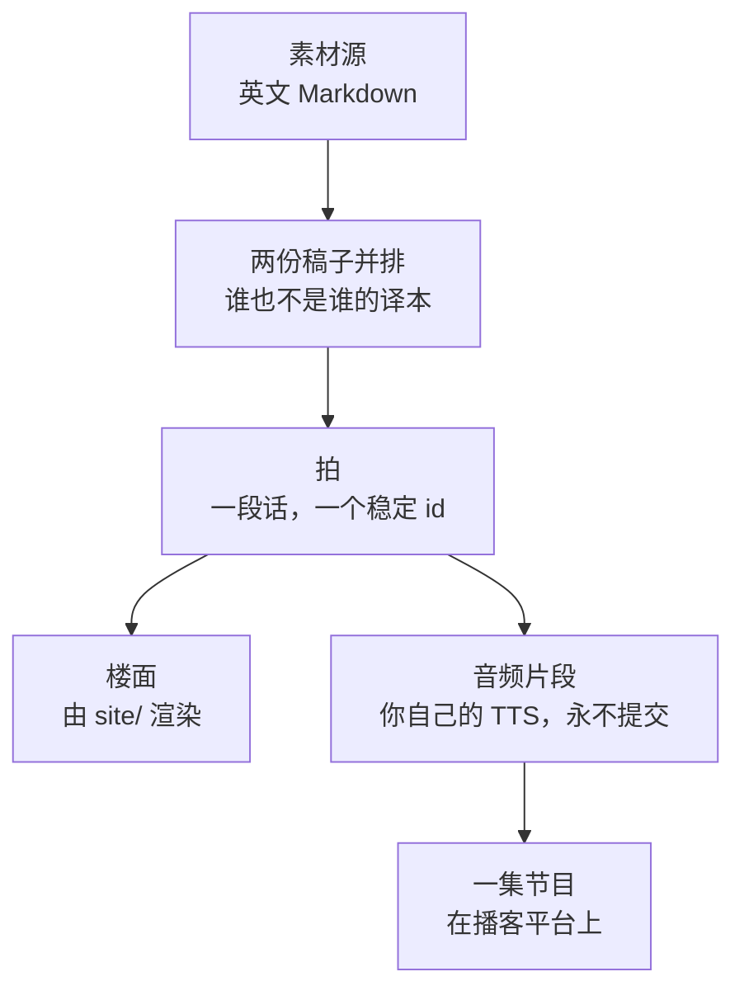

# 走读 —— 把参考办公室讲出来

> 一条**横穿其他轴的路线**，理由和 [`build-out/`](../../../build-out/README.md) 一样：
> 它不教任何这个仓库尚未持有的页面。它加的是**顺序**和**语域** —— 一间一百人的办公室，
> 慢慢走一遍，用这个仓库其余部分刻意不用的那种声音。
> 决定：[`docs/adr/0009`](../../adr/0009-the-walkthrough-ships-its-script-not-its-audio.md)

> 🌐 **语言：** [English（默认）](../../../walkthrough/README.md) · 中文

**写来被语音合成引擎念出、被人听见的 —— 绝不是用来读的。** 这不是文体偏好，它决定了
整个格式：没有表格、没有行内链接、没有「如上表所示」、没有括号插入语，数字写成人会
念出来的样子。一份 `walkthrough/*.md` 里只有会被念出来的字，别的一个字都没有。

## 一份稿子会产出什么



**这里不提交任何音频。** 你用自己的凭证生成，或者去听已发布的那一集。仓库里的一份录音
只服务一种声音、一种语言、一种语速，对其他所有人都是错的。

## 三样产物，每一样都必须独立成立

因为三种受众各缺一样东西，而第三种缺的那样决定的最多：

| 受众 | 拿到的 | 缺的 |
|---|---|---|
| GitHub 上的读者 | 稿子 | 画面、声音 |
| [`site/`](../../../site/README.md) 里的读者 | 稿子、楼面 | 声音，除非自己接了 TTS |
| 播客听众 | 声音 | **任何屏幕** |

最后一行就是为什么诚信标记必须**被说出来**。画在楼面上的 🔨 或 🧭 徽章，对听众而言并不
存在，所以叙述者用故事自己的声音、在立足点切换的那一刻把界说出来。走读 01 里它切换一次
—— 从作者真的做过的分段与地址规划，切到
[`the-reference-office.md`](../../../the-reference-office.md) 已经标注为「来自厂商公开
指南、而非跟一套部署一起生活过」的那段无线算术。

## 拍

一拍是**一段话、一次 TTS 调用、一个音频片段、一个楼面状态**。它由一条带稳定 id 的 HTML
注释分界，而 GitHub、viewer 和语音引擎三方都会忽略它：

```markdown
<!-- beat: coverage-not-capacity -->
```

**id 是名字，绝不是序号。** 往一份一百多拍的稿子里插一段话，后面每一个序号都会平移 ——
而且是静默平移，因为一个指向错误拍的楼面，看起来和指向正确拍的楼面一模一样。对齐单位
是拍，永远不是时间戳，所以任何引擎、任何音色、任何语言都不用配置就能用：见
[`docs/adr/0012`](../../adr/0012-alignment-is-by-beat-not-by-timestamp.md)。

## 两种语言，而且谁也不是译本

`<walkthrough>.en.md` 和 `<walkthrough>.zh.md` 并排放在那个目录里，**不在**
[`docs/zh/`](../README.md) 之下。那个目录的含义是*镜像*，而这两份不是镜像：翻译保住的是
事实、毁掉的是节奏，而节奏恰恰是一份口播稿唯一的组成部分。

每一份稿子在自己的语感上都是正本。两份声明同一组 `sources:`，两者不一致时，靠读那份
它们共同负责的源来裁决 —— 绝不是靠偏袒其中一份。「英文是事实来源」这条全仓库规则在别处
一字未改；在这里它被收窄回它本来在做的那件事，也就是裁决**事实**。理由在
[`docs/adr/0010`](../../adr/0010-a-spoken-script-has-no-translation.md)。

## 楼面

viewer 渲染一间可交互的二维办公室，走读在它上面播放 —— 可平移、可缩放、物体可点击，
还有一群**本身就是无线负载**而不是装饰的人。缩放是语义的，分三档：远处看到场人数与
覆盖，中间看放置，近处看从接入口到上联的那条路径。

按钮同时指定缩放倍数和镜头对象：**楼面**框住整块 plate，**机柜**框住 IDF，
**房间**保留当前的围合空间（或你刚点击的设备所在的围合空间）。当前没有这样的空间时，
**房间**默认打开大会议室。选择档位或上班日后，调整窗口大小仍保留这次浏览选择；
**上一拍**、**下一拍** 和 **播放**会把镜头交还给走读的当前拍。

它是一个**视图**。它渲染 Markdown 已经陈述的数字，自己不计算任何东西；一个物体的面板
显示的是判断和要指定什么 —— 绝不是设备配置，这个仓库不持有配置。这条线，以及守住它的
代价，在
[`docs/adr/0011`](../../adr/0011-the-floor-renders-the-reference-office-and-may-not-compute-it.md)。

场景数据放在稿子旁边，不在 `site/` 下，因为一个只有 viewer 持有的事实，在 viewer 被删掉
的那一刻就丢了。它分成两半：

| | |
| --- | --- |
| **plate** —— `reference-office.plate.json` | 这层楼**是什么**：有哪些空间、谁挨着谁、怎么从一处走到另一处。各篇走读共享，因为走读 02 是同一间办公室。 |
| **走读** —— `<walkthrough>.floor.json` | 这一篇**对它说了什么**：物体面板和拍级镜头。走读 01 里那些面板是几何的五倍大，而且每一个字都在讲网络。 |

**plate 停在拓扑为止** —— 没有走廊宽度、没有疏散距离、没有卫生间数量、不声称它能通过
任何审查（[ADR-0014](../../adr/0014-the-plate-stops-at-topology.md)）。它确实声称的
那部分是被检查过的：一个 headless 的 Godot 工程从电梯厅出发沿动线走这层楼，报告任何
它到不了的地方。**它第一次跑就抓到两扇开向虚空的门。**

## 自己生成音频

一拍就是一次调用。按拍注释切开，把每一段话发给你手上任何一个引擎，然后按顺序播放 ——
楼面在每一段结束时推进，不需要任何时间数据。这个仓库里没有任何东西依赖你选了哪个引擎。

## 加一篇走读

1. **按「它讲什么」来定，不是按「它是第几步」。** 这里的顺序是它自己的：第一篇走读横跨两条
   轴加根目录上的三份文档。这不是 `build-out/` 加一层配音，编号也不对应。
2. **先列 `sources:`。** 每一个说出口的事实都必须能追到其中一份。如果某句话需要一个所有
   源都没有的事实，那这个事实要**先写进材料里** —— 走读绝不是某样东西第一次出现的地方。
3. **写拍、给拍命名、并且让文件保持可念。** 生成任何东西之前先朗读一遍；你换气的地方
   就是该切的地方。
4. **第二种语言要独立成稿**，不是第一份的翻译。
5. **发布即冻结。** 记下 `published:` 和各个源的指纹。此后稿子不再编辑 —— 发现错误就在
   文档里记一条勘误，因为录音无法修改，而悄悄改掉会让它一直对听众说谎。

## 状态

| # | 走读 | EN | 中文 | 楼面 | 已发布 |
|---|---|---|---|---|---|
| 01 | [网络](../../../walkthrough/01-the-network.en.md) —— 一层楼、四个网段、和天花板上的那几个天线 | ✅ | [✅](../../../walkthrough/01-the-network.zh.md) | ✅ 20 个物体 | ⏳ |

**106 拍，念出来约二十分钟。** 它取材于
[`the-reference-office.md`](../../../the-reference-office.md)、
[`site-network-design.md`](../../../cross-cutting/site-network-design.md) 和
[`build-out/05-network.md`](../../../build-out/05-network.md) —— 横跨两条轴加根目录的
三份文档，这也是编号不跟着 `build-out/` 走的原因。立足点切换一次，说出口，就在 🔨 的
分段与地址规划让位给 🧭 的无线算术那个地方。

后续的走读，在真的有什么值得说出口的时候才写，一次一篇，像
[`toolbox/`](../../../toolbox/README.md) 那样生长。没有目标篇数。

## 检查一篇

```bash
python3 walkthrough/build-walkthrough.py            # 拍、锚点、格式、冻结
python3 tools/floor/build-tiles.py --check          # 楼面的精灵图集
python3 tools/floor/prove-topology.py --check       # plate 还是被证明过的吗？
```

这里没有任何东西是生成的 —— 稿子**就是** TTS 的输入，所以不存在会落后的派生物。检查器
守的是：两种语言携带相同的拍且顺序相同、楼面只 cue 真实存在的拍、每一个物体锚点都是某个
真实文件里的真实标题、以及口播正文里没有任何语音引擎会念成噪音或静默丢弃的东西。

`--freeze <walkthrough>` 会盖上 `published:` 和每个源的指纹。此后某个源被改动，会被报告成
*这段录音正在描述一份已经移动过的文档* —— 那就是该重录的信号，而稿子本身不再编辑。
