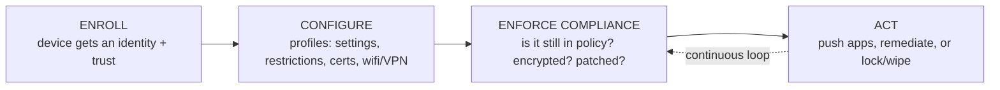
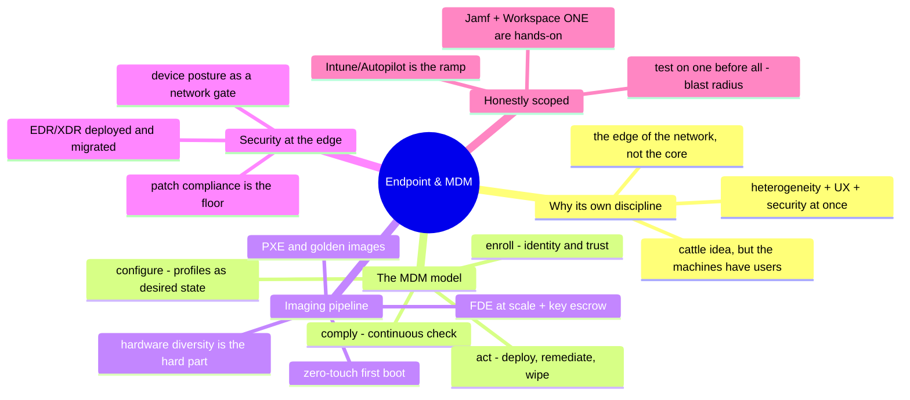

# Endpoint & MDM

> One of the densest demand clusters in the whole signal, and the platform folders
> don't cover it: managing the fleet of laptops and phones that people actually
> work on. This is a first-class track because it's a first-class job — and it's
> the one written from the deepest hands-on experience in this repo.

Endpoint management is the discipline of taking thousands of heterogeneous devices
— macOS, Windows, iOS, Android — and making them consistent, secure, and
self-provisioning without a human touching each one. It's the same
*register → image → personalize → maintain* pipeline as [`the-stack/03`](../the-stack/03-compute-and-images.md),
pointed at the endpoint instead of the server, and it's **✋ hands-on depth**: a
multi-OS deployment platform built from scratch and operated at ~100k-device scale.

## Why endpoint is its own discipline (not "IT support")

The clouds taught the industry to treat servers as cattle — imaged from code,
replaced not repaired. Endpoint is that same idea dragged onto the hardest possible
terrain: **the machines have users on them.** A server you can drain and reimage at
3 a.m.; a laptop belongs to someone mid-deadline, in a different country, on their
home wifi, who will not tolerate downtime and *will* file a ticket. Doing this well
at scale is a real engineering problem — heterogeneity, user experience, security,
and lifecycle all at once — and it's exactly the operate-and-automate lane this repo
is built around, just pointed at the edge of the network instead of the core.

## The MDM/UEM model — infrastructure-as-code for devices

Strip the vendor names and every MDM/UEM platform does the same four things — the
endpoint's version of the [operating model](../00-the-operating-model.md):

- **Enroll** — the device acquires a managed identity and a trust relationship
  (the endpoint analog of [identity's](../cross-cutting/identity-iam.md) "register a
  scoped principal"). This is where user-owned (BYOD) and company-owned diverge.
- **Configure** — declarative **profiles** describe desired state: settings,
  restrictions, certificates, wifi/VPN payloads. Same instinct as
  [IaC](../cross-cutting/iac-and-config.md): describe the end state, let the platform
  converge the device to it.
- **Enforce compliance** — is the device *still* what policy requires: encrypted,
  patched, unrooted, on a supported OS? Compliance is a continuous check, not a
  one-time gate.
- **Act** — distribute software, remediate drift, and in the worst case lock or wipe
  a lost device. The security payoff of all the structure above.

"Two industry-standard MDMs" is a real job requirement, and it's met here for real:
**Jamf** (macOS) and **VMware Workspace ONE / UEM** operated hands-on across the
fleet — the same model, two vendor dialects, which is the whole transferability
point.

## Imaging & provisioning — the pipeline, edge edition

This is [`the-stack/03`](../the-stack/03-compute-and-images.md)'s
*boot → image → personalize* pipeline, and the hardest version of it, because the
targets are diverse consumer-ish hardware and the output has to be usable by a
non-technical human on day one:

- **PXE and custom images** — network boot, a golden image tuned per hardware
  generation, and the truth the clouds hide: your image must boot on every laptop
  model you own, with the right drivers, every time.
- **Zero-touch first boot** — the goal is a device that arrives, connects, and
  configures itself with no IT hands — Apple's Automated Device Enrollment, Windows
  Autopilot, and their equivalents are this idea productized.
- **The warehouse reality** — imaging hundreds of machines a day, re-imaging
  returns, and **full-disk encryption enrolled at scale** (encryption isn't a
  checkbox at fleet volume — it's key escrow, recovery-key custody, and a process).
- **Hardware diversity and drivers** — the leak point the cloud never shows you, and
  the one that makes endpoint imaging genuinely hard: same image, twelve laptop
  models, one that won't take the wifi driver.

## Software & patch lifecycle

The unglamorous half that is most of the job:

- **Application packaging** — turning an installer into a policy-deployable package
  (the endpoint cousin of [`the-stack/03`](../the-stack/03-compute-and-images.md)'s
  RPM/deb work), primarily `.deb` and `.pkg`/MSI-style payloads.
- **Targeted distribution** — pushing software to the *right* devices: by user,
  group, region, country, or compliance state, through the UEM — not a single
  broadcast.
- **Patch compliance** — the daily discipline that closes [`the-stack/07`](../the-stack/07-security.md)'s
  "unpatched known CVE," measured and enforced, not hoped for. Patch compliance *is*
  endpoint security's floor.

## Endpoint security

The security chapter, at the edge — the slice of [`the-stack/07`](../the-stack/07-security.md)
that lives on the device:

- **EDR/XDR** — endpoint detection and response deployed and operated: Microsoft
  **Defender for Endpoint** deployed and **migrated to SentinelOne**, both
  management consoles operated hands-on (honestly scoped: this is the *endpoint*
  Defender, not Defender for Office 365).
- **Compliance as a gate** — device security-configuration checks and
  secure-network-admission (入网) checks, run routinely — a device proves it's
  healthy before it's trusted on the network. This is [zero-trust](../the-stack/07-security.md)'s
  device-posture leg, done in practice.
- **Encryption and the recovery story** — FDE enrolled, with the key-escrow and
  recovery process that makes it survivable when someone forgets a password (losing
  the key is losing the laptop — [`the-stack/04`](../the-stack/04-storage.md)'s
  custody lesson, on 3,000 devices).

## BYOD — the hardest trust problem

Personal devices touching company data is where identity, security, and privacy
collide:

- **Enrollment and separation** — iOS/Android enrollment that manages the *work* on
  a device without owning the *device*, keeping personal and corporate data apart.
- **The identity question** — BYOD is where cloud SSO choices get made; it's the
  concrete pressure behind the [identity chapter](../cross-cutting/identity-iam.md)'s
  in-house-vs-Okta-vs-Google decision.
- **The tunnel plumbing** — UAG / per-app VPN so a personal phone reaches an
  internal app safely.
- **Scoped honestly** — enrollment and platform lifecycle are ✋; deep iOS/Android
  *fleet compliance-profile mastery* is a step beyond, and labeled as such rather
  than claimed.

## Where Intune is a ramp

The Microsoft endpoint stack — **Intune, Autopilot, Configuration Manager** — is
🧗, not ✋. But the model above is exactly transferable: Intune is
*enroll → configure → comply → act* in Microsoft's dialect, with Autopilot as its
zero-touch first boot. The discipline is hands-on; the specific console is a lookup
— which is the whole thesis of this repo applied to one more tool.

## The AI-assisted ramp (endpoint flavor)

- **Translate from what you run:** *"I operate Jamf and Workspace ONE — map my
  enrollment/profile/compliance/app-deploy workflow onto Intune, and flag where the
  model genuinely differs from what I know."* The diff is short; that's the point.
- **Draft the packaging and scripts, verify on a test device:** AI writes
  deployment scripts and profile payloads quickly and gets plist/XML/JSON structure
  subtly wrong — every profile gets tested on a real enrolled device before it
  touches the fleet, because a bad compliance policy can lock out thousands.
- **Where AI burns you (verify hardest):** it **invents MDM payload keys and cmdlets**
  that don't exist; it **conflates the MDM vendors' capabilities** (what Jamf does
  natively vs. what Workspace ONE needs a script for); and it **underestimates blast
  radius** — a mistaken wipe or lockout policy is not a rollback, it's an incident on
  every device it reached. Test on one before you trust it on all.

## Honest boundaries

✋ **hands-on depth — the core lane.** Designed and ran a multi-OS (Win/macOS/Linux)
PXE and image-based deployment platform adopted org-wide, cumulatively provisioning
100k+ devices; **Jamf + Workspace ONE / UEM** operated hands-on (owning North
America testing/maintenance on the Jamf side); application packaging, targeted
distribution, patch compliance, full-disk encryption at scale, and **EDR
deploy/migration** (Defender for Endpoint → SentinelOne, both consoles) all daily
work. 🧗 where marked and nowhere else: **Intune/Autopilot/ConfigMgr** (different
console, same discipline) and deep **iOS/Android fleet compliance-profile
engineering** (enrollment and lifecycle are ✋; fleet-profile mastery is the ramp).
This is the track that most directly *is* the job the whole repo is aimed at.

## Lab (🚧 planned — spec)

**Enroll, configure, comply — end to end, on one device.** Using a free-tier or
trial MDM and a spare device or VM:

1. **Enroll** a device and push a **configuration profile** (a wifi payload or a
   restriction) — watch desired state converge, the IaC-for-devices moment.
2. Write a **compliance policy** (must be encrypted / must be on a supported OS) and
   deliberately fail it, then watch the device fall out of compliance and a
   remediation act fire.
3. **The drill:** scope an app deployment to a group, prove it lands only on the
   targeted device, and — the endpoint lesson — write down the blast radius of the
   policy you just wrote *before* you'd run it on 3,000 machines.

## The chapter on one screen

