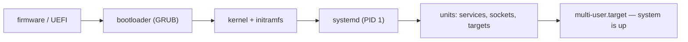
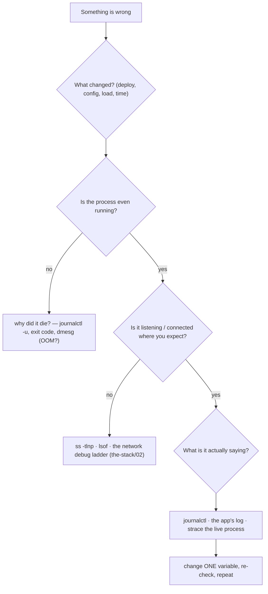
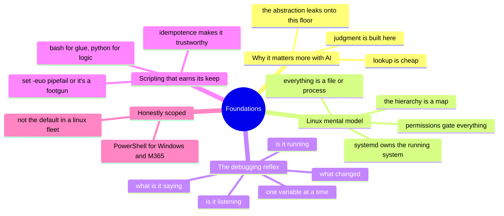

# Foundations — Linux & scripting

> The floor under every role in this repo. Every job posting that inspired this
> project *assumes* this and never lists it — which is exactly why it's worth
> making explicit. You don't get to the clouds without standing on this.

The roadmap leads with cross-cutting skills because they transfer; this module is
the thing *underneath* even those — the Linux command line and the scripting that
turns "I did it once by hand" into "it runs itself now." It's the most-requested,
least-taught skill in the whole demand signal, precisely because everyone assumes
you already have it. And it's the one place in this repo where the honesty marker is
unqualified: **✋ hands-on depth** — RHCE-level Linux operated at fleet scale, Python
and Bash as daily tools for over a decade. Everything else here is written looking
*up* from this floor.

## Why the floor matters more in the AI era, not less

[`WHY.md`](../WHY.md) argues that AI makes tool-lookup cheap and pushes the test up
to judgment. Foundations is where that judgment is *built*. You can prompt your way
to a `kubectl` command or a Terraform block, but you can't prompt your way to the
instinct that says *"that output is lying to me"* — that comes from years of reading
what Linux actually tells you. The clouds are abstractions over this layer; when the
abstraction leaks (and [`the-stack`](../the-stack/) is a catalog of where it does),
you fall back onto exactly these skills. AI raises the ceiling; foundations is the
floor, and the floor is load-bearing.

## The Linux mental model

You don't memorize Linux; you internalize a few models that make commands
*guessable*. Four carry most of the weight.

**Everything is a file (or a process).** Devices, sockets, kernel state, running
programs — Linux exposes almost everything as a path you can read or write. A disk
is `/dev/sda`; a process's open files are under `/proc/<pid>/fd`; a kernel tunable is
a file in `/proc/sys`. Once you believe this, "how do I inspect X?" almost always
has the answer *"find the file."*

**The filesystem hierarchy is a map, not a junk drawer.** `/etc` is configuration,
`/var` is state that changes (logs, spools, databases), `/usr` is installed
software, `/proc` and `/sys` are live windows into the kernel, `/home` is people.
When something breaks, the hierarchy tells you *where to look* before you've run a
single diagnostic — a full `/var` is a different problem than a full `/home`, and the
path says which.

**Permissions and identity gate everything.** User, group, other; read, write,
execute; plus ownership. Most "it won't run" and "permission denied" incidents are
this model, and the fix is reading it correctly, not `chmod 777` (the reflex that
turns a permission bug into a security bug). This is where the
[identity chapter](../cross-cutting/identity-iam.md)'s least-privilege discipline
starts — on a single box, with a single file.

**systemd owns the running system.** The boot path (firmware → bootloader → kernel →
init → systemd → units), services as units, `systemctl` to control them, and the
journal as the record. Knowing that a service is a *unit* with dependencies,
ordering, and a logged lifecycle turns "the service won't start" from a mystery into
a query.



This is the same boot path [`the-stack/01`](../the-stack/01-physical.md) debugs from
a serial console and [`the-stack/03`](../the-stack/03-compute-and-images.md)
personalizes with cloud-init — foundations is where you learn to read it.

## The debugging reflex — the actual differentiator

Tool knowledge is cheap now; the reflex for *finding out what's wrong* is not, and
it's the thing [`WHY.md`](../WHY.md) says survives. It's a ladder, climbed the same
way every time, on a laptop or a server or a container:



The tools that climb it, and the question each answers:

- **`ps` / `top` / `htop`** — is it running, and what's it doing to the CPU/memory?
- **`ss -tlnp`** (the modern `netstat`) — what's listening, and who owns the socket?
- **`lsof`** — what files/sockets does this process have open? (the "everything is a
  file" model, weaponized for debugging)
- **`strace`** — what system calls is it actually making, and which one is failing?
  This is the tool that ends arguments: the program isn't "hanging," it's blocked in
  a specific `read()` on a specific fd.
- **`journalctl` / `dmesg`** — what did systemd and the kernel record? (the OOM
  killer, the segfault, the failed mount all live here)
- **`df` / `du` / `free`** — the boring killers: a full disk or exhausted memory
  masquerading as an application bug.

The discipline underneath the tools is the part no model supplies: **change one
variable at a time and read what the system tells you.** Thrashing — changing three
things and re-running — is how you turn a ten-minute fix into a two-hour one and
never learn what actually broke. This reflex is why the network chapter has a debug
*ladder* and not a debug *checklist*: the order is the skill.

## Scripting that earns its keep

Automation is where a sysadmin stops *scaling tickets* and starts *scaling systems*.
Two languages carry it, and knowing the line between them is half the skill.

**Bash for glue, Python for logic.** Bash is unbeatable for stringing commands
together, piping, and quick fleet one-liners — and it becomes a liability the moment
there's real branching, data structures, or error handling. The rule of thumb: if
it has more than a couple of `if`s or touches structured data (JSON, CSV, an API),
it wants to be Python. Fighting Bash into doing Python's job is a classic
time-sink.

**Idempotence is the property that makes a script trustworthy.** A script you can
run twice safely — that converges to the same state instead of doubling it — is
infrastructure; one that breaks or duplicates on a second run is a liability you
have to babysit. "Create the user *if it doesn't exist*," "append the line *only if
absent*," "make the directory *without failing if it's there*." This is the same
idea Ansible ([`cross-cutting/iac-and-config.md`](../cross-cutting/iac-and-config.md))
builds its whole model on — foundations is where you learn to want it.

**Error handling separates a tool from a footgun.** A Bash script without
`set -euo pipefail` sails past its own failures and does damage with a half-set
variable; the difference between a script that stops on the first error and one that
`rm -rf "$DIR/"` with an empty `$DIR` is one line at the top. Fail fast, fail loud,
and make the failure legible to the next person (often you, at 3 a.m.).

```bash
#!/usr/bin/env bash
set -euo pipefail        # exit on error, on unset var, and on a failed pipe stage

target="${1:?usage: setup.sh <dir>}"   # fail with a message if $1 is missing
mkdir -p "$target"                     # idempotent: fine if it already exists
```

Four lines, and every one of them is a lesson: a shebang that finds bash on any
system, the safety flags, an argument that refuses to be empty, and an idempotent
operation. This is the shape of a script you can trust in a pipeline.

## PowerShell, honestly scoped

PowerShell is real and worth knowing — object-passing pipelines are genuinely nicer
than Bash's text streams for Windows administration — but scoped honestly here: it's
the tool for **Windows Server maintenance and the M365/Entra admin surface**
([`cross-cutting/saas-admin.md`](../cross-cutting/saas-admin.md)), not the primary
automation language in a mostly-Linux, mostly-macOS fleet. The concepts (pipelines,
objects, cmdlets) transfer from the Bash/Python foundation fast; the point is
knowing *when* it's the right tool — administering Windows and Microsoft's cloud —
rather than reaching for it by default.

## The AI-assisted ramp (foundations flavor)

Foundations is the layer where AI is *most* immediately useful and *most* dangerous
to trust — because a shell command runs as you, right now, with your privileges.

- **Draft one-liners, then read them before they run:** AI is excellent at
  *"the `find` command to delete files older than 30 days in these dirs"* — and one
  wrong flag is `rm` in the wrong place. Read every generated command as if you're
  about to run it as root, because you are.
- **Explain, don't just produce:** *"walk me through what this `awk`/`sed`/`jq` line
  does, field by field"* turns AI from a code vending machine into a tutor, and
  builds the model instead of renting it.
- **Use it to accelerate the reflex, not replace it:** *"here's the `strace` tail
  and the journal — what's the failing syscall pointing at?"* is a great use; *"just
  tell me why my server is slow"* with no evidence is how you get a confident,
  plausible, wrong answer.
- **Where AI burns you (verify hardest):** it **invents flags and options** that
  don't exist on your version of a tool (GNU vs. BSD `sed` alone is a minefield);
  it **assumes a distro/shell** and hands you commands that don't match yours; and
  it will **confidently offer a destructive command** without the guardrail you'd
  add by instinct. On this layer, the cost of a hallucination is measured in deleted
  files, so the verification habit isn't optional — it's the whole reason
  foundations has to be *yours* and not the model's.

## Honest boundaries

✋ **hands-on depth — the most direct in the repo.** Linux (RHEL/CentOS/Ubuntu)
operated at fleet scale, RHCE certified, with Python and Bash as everyday automation
tools across ten-plus years — provisioning pipelines, audit-reconciliation scripts,
and the cross-stack troubleshooting the [`the-stack`](../the-stack/) chapters draw
on. PowerShell is real but scoped (Windows Server maintenance, M365/Entra admin) and
labeled that way, not inflated into a primary language. There's no 🧗 in this module
because there's nothing here that's a ramp — this is the ground the ramps are
launched from.

## Lab (✅ runnable — [`labs/idempotence-drill/`](labs/idempotence-drill/))

**Feel the idempotence lesson in bash** — this one runs, no cloud, no root:

```bash
bash foundations/labs/idempotence-drill/idempotence_drill.sh
```

It builds a **fragile** script (unconditional append, bare `mkdir`, no `set -e`) and a
**safe** one (`set -euo pipefail`, a required-arg guard, `mkdir -p`, check-then-append),
runs each repeatedly, and checks the difference: the fragile one *doubles its work* and
*masks its own failure with exit 0*; the safe one *converges* and *fails fast* on a
missing argument. Exit `0` means the lessons held. It's a natural companion to the
runnable [backup drill](../the-stack/labs/04-backup-not-snapshot/) and
[failure-domains lab](../the-stack/labs/01-failure-domains/) — all pure-local, all
proving a discipline rather than a fact.

**The reflex half** (planned): a setup script breaks *one* thing (a service on a full
disk, a flipped permission, a process wedged on a missing file); climb the debugging
ladder with only `systemctl`/`journalctl`/`ss`/`lsof`/`strace`/`df` until you name the
failing syscall — no guessing, one variable at a time.

## The chapter on one screen


