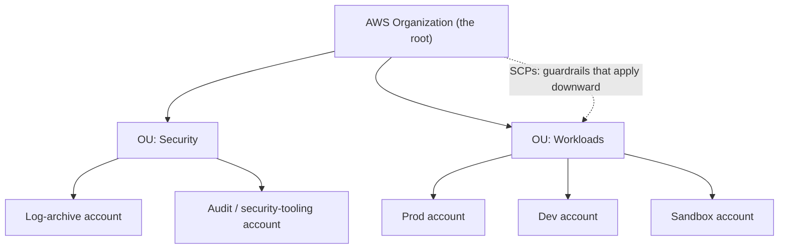
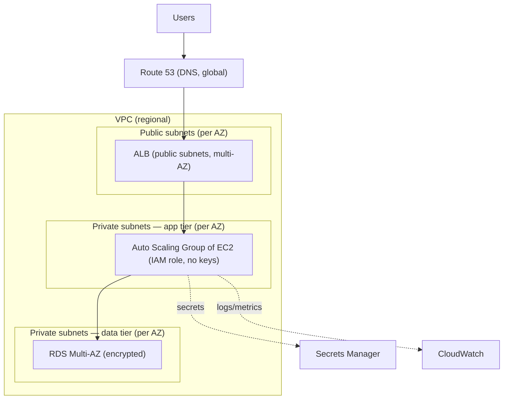

# AWS — Understanding the Architecture

> The [README](README.md) mapped AWS onto the seven surfaces — *what the services
> are.* This note is the layer up: *how AWS is structured*, so you design **with**
> its architecture instead of fighting it. Get the account model, the region/AZ
> geography, and the global-vs-regional split right, and most "why doesn't this
> work" questions answer themselves.

AWS isn't a pile of 200 services; it's a small set of organizing principles with
services hung off them. Learn the principles and the services become lookups. Four
carry the weight.

## 1. The account & organization model — the blast-radius unit

The most under-taught, most consequential AWS decision isn't a service — it's how
you carve up **accounts**. An AWS account is a hard security and billing boundary:
resources in one account can't touch another's except through explicit,
cross-account grants. That makes the account the natural unit of **blast radius**.

- **One account is not the answer at scale.** Prod and dev in the same account means
  a dev mistake can reach prod; a multi-account layout with **AWS Organizations**
  gives you real isolation, per-account billing, and **Service Control Policies
  (SCPs)** — org-wide guardrails that make whole categories of action *impossible*
  below a point (policy-as-code from [`the-stack/07`](../../the-stack/07-security.md)).
- **The mental model:** an account is a room with a lock; the Organization is the
  building; SCPs are the building rules. Design the rooms before you furnish them.
- This is where the [`cost` chapter](../../cross-cutting/cost.md)'s tagging and the
  [`security` chapter](../../the-stack/07-security.md)'s separation both land — the
  account boundary is the strongest control AWS gives you, and it's a design-time
  decision that's painful to change later.

## 2. Regions & Availability Zones — the geography you design against

This is [`the-stack/01`](../../the-stack/01-physical.md)'s failure-domain model in
AWS's words:

- A **Region** (e.g. `us-east-1`) is a geographic area — pick it for latency to
  users, data-residency/compliance, and which services are available (not all
  services are in all regions).
- An **Availability Zone (AZ)** is one or more discrete data centers with
  independent power, cooling, and networking. **Multi-AZ is how you survive a
  building failure;** placing both replicas of anything in one AZ is the mistake the
  whole failure-domain model exists to prevent.
- **Regions are isolated by design** — cross-region is your explicit choice, and it
  costs egress ([`the-stack/02`](../../the-stack/02-network.md)). You don't
  accidentally span regions.

The design instinct: **spread across AZs for availability, choose regions
deliberately, and treat cross-region as a priced decision, not a default.**

## 3. Global vs. regional services — the classic gotcha

Some AWS services live *in* a region; some are *global*. Confusing the two is a
top source of "why can't I find my resource" and broken automation:

| Scope | Services | Implication |
| --- | --- | --- |
| **Global** | IAM, Route 53, CloudFront, WAF (partly), Organizations | One namespace across all regions; an IAM role exists everywhere. |
| **Regional** | EC2, VPC, S3 (bucket namespace is global, data is regional), RDS, Lambda, most others | Exists only in the region you made it; you must iterate regions to inventory. |

This is exactly the gotcha the [inventory lab](labs/01-scoped-identity-inventory/)
teaches by making you iterate regions for EC2/VPCs while IAM/S3-listing are
one-shot. When AI writes you an inventory script that forgets to loop regions
([`ai-ramp.md`](ai-ramp.md)), this is the knowledge that catches it.

## 4. The shared responsibility model — where your job starts

AWS secures **of** the cloud; you secure **in** it — and the line moves with the
service ([`the-stack/07`](../../the-stack/07-security.md)):

- **AWS's side:** the physical DCs, hardware, hypervisor, and the managed-service
  internals.
- **Your side, always:** your data, your IAM, your network config, your encryption
  choices — and the overwhelming majority of breaches live here (a public S3 bucket,
  an over-broad role), not in AWS failing.
- The higher up the stack you go (EC2 → RDS → Lambda), the more AWS handles — but
  your data and access controls never stop being yours.

## The Well-Architected Framework — the design checklist

AWS's own mental model for "is this a good architecture" — six pillars worth knowing
as a review lens, not memorizing as trivia:

- **Operational excellence** — can you run and improve it? (the [operations](operations.md) doc)
- **Security** — least privilege, encryption, auditability ([`the-stack/07`](../../the-stack/07-security.md)).
- **Reliability** — multi-AZ, failure recovery, tested backups ([`the-stack/04`](../../the-stack/04-storage.md)).
- **Performance efficiency** — right-sized, right-service-for-the-job.
- **Cost optimization** — commitment matched to workload ([`cost`](../../cross-cutting/cost.md)).
- **Sustainability** — efficient use of what you provision.

Used well, it's the set of questions to ask *before* shipping an architecture — the
same "what would break, what's exposed, what's this costing" instinct this repo
teaches, packaged as AWS's own checklist.

## A reference architecture — how the surfaces compose

The canonical three-tier web app, and where each surface shows up:

Every surface is present: **identity** (instance roles, no baked keys),
**networking** (VPC, public/private subnets across AZs, security groups),
**compute** (ASG), **storage** (RDS Multi-AZ, encrypted), **observability**
(CloudWatch), **security** (Secrets Manager, encryption, tiered subnets). Read this
diagram and you can see the whole [skill map](skills-map.md) doing one job.

## Honest boundaries

🧗 **ramp, honestly.** This is the transferable architecture model — account/org
design, failure domains, shared responsibility — mapped onto AWS and verified
against its docs, not a claim of years architecting production AWS estates. The
*instincts* underneath (blast-radius thinking, multi-AZ placement, least privilege,
"design the rooms before you furnish them") are ✋ — they come from real
infrastructure and fleet work ([`the-stack`](../../the-stack/) draws on it); the
AWS-specific service composition is the ramp. The claim is a sound architectural
model plus a fast, verifiable ramp onto AWS's version of it — the repo's honest
position, applied to architecture.
