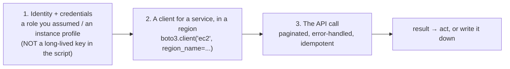
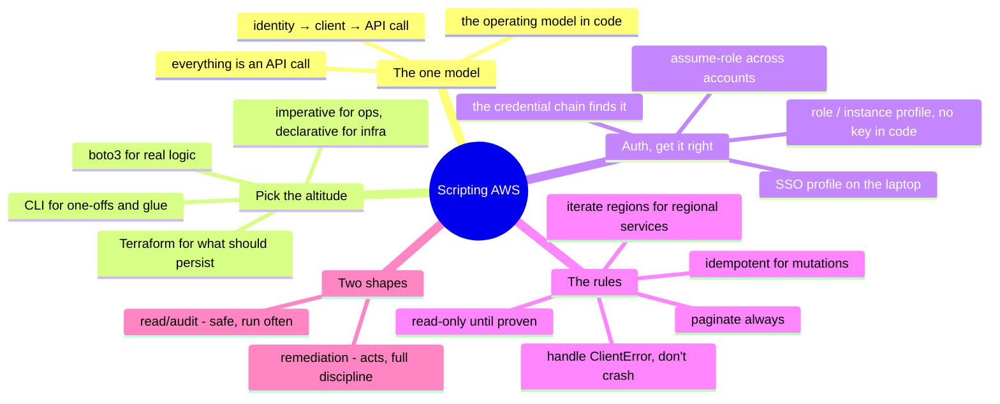

# AWS — Scripting the API (managing & operating from code)

> [`architecture`](architecture.md) is how AWS is structured; [`operations`](operations.md)
> is what running it looks like. This note is the *how*: **driving AWS through its
> API from code** — the concrete craft behind move #3 of the
> [operating model](../../00-the-operating-model.md), "drive the platform through its
> API and codify it." The console is for looking; scripts and IaC are for doing.

Everything in AWS is an API call. The console, the CLI, Terraform, the SDKs — all of
them are wrappers over the same HTTPS API. Once you internalize that, "how do I
automate X?" stops being a search for a feature and becomes *"which API call, with
which identity, handling which failure modes?"* This is the layer where a
scripting-and-Linux background ([`foundations/`](../../foundations/)) turns directly
into cloud operations skill.

## The one model: everything is `(identity) → (client) → (API call)`

Every script you write against AWS is the [operating model](../../00-the-operating-model.md)'s
three moves, in code:

Get those three right — a **scoped identity**, a **region-aware client**, and a
**properly-called API** — and you can automate anything AWS exposes. The
[inventory lab](labs/01-scoped-identity-inventory/) is exactly this model, read-only:
worth reading `inventory.py` alongside this note, because it demonstrates every rule
below in working code.

## The tooling ladder — pick the right altitude

Four ways to drive the API, from quick to durable. Reaching for the wrong altitude
is a common mistake:

| Tool | What it is | Reach for it when |
| --- | --- | --- |
| **AWS CLI** (`aws ...`) | the API as shell commands | one-off checks, quick fixes, glue in a Bash script, exploring |
| **boto3 / SDK** (Python) | the API as a library | real logic — loops, branching, data shaping, an actual tool |
| **CloudShell / scripts** | CLI+SDK in a managed shell | ad-hoc ops without local creds |
| **Terraform / IaC** | *declarative* desired state | anything that should be reproducible, reviewed, and destroyable ([`iac`](../../cross-cutting/iac-and-config.md)) |

The dividing line that matters: **the CLI and SDK are *imperative* — "make this call
now"; Terraform is *declarative* — "this is what should exist."** Use imperative
scripts for *operations* (inventory, remediation, one-off queries, orchestration);
use IaC for *provisioning* (the infrastructure that should persist). Building
persistent infrastructure with a boto3 `create_*` script instead of Terraform is
fighting the grain — you've just written a worse Terraform with no state file.

## Authentication — get this right or nothing else matters

The single most important rule, and the one AI and tutorials get wrong most often:
**never put a long-lived access key in a script.** The credential chain, in order of
preference:

- **On an EC2 instance / in Lambda / in a container** → an **IAM role** attached to
  the compute (an instance profile / task role). The SDK picks it up automatically;
  there is *no key anywhere*. This is the correct default for anything running in
  AWS.
- **On your laptop** → a **named profile** (`AWS_PROFILE`) backed by SSO / IAM
  Identity Center or `aws sso login` — short-lived, auto-refreshed session
  credentials.
- **For cross-account automation** → **assume-role** via STS: your identity assumes a
  scoped role in the target account, getting temporary credentials that expire.
- **Never** → an access key ID + secret hardcoded in the script, in a repo, or in an
  env file you might commit. That's the leaked-key incident from
  [`operations.md`](operations.md), pre-committed.

`boto3.Session()` walks this chain for you — which is *why* the inventory script just
calls `boto3.Session()` and never mentions a key. Let the chain do its job; the
absence of a credential in your code is the point.

## The rules that separate a working script from a footgun

The same idempotence-and-error-handling discipline from
[`foundations/`](../../foundations/), in AWS's specifics:

- **Paginate — always.** AWS truncates list responses. A script that calls
  `describe_instances()` once and trusts the result silently misses everything past
  the first page. Use the **paginators** (`get_paginator(...).paginate()`) — the
  inventory script does this on every list call, and it's the #1 bug in
  hand-written and AI-written AWS scripts alike.
- **Iterate regions for regional services.** EC2, VPCs, RDS exist *per region*;
  IAM, S3-listing, Route 53 are global ([`architecture.md`](architecture.md)). A
  script that inventories "everything" from one region silently sees a slice.
- **Handle `ClientError` per resource, don't crash the run.** One region you lack
  permission in, or one throttled call, should log and continue — not abort the whole
  inventory. The script wraps each region's call in `try/except ClientError` for
  exactly this.
- **Expect throttling; back off.** AWS rate-limits APIs. boto3 retries automatically,
  but heavy scripts still need to respect `Throttling` errors — exponential backoff,
  not a tight retry loop.
- **Be idempotent for mutations.** A remediation script must be safe to re-run:
  check-then-act ("is this SG rule already gone?"), not blind-act. Re-running should
  converge, not double-apply or crash — the same rule Ansible and Terraform enforce
  structurally ([`iac`](../../cross-cutting/iac-and-config.md)).
- **Read-only until proven.** Develop and test against `describe_*`/`list_*` calls
  first; add `create_*`/`delete_*`/`modify_*` only once the logic is proven. A dry
  `--check`-style flag on anything destructive is cheap insurance.

## Two shapes of automation script

Most AWS operational scripting is one of two shapes:

- **The read/audit script** — inventory, compliance check, cost/tag report, "find
  every X that violates Y." Read-only, safe, run often. The
  [inventory lab](labs/01-scoped-identity-inventory/) is the canonical example; a
  compliance variant ("find every public bucket," "every SG open to 0.0.0.0/0," "every
  unencrypted volume") is the same skeleton with a different filter.
- **The remediation / orchestration script** — *acts*: tag untagged resources, stop
  idle instances on a schedule, rotate a key, drain-and-replace a node on a
  retirement notice. Mutating, so it carries the full discipline above — idempotent,
  scoped identity, dry-run first, logged.

The progression to internalize: **read scripts build the muscle safely; remediation
scripts apply it with care.** Start every new automation as a read script that finds
the problem, then add the fix once you trust the finding.

## How AI assists writing the automation

The [operating-loop AI section](operations.md) covered AI in incidents; this is AI
writing the *code*. Genuinely accelerating, with specific traps:

- **Great for the skeleton:** *"a boto3 script that lists every S3 bucket without
  encryption, paginated, across an account"* — AI writes the shape in seconds, and
  it's usually structurally right.
- **Great for the API lookup:** *"which boto3 call and parameters get the encryption
  status of a bucket?"* — faster than digging the docs, *if* you verify the call
  exists.
- **Where AI burns you (verify hardest):** it **invents boto3 method names and
  parameters** that don't exist (the API surface is huge and it guesses); it
  **forgets pagination** and hands you a script that silently under-reports; it
  **forgets to iterate regions**; and it **hardcodes or suggests a static key**
  instead of using the credential chain. Every one of those is a rule above — which
  is why you have to *own* the rules and treat AI's draft as a first pass to audit.
  Run it read-only against a sandbox; the truncated result or the missing region
  shows up immediately.

## The admin discipline (what to be able to do)

- Authenticate a script with a **scoped role**, no key in the code, and explain the
  credential chain that made it work.
- Write a **paginated, region-aware, error-handled** read script — and prove it sees
  resources a naive one-region-one-page script misses.
- Turn a read script into a **safe remediation** — idempotent, dry-run-first,
  logged — for one real task (tag enforcement, idle-instance stop).
- Choose **CLI vs. boto3 vs. Terraform** for a task and defend the altitude.
- Read an AWS **API error** (`AccessDenied`, `Throttling`, `ResourceNotFound`) and
  know what each tells you to do next.

## Honest boundaries

✋ **where it counts, and it counts here.** The scripting-and-automation discipline is
hands-on — Python and Bash as everyday tools, paginated/idempotent/error-handled
automation, and the "read-only first, then act" instinct built on real fleet
scripting ([`foundations/`](../../foundations/)). The AWS-API *specifics* (the exact
boto3 calls, the service quirks) are the 🧗 ramp, and the [inventory lab](labs/01-scoped-identity-inventory/)
is that ramp proven in running code — read-only, least-privilege, paginated,
region-aware. The claim is a strong automation foundation plus a verifiable ramp onto
AWS's API surface — not years of production AWS platform-engineering.

## Lab (✅ built — read the code)

The [scoped-identity inventory lab](labs/01-scoped-identity-inventory/) *is* this
note in working form: a least-privilege role + a `boto3` script that authenticates
via the credential chain, paginates every list call, iterates regions for regional
resources, handles `ClientError` per region, and writes CSV — read-only throughout.
Read [`inventory.py`](labs/01-scoped-identity-inventory/inventory.py) with this note
open and every rule above is visible in ~150 lines. The natural next exercise
(specced): fork it into a **compliance scanner** — same skeleton, a filter for public
buckets / open security groups / unencrypted volumes.

## The doc on one screen

