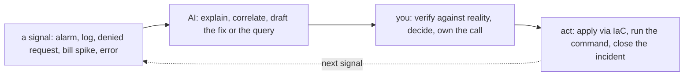

# AWS — Operating It (the day-2 reality)

> The [README](README.md) is *what AWS is*; [architecture](architecture.md) is *how
> it's structured*; this note is **what running it actually looks like** — the
> operations brief, what pages you at 3 a.m., the real ops work broken down by
> cadence, and how AI earns its place as a co-pilot in the operating loop (distinct
> from the [learning ramp](ai-ramp.md)).

## The brief — what "operating AWS" means

On-prem, operations meant hands on hardware: swapping disks, patching boxes, walking
the data center. On AWS the hardware is gone and the job shifts up: **you operate by
declaring intent, watching what the platform does with it, and keeping the result
secure, reliable, and affordable.** The three questions that define day-2 work:

- **Is it healthy?** — and would you know before a user tells you? (observability)
- **Is it safe?** — least privilege holding, nothing exposed, nothing drifting?
- **Is it affordable?** — no forgotten resource quietly billing, no workload on the
  wrong pricing model?

Everything below is those three questions, made concrete.

## Ops notes — what pages you on AWS (and what should)

The failure modes that actually generate incidents, most of them the customer-side
of the [shared-responsibility line](architecture.md):

- **The public S3 bucket** — private data made public by a misconfiguration; the
  canonical AWS breach. Block-public-access on by default + a posture scan that
  someone *reads* ([`the-stack/07`](../../the-stack/07-security.md)).
- **The leaked IAM key in git** — a long-lived access key committed to a repo, found
  by scanners. This is *why* the whole repo preaches roles and short-lived creds over
  keys ([`identity`](../../cross-cutting/identity-iam.md)); secret-scanning in CI is
  table stakes.
- **"Why can't this reach that?"** — the daily networking incident. Usually a
  security group, a route table, a NACL's stateless return path, or a subnet with no
  route to a NAT — the [debug ladder from `the-stack/02`](../../the-stack/02-network.md)
  applies unchanged.
- **The bill surprise** — egress, inter-AZ traffic, a NAT-gateway processing tax, or
  a forgotten GPU instance ([`cost`](../../cross-cutting/cost.md)). On AWS this pages
  you as a *budget alarm* if you set one, or as an invoice if you didn't.
- **Single-AZ when you meant multi-AZ** — a "highly available" service with both
  replicas in one AZ, discovered during the AZ event it was supposed to survive
  ([`the-stack/01`](../../the-stack/01-physical.md)).
- **The instance-retirement / degraded event** — AWS tells you hardware under your
  instance is failing; the discipline is automation that drains and replaces on
  notice, not a human reading the email.
- **IAM permission drift** — the role that accreted permissions until it can do
  everything, discovered the day it's abused. Least privilege is an ongoing review,
  not a one-time grant.

## The ops work, broken down

The recurring work of an AWS admin, decomposed by **cadence** — because "what does
this job actually involve" is best answered by what you do, and how often:

| Cadence | Task | Surface | Why it matters |
| --- | --- | --- | --- |
| **Continuous (automated)** | Alarms on health, error rate, latency, budget, security findings | observability, cost, security | The system watches itself; you get paged, not surprised. |
| **Continuous (automated)** | Auto Scaling replaces unhealthy instances; drain-on-retirement | compute | Cattle, not pets — failure is handled, not attended. |
| **Daily** | Triage alarms and Security Hub / GuardDuty findings; act on the real ones | security, observability | The findings only help if someone reads and acts on them. |
| **Daily** | Answer "why can't X reach Y" and "who did this" (CloudTrail) | networking, identity | The bread-and-butter incident and audit questions. |
| **Weekly** | Review IAM: stale users/roles, over-broad policies, unused access | identity | Least privilege decays; this is how you catch the drift. |
| **Weekly** | Cost review: anomalies, untagged spend, top movers | cost | Catch the forgotten resource before the invoice does. |
| **Monthly** | Right-size from utilization data; revisit reserved/spot coverage | cost, compute | Most instances are oversized because nobody looked. |
| **Monthly** | Patch/refresh AMIs; roll the fleet from a new golden image | compute, security | Closes known-CVE exposure; reimage over patch-in-place. |
| **Quarterly** | Restore-test a backup; verify RPO/RTO for real | storage | An untested backup is a hope ([`the-stack/04`](../../the-stack/04-storage.md)). |
| **Quarterly** | Access recertification; review SCPs and account guardrails | identity, security | Prove the guardrails still hold; audits want evidence. |
| **On-incident** | Detect → contain → eradicate → recover → write the post-mortem | all | The judgment the whole repo is about; the calm at 3 a.m. |
| **On-change** | Everything through IaC + review, not the console | provisioning | The console is for looking; changes go through code ([`iac`](../../cross-cutting/iac-and-config.md)). |

Two things this table makes visible. First, **most of the routine work is automated
or should be** — the human job is triage, review, and judgment, not toil. Second,
**the review cadence (weekly IAM, weekly cost, quarterly restores) is the part
teams skip and regret** — it's unglamorous, and it's exactly where drift, overspend,
and un-restorable backups hide until they become incidents.

## How AI assists the operating work (not just the learning)

The [ai-ramp](ai-ramp.md) note is about getting *competent fast*; this is about AI
in the *daily operating loop*, once you already know AWS. Different job, same
discipline: **AI for speed, judgment for truth.**

Where AI genuinely pulls its weight in operations:

- **Incident co-pilot / rubber duck** — paste the CloudTrail entry, the denied
  request, the `aws` CLI error, the stack trace: *"what does this mean and what would
  you check next?"* AI is fast at turning a cryptic signal into a hypothesis — you
  test the hypothesis.
- **Query authoring** — *"a CloudWatch Logs Insights query to find 5xx spikes by
  path in the last hour."* AI writes CloudWatch Insights / Athena / SQL fluently;
  you sanity-check it against known data before trusting the graph.
- **Log & metric triage** — summarize a noisy log window, cluster similar errors,
  surface the anomaly. A strong first pass over volume no human wants to scroll.
- **Drafting the fix as code** — *"the Terraform / SCP / security-group change that
  closes this finding"* — as a reviewable draft that goes through the normal IaC
  gate, never a console change AI talks you into.
- **Post-incident writing** — turn the timeline into a first-draft post-mortem; you
  correct the causality and own the conclusions.
- **Runbook drafting** — generate the first version of a runbook for a recurring
  task, then harden it against reality.

Where AI must **not** be trusted in the operating loop — the failure modes are
higher-stakes than in learning, because these run against production:

- It will **confidently misread a denied request** — the NACL is stateless and you
  only opened inbound; AI may blame the security group. Reality (a re-run, a flow
  log) is the arbiter, not the explanation.
- It **invents CLI flags, ARNs, and API parameters** that don't exist — verify
  before running anything that mutates state.
- It **drafts permissive fixes** — a security-group change "to make it work" that
  opens `0.0.0.0/0`. Every AI-drafted fix gets tightened by hand.
- It **cannot own the incident.** AI accelerates the lookup and the first draft; the
  decision, the blast-radius call, and the 3 a.m. accountability stay with you.

The rule that keeps it safe: **AI touches signals and drafts; you touch production.**
Anything AI suggests that changes state goes through the same review-and-IaC gate as
your own changes — the console-is-for-looking discipline
([`iac`](../../cross-cutting/iac-and-config.md)) applies to AI's suggestions exactly
as it does to yours.

## Honest boundaries

The ops *discipline* here is ✋ — triage, incident method, the review cadence,
least-privilege review, restore-testing, treating cost and drift as signals — because
it's the same operations craft carried from real infrastructure and fleet work,
where the pager was real. The AWS-service specifics (which console, which alarm,
which finding type) are the 🧗 ramp, mapped and verified per this repo's method. The
claim isn't "years on-call for a production AWS estate"; it's a **transferable
operating discipline plus a fast, honest ramp onto AWS's tooling** — and the
AI-assisted operating loop above is exactly how that ramp gets applied without
pretending the judgment came from the machine.
