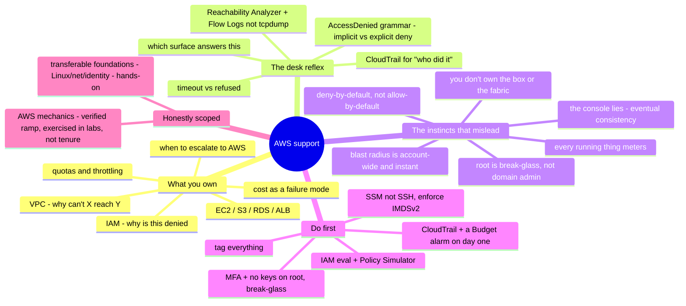

# AWS Support — the operator's transition guide

> 🌐 **Languages:** English (default) · [中文](../../docs/zh/platforms/aws/support.md)

---

> [`operations.md`](operations.md) covers the **cadence** of running your own AWS
> estate — what pages you, and the daily/weekly/quarterly work. This note covers the
> other half: **supporting AWS as a break-fix craft** — the tickets that actually
> recur, exactly where you look, and, most usefully, **what a strong sysadmin from
> another lane gets wrong when they inherit it.** AWS itself stays a 🧗 ramp here; the
> transferable foundations under it (Linux, networking, identity, troubleshooting)
> are the ✋ that carries the load — which is the whole point of this page.

A competent Linux / on-prem-network / virtualization / another-cloud admin can pick
up AWS support faster than a fresh cloud hire — *if* they notice which of their
instincts no longer hold. The pain in that transition isn't ignorance; it's
**confident muscle memory pointed at a platform that inverts several of its own
rules** — deny-by-default instead of allow-by-default, a metered bill instead of sunk
cost, an API you can't packet-capture instead of a switch you can. This note names
the responsibilities, the recurring tickets and their diagnostic surface, and the
exact places an experienced admin's reflexes mislead — so the transfer is a
checklist, not a string of self-inflicted incidents (or invoices).

## What supporting AWS makes you responsible for

Mapped onto the [seven surfaces](../../00-the-operating-model.md), in the order
tickets arrive:

| Surface | What you're on the hook for |
| --- | --- |
| **Identity & access (IAM)** | "Why is this denied?" — policy evaluation across identity/resource/SCP/boundary/session, assume-role trust, cross-account, least-privilege. The single biggest time sink. |
| **Networking (VPC)** | "Why can't X reach Y?" — security groups, NACLs, route tables, IGW/NAT, public-IP vs EIP, Route 53 DNS. The daily incident. |
| **Compute (EC2)** | Launch/health/access — status checks, SSH vs SSM, disk-full/EBS growth. |
| **Storage (S3/EBS)** | S3 403s (the layered kind), Block Public Access, bucket policy vs ACL vs KMS; EBS resize. |
| **Managed data (RDS)** | Connectivity, `storage-full`, `max_connections`, parameter groups. |
| **Load balancing & TLS** | ALB 502/503/504, unhealthy target groups, ACM cert validation/renewal. |
| **Observability** | CloudWatch metrics/logs/alarms; **CloudTrail** for "who did that." |
| **Cost** | The surprise bill as a first-class failure — NAT, egress, cross-AZ, orphaned resources, public IPv4. |
| **Quotas & throttling** | `LimitExceeded` on launch; `ThrottlingException` in scripts. |
| **Escalation to AWS** | Trusted Advisor, AWS Health Dashboard, and when to open a Support case (and what your plan even allows). |

Two of these — **IAM** and **networking** — generate the majority of the volume, and
both are exactly where an outsider's instincts fail hardest (see the gap section).

## The common tickets — and where you look

Break-fix on AWS is pattern recognition over a small set of consoles and logs. The
reflex you're building is *"which surface answers this, and what are its limits?"*

**IAM — "Access Denied" (the #1 ticket).** Read the error grammar: *"no identity-based
policy allows the action"* is an **implicit deny** (nothing granted it) — different
from *"…with an explicit deny in a … policy"*, which means something actively blocks
it (often an **SCP or permissions boundary you can't even see from the account**). An
`sts:AssumeRole` failure needs **both** the target role's **trust policy** *and* the
caller's identity policy to allow it. For opaque `UnauthorizedOperation` (encoded)
errors, decode with **`aws sts decode-authorization-message`**. *Where you look:*
**IAM Policy Simulator** (but know its limits — it doesn't do resource policies for
roles, SCP conditions, or cross-account, and it doesn't make a real request),
**CloudTrail** `errorCode`/`errorMessage`, and **IAM Access Analyzer**.

**Networking — "can't reach it."** First split **timeout vs refused**: *connection
timed out* is a **network-layer** block — a security group with no inbound rule, a
NACL, a missing route to an IGW/NAT, or **no public IP** — while *connection refused*
means you reached the host but **nothing is listening** on that port. Remember the
semantics that trip up firewall veterans: **security groups are stateful and
allow-only** (return traffic is automatic), but **NACLs are stateless** — you must
also allow the **ephemeral return range** (open 1024–65535). *Where you look:* **VPC
Reachability Analyzer** (analyzes the SG/NACL/route/IGW config path and *names the
blocking component* — not `tcpdump`, which you can't run on a fabric you don't own)
and **VPC Flow Logs** (`ACCEPT`/`REJECT` per flow).

**EC2 — connectivity & health.** **Status checks** localize the fault: a failed
**System** check is AWS's underlying host → remedy is **stop/start** (migrates to new
hardware); a failed **Instance** check is *your* OS/config → reboot or fix ("2/2 vs
1/2 checks passed" is the console shorthand). SSH `Permission denied (publickey)` is a
wrong AMI username (`ec2-user` / `ubuntu` / `admin` / …) or wrong key; `UNPROTECTED
PRIVATE KEY FILE` → `chmod 400`. **Stop SSHing** — use **SSM Session Manager** (no
open port 22, no bastion, IAM-controlled, audited); when it won't connect it's the
missing `AmazonSSMManagedInstanceCore` role, a stopped agent, or no network path (the
three `ssm`/`ec2messages`/`ssmmessages` endpoints). Disk-full after an EBS resize is a
**two-step** gotcha: growing the volume isn't enough — `growpart` the partition, then
`xfs_growfs` / `resize2fs` the filesystem.

**S3 — 403 Access Denied (the layered kind).** Any one of these denies: the **IAM
identity policy**, the **bucket policy**, **S3 Block Public Access** (the usual cause
of "still private *despite* my bucket policy" — most-restrictive of account+bucket
wins), **Object Ownership / ACLs** (cross-account-uploaded objects owned by the writer
is the classic gap), or **SSE-KMS key permissions** (`GetObject` needs `kms:Decrypt`).
Start with `aws sts get-caller-identity` so you know *which* principal is being denied.

**Load balancer & TLS.** ALB **502** = the target returned nothing usable (crash,
malformed response, or closed the connection early); **503** = **no healthy
targets**; **504** = the target didn't answer within the timeout. `HTTPCode_ELB_5XX`
(the LB generated it) vs `HTTPCode_Target_5XX` (the LB is just forwarding your app's
error) tells you which side to debug. A target stuck **unhealthy** is usually a
security group that doesn't allow the LB on the **health-check port**, a wrong ping
path, or a non-200 response. **ACM** certs stall in *Pending validation* until you add
(and **keep** — removing it breaks auto-renewal) the DNS **CNAME**, and they're
**regional** (CloudFront needs the cert in **us-east-1**).

**RDS.** Can't-connect is the DB security group not allowing the client on **3306/5432**,
or "Publicly accessible = No" with no IGW path. Storage pressure shows as status
**`storage-full`** and CloudWatch **`FreeStorageSpace`** — enable **storage
autoscaling**. And the parameter-group trap: **static** parameter changes need a
**manual reboot** to apply, and you **can't edit a default parameter group** (make a
custom one).

**Cost — the surprise bill is a ticket too.** The classics: a **NAT Gateway** billing
an hourly fee **plus per-GB processed** *even for traffic to S3 that never leaves
AWS* (fix: a free **Gateway VPC Endpoint**); **cross-AZ and egress** data transfer you'd
think of as "internal"; **$0.005/hour per public IPv4** (since Feb 2024, attached or
idle); and orphans — **unattached EBS volumes, snapshots an AMI left behind,
unassociated Elastic IPs** — all quietly metering. *Where you look:* **Cost Explorer**,
**Budgets**, **Cost Anomaly Detection** ([`cross-cutting/cost.md`](../../cross-cutting/cost.md)).

**Quotas & throttling.** Separate two things: a **count quota** (`LimitExceeded` — your
launch hit a per-region ceiling → raise it in **Service Quotas**, ahead of need) and
**API rate throttling** (`RequestLimitExceeded` / `ThrottlingException` "Rate
exceeded" — your script is calling too fast → **exponential backoff with jitter**;
the SDKs already retry, but hand-rolled `boto3`/CLI loops don't).

**DNS / Route 53.** A **CNAME can't sit at the zone apex** — use an **Alias** record.
And the delegation gotcha: recreating a hosted zone hands you a **new set of 4 name
servers**, so resolution breaks until the **registrar's NS records match** the zone's.

## The experience gap — what a strong sysadmin's instincts get wrong

This is the part the ticket queue hides. The gap between an admin who's *done* AWS
support and one who hasn't isn't the console — a sharp admin learns consoles in a
week. It's a set of load-bearing assumptions from the on-prem / other-cloud world that
are **false here**, each with a failure mode attached.

- **IAM is deny-by-default, and it's your #1 time sink.** On-prem, "the admin can do
  anything" and a firewall is an allow-list you bolt exceptions onto. AWS inverts
  both: **no matching Allow = deny**, and an **explicit Deny always wins** — over any
  Allow, from any of six policy types (identity, resource, SCP, RCP, boundary,
  session) that combine as unions and intersections. The "just grant them admin"
  reflex fails silently when an **SCP or permissions boundary caps them** — and AWS's
  own docs tell you the denying policy can live somewhere **you can't see from the
  account.**
- **You don't own the box or the fabric (shared responsibility).** AWS owns the
  hypervisor, the physical host, the switches. You **can't SSH the host, can't
  `tcpdump` the network**, and managed services (RDS, Lambda) give you **no shell at
  all**. The "log into the box and look" workflow is gone for large swaths of the
  platform; you diagnose from **config analysis (Reachability Analyzer) + logs (Flow
  Logs, CloudWatch, CloudTrail)**, and sometimes the honest terminal step is *"open a
  Support case."*
- **"Just open the firewall" maps badly.** There are layers with different semantics —
  **stateful, allow-only security groups** on the ENI vs **stateless, ordered NACLs**
  on the subnet (which need the return traffic explicitly allowed) vs route tables vs
  IGW/NAT. Broadening a security group to `0.0.0.0/0` out of frustration is the
  anti-pattern; find the **one** blocking rule.
- **The console briefly lies (eventual consistency).** A new IAM role/policy can take
  **up to a minute** to work; S3 bucket policies, Route 53 TTLs, and tag/console views
  lag too. The on-prem *change-refresh-didn't-work-change-again* reflex manufactures
  conflicting state. **Make the change once, then wait** — the SDKs even ship *waiters*
  for exactly this.
- **Everything is an API, and the API is rate-limited.** Loop over 10,000 resources
  without **backoff + jitter** and you'll `ThrottlingException` yourself into a
  self-inflicted outage. On-prem, hammering your own server was free; here the platform
  pushes back.
- **Cost is a first-class failure mode — unique versus on-prem.** Sunk-cost hardware
  costs nothing to leave idle; on AWS **every running thing meters**, and the meter has
  non-obvious edges (NAT per-GB processing that stacks on egress, cross-AZ transfer,
  per-hour public IPv4, orphaned EBS/EIP). "I'll clean it up later" = a surprise
  invoice. A **Budget alarm on day one** is not optional.
- **Blast radius is bigger and faster.** One IAM policy, one security-group change, one
  route edit hits **everything at once** — there's no per-rack fault isolation. And
  many *global* control planes have historically leaned on **us-east-1**; a regional
  event there has cascaded across dozens of services. Least-privilege and change
  discipline matter *more* here, not less.
- **The root user is not "domain admin."** It's a **break-glass identity**: MFA it,
  create **no access keys** for it, use a group email, and leave it alone — humans work
  through **IAM Identity Center / roles**. There's no superuser you drive daily.
- **Quotas are soft, per-region, and raised *ahead* of need.** "Why did my launch fail:
  `InstanceLimitExceeded`" is a quota you should have raised last week; increases can
  take minutes to days.
- **"It's not there" usually means "wrong region."** Resources are regional/zonal and
  **not replicated unless you do it**; some consoles silently drop you in a different
  region than where you built the thing.
- **CloudTrail is your "who deleted it" — and it can't look backward.** It's the audit
  trail and the post-incident pcap, but only for events **after** you enabled it. Turn
  it on (and a Budget, and IMDSv2) **before** you need them.

## What transfers, what doesn't

| Transfers strongly | Transfers with a caveat | Don't bring it |
| --- | --- | --- |
| Linux / guest-OS depth — still 100% yours (your side of the shared model) | Firewall/ACL reasoning — re-learn stateful-SG vs stateless-NACL + layered eval | Packet capture on the fabric — no `tcpdump` on a switch you can't see |
| DNS reasoning (Route 53 is DNS; mind eventual consistency) | Identity & least-privilege — the *principle* holds; deny-by-default JSON is new | "The admin can do anything" — deny-by-default + SCPs cap even admins; root is break-glass |
| TLS / cert reasoning (ACM manages issuance; PKI is identical) | "I have admin, so I can see everything" — no shell on managed services; "open a case" | Sunk-cost / capacity mindset — idle = billing |
| TCP/IP, subnetting, CIDR → VPC design | Read-after-write consistency — recalibrate for propagation lag | "Restore from the backup server" — only what you *pre-configured* (snapshots/Backup/versioning) exists |
| Structured troubleshooting, log reading, scripting | | "Just open the firewall to 0.0.0.0/0" — find the one blocking rule |
| Change discipline (pilot / IaC / rollback) — matters *more* here | | Static-pet-server thinking — if you're SSHing in to hand-fix, the automation failed |

## First week / first 90 days

**Week one — before you touch anything broad.**
1. **Secure the root user** — MFA on, **delete any root access keys**, group email,
   documented break-glass (don't store the root password in a vault that needs this
   same account to unlock).
2. **Enable CloudTrail** (all regions) — it can't capture the past.
3. **Set a Budget + billing alarm** — the very first post-billing action; runaway cost
   is caught before month-end, not after.
4. **Confirm and bookmark your working region** — half your "missing resource" tickets
   are wrong-region.

**First 30 days — the reflexes that prevent self-inflicted incidents.**
5. **Learn IAM policy evaluation + the Policy Simulator** — this is where most of your
   support time goes. Read `AccessDenied` grammar (implicit vs explicit deny).
6. **Read the SG/NACL/route path with Reachability Analyzer + Flow Logs**, not
   `tcpdump`.
7. **Use SSM Session Manager, not SSH keys; enforce IMDSv2** on instances.
8. **Never edit a broad IAM policy or a shared security group without understanding
   blast radius** — one change is account-wide and instant.

**First 90 days — get ahead of the failure modes.**
9. **Tag everything on creation** — it's the only thing between you and orphan-and-bill
   chaos, and it drives cost allocation and ABAC.
10. **Know Service Quotas exists** and raise limits before a launch/scaling event.
11. **Design every looping script for throttling** (backoff + jitter).
12. **Reduce casual us-east-1 control-plane dependencies** for anything that must
    survive a regional event.

## The AI-assisted ramp (AWS-support flavor)

- **Translate your instinct into the AWS idiom:** *"I'd `tcpdump` the interface and
  grep the firewall log — what's the AWS equivalent for 'this can't reach that,' and
  what can't I see?"* The honest answer (Reachability Analyzer + Flow Logs + the
  shared-responsibility line) is exactly what AI compresses well.
- **Draft the policy/command, least-privilege it by hand.** AI is genuinely strong at
  **IAM JSON, `aws` CLI, `boto3`, and Terraform** — and it **invents IAM actions and
  API calls that don't exist**, **over-scopes to `"*"`**, and cheerfully proposes a
  security-group or policy change whose **blast radius is the whole account**. Every
  generated policy gets checked against the docs (and a linter — see the field kit)
  and run in a **throwaway account** before it touches production. Same verify-hard
  discipline as everywhere in this repo — see [`ai-workflow/`](../../ai-workflow/) and
  the [operating loop](operations.md#how-ai-assists-the-operating-work-not-just-the-learning).

## Honest boundaries

**AWS is a 🧗 verified ramp in this repo, and this page keeps that line.** What makes
the ramp fast is that the load is carried by **✋ transferable foundations** that are
real: **Linux** and guest-OS operations, **networking / DNS / TLS**
([`the-stack/02`](../../the-stack/02-network.md)), and **identity & least-privilege
thinking** ([`identity-iam.md`](../../cross-cutting/identity-iam.md)) — the parts of
AWS support that *are* those skills wearing AWS names. The AWS-specific mechanics
(deny-by-default policy evaluation, the VPC layers, the service catalog, the pricing
edges) are mapped, checked against the docs, and exercised in the runnable
[labs](labs/) — **not** claimed as years of production tenure. The claim is the one
the [platform README](README.md) makes: *a transferable operating model plus an
AI-augmented ramp that reaches competent, fast, and can be verified in this repo* —
and the support reflexes above are that ramp made concrete. Deep, at-scale production
AWS on a specific service is still ahead, and the notes say so rather than bluffing.

## Field kit — real tools & references

Pointers verified live on GitHub, grouped by use. Security/audit tools double as
troubleshooting checklists; some are advanced.

**Curated / practical (the daily desk):**
- [`open-guides/og-aws`](https://github.com/open-guides/og-aws) — the crowd-sourced
  "practical guide to AWS," heavy on gotchas, limits, and failure modes. The best
  single ops/troubleshooting read.
- [`donnemartin/awesome-aws`](https://github.com/donnemartin/awesome-aws) — the master
  index of AWS tools/libraries.
- [`awslabs/aws-support-tools`](https://github.com/awslabs/aws-support-tools) — scripts
  authored by **AWS Premium Support** for exactly these break-fix scenarios.
- [`aws/aws-cli`](https://github.com/aws/aws-cli) · [`boto/boto3`](https://github.com/boto/boto3)
  — the primary diagnostic surface and the SDK under every script.

**IAM & permission debugging (the #1 pain):**
- [`iann0036/iamlive`](https://github.com/iann0036/iamlive) — generates least-privilege
  policy by watching live API calls; the fastest way to resolve an `AccessDenied`
  (shows the exact missing action).
- [`salesforce/cloudsplaining`](https://github.com/salesforce/cloudsplaining) — turns an
  account's IAM sprawl into a risk-ranked report.
- [`nccgroup/PMapper`](https://github.com/nccgroup/PMapper) — models IAM as a graph:
  "can principal X actually do Y?" and privilege-escalation paths.
- [`salesforce/policy_sentry`](https://github.com/salesforce/policy_sentry) ·
  [`duo-labs/parliament`](https://github.com/duo-labs/parliament) — generate and lint
  least-privilege policies.

**Networking / posture / diagnostics:**
- [`duo-labs/cloudmapper`](https://github.com/duo-labs/cloudmapper) — visualize VPC
  topology and security-group exposure.
- [`prowler-cloud/prowler`](https://github.com/prowler-cloud/prowler) — the go-to
  "what's wrong with this account?" scanner; findings read as a remediation runbook.
- [`turbot/steampipe`](https://github.com/turbot/steampipe) — query live AWS with SQL;
  ad-hoc "which resources are exposed/costly/misconfigured?" in seconds.
- [`nccgroup/ScoutSuite`](https://github.com/nccgroup/ScoutSuite) — offline multi-cloud
  posture report.

**Cost & governance:**
- [`cloud-custodian/cloud-custodian`](https://github.com/cloud-custodian/cloud-custodian)
  — YAML rules engine for cost/security/governance remediation.
- [`infracost/infracost`](https://github.com/infracost/infracost) — cost estimates on
  Terraform PRs (catch the regression before deploy).
- [`mlabouardy/komiser`](https://github.com/mlabouardy/komiser) — inventory + cost
  inspector; surfaces idle/untagged/expensive resources.

**Credentials & incident response:**
- [`99designs/aws-vault`](https://github.com/99designs/aws-vault) — secure credential
  storage + MFA/role-assumption; fixes the expired-token/assume-role pain.
- [`aws-samples/aws-incident-response-playbooks`](https://github.com/aws-samples/aws-incident-response-playbooks)
  — AWS-authored runbooks (exposed keys, compromised creds).

**Authoritative docs** worth bookmarking over any blog: **AWS docs** for
[IAM policy evaluation](https://docs.aws.amazon.com/IAM/latest/UserGuide/reference_policies_evaluation-logic.html),
[the "Access Denied" error grammar](https://docs.aws.amazon.com/IAM/latest/UserGuide/troubleshoot_access-denied.html),
[VPC Reachability Analyzer](https://docs.aws.amazon.com/vpc/latest/reachability/what-is-reachability-analyzer.html),
[S3 403 troubleshooting](https://docs.aws.amazon.com/AmazonS3/latest/userguide/troubleshoot-403-errors.html),
and [ALB troubleshooting](https://docs.aws.amazon.com/elasticloadbalancing/latest/application/load-balancer-troubleshooting.html).
*(AWS restructured its Support plans at re:Invent 2025 — Basic / Business Support+ /
Enterprise / Unified Operations; the legacy Developer / Business / Enterprise On-Ramp
tiers stop taking new subscribers and end Jan 1, 2027. Basic opens **no** technical
cases — billing, service-limit increases, and re:Post community only.)*

## The chapter on one screen

