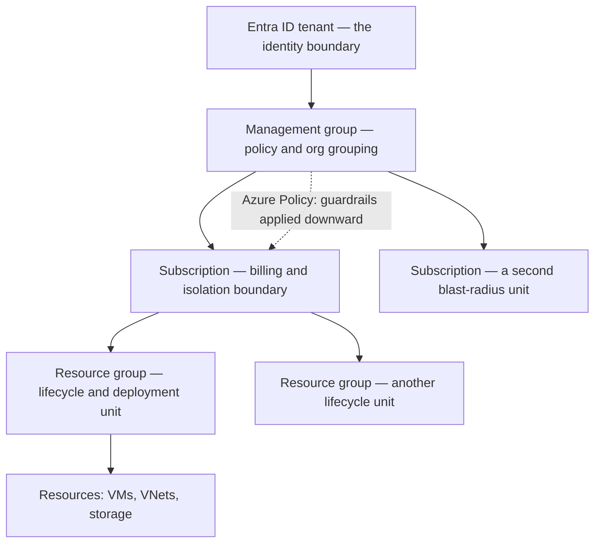
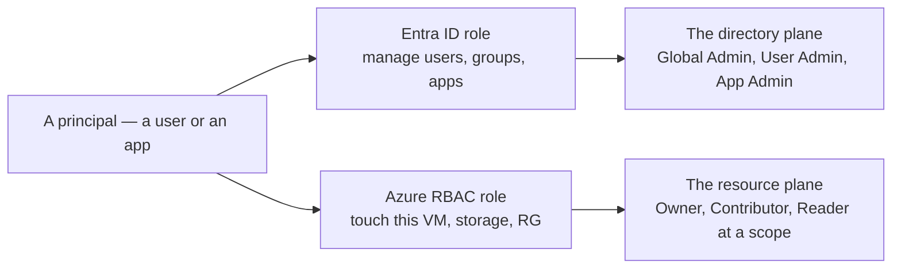
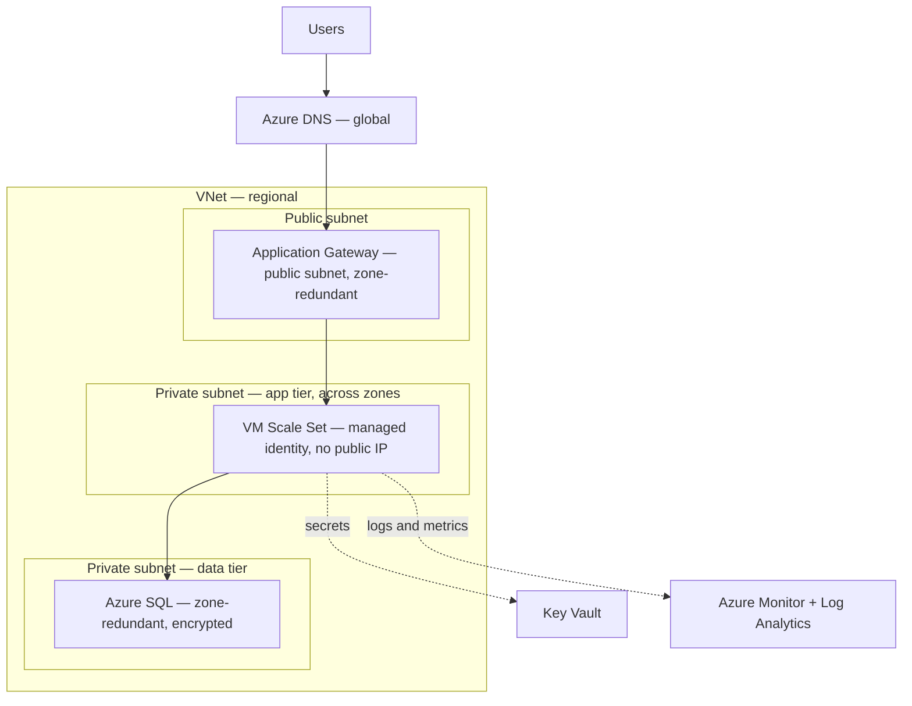

# Azure — Understanding the Architecture

> The [README](README.md) mapped Azure onto the seven surfaces — *what the services
> are.* This note is the layer up: *how Azure is structured*, so you design **with**
> its architecture instead of fighting it. Get the management hierarchy, the
> region/zone geography, and — above all — the **two permission planes** right, and
> most "why is this denied" questions answer themselves.

Azure isn't a pile of services; it's a small set of organizing principles with
services hung off them. Learn the principles and the services become lookups. Five
carry the weight — and one of them, the identity split, is the Azure-specific trap
that catches everyone arriving from AWS.

## 1. The management hierarchy — the blast-radius unit

Where AWS makes the **account** its hard boundary, Azure gives you a four-level
hierarchy, and each level has a distinct job. This is the analog of AWS Organizations
+ SCPs, and getting it wrong is the Azure blast-radius mistake:

- **The subscription is the billing and scale boundary** — the closest thing to an
  AWS account. Prod and dev in separate subscriptions gives you real isolation and
  per-subscription cost. Piling everything into one is the same mistake as one big
  AWS account.
- **The resource group is the lifecycle unit** — and has *no clean AWS equivalent*.
  Everything lives in exactly one RG; delete the RG and its contents go with it.
  That makes it the natural unit of deployment and teardown ([`iac`](../../cross-cutting/iac-and-config.md)).
- **Management groups + Azure Policy are the guardrails** — policy applied at a
  management group flows down to every subscription and resource beneath it, making
  whole categories of action *impossible* (no public IPs, encryption required). This
  is policy-as-code from [`the-stack/07`](../../the-stack/07-security.md), and it's
  Azure's answer to SCPs.
- **The mental model:** the resource group is a room with a lock, the subscription is
  the building, the management group holds the building rules. Design the rooms before
  you furnish them — RBAC scope, cost, and policy all key off this hierarchy.

## 2. Regions, zones, and region pairs — the geography you design against

This is [`the-stack/01`](../../the-stack/01-physical.md)'s failure-domain model in
Azure's words, with one concept AWS doesn't have in the same form:

- A **Region** (e.g. `eastus`) is a geographic area — pick it for latency,
  data-residency, and which services are actually available there (not all are).
- An **Availability Zone** is one or more physically separate datacenters with
  independent power, cooling, and network. **Zone-redundant is how you survive a
  building failure;** a single-zone deployment when you meant zone-redundant is the
  mistake the whole failure-domain model exists to prevent.
- **Paired regions** are Azure's distinctive twist: most regions come pre-paired
  (e.g. `eastus` ↔ `westus`) for platform-managed replication and sequential update
  rollout — a DR primitive you design *toward*, not something AWS exposes the same way.

The design instinct: **spread across zones for availability, choose regions
deliberately, and treat the region pair as your DR anchor.**

## 3. The two permission planes — Azure's signature gotcha

This is the one that has no AWS analog, and it's the #1 Azure identity mistake:
**Azure has two separate permission systems, not one.** AWS has a single IAM; Azure
splits authorization across a directory plane and a resource plane
([`identity`](../../cross-cutting/identity-iam.md)):

- **Entra ID roles** govern the **directory** — who can create users, register apps,
  manage groups. Global Admin lives here.
- **Azure RBAC roles** govern **resources** — who can start this VM, read this
  storage account, deploy into this resource group. Owner/Contributor/Reader live here,
  each assigned *at a scope* (management group / subscription / RG / resource).
- **They do not imply each other.** A Global Admin in Entra can have *zero* access to
  a VM; a subscription Owner can be unable to add a user to a group. "My action was
  denied and I'm an admin" almost always means you're an admin in the *wrong plane*.
- **Scope inheritance is the second trap:** an RBAC role at the subscription flows
  down to every RG and resource. Assigning `Owner` too high is how blast radius
  quietly goes global. Assign at the narrowest scope that does the job.

Give this real weight: nail the two planes and the resource-group hierarchy, and the
rest of Azure follows ([`skills-map.md`](skills-map.md)).

## 4. The shared responsibility model — where your job starts

Azure secures **of** the cloud; you secure **in** it — and the line moves with the
service ([`the-stack/07`](../../the-stack/07-security.md)):

- **Microsoft's side:** the physical datacenters, hardware, hypervisor, and the
  managed-service internals.
- **Your side, always:** your data, your identities and role assignments, your NSGs
  and network config, your encryption and secrets choices — and the overwhelming
  majority of incidents live here (a public blob container, an over-broad RBAC grant),
  not in Azure failing.
- The higher up the stack you go (VM → Azure SQL → Functions), the more Microsoft
  handles — but your data and access controls never stop being yours.

## The Well-Architected Framework — the design checklist

Microsoft has its own version — **five pillars** worth knowing as a review lens, not
memorizing as trivia:

- **Reliability** — zone/region redundancy, failure recovery, tested backups ([`the-stack/04`](../../the-stack/04-storage.md)).
- **Security** — least privilege across *both* planes, encryption, auditability ([`the-stack/07`](../../the-stack/07-security.md)).
- **Cost Optimization** — commitment matched to workload, no forgotten resource ([`cost`](../../cross-cutting/cost.md)).
- **Operational Excellence** — can you run and improve it? (the [operations](operations.md) doc).
- **Performance Efficiency** — right-sized, right-service-for-the-job.

Used well, it's the set of questions to ask *before* shipping — the same "what would
break, what's exposed, what's this costing" instinct this repo teaches, packaged as
Azure's own checklist.

## A reference architecture — how the surfaces compose

The canonical three-tier web app, and where each surface shows up:

Every surface is present: **identity** (managed identity, no keys on the box),
**networking** (VNet, public/private subnets, NSGs, App Gateway), **compute** (VM
Scale Set across zones), **storage** (Azure SQL, zone-redundant, encrypted),
**observability** (Azure Monitor + Log Analytics), **security** (Key Vault,
encryption, tiered subnets). Read this diagram and you can see the whole
[skill map](skills-map.md) doing one job.

## Honest boundaries

🧗 **ramp, honestly — with one ✋ exception that matters here.** The transferable
architecture model (blast-radius thinking, failure domains, shared responsibility,
"design the rooms before you furnish them") is ✋ craft from real infrastructure and
fleet work, mapped onto Azure and verified against its docs — not a claim of years
architecting production Azure estates, which is 🧗. The exception is the **identity
plane**: Entra ID / Azure AD setup and directory design is genuine hands-on ground
([`identity`](../../cross-cutting/identity-iam.md)), so the two-permission-planes
section is written from experience, not from a doc read. The claim is a sound
architectural model plus a fast, verifiable ramp onto Azure's resource surfaces — with
identity as the part that's already deep.
