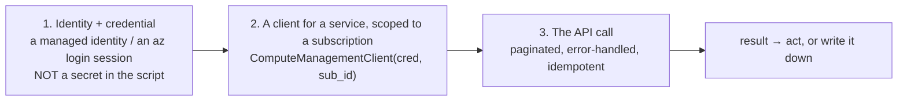
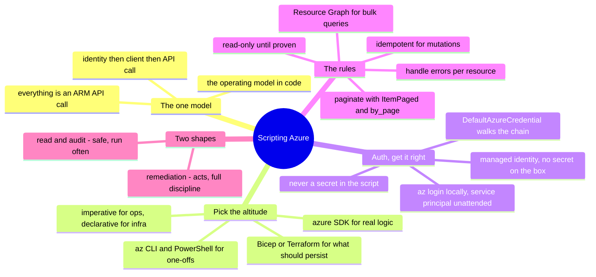

# Azure — Scripting the API (managing & operating from code)

> [`architecture`](architecture.md) is how Azure is structured; [`operations`](operations.md)
> is what running it looks like. This note is the *how*: **driving Azure through its
> API from code** — the concrete craft behind move #3 of the
> [operating model](../../00-the-operating-model.md), "drive the platform through its
> API and codify it." The portal is for looking; scripts and IaC are for doing.

Everything in Azure is an API call over Azure Resource Manager (ARM). The portal, the
CLI, PowerShell, Terraform, the SDKs — all of them are wrappers over the same ARM
endpoints. Once you internalize that, "how do I automate X?" stops being a search for
a feature and becomes *"which API call, with which identity, handling which failure
modes?"* This is the layer where a scripting-and-Linux background
([`foundations/`](../../foundations/)) turns directly into cloud operations skill.

## The one model: everything is `(identity) → (client) → (API call)`

Every script you write against Azure is the [operating model](../../00-the-operating-model.md)'s
three moves, in code:

Get those three right — a **scoped identity**, a **subscription-scoped client**, and a
**properly-called API** — and you can automate anything Azure exposes. One Azure note
worth stating up front: it ships **both** a first-class CLI *and* a first-class
PowerShell story, so "one-off from the shell" has two equally supported answers,
covered next.

## The tooling ladder — pick the right altitude

Five ways to drive the API, from quick to durable. Reaching for the wrong altitude is
a common mistake:

| Tool | What it is | Reach for it when |
| --- | --- | --- |
| **Azure CLI** (`az ...`) | the API as shell commands, cross-platform | one-off checks, quick fixes, glue in a Bash script, exploring |
| **Azure PowerShell** (`Az` module) | the API as PowerShell cmdlets and objects | the same, when you live in PowerShell / on Windows and want objects, not text |
| **Azure SDK** (Python `azure-*`) | the API as a library | real logic — loops, branching, data shaping, an actual tool |
| **Bicep** | *declarative* desired state, Azure-native | Azure-only infra you want in the native language, tight ARM coupling |
| **Terraform** | *declarative* desired state, cross-cloud | reproducible, reviewed, destroyable infra — especially multi-cloud ([`iac`](../../cross-cutting/iac-and-config.md)) |

The dividing line that matters: **`az`/PowerShell/SDK are *imperative* — "make this
call now"; Bicep and Terraform are *declarative* — "this is what should exist."** Use
imperative scripts for *operations* (inventory, remediation, one-off queries,
orchestration); use IaC for *provisioning* (the infrastructure that should persist).
Building persistent infrastructure with an SDK `begin_create_*` script instead of
Bicep/Terraform is fighting the grain — you've written a worse Terraform with no state.
Bicep vs. Terraform is the sub-choice: **Bicep when you're all-in on Azure, Terraform
when you're cross-cloud or already standardized on it.**

## Authentication — get this right or nothing else matters

The single most important rule, and the one AI and tutorials get wrong most often:
**never put a secret in a script.** The credential chain, in order of preference:

- **On a VM / in a Function / in a container** → a **Managed Identity** attached to the
  compute (system- or user-assigned). The SDK picks it up automatically; there is *no
  secret anywhere*. This is Azure's answer to an AWS instance role, and the correct
  default for anything running in Azure.
- **On your laptop** → **`az login`** (or `Connect-AzAccount`), which caches a
  short-lived, auto-refreshed session the SDK reuses. No key on disk.
- **For unattended automation outside Azure** → a **service principal** with a
  certificate or a federated credential — not a client secret you have to store and
  rotate by hand.
- **Never** → a client secret or account key hardcoded in the script, in a repo, or in
  an env file you might commit. That's the leaked-credential incident from
  [`operations.md`](operations.md), pre-committed.

`DefaultAzureCredential` from the **`azure-identity`** package walks this chain for you
— managed identity, then environment, then the `az` session — exactly analogous to
`boto3.Session()`. Which is *why* a good Azure script just constructs
`DefaultAzureCredential()` and never mentions a key. Let the chain do its job; the
absence of a credential in your code is the point.

## The rules that separate a working script from a footgun

The same idempotence-and-error-handling discipline from
[`foundations/`](../../foundations/), in Azure's specifics:

- **Paginate — always.** The Azure SDK returns `ItemPaged` iterators; iterating them
  transparently follows continuation tokens, and `.by_page()` gives you the raw pages.
  A script that reads only the first page silently misses everything past it — the #1
  bug in hand-written and AI-written Azure scripts alike.
- **Prefer Azure Resource Graph for bulk queries.** To ask "every VM without
  encryption" or "every public storage account" across many subscriptions, one
  **Resource Graph** KQL query beats looping the management API subscription by
  subscription — faster, cheaper, and it *is* the Azure-specific move. Reach for
  per-resource enumeration only when Graph can't answer the question.
- **Handle errors per resource, don't crash the run.** One subscription you lack
  access to, or one throttled call, should log and continue — not abort the whole
  inventory. Wrap each unit of work in `try/except` on `HttpResponseError`.
- **Expect throttling; back off.** ARM rate-limits. The SDK retries by default, but
  heavy scripts still need to respect `429` responses — exponential backoff, not a
  tight retry loop.
- **Be idempotent for mutations.** A remediation script must be safe to re-run:
  check-then-act ("is this NSG rule already gone?"), not blind-act. Re-running should
  converge, not double-apply or crash — the same rule Bicep and Terraform enforce
  structurally ([`iac`](../../cross-cutting/iac-and-config.md)).
- **Read-only until proven.** Develop against `list`/`get` calls first; add
  `begin_create_*`/`begin_delete_*` only once the logic is proven. A `--dry-run` flag
  on anything destructive is cheap insurance.

## Two shapes of automation script

Most Azure operational scripting is one of two shapes:

- **The read/audit script** — inventory, compliance check, cost/tag report, "find
  every X that violates Y." Read-only, safe, run often. A subscription inventory via
  Resource Graph is the canonical example; a compliance variant ("every public
  container," "every NSG open to the internet," "every unencrypted disk") is the same
  skeleton with a different filter.
- **The remediation / orchestration script** — *acts*: tag untagged resources, stop
  idle VMs on a schedule, rotate a secret in Key Vault, deallocate a scale set on
  schedule. Mutating, so it carries the full discipline above — idempotent, scoped
  identity, dry-run first, logged.

The progression to internalize: **read scripts build the muscle safely; remediation
scripts apply it with care.** Start every new automation as a read script that finds
the problem, then add the fix once you trust the finding.

## How AI assists writing the automation

The [operating-loop AI section](operations.md) covered AI in incidents; this is AI
writing the *code*. Genuinely accelerating, with specific traps:

- **Great for the skeleton:** *"an azure-mgmt script that lists every storage account
  with public access enabled, paginated, across the subscription"* — AI writes the
  shape in seconds, and it's usually structurally right.
- **Great for the API lookup:** *"which SDK client and method get a storage account's
  public-access setting?"* — faster than digging the docs, *if* you verify it exists.
- **Where AI burns you (verify hardest):** it **invents SDK method names** that don't
  exist (the surface is huge and it guesses); it **gets the package name wrong** — the
  `azure-*` SDK is notoriously easy to fumble (`azure-mgmt-compute` vs.
  `azure-mgmt-network` vs. `azure-storage-blob`, and the older `azure-mgmt-resource`
  split), so a hallucinated import looks plausible and fails only at runtime; it
  **forgets pagination** and hands you a script that silently under-reports; and it
  **hardcodes or suggests a client secret** instead of `DefaultAzureCredential`. Every
  one of those is a rule above — which is why you *own* the rules and treat AI's draft
  as a first pass to audit. Run it read-only against a sandbox subscription; the
  wrong package or the missing page shows up immediately.

## The admin discipline (what to be able to do)

- Authenticate a script with a **managed identity** (or `az login` locally), no secret
  in the code, and explain the `DefaultAzureCredential` chain that made it work.
- Write a **paginated, subscription-aware, error-handled** read script — and prove it
  sees resources a naive one-page script misses.
- Use **Azure Resource Graph** for a bulk question and know when to fall back to
  per-resource enumeration.
- Turn a read script into a **safe remediation** — idempotent, dry-run-first, logged —
  for one real task (tag enforcement, idle-VM deallocation).
- Choose **`az` vs. SDK vs. Bicep vs. Terraform** for a task and defend the altitude.
- Read an Azure **API error** (`AuthorizationFailed`, `429`, `ResourceNotFound`) and
  know what each tells you to do next.

## Honest boundaries

✋ **where it counts, and it counts here.** The scripting-and-automation discipline is
hands-on — Python and Bash (and PowerShell for Windows Server work) as everyday tools,
paginated/idempotent/error-handled automation, and the "read-only first, then act"
instinct built on real fleet scripting ([`foundations/`](../../foundations/)). The
**identity end is doubly ✋**: managed identities, service principals, and scoped RBAC
are the Entra/Azure-AD ground I've worked directly
([`identity`](../../cross-cutting/identity-iam.md)). The Azure-API *specifics* (the
exact `azure-*` clients, ARM quirks, Resource Graph schema) are the 🧗 ramp. The claim
is a strong automation foundation plus a verifiable ramp onto Azure's API surface —
not years of production Azure platform-engineering.

## Labs (specced — build order in the labs README)

The [Azure labs](labs/) mirror the AWS set: a **scoped-identity subscription
inventory** (a least-privilege Reader + a Resource-Graph / `az` script to CSV — the
Azure twin of AWS lab 01), then a **minimal VNet + VM in Terraform** reachable via
Bastion with no open port, then **Key Vault + managed identity**, then a **Budget +
Azure Policy** guardrail. They land as the module matures; each will demonstrate every
rule above in read-only, least-privilege, paginated, subscription-aware code.

## The doc on one screen

