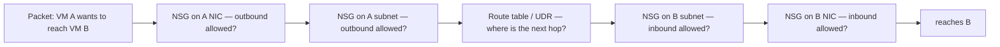
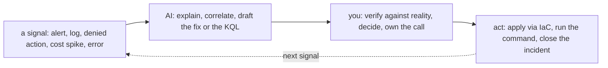

# Azure — Operating It (the day-2 reality)

> The [README](README.md) is *what Azure is*; [architecture](architecture.md) is *how
> it's structured*; this note is **what running it actually looks like** — the
> operations brief, what pages you at 3 a.m., the real ops work broken down by
> cadence, and how AI earns its place as a co-pilot in the operating loop (distinct
> from the [learning ramp](ai-ramp.md)).

## The brief — what "operating Azure" means

On-prem, operations meant hands on hardware: swapping disks, patching boxes, walking
the datacenter. On Azure the hardware is gone and the job shifts up: **you operate by
declaring intent, watching what the platform does with it, and keeping the result
secure, reliable, and affordable.** The three questions that define day-2 work:

- **Is it healthy?** — and would you know before a user tells you? (observability)
- **Is it safe?** — least privilege holding across *both* planes, nothing exposed,
  nothing drifting?
- **Is it affordable?** — no forgotten resource quietly billing, no workload on the
  wrong SKU or tier?

Everything below is those three questions, made concrete.

## Ops notes — what pages you on Azure (and what should)

The failure modes that actually generate incidents, most of them the customer-side of
the [shared-responsibility line](architecture.md):

- **The public blob container** — private data made public by an anonymous-access
  setting on a Storage Account; the canonical Azure exposure. Public network access
  disabled by default + a Defender for Cloud finding that someone *reads*
  ([`the-stack/07`](../../the-stack/07-security.md)).
- **The leaked credential** — a storage **account key** or a service-principal secret
  committed to a repo, or a broad **SAS token** that never expires. This is *why* the
  repo preaches managed identities and RBAC over keys ([`identity`](../../cross-cutting/identity-iam.md));
  secret-scanning in CI is table stakes.
- **"Why can't this reach that?"** — the daily networking incident, with an Azure
  twist: an **NSG evaluated at both the subnet and the NIC** must *both* allow the
  traffic, and a **UDR** can silently blackhole it. The
  [debug ladder from `the-stack/02`](../../the-stack/02-network.md) applies unchanged:

- **The bill surprise** — egress, cross-zone traffic, a forgotten **Bastion host** or
  **NAT gateway** or GPU VM ([`cost`](../../cross-cutting/cost.md)). On Azure this
  pages you as a **Budget alert** if you set one, or as an invoice if you didn't.
- **Single-zone when you meant zone-redundant** — a "highly available" service with
  everything in one zone, discovered during the zone outage it was supposed to survive
  ([`the-stack/01`](../../the-stack/01-physical.md)).
- **The Entra-role-vs-RBAC denial** — an action denied not because a grant is missing
  but because it was made in the *wrong plane*: you're a subscription Owner trying to
  do a directory task, or a Global Admin who was never given resource access
  ([`architecture.md`](architecture.md)). Azure's signature 3-a.m. head-scratcher.
- **RBAC scope drift** — the role assigned at the subscription (or worse, the
  management group) that flows down further than anyone intended, discovered the day
  it's abused. Least privilege is an ongoing review, not a one-time grant.

## The ops work, broken down

The recurring work of an Azure admin, decomposed by **cadence** — because "what does
this job actually involve" is best answered by what you do, and how often:

| Cadence | Task | Surface | Why it matters |
| --- | --- | --- | --- |
| **Continuous (automated)** | Azure Monitor alerts on health, latency, error rate, budget; Defender for Cloud findings | observability, cost, security | The system watches itself; you get paged, not surprised. |
| **Continuous (automated)** | VM Scale Set replaces unhealthy instances; auto-repair on | compute | Cattle, not pets — failure is handled, not attended. |
| **Daily** | Triage Defender for Cloud + Sentinel alerts; act on the real ones | security, observability | Findings only help if someone reads and acts on them. |
| **Daily** | Answer "why can't X reach Y" (NSG/UDR) and "who did this" (Activity Log) | networking, identity | The bread-and-butter incident and audit questions. |
| **Weekly** | Review RBAC: over-broad assignments, `Owner` too high, stale service principals | identity | Least privilege decays; this is how you catch the drift. |
| **Weekly** | Cost Management review: anomalies, untagged spend, top movers | cost | Catch the forgotten resource before the invoice does. |
| **Monthly** | Right-size from utilization; revisit reservations / savings plans / Spot | cost, compute | Most VMs are oversized because nobody looked. |
| **Monthly** | Patch/refresh images; roll the scale set from a new Compute Gallery image | compute, security | Closes known-CVE exposure; reimage over patch-in-place. |
| **Quarterly** | Restore-test from a Recovery Services Vault; verify RPO/RTO for real | storage | An untested backup is a hope ([`the-stack/04`](../../the-stack/04-storage.md)). |
| **Quarterly** | Access recertification; review Azure Policy + management-group guardrails | identity, security | Prove the guardrails still hold; audits want evidence. |
| **On-incident** | Detect → contain → eradicate → recover → write the post-mortem | all | The judgment the whole repo is about; the calm at 3 a.m. |
| **On-change** | Everything through Bicep/Terraform + review, not the portal | provisioning | The portal is for looking; changes go through code ([`iac`](../../cross-cutting/iac-and-config.md)). |

Two things this table makes visible. First, **most of the routine work is automated
or should be** — the human job is triage, review, and judgment, not toil. Second,
**the review cadence (weekly RBAC, weekly cost, quarterly restores) is the part teams
skip and regret** — it's unglamorous, and it's exactly where drift, overspend, and
un-restorable backups hide until they become incidents.

## How AI assists the operating work (not just the learning)

The [ai-ramp](ai-ramp.md) note is about getting *competent fast*; this is about AI in
the *daily operating loop*, once you already know Azure. Different job, same
discipline: **AI for speed, judgment for truth.**

Where AI genuinely pulls its weight in operations:

- **Incident co-pilot / rubber duck** — paste the Activity Log entry, the denied
  action, the `az` CLI error: *"what does this mean and what would you check next?"*
  AI is fast at turning a cryptic signal into a hypothesis — you test the hypothesis.
- **KQL authoring** — this is a real Azure strength to lean into. *"a KQL query over
  Log Analytics for 5xx spikes by URL in the last hour,"* or a **Sentinel** hunting
  query for a suspicious sign-in pattern. AI writes KQL fluently; you sanity-check it
  against known data before trusting the result.
- **Log & metric triage** — summarize a noisy log window, cluster similar errors,
  surface the anomaly. A strong first pass over volume no human wants to scroll.
- **Drafting the fix as code** — *"the Bicep / Terraform / Azure Policy change that
  closes this finding"* — as a reviewable draft that goes through the normal IaC gate,
  never a portal change AI talks you into.
- **Post-incident writing** — turn the timeline into a first-draft post-mortem; you
  correct the causality and own the conclusions.

Where AI must **not** be trusted in the operating loop — higher-stakes here than in
learning, because these run against production:

- It will **confidently misread a denied action** — it may blame the RBAC assignment
  when the real problem is the *Entra plane*, or one NSG when the other layer is the
  blocker. Reality (a re-run, a flow log, the effective-access blade) is the arbiter.
- It **invents `az` flags, resource-provider properties, and RBAC role names** that
  don't exist — verify before running anything that mutates state.
- It **drafts permissive fixes** — an NSG rule "to make it work" that opens
  `0.0.0.0/0`, or `Owner` where `Reader` would do. Every AI-drafted fix gets tightened
  by hand.
- It **cannot own the incident.** AI accelerates the lookup and the first draft; the
  decision, the blast-radius call, and the 3 a.m. accountability stay with you.

The rule that keeps it safe: **AI touches signals and drafts; you touch production.**
Anything AI suggests that changes state goes through the same review-and-IaC gate as
your own changes — the portal-is-for-looking discipline
([`iac`](../../cross-cutting/iac-and-config.md)) applies to AI's suggestions exactly
as it does to yours.

## Honest boundaries

The ops *discipline* here is ✋ — triage, incident method, the review cadence,
least-privilege review, restore-testing, treating cost and drift as signals — because
it's the same operations craft carried from real infrastructure and fleet work, where
the pager was real. The **identity slice is doubly ✋**: reading a denied action in the
Activity Log and untangling the two permission planes is exactly the Entra/RBAC ground
I've worked hands-on ([`identity`](../../cross-cutting/identity-iam.md)). The rest of
the Azure-service specifics (which blade, which alert, which finding type) are the 🧗
ramp, mapped and verified per this repo's method. The claim isn't "years on-call for a
production Azure estate"; it's a **transferable operating discipline plus a fast,
honest ramp onto Azure's tooling** — with identity already deep.
