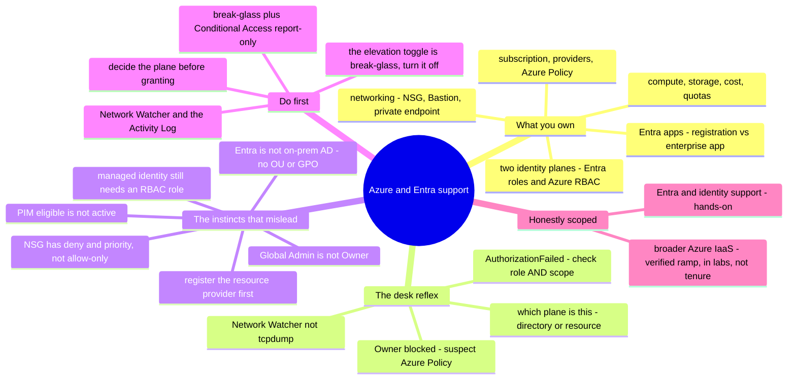

# Azure & Entra Support — the operator's transition guide

> 🌐 **Languages:** English (default) · [中文](../../docs/zh/platforms/azure/support.md)

---

> [`operations.md`](operations.md) covers the **cadence** of running your own Azure
> estate. This note covers the other half: **supporting Azure and Microsoft Entra ID
> as a break-fix craft** — the tickets that actually recur, exactly where you look,
> and **what a strong sysadmin from another lane (AWS, GCP, or on-prem AD) gets wrong
> when they inherit it.** Note the honest-scope split this page keeps: the **Entra /
> identity** half is ✋ hands-on (real tenant work — MFA, Conditional Access, PIM,
> Entra initial setup); the broader **Azure IaaS** is a 🧗 ramp. Both are labeled.

Azure's own [platform note](README.md) says the classic mistake in one line: *Entra =
who you are, RBAC = what you can touch — confusing them is the classic mistake.* That
sentence is the whole reason this page exists. An admin who "already knows cloud" ramps
onto Azure support fast, then gets burned in the places Microsoft made a different
choice: **two separate identity planes** (a Global Administrator is **not** an Owner),
Entra that is **not** on-prem AD, **resource providers** you must register, and a
governance plane (**Azure Policy**) that blocks even an Owner. This note names the
responsibilities, the recurring tickets and their diagnostic surface, and the exact
places a confident cloud (or AD) admin's reflexes mislead — with the AWS / on-prem-AD
contrast called out, because that's where most readers are coming from.

## What supporting Azure & Entra makes you responsible for

Mapped onto the [seven surfaces](../../00-the-operating-model.md), in the order tickets
arrive:

| Surface | What you're on the hook for |
| --- | --- |
| **Identity — the two planes** | **Entra ID directory roles** (Global Admin, User Admin — govern the *tenant*) vs **Azure RBAC** (Owner/Contributor/Reader — govern *resources* on the mgmt-group→subscription→RG→resource hierarchy). PIM (eligible vs active), Conditional Access, sign-in/audit logs, break-glass. **✋** |
| **Entra app identities** | App registration vs enterprise app (service principal), delegated vs application permissions + admin consent, expiring secrets, managed identities (system vs user-assigned). **✋** |
| **The subscription & governance** | Resource providers registered per subscription, **Azure Policy** guardrails, quotas — the "it's not RBAC, it's policy/the provider" tickets. |
| **Networking** | "Why can't X reach Y?" — **NSGs** (stateful, allow **and** deny, priority, default rules), UDR, Azure Firewall, **Bastion** (no public IP), Private Endpoint DNS, peering. |
| **Compute** | VM access via **Bastion / serial console / run-command**, managed disks, VMSS, boot diagnostics. |
| **Storage & data** | Storage access via **RBAC vs SAS vs account key**, public-access, firewall; Azure SQL connectivity. |
| **Load balancing & TLS** | Load Balancer (L4) vs Application Gateway (L7 + WAF + TLS), Key Vault certs, backend health. |
| **Observability** | **Activity Log** (control-plane "who did what"), Azure Monitor / Log Analytics (**KQL**), Resource Health, Service Health. |
| **Cost & quotas** | Budgets, egress, orphaned disks/IPs; per-subscription, per-region quotas. |
| **Escalation to Microsoft** | Network Watcher, the sign-in-logs CA tab, and when to open a support case. |

## The common tickets — and where you look

Break-fix on Azure is pattern recognition over the portal, two CLIs (`az`, `Az`
PowerShell), and the **Activity Log**. The reflex you're building is *"which plane /
surface answers this, and what are its limits?"*

**Identity — `AuthorizationFailed` (403), the #1 ticket.** The signed-in principal
lacks the action at the **selected scope**. Check **Access control (IAM) → Role
assignments** — confirm both the **role** *and* the **scope** — and allow for
**propagation (~10–30 min)**. `az role assignment list`, cross-checked against the
**Activity Log**. The signature Azure variant: *"I'm **Global Administrator** but I
can't see/manage this VM."* Global Admin is an **Entra directory** role; it grants
**nothing** over Azure resources. The one bridge is **Entra ID → Properties → "Access
management for Azure resources" → Yes**, which gives that user **User Access
Administrator** at root scope `/` — enough to *assign* roles (break-glass), not to
*use* the resource. Turn it back off after.

**Conditional Access blocks a legitimate sign-in** → `AADSTS53003
(BlockedByConditionalAccess)`. **Entra ID → Sign-in logs → the failed event →
Conditional Access tab** names the exact policy; the **Troubleshooting and support**
tab gives the reason. (A managed identity can't satisfy an MFA / compliant-device
grant.)

**App / service-principal auth.** The classic: `AADSTS7000215 "Invalid client secret
is provided"` = an **expired/rotated secret** (or you pasted the secret **ID** instead
of its **Value**) — regenerate under **Certificates & secrets**. `AADSTS50105` = the
principal isn't assigned to the app. And the debugging order that fixes most app auth:
**delegated vs application permission → admin consent (recorded on the enterprise app /
service principal, not the app registration) → secret expiry → redirect URI.** A
**managed identity with no RBAC role** at the target does nothing — grant it a role.

**"It's not RBAC — the resource provider isn't registered."** A deployment fails with
`MissingSubscriptionRegistration: The subscription is not registered to use namespace
'Microsoft.X'` — a one-time per-subscription acknowledgment, `az provider register
--namespace Microsoft.X`, **not** a permission problem.

**"It's not RBAC — Azure Policy denied it."** An **Owner** who can't deploy often hits
`RequestDisallowedByPolicy` — a **Deny-effect Azure Policy** (no public IPs, allowed
regions, required tags) at some scope. Policy governs *what state may exist* regardless
of who you are; suspect it before RBAC when an Owner is blocked.

**PIM — "I have the role but I'm denied."** With Privileged Identity Management a role
can be **eligible** (you must **activate** it just-in-time, sometimes with MFA /
justification / approval) rather than **active**. Check PIM before concluding the
permission is broken.

**Networking — "can't reach my VM."** Remember the shape: an **NSG** is **stateful**
(no reverse rule needed), has **allow *and* deny** rules by **numeric priority**
(lowest wins, first match), built-in **default rules** (incl. deny-all-inbound-from-
internet), and evaluates **subnet then NIC**. A VM with **no public IP** is reached via
**Bastion**, not a public SSH port. *Where you look:* **Network Watcher** — **IP flow
verify** (is this packet allowed/denied, by which rule), **Effective security rules**
(the merged subnet+NIC result), **Next hop** (UDR blackholes), **Connection
troubleshoot**, and **NSG flow logs** — not `tcpdump` on a fabric you don't own. A
**Private Endpoint** that won't resolve is usually a **private DNS zone not linked to
the VNet**.

**Storage — 403.** Distinguish **RBAC vs SAS vs account key vs public-access-disabled
vs network firewall**. The trap: a **subscription-scoped role does not grant blob/queue
*data* access** — assign a **data** role (e.g. Storage Blob Data Contributor) at the
account/container. Prefer a **user delegation SAS** (Entra-signed) over account keys.

**Quotas & cost.** `QuotaExceeded` on vCPUs is **two-tier (Total Regional + per-family)
per subscription, per region** — raise it in **My quotas**, per region, *ahead* of the
deploy. Cost surprises are egress and orphaned disks / public IPs; the guardrail is a
**budget**, and **Advisor** flags idle resources.

## The experience gap — what a strong sysadmin's instincts get wrong

The gap between an admin who's *done* Azure/Entra support and one who hasn't isn't the
portal — it's a set of load-bearing assumptions (imported from AWS, GCP, or on-prem AD)
that are **false here**, each with its failure mode.

- **Two identity planes — "Global Administrator is NOT Owner."** Microsoft says it
  plainly: *by default the Global Administrator has no access to Azure resources.*
  **Entra directory roles** (Global Admin, User Admin — manage users/apps/the tenant)
  and **Azure RBAC** (Owner/Contributor/Reader — manage resources at a scope) are
  **separate authorization systems that don't span each other**. Being all-powerful in
  one gives you *nothing* in the other; role **names even collide** with different
  meanings ("Security Administrator" is a different role in each). The single bridge is
  the **elevation toggle** → User Access Administrator at `/` (assign, not use) — a
  break-glass tool, not a daily driver. The [lab](#lab--global-admin-is-not-owner--runnable)
  proves it.
- **Entra ID is NOT on-prem AD.** No **OUs**, no **GPO**, no forest/domain/trusts, no
  LDAP tree. It's OAuth2/OIDC/SAML over a **flat directory** queried by **Microsoft
  Graph**; admin is scoped by **administrative units + RBAC** (not OU delegation), and
  device policy is **Intune**, not Group Policy. Your ADUC/GPMC/`gpresult` muscle memory
  does **not** transfer.
- **The hierarchy inherits down, additively — and there's no everyday user "deny."**
  RBAC assignments on **mgmt-group → subscription → RG → resource** flow to all children
  and are a **union**; there is **no user-authored explicit deny at a child scope**
  (system-managed **deny assignments** exist but you rarely author them). **Scope is
  everything** — the same role at `/` vs one RG is a different blast radius. (GCP folks:
  the inheritance transfers; AWS folks: there's no `Deny` statement to reach for.)
- **The subscription is the unit — and resource providers start unregistered.** The
  **subscription** is the billing/quota/isolation boundary (≈ an AWS account / GCP
  project); **management groups** group subscriptions for RBAC + Policy. And each
  **resource provider** must be **registered per subscription** first (the GCP
  API-enablement parallel; **AWS has no equivalent**, so AWS migrants get blindsided).
- **App registration vs enterprise application (service principal).** The **app
  registration** is the *definition* (client ID, redirect URIs, requested permissions,
  secrets) in the home tenant; the **enterprise app / service principal** is the
  *instance* in your tenant where **consent, sign-in logs, and local grants** live.
  **Delegated** (acts as the user) vs **application** (acts as itself, needs **admin
  consent**) permissions, and **admin consent lives on the service principal**, are the
  #1 app-auth confusion.
- **Managed identities still need an RBAC grant.** System-assigned (tied to the
  resource lifecycle) vs user-assigned (standalone, reusable) remove secret handling —
  but a managed identity **with no role assignment does nothing** (and its role changes
  can take **hours** to propagate). It's the AWS instance-profile / GCP attached-SA
  pattern; just remember the grant is a separate step.
- **NSG is not an AWS security group.** It's **stateful** (like an SG) but **has deny
  rules and numeric priority and built-in default rules** (like a NACL) and attaches at
  **subnet and/or NIC**. A hybrid neither AWS object matches — don't assume "allow-only";
  an explicit deny at a lower priority number wins. Read **Effective security rules**.
- **Azure Policy is a third plane.** RBAC = *who can act*; Policy = *what state may
  exist*. A Deny-effect policy blocks an **Owner** (`RequestDisallowedByPolicy`).
  Parallel to AWS SCPs / GCP Org Policy, but broader (it also audits and remediates).
- **"Who did it" is the Activity Log — and data-plane logging is opt-in.** The
  **Activity Log** is the control-plane audit (≈ CloudTrail management events / GCP
  Admin Activity), ~90-day retention; reading a secret or a row is a **resource log**
  captured **only** if you add a **diagnostic setting**.
- **The console briefly "lies."** RBAC changes take **~10–30 min** (managed identities:
  **hours**); *"access denied right after I granted it"* is usually propagation — refresh
  the token, don't thrash. And **soft-delete** windows (Key Vault 7–90 days, storage,
  resources) mean "deleted" isn't always gone — know the window before reusing a name.
- **Quotas are per-subscription, per-region, soft, and don't auto-grow** — a new region
  starts *low*; a big deploy fails on vCPU quota unless you raised it there first.

## What transfers, what doesn't

| Transfers strongly | Transfers with a caveat | Don't bring it |
| --- | --- | --- |
| Linux / guest-OS depth — Azure runs huge Linux fleets | Identity & least-privilege *thinking* — maps onto RBAC scoping + PIM (arguably better) | On-prem AD **OU/GPO** instincts — no OUs, no GPO; AUs + RBAC + Intune |
| DNS, TLS/certs, TCP/IP, CIDR | Firewall/ACL reasoning — NSG is stateful **and** ordered **and** allow/deny | "Global Admin can do everything" — false; Global Admin ≠ Owner |
| Structured troubleshooting — Azure errors are specific (`MissingSubscriptionRegistration`, `RequestDisallowedByPolicy`) | Hierarchy/inheritance intuition — transfers from GCP; AWS needs the no-`Deny` recalibration | AWS single-JSON-policy reflex — Azure splits Entra / RBAC / Policy into three planes |
| Scripting & IaC (`az`, Bicep, Terraform) | Consistency assumptions — recalibrate for ~10–30 min RBAC propagation (MI: hours) | "Security group is allow-only" — NSG has deny + priority |
| Log reading incl. **KQL** (SQL-adjacent) | "The service is just available" — register the resource provider first | Packet capture on the fabric — use Network Watcher |
| Change discipline (report-only, IaC, rollback) | | "Owner can deploy anything" — Azure Policy can deny even an Owner |

## First week / first 90 days

**Week one.**
1. **Internalize the Entra-roles-vs-Azure-RBAC split before granting anything** — for
   every request, decide *directory plane* or *resource plane*. Don't hand out Global
   Administrator to fix an Azure resource problem.
2. **Know Global Admin ≠ Owner and where the elevation toggle lives** — "Access
   management for Azure resources" → User Access Administrator at `/` — break-glass
   only, then turn it back off.
3. **Set a budget** on each subscription (the billing unit) and **register resource
   providers** before deploying.
4. **Learn Network Watcher + the Activity Log first**, then add **diagnostic settings**
   to capture data-plane logs and retain the Activity Log past ~90 days.

**First 30 days.**
5. **Stand up break-glass accounts and run Conditional Access in report-only** before
   enforcing — exclude break-glass from all CA policies, with phishing-resistant MFA.
6. **Understand app-reg vs enterprise-app + consent before debugging app auth** —
   delegated-vs-application, admin consent on the SP, then secret expiry.
7. **Grant every managed identity its RBAC role** (and allow hours for propagation).
8. **When an Owner can't deploy, suspect Azure Policy** (`RequestDisallowedByPolicy`)
   before RBAC.

**First 90 days.**
9. **PIM-activate before assuming a permission is broken** — eligible ≠ active.
10. **Raise quotas per-region ahead of deployments** — defaults are low and per-region.
11. **Expect eventual consistency** on new assignments (~10–30 min; MI hours) — refresh,
    don't thrash.
12. **Know the soft-delete windows** before reusing a name or declaring data gone.

## The AI-assisted ramp (Azure/Entra flavor)

- **Translate from what you know — and demand the deltas:** *"I know AWS IAM and
  on-prem AD — map Azure's two identity planes, RBAC scopes, and Entra onto them and
  flag ONLY the genuine differences."* Azure rewards the translate-then-verify method,
  because so much is renamed — but the **two-planes split and Azure Policy have no clean
  AWS analog**, so verify those hardest.
- **Draft the `az`/PowerShell/Bicep, least-privilege it by hand.** AI is strong here —
  and it **conflates Entra roles with Azure RBAC** (hands you Global Administrator when
  you needed Reader at a scope), **invents role/permission names**, forgets the resource
  provider, and proposes a scope whose **blast radius is the whole management group**.
  Verify against the docs ([field kit](#field-kit--real-tools--references)) and run it in
  a throwaway subscription. Same verify-hard discipline as everywhere —
  [`ai-workflow/`](../../ai-workflow/) and the [operating loop](operations.md).

## Honest boundaries

This page keeps a **split** honest line, and it's a real one.

✋ **The Entra / identity half is hands-on.** Real tenant work — **Entra ID initial
setup, tenant-wide MFA, a Conditional Access policy, PIM for privileged roles**, and the
identity lifecycle — is depth, not a ramp (the same line drawn in
[`saas-admin.md`](../../cross-cutting/saas-admin.md) and
[`identity-iam.md`](../../cross-cutting/identity-iam.md), and shared with the
[M365 support note](../../cross-cutting/m365-support.md), since Entra is the identity
backbone under both). Conditional Access, sign-in-log triage, and break-glass discipline
are ✋.

🧗 **The broader Azure IaaS is a verified ramp.** The resource-plane mechanics — RBAC
scopes and inheritance, VNet/NSG, Bastion, Azure Policy, the quota/provider edges — are
mapped, checked against the docs, and exercised in the runnable
[lab](#lab--global-admin-is-not-owner--runnable), carried by the **✋ transferable
foundations** (Linux, networking, DNS/TLS, identity thinking). Deep at-scale production
Azure (landing zones, AKS platform engineering, large multi-subscription estates) is
still ahead, and the notes say so rather than bluffing.

## Field kit — real tools & references

Pointers verified live on GitHub, grouped by use. Entra-identity and Azure-resource
tools are marked; several security tools double as "how does auth actually work" maps.

**Entra / identity (the ✋ half):**
- [`merill/awesome-entra`](https://github.com/merill/awesome-entra) — the best jump-off
  for Entra admin/ops tooling (maintained by an Entra PM).
- [`maester365/maester`](https://github.com/maester365/maester) — Pester-based tests that
  turn "is my tenant / Conditional Access configured right?" into pass/fail checks.
- [`AzureAD/AzureADAssessment`](https://github.com/AzureAD/AzureADAssessment) ·
  [`merill/idPowerToys`](https://github.com/merill/idPowerToys) — Microsoft's Entra
  health assessment, and a Conditional Access policy documenter (why was this sign-in
  blocked?).
- [`dirkjanm/ROADtools`](https://github.com/dirkjanm/ROADtools) ·
  [`Gerenios/AADInternals`](https://github.com/Gerenios/AADInternals) — dump and graph a
  tenant's roles/apps/consent offline; offensive-origin but the reference for
  *understanding* how Entra auth really works.

**Azure resources & governance (the 🧗 half):**
- [`Azure/azure-cli`](https://github.com/Azure/azure-cli) ·
  [`Azure/azure-powershell`](https://github.com/Azure/azure-powershell) — the primary
  inspect/repair surface; the issue trackers are de-facto troubleshooting KBs.
- [`microsoft/ARI`](https://github.com/microsoft/ARI) — Azure Resource Inventory: the
  "what do we even have?" baseline for any support engagement.
- [`Azure/Enterprise-Scale`](https://github.com/Azure/Enterprise-Scale) — landing-zone
  RBAC/network/policy baselines; a known-good to diff a misbehaving tenant against.
- [`iann0036/azure.permissions.cloud`](https://github.com/iann0036/azure.permissions.cloud)
  — crowdsourced RBAC action reference for decoding `AuthorizationFailed`.

**Posture & cost (multi-cloud, incl. Azure):**
- [`prowler-cloud/prowler`](https://github.com/prowler-cloud/prowler) ·
  [`nccgroup/ScoutSuite`](https://github.com/nccgroup/ScoutSuite) ·
  [`silverhack/monkey365`](https://github.com/silverhack/monkey365) — "what's wrong with
  this tenant?" audits spanning both planes.
- [`turbot/steampipe`](https://github.com/turbot/steampipe) (+ the Azure plugin) — query
  live Azure/Entra with SQL for ad-hoc misconfig/inventory questions.
- [`mivano/azure-cost-cli`](https://github.com/mivano/azure-cost-cli) ·
  [`infracost/infracost`](https://github.com/infracost/infracost) — a subscription cost
  breakdown from the terminal, and pre-deploy cost on Terraform.

**Authoritative docs** worth bookmarking over any blog: **Microsoft Learn** for
[Azure roles vs Entra roles](https://learn.microsoft.com/en-us/azure/role-based-access-control/rbac-and-directory-admin-roles),
[Elevate access (root scope)](https://learn.microsoft.com/en-us/azure/role-based-access-control/elevate-access-global-admin),
[Network Watcher](https://learn.microsoft.com/en-us/azure/network-watcher/network-watcher-overview),
and [app objects & service principals](https://learn.microsoft.com/en-us/entra/identity-platform/app-objects-and-service-principals).
*(Currency: **Azure AD was renamed Microsoft Entra ID** — error codes still say
`AADSTS…`; the classic subscription-admin roles are retired as of 2026 — access is
RBAC-only. Verify against the current docs.)*

## Lab — Global Admin is not Owner ✅ runnable

**Prove Azure's signature access lesson in your own hands.** A pure-local, stdlib-only
drill that models Azure's **two identity planes**: a **Global Administrator** (Entra
directory role) tries to read a VM and is **denied** (no Azure RBAC); an **Owner**
(Azure RBAC) tries to create a user and is **denied** (no Entra role); the **elevation
toggle** grants User Access Administrator at `/` (assign, not use); and the real fix is
a **scoped RBAC assignment** — with scope inheritance and isolation shown.

```bash
python3 platforms/azure/labs/global-admin-is-not-owner/two_planes_drill.py
```

Exit `0` means the lessons held (it doubles as a CI check). See
[`labs/global-admin-is-not-owner/`](labs/global-admin-is-not-owner/).

## The chapter on one screen


