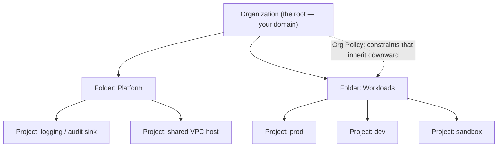
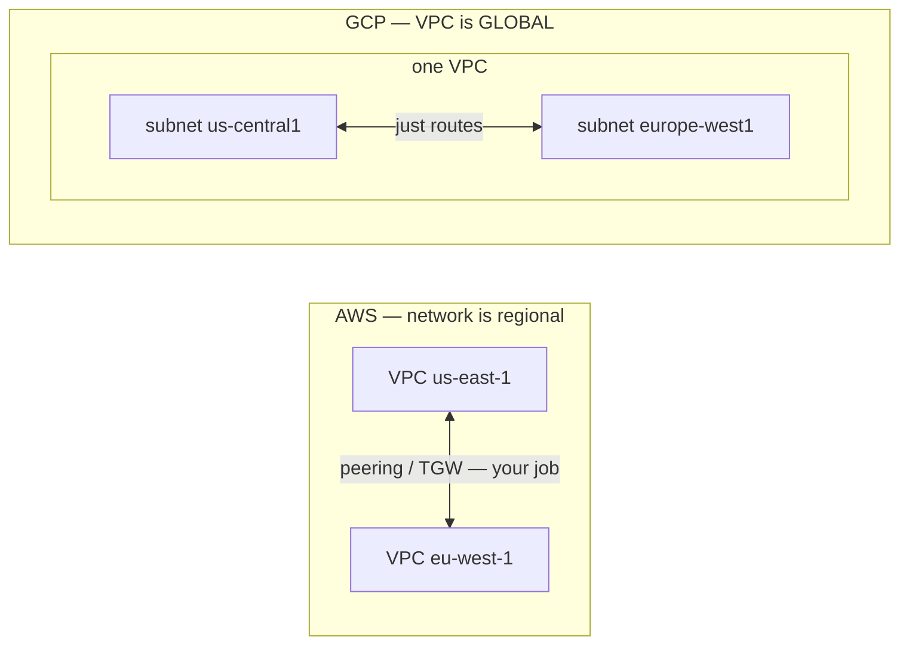
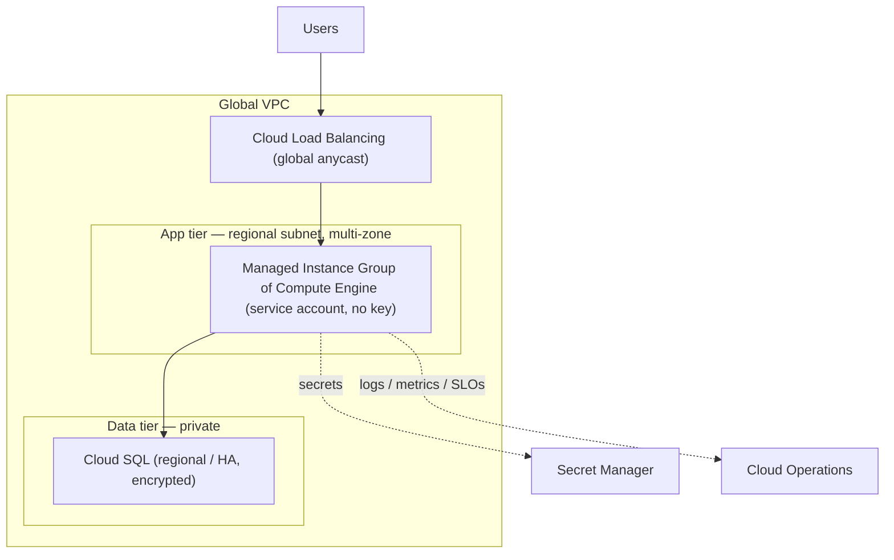

# GCP — Understanding the Architecture

> The [README](README.md) mapped GCP onto the seven surfaces — *what the services
> are.* This note is the layer up: *how GCP is structured*, so you design **with**
> its architecture instead of fighting it. Get the resource hierarchy, the
> region/zone geography, and the one genuinely-different idea — the **global VPC** —
> right, and most "why doesn't this work" questions answer themselves.

GCP isn't a pile of services; it's a small set of organizing principles with
services hung off them — and because those principles map so cleanly onto AWS, the
whole job is learning the four places Google did something different. Four
principles carry the weight.

## 1. The resource hierarchy — the blast-radius unit

The most consequential GCP structural decision isn't a service — it's how you carve
up the **resource hierarchy**: **Organization → Folders → Projects → resources.**

- **The Project is the fundamental unit** — of billing, of isolation, and of blast
  radius. It's the closest analog to an AWS account: resources in one project don't
  reach another's except through explicit grants. Prod and dev in *separate projects*
  is the baseline, not an optimization.
- **IAM inherits downward.** A role bound at the Org or Folder level flows to every
  Project beneath it — powerful and a footgun: a broad grant high in the tree is a
  broad grant everywhere below. This is the GCP-specific mistake to watch (see
  [`operations.md`](operations.md)).
- **Org Policy constraints** are the guardrails — org-wide rules that make whole
  categories of misconfiguration *impossible* below a point (policy-as-code from
  [`the-stack/07`](../../the-stack/07-security.md), GCP's answer to AWS SCPs).
- **Mental model:** a Project is a room with a lock; Folders group the rooms;
  the Organization is the building; Org Policy is the building rules. Design the
  hierarchy before you furnish it — it's painful to restructure later.

## 2. Regions & Zones — the geography you design against

[`the-stack/01`](../../the-stack/01-physical.md)'s failure-domain model, in GCP's
words:

- A **Region** (e.g. `us-central1`) is a geographic area — pick it for latency to
  users, data residency, and service availability (not every service is in every
  region).
- A **Zone** (e.g. `us-central1-a`) is one or more discrete data centers with
  independent power, cooling, and networking. **Multi-zone is how you survive a
  building failure;** both replicas in one zone is the mistake the failure-domain
  model exists to prevent.
- GCP's cleaner HA primitive: **regional resources** (a regional Persistent Disk
  synchronously replicates across two zones; a regional Managed Instance Group
  spreads instances across zones for you) — often a better default than hand-placing
  across zones.

## 3. The global VPC — GCP's signature difference

This is the one place your AWS instinct will actively mislead you, so give it real
attention:

- **One VPC spans the planet; subnets are regional.** A single VPC can hold subnets
  in every region, and they route to each other by default — no peering, no transit
  gateway. Multi-region design that's a project on AWS is "just routes" here
  ([`the-stack/02`](../../the-stack/02-network.md)).
- **Firewall rules target tags or service accounts**, not just IP ranges — a
  different, identity-aware model than AWS security groups.
- The trap: an AWS admin plans regional VPCs and peering on GCP and builds something
  needlessly complex, or assumes isolation the global VPC doesn't give. Know the
  model before you draw the diagram.

## 4. Service-account-centric IAM — where your job starts

GCP IAM binds **roles to members on the resource hierarchy**, and the default
workload identity is the **service account**:

- **Service accounts are the "no key on the box" answer** — attach one to a Compute
  Engine VM or Cloud Run service and code authenticates as it, with no key file
  anywhere ([`identity`](../../cross-cutting/identity-iam.md)).
- **Roles come in three grades:** primitive (owner/editor/viewer — too broad for
  real use), predefined (the everyday choice), and custom (exactly the permissions a
  task needs). Reach for predefined at the narrowest scope; write custom when you
  must.
- **Shared responsibility:** Google secures the data centers, hardware, and managed-
  service internals; your data, IAM, network config, and encryption choices are
  always yours — and, as everywhere, most breaches live on your side of that line
  ([`the-stack/07`](../../the-stack/07-security.md)).

## The Architecture Framework — the design checklist

Google's own "is this a good architecture" lens, worth knowing as a review pass:
operational excellence, security, reliability, performance & cost optimization —
plus the SRE heritage that makes **SLOs native** rather than bolted on
([`the-stack/06`](../../the-stack/06-observability.md)). Used well, it's the set of
questions to ask *before* shipping — the same "what would break, what's exposed,
what's this costing" instinct this repo teaches, in Google's packaging.

## A reference architecture — how the surfaces compose

The canonical three-tier web app, and where each surface shows up:

Every surface is present: **identity** (attached service account, no key),
**networking** (global VPC, regional subnet, firewall rules), **compute** (regional
MIG), **storage** (Cloud SQL HA, encrypted), **observability** (Cloud Operations,
native SLOs), **security** (Secret Manager, encryption). Read this and you can see
the whole [skill map](skills-map.md) doing one job.

## Honest boundaries

🧗 **ramp, honestly — and more so than AWS.** This is the transferable architecture
model — hierarchy/blast-radius design, failure domains, shared responsibility —
mapped onto GCP and verified against its docs, with **no production GCP operations
claimed** (the [README](README.md) says the same). The *instincts* underneath
(blast-radius thinking, multi-zone placement, least privilege, "design the hierarchy
before you furnish it") are ✋ — from real infrastructure and fleet work
([`the-stack`](../../the-stack/) draws on it) — but every GCP-service specific here is
the ramp. The claim is a sound architectural model plus a fast, verifiable ramp onto
GCP's version of it — the repo's honest position ([`WHY.md`](../../WHY.md)), applied
to architecture, with the four outliers (global VPC, projects, custom machine types,
service-account IAM) flagged as where the AWS reflex fails.
