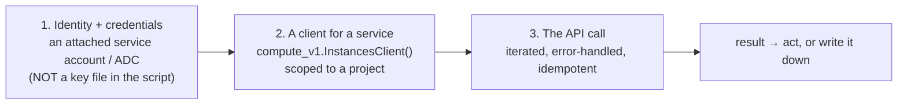
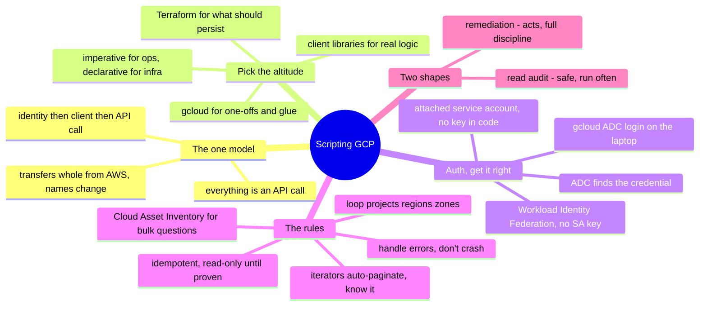

# GCP — Scripting the API (managing & operating from code)

> [`architecture`](architecture.md) is how GCP is structured; [`operations`](operations.md)
> is what running it looks like. This note is the *how*: **driving GCP through its
> API from code** — the concrete craft behind move #3 of the
> [operating model](../../00-the-operating-model.md), "drive the platform through its
> API and codify it." The console is for looking; scripts and IaC are for doing.

Everything in GCP is an API call. The console, `gcloud`, Terraform, the client
libraries — all wrappers over the same API. Once you internalize that, "how do I
automate X?" stops being a search for a feature and becomes *"which API call, with
which identity, handling which failure modes?"* This is where a scripting-and-Linux
background ([`foundations/`](../../foundations/)) turns directly into cloud operations
skill — and it transfers whole from AWS, only the names change.

## The one model: everything is `(identity) → (client) → (API call)`

Every script you write against GCP is the [operating model](../../00-the-operating-model.md)'s
three moves, in code:

Get those three right — a **scoped identity**, a **project-aware client**, and a
**properly-called API** — and you can automate anything GCP exposes.

## The tooling ladder — pick the right altitude

Four ways to drive the API, from quick to durable; reaching for the wrong altitude is
a common mistake:

| Tool | What it is | Reach for it when |
| --- | --- | --- |
| **`gcloud` CLI** | the API as shell commands | one-off checks, quick fixes, glue in a Bash script, exploring |
| **client libraries** (`google-cloud-*`, Python) | the API as a library | real logic — loops, branching, data shaping, an actual tool |
| **Cloud Shell** | CLI + libraries in a managed shell | ad-hoc ops without local creds |
| **Terraform / Config Connector** | *declarative* desired state | anything that should be reproducible, reviewed, destroyable ([`iac`](../../cross-cutting/iac-and-config.md)) |

The dividing line: **`gcloud` and the client libraries are *imperative* — "make this
call now"; Terraform is *declarative* — "this is what should exist."** Use imperative
scripts for *operations* (inventory, remediation, one-off queries); use IaC for
*provisioning* (infrastructure that should persist). Building persistent
infrastructure with a `create_*` script instead of Terraform is fighting the grain.

## Authentication — get this right or nothing else matters

The single most important rule, and the one AI and tutorials get wrong most often:
**never put a service-account key file in a script or repo.** The credential chain —
GCP calls it **Application Default Credentials (ADC)** — in order of preference:

- **On a Compute Engine VM / Cloud Run / GKE** → an **attached service account**. The
  client libraries pick it up automatically via ADC; there is *no key anywhere*. The
  correct default for anything running in GCP (the analog of an AWS instance role).
- **On your laptop** → `gcloud auth application-default login` — short-lived,
  auto-refreshed user credentials the libraries find through ADC.
- **For workloads outside GCP** → **Workload Identity Federation**, so an external
  identity (a CI system, another cloud) gets short-lived GCP tokens with **no SA key
  at all**.
- **Never** → a service-account **key JSON** downloaded and referenced in the script,
  committed to a repo, or baked into an image. That's the leaked-key incident from
  [`operations.md`](operations.md), pre-committed.

The client libraries walk ADC for you — which is *why* well-written GCP scripts
construct a client with no credential argument at all. The absence of a key in your
code is the point.

## The rules that separate a working script from a footgun

The same idempotence-and-error-handling discipline from
[`foundations/`](../../foundations/), in GCP's specifics:

- **Iterate the pages.** GCP client libraries return **iterators that auto-paginate**
  — convenient, but know it's happening, and don't materialize a million-row result
  into memory. For `gcloud`, remember `--page-size` and that a default list may
  truncate.
- **Loop projects, regions, and zones.** GCP resources live *per project*, and many
  are **zonal or regional** ([`architecture.md`](architecture.md)). A script that
  inventories "everything" from one project, one region, silently sees a slice — the
  GCP version of AWS's forgotten-region bug, one level up (you loop *projects* too).
- **Reach for Cloud Asset Inventory for bulk questions.** Rather than looping every
  API in every project, **Cloud Asset Inventory** answers "every resource of type X
  across the org" in one query — the right tool for org-wide audit, and a genuinely
  GCP-strong angle.
- **Handle errors per resource, don't crash the run.** One project you lack
  permission in, or one throttled call, should log and continue — not abort the whole
  scan.
- **Expect quota/rate limits; back off.** GCP rate-limits APIs; heavy scripts need
  exponential backoff, not a tight retry loop.
- **Be idempotent for mutations.** A remediation script must be safe to re-run:
  check-then-act, not blind-act — the same rule Terraform enforces structurally
  ([`iac`](../../cross-cutting/iac-and-config.md)).
- **Read-only until proven.** Develop against `list`/`get` calls first; add
  `create`/`delete`/`update` only once the logic is proven, behind a dry-run flag.

## Two shapes of automation script

Most GCP operational scripting is one of two shapes:

- **The read/audit script** — inventory, compliance check, cost/label report, "find
  every X that violates Y." Read-only, safe, run often. A compliance variant ("every
  public bucket," "every firewall open to 0.0.0.0/0," "every unencrypted disk") is the
  same skeleton with a different filter — and Cloud Asset Inventory often does it
  faster than looping.
- **The remediation / orchestration script** — *acts*: label unlabeled resources,
  stop idle instances on a schedule, rotate a key, drain-and-replace a node. Mutating,
  so it carries the full discipline above — idempotent, scoped identity, dry-run
  first, logged.

The progression to internalize: **read scripts build the muscle safely; remediation
scripts apply it with care.** Start every new automation as a read script that finds
the problem, then add the fix once you trust the finding.

## How AI assists writing the automation

The [operating-loop AI section](operations.md) covered AI in incidents; this is AI
writing the *code*. Genuinely accelerating, with specific traps:

- **Great for the skeleton:** *"a Python script using google-cloud-storage that lists
  every bucket without uniform bucket-level access, across a project"* — AI writes the
  shape in seconds, usually structurally right.
- **Great for the API lookup:** *"which client library and method get a bucket's IAM
  policy?"* — faster than digging docs, *if* you verify the call exists.
- **Where AI burns you (verify hardest):** it **invents client-library method names
  and, worse, wrong `google-cloud-*` package names** (the package split is notoriously
  easy to get wrong — `google-cloud-compute` vs `google-cloud-storage` vs the older
  `google-api-python-client`); it **forgets to iterate projects**; it **confuses
  zonal/regional/global** resources; and it **hardcodes or references an SA key file**
  instead of using ADC. Every one of those is a rule above — own the rules and treat
  AI's draft as a first pass to audit. Run it read-only against a sandbox project; the
  missing project or the truncated result shows up immediately.

## The admin discipline (what to be able to do)

- Authenticate a script via **ADC / an attached service account**, no key in the
  code, and explain the credential chain that made it work.
- Write an **iterated, project/region-aware, error-handled** read script — and prove
  it sees resources a naive single-project script misses.
- Use **Cloud Asset Inventory** for an org-wide question instead of looping every API.
- Turn a read script into a **safe remediation** — idempotent, dry-run-first, logged.
- Choose **`gcloud` vs. client library vs. Terraform** for a task and defend the
  altitude.
- Read a GCP **API error** (`PERMISSION_DENIED`, `RESOURCE_EXHAUSTED`, `NOT_FOUND`)
  and know what each tells you to do next.

## Honest boundaries

✋ **where it transfers, 🧗 where it's GCP.** The scripting-and-automation *discipline*
is hands-on — Python and Bash as everyday tools, iterated/idempotent/error-handled
automation, and the "read-only first, then act" instinct built on real fleet scripting
([`foundations/`](../../foundations/)) — and that discipline transfers whole onto GCP's
API. But the GCP-*specific* surface (the exact client libraries, ADC quirks, service
behaviors) is the 🧗 ramp, mapped and verified per this repo's method, with **no
production GCP claimed**. The claim is a strong automation foundation plus a fast,
verifiable ramp onto GCP's API surface — the honest position of every GCP doc here
([`WHY.md`](../../WHY.md)).

## The doc on one screen

