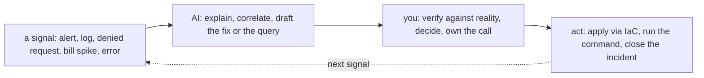

# GCP — Operating It (the day-2 reality)

> The [README](README.md) is *what GCP is*; [architecture](architecture.md) is *how
> it's structured*; this note is **what running it actually looks like** — the
> operations brief, what pages you at 3 a.m., the real ops work broken down by
> cadence, and how AI earns its place as a co-pilot in the operating loop (distinct
> from the [learning ramp](ai-ramp.md)).

## The brief — what "operating GCP" means

On-prem, operations meant hands on hardware. On GCP the hardware is gone and the job
shifts up: **you operate by declaring intent, watching what the platform does with
it, and keeping the result secure, reliable, and affordable.** The three questions
that define day-2 work:

- **Is it healthy?** — and would you know before a user tells you? (observability —
  and GCP's native SLOs make this a first-class question)
- **Is it safe?** — least privilege holding, nothing exposed, no binding at the
  wrong hierarchy level?
- **Is it affordable?** — no forgotten resource billing, no workload on the wrong
  pricing model, no egress surprise?

Everything below is those three questions, made concrete.

## Ops notes — what pages you on GCP (and what should)

The failure modes that actually generate incidents, most on the customer side of
the [shared-responsibility line](architecture.md):

- **The public Cloud Storage bucket** — private data made public by a
  misconfiguration; the canonical cloud breach. Uniform bucket-level access + a
  Security Command Center finding that someone *reads* ([`the-stack/07`](../../the-stack/07-security.md)).
- **The leaked service-account key** — an SA key JSON committed to a repo, found by
  scanners. This is *why* GCP pushes attached service accounts and Workload Identity
  Federation over key files ([`identity`](../../cross-cutting/identity-iam.md), and
  [`automation.md`](automation.md)); a key in git is an incident.
- **"Why can't this reach that?"** — the daily networking incident, with a
  GCP-specific twist: firewall rules target **tags/service accounts**, and the
  **global VPC** routes across regions by default, so the AWS-shaped mental model
  gives wrong answers. The [debug ladder from `the-stack/02`](../../the-stack/02-network.md)
  still applies — just against GCP's model.
- **The bill surprise** — egress, cross-region traffic, or a forgotten instance
  ([`cost`](../../cross-cutting/cost.md)). It pages you as a **budget alert** if you
  set one, or as an invoice if you didn't.
- **Single-zone when you meant regional** — a "highly available" service with both
  replicas in one zone, discovered during the zone event it was meant to survive.
  Regional PD / regional MIG exist precisely to prevent this ([`the-stack/01`](../../the-stack/01-physical.md)).
- **An IAM binding at the wrong hierarchy level** — a role granted at the Org or
  Folder that inherits down to every project, discovered when someone has access they
  shouldn't. Inheritance is power and hazard ([architecture](architecture.md)).

## The ops work, broken down

The recurring work of a GCP admin, decomposed by **cadence** — because "what does
this job actually involve" is best answered by what you do, and how often:

| Cadence | Task | Surface | Why it matters |
| --- | --- | --- | --- |
| **Continuous (automated)** | Alerts on health, error rate, latency, budget, security findings; **SLO burn-rate alerts** | observability, cost, security | The system watches itself; you get paged, not surprised. GCP's native SLOs make this sharp. |
| **Continuous (automated)** | Managed Instance Group heals/replaces unhealthy instances; autoscaling | compute | Cattle, not pets — failure is handled, not attended. |
| **Daily** | Triage alerts and Security Command Center findings; act on the real ones | security, observability | Findings only help if someone reads and acts on them. |
| **Daily** | Answer "why can't X reach Y" and "who did this" (Cloud Audit Logs) | networking, identity | The bread-and-butter incident and audit questions. |
| **Weekly** | Review IAM: bindings at each hierarchy level, over-broad roles, unused service accounts | identity | Inherited grants decay into over-privilege; this catches the drift. |
| **Weekly** | Cost review: anomalies, untagged/unlabeled spend, top movers | cost | Catch the forgotten resource before the invoice. |
| **Monthly** | Right-size from utilization; revisit committed-use discounts / preemptible coverage | cost, compute | Most instances are oversized because nobody looked. |
| **Monthly** | Refresh custom images; roll the MIG from a new image | compute, security | Closes known-CVE exposure; reimage over patch-in-place ([`the-stack/03`](../../the-stack/03-compute-and-images.md)). |
| **Quarterly** | Restore-test a backup; verify RPO/RTO for real | storage | An untested backup is a hope ([`the-stack/04`](../../the-stack/04-storage.md)). |
| **Quarterly** | Access recertification; review Org Policy constraints and hierarchy guardrails | identity, security | Prove the guardrails still hold; audits want evidence. |
| **On-incident** | Detect → contain → eradicate → recover → write the post-mortem | all | The judgment the whole repo is about; the calm at 3 a.m. |
| **On-change** | Everything through IaC + review, not the console | provisioning | The console is for looking; changes go through code ([`iac`](../../cross-cutting/iac-and-config.md)). |

Two things this table makes visible. First, **most of the routine work is automated
or should be** — the human job is triage, review, and judgment, not toil. Second,
**the review cadence (weekly IAM, weekly cost, quarterly restores) is the part teams
skip and regret** — it's unglamorous, and it's exactly where inherited over-privilege,
overspend, and un-restorable backups hide until they become incidents.

## How AI assists the operating work (not just the learning)

The [ai-ramp](ai-ramp.md) note is about getting *competent fast*; this is about AI in
the *daily operating loop*, once you already know GCP. Different job, same discipline:
**AI for speed, judgment for truth.**

Where AI genuinely pulls its weight in operations:

- **Incident co-pilot / rubber duck** — paste the audit-log entry, the denied
  request, the `gcloud` error, the stack trace: *"what does this mean and what would
  you check next?"* AI is fast at turning a cryptic signal into a hypothesis — you
  test it.
- **Query authoring** — *"a Cloud Logging query to find 5xx spikes by path in the
  last hour"* — AI writes the logging query language / BigQuery SQL fluently; you
  sanity-check against known data before trusting the graph.
- **Log & metric triage** — summarize a noisy log window, cluster similar errors,
  surface the anomaly — a strong first pass over volume no human wants to scroll.
- **Drafting the fix as code** — *"the Terraform / Org Policy / firewall-rule change
  that closes this finding"* — a reviewable draft through the normal IaC gate, never a
  console change AI talks you into.

Where AI must **not** be trusted in the GCP operating loop — the failure modes are
higher-stakes than in learning, and one is GCP-specific:

- **It gives you AWS-shaped advice on GCP.** Trained on AWS-heavy text, AI will hand
  you **regional-VPC / peering** networking guidance for a **global VPC**, or
  security-group thinking for tag/SA-targeted firewall rules. Catch it every time —
  this is the single most common GCP AI error.
- It **invents `gcloud` flags, resource names, and API fields** that don't exist —
  verify before running anything that mutates state.
- It **drafts permissive fixes** — a firewall rule or IAM binding "to make it work"
  that's far too broad. Every AI-drafted fix gets tightened by hand.
- It **cannot own the incident.** AI accelerates the lookup and the first draft; the
  decision, the blast-radius call, and the 3 a.m. accountability stay with you.

The rule that keeps it safe: **AI touches signals and drafts; you touch production.**
Anything AI suggests that changes state goes through the same review-and-IaC gate as
your own changes ([`iac`](../../cross-cutting/iac-and-config.md)).

## Honest boundaries

🧗 **ramp — GCP has no production hands-on here, and it's labeled that way.** The ops
*discipline* is ✋ — triage, incident method, the review cadence, least-privilege
review, restore-testing, treating cost and drift as signals — because it's the same
operations craft carried from real infrastructure and fleet work, where the pager was
real. But every GCP-service specific (which console, which finding, which SLO tool) is
the 🧗 ramp, mapped and verified per this repo's method, **not** claimed as time
on-call for a production GCP estate. The claim is a transferable operating discipline
plus a fast, honest ramp onto GCP's tooling — and the AI-assisted operating loop above
is how that ramp gets applied without pretending the judgment came from the machine.
