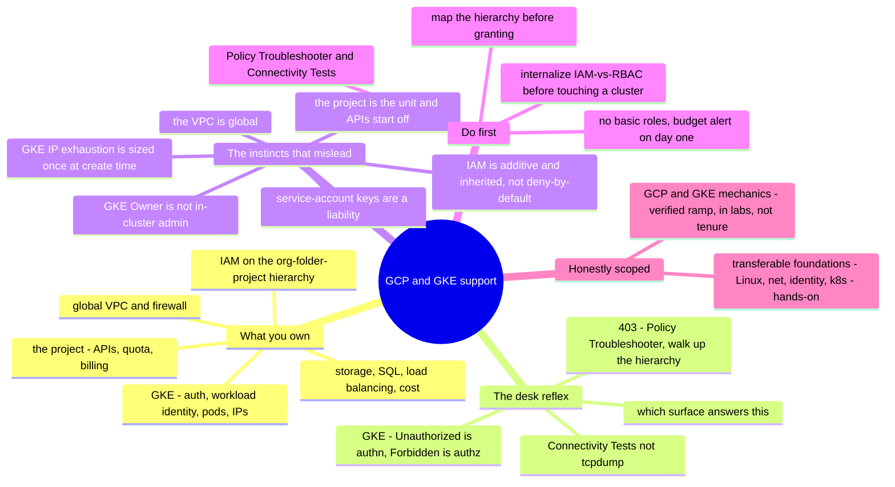

# GCP & GKE Support — the operator's transition guide

> 🌐 **Languages:** English (default) · [中文](../../docs/zh/platforms/gcp/support.md)

---

> [`operations.md`](operations.md) covers the **cadence** of running your own GCP
> estate. This note covers the other half: **supporting GCP and GKE as a break-fix
> craft** — the tickets that actually recur, exactly where you look, and, most
> usefully, **what a strong sysadmin from another lane (especially AWS) gets wrong
> when they inherit it.** GCP stays a 🧗 ramp here; the transferable foundations under
> it (Linux, networking, identity, Kubernetes concepts, troubleshooting) are the ✋
> that carries the load — which is the whole point of this page.

GCP is, as the [platform note](README.md) says, mostly *renamed AWS/Azure* — which is
exactly the trap. An admin who "already knows cloud" ramps onto GCP support fast, then
gets burned in the handful of places Google made a genuinely different design choice:
IAM that's **additive and inherited down a hierarchy** instead of deny-by-default, a
**global VPC**, the **project** as the unit of everything, and — the part that
surprises even people who know both AWS *and* Kubernetes — **GKE's two separate auth
planes**. This note names the responsibilities, the recurring tickets and their
diagnostic surface, and the exact places a confident cloud admin's reflexes mislead —
with the AWS contrast called out, because that's where most readers are coming from.

## What supporting GCP & GKE makes you responsible for

Mapped onto the [seven surfaces](../../00-the-operating-model.md), in the order tickets
arrive:

| Surface | What you're on the hook for |
| --- | --- |
| **Identity & access (Cloud IAM)** | "Why is this denied / why does this have access?" — roles + bindings on the **org→folder→project→resource** hierarchy, inheritance, service accounts, impersonation. The biggest time sink. |
| **The project & org** | APIs enabled per project, org-policy constraints, quotas — the "it's not IAM, it's the project" tickets. |
| **Networking (global VPC)** | "Why can't X reach Y?" — firewall rules (allow **and** deny, priority), the **global** VPC, Cloud NAT, Private Google Access, IAP, Cloud DNS. |
| **Compute Engine** | SSH via **OS Login / IAP**, the serial console, the attached service account, disk resize. |
| **GKE** | Cluster auth (`get-credentials` + the auth plugin), the **IAM-vs-RBAC two planes**, Workload Identity, pod failures, **IP exhaustion**, private clusters. |
| **Storage & data** | Cloud Storage **uniform bucket-level access** vs ACLs, public-access prevention; Cloud SQL connectivity (Auth Proxy / private IP / authorized networks). |
| **Load balancing & TLS** | Google-managed SSL certs (the DNS-first, ~1-hour provision), backend health, 502s. |
| **Observability** | Cloud Logging (Logs Explorer), Monitoring, and **Cloud Audit Logs** (Admin Activity always-on vs Data Access opt-in). |
| **Cost & quotas** | Budgets, egress, forgotten resources; per-project, per-region quotas. |
| **Escalation to Google** | Policy Troubleshooter, Connectivity Tests, and when to open a Cloud Support case. |

## The common tickets — and where you look

Break-fix on GCP is pattern recognition over a small set of consoles, logs, and two
CLIs (`gcloud`, `kubectl`). The reflex you're building is *"which surface answers this,
and what are its limits?"*

**IAM — `403 PERMISSION_DENIED` (the #1 ticket).** The error reads
`Permission 'x.y.z' denied on resource (or it may not exist)` — note the *"or it may
not exist"*: a missing resource and a missing permission look identical. The cause is
usually a missing role binding, but it can be a grant that lives **up the hierarchy**
(a role on the folder cascades to every project under it) or an **org-policy** or
**IAM deny policy** blocking it from somewhere you can't see on the resource. *Where
you look:* the **IAM Policy Troubleshooter** (principal + permission + resource →
allow/deny with the *deciding* policy), and `gcloud projects get-iam-policy` /
`get-ancestors-iam-policy` to see inherited grants.

**"It's not IAM — the API isn't enabled."** A very common newcomer 403 is
`SERVICE_DISABLED` / *"API has not been used in project … before or it is disabled."*
GCP starts every project with almost everything **off**; fix is `gcloud services
enable <api>` for *that project*, not an IAM change.

**Networking — "can't reach it."** Remember the shape: firewall rules can **allow or
deny**, carry a **priority** (lower wins; at equal priority **deny beats allow**), and
are **directional** but **stateful**; every VPC ships an implied **deny-all-ingress**
and **allow-all-egress** at 65535. A no-external-IP VM needs **Cloud NAT** for egress
and **Private Google Access** to reach Google APIs. *Where you look:* **Connectivity
Tests** (Network Intelligence Center — simulates the packet's path and names the
blocking rule, GCP's reachability analyzer), plus **Firewall Rules Logging** and **VPC
Flow Logs** — not `tcpdump` on a fabric you don't own.

**Compute Engine — SSH.** The classic trap: **OS Login and metadata SSH keys are
mutually exclusive** — if OS Login is on, a pushed metadata key is rejected. Use
`gcloud compute ssh --troubleshoot` (add `--tunnel-through-iap`); for **IAP** SSH,
allow ingress from **`35.235.240.0/20`** to tcp:22 (no public IP, no bastion). When SSH
and the network are both down, the **serial console** is the rescue path.

**GKE — the part you were told to care about.**
- *kubectl can't authenticate* → since Kubernetes **v1.26** you must install
  **`gke-gcloud-auth-plugin`** (the in-tree `gcp` provider was removed). `gcloud
  container clusters get-credentials <cluster>` writes the kubeconfig.
- *The #1 GKE ticket — "I have access in the console but `kubectl` says Forbidden."*
  GKE has **two auth planes**: **Cloud IAM authenticates** you to the cluster (you need
  the IAM permission `container.clusters.get` just to reach the API server) and governs
  cluster-*infra* ops; **Kubernetes RBAC authorizes** what you do *inside* (get pods,
  read secrets, per namespace). GKE checks **RBAC first, then falls back to IAM** —
  access needs *either*. Two words, two failures: **`Unauthorized`** = authentication
  (bad/expired credential, missing plugin, no `container.clusters.get`); **`Forbidden`**
  = authenticated but neither RBAC nor an in-cluster IAM role grants the verb. The
  nasty trap: the IAM role **"Kubernetes Engine Cluster Admin" is NOT the RBAC
  `cluster-admin`** — it lets you change cluster infra but grants nothing *inside*. You
  fix in-cluster access with an **RBAC binding**, not by escalating IAM. (The [lab](#lab--gke-has-two-auth-planes--runnable)
  proves this; the object model is in [`cross-cutting/kubernetes.md`](../../cross-cutting/kubernetes.md).)
- *Workload Identity* (Pod → GCP API) fails when the KSA↔GSA annotation is wrong, the
  IAM Credentials API is off, WI isn't enabled on the node pool, or the metadata server
  is blocked — and it **silently falls back to the node's default SA**, masking the
  misconfig.
- *Pod states* localize the fault: **ImagePullBackOff** (name/tag, registry
  unreachable, node SA lacks Artifact Registry pull), **CrashLoopBackOff** (app/config/
  probe), **Pending/unschedulable** (`Insufficient cpu`/memory, taints, or IP
  exhaustion), **OOMKilled** (over the memory limit). Diagnose with `kubectl describe
  pod` / `logs` / `get events`.
- *`IP_SPACE_EXHAUSTED`* — the distinctive GKE trap. VPC-native clusters give pods
  **real VPC IPs** from an alias range, and each node grabs a whole **/24** (at the
  default 110 pods/node) — so your node ceiling is the number of `/24` slices in the
  **pod range**, not the raw subnet size. Undersize it at create time and new nodes
  silently fail, pods stick **Pending**, and autoscaling quietly stops. See it coming
  with **Network Analyzer**; fix with a discontiguous multi-pod-CIDR, a lower
  `--max-pods-per-node`, or a rebuild.
- *Private cluster `kubectl` timeout* usually means your source IP isn't in the
  cluster's **authorized networks**.

**Cloud Storage — 403.** If **uniform bucket-level access** is on, per-object ACLs are
ignored — grant **bucket IAM**; if a public URL 403s, **public access prevention** may
be overriding an `allUsers` grant.

**Cloud SQL — can't connect.** Pick the model: **Auth Proxy** (IAM, no allowlist),
**private IP** (needs VPC reachability), or **authorized networks** (public IP). Most
tickets are private-IP-without-reachability or public-IP-without-the-client-allowlisted.

**Load balancer & managed SSL cert.** A cert stuck **`FAILED_NOT_VISIBLE`** means
Google can't see your domain's A/AAAA pointing at the LB IP yet — the LB/DNS must exist
**first**, and provisioning takes **up to ~60 min** (then up to 30 more to serve).
502s / unhealthy backends are usually a **missing firewall rule for the health-check
ranges `130.211.0.0/22` and `35.191.0.0/16`**, or the backend isn't listening.

**Quotas & cost.** `Quota exceeded` is **per-project, per-region** — raise it *ahead*
of the launch. Cost surprises are egress and forgotten resources (idle external IPs,
unattached disks); the guardrail is a **budget alert**, and **Active Assist /
Recommender** flags idle resources.

## The experience gap — what a strong sysadmin's instincts get wrong

The gap between an admin who's *done* GCP/GKE support and one who hasn't isn't the
console — it's a set of load-bearing assumptions (many imported straight from AWS) that
are **false here**, each with its failure mode.

- **IAM is additive and inherited — not deny-by-default.** A principal's access is the
  **union** of every role granted at every level of the **org → folder → project →
  resource** hierarchy, and grants **cascade downward** — a `Storage Admin` role on a
  *folder* silently applies to every bucket beneath it, **invisibly when you inspect
  the bucket**. There is no per-identity policy document that's the source of truth
  (the AWS reflex); you walk *up* the tree. Classic allow-policies **can't say "deny"**
  (IAM **Deny policies** exist now but are a separate, newer system attached only at
  org/folder/project). The AWS instincts — *attach a policy to the identity, add an
  explicit Deny, read the identity's policy to know its access* — all mislead.
- **A GCP "role" is not an AWS "role."** Here you grant a **role** (a bag of
  permissions) *to* a member; in AWS a role is an identity you *assume*. And the
  **basic roles Owner/Editor/Viewer are dangerously broad** — thousands of permissions;
  treat Owner like `AdministratorAccess`. Use **predefined** or **custom** roles.
- **The project is the unit — and APIs start OFF.** The **project** is the atom of
  billing, quota, IAM scope, and API surface (closer to an *AWS account* than to
  anything called "project" elsewhere). Every service API must be **explicitly enabled
  per project** — a `SERVICE_DISABLED` 403 is not an IAM bug.
- **The VPC is global — unlearn the regional-VPC reflex.** One VPC spans all regions;
  **subnets are regional** (one subnet covers every zone in its region — the inverse of
  an AWS AZ-pinned subnet). VMs in different regions on the same VPC talk privately with
  **no peering, VPN, or transit gateway**. Rebuilding an AWS multi-VPC / per-region /
  Transit-Gateway design here is re-plumbing what GCP gives you free.
- **Firewall rules have deny + priority + direction — but are stateful.** A hybrid:
  NACL-like expressiveness (allow *and* deny, numeric priority, ingress-or-egress)
  with security-group-like statefulness (return traffic auto-allowed). The "SG is
  allow-only" reflex under-reads them.
- **Service accounts are first-class, and their keys are a liability.** An SA is **both
  an identity and a resource** (you grant others the right to *impersonate* it).
  Exported **SA JSON keys are GCP's long-lived-access-key problem** — prefer an
  **attached SA + Application Default Credentials**, **impersonation / short-lived
  tokens**, and for GKE **Workload Identity**.
- **Org Policy is a second control plane.** **Constraints** cap *what can be deployed /
  how resources are configured* (restrict locations, disable SA keys, require OS Login),
  attached up the hierarchy and inherited down — parallel to AWS **SCPs** but a
  *separate axis* from IAM's "who can act." Don't conflate the two.
- **GKE's two auth planes.** Covered above and in the lab — the single highest-value
  gotcha for someone who knows *both* AWS and Kubernetes. "Project Owner" does **not**
  automatically make `kubectl get secrets` work; in-cluster power comes from an **RBAC**
  binding, and `Unauthorized` (authn) ≠ `Forbidden` (authz).
- **GKE IP exhaustion has no AWS-brain analog at the same intensity.** The `/24`-per-
  node, size-it-once-at-create-time trap is nearly un-fixable later — a decision made
  weeks before it becomes a terminal outage.
- **The console briefly "lies" (eventual consistency).** IAM changes take **~2 min,
  up to 7+** (longer for group membership); enabling an API and managed SSL certs also
  lag. *"I granted it, still 403"* is often propagation — don't thrash.
- **"Who did it" is split.** **Admin Activity** audit logs are always-on and free;
  **Data Access** logs (who *read* the data) are **opt-in and cost money** — if you
  assume full read-history exists by default, there's a hole.
- **Quotas are per-project, per-region, soft, and don't auto-grow.** A high quota in
  one region doesn't carry to another; autoscalers hit the wall and **silently fail to
  create VMs**. Raise them *before* the event.

## What transfers, what doesn't

| Transfers strongly | Transfers with a caveat | Don't bring it |
| --- | --- | --- |
| Linux / guest-OS depth — same guest OS, your side of the line | Identity & least-privilege *thinking* — principle holds; the mechanism is *inverted* (union/inherit vs deny-override) | AWS IAM instincts — attach-to-identity, explicit-Deny, read-the-policy-to-know-access all mislead |
| DNS, TLS/certs, TCP/IP, **CIDR math** (you'll size pod ranges by hand) | Firewall/ACL reasoning — re-learn deny+priority+direction-but-stateful | Regional-VPC / per-region design — the GCP VPC is global |
| **Kubernetes concepts** (RBAC, namespaces, Deployments, HPA) — GKE is real upstream k8s | "The account is the blast radius" — it's the **project**, and org/folder policies cascade in | "Security group allow-list" reflex — GCP firewall has deny + priority |
| Structured troubleshooting, log reading, scripting | Consistency assumptions — recalibrate for IAM/API/cert propagation | Packet capture on the fabric — use Connectivity Tests + Flow Logs |
| Change discipline (pilot / IaC / rollback) — matters *more* here | | "Owner = full power inside the cluster" — false for GKE in-cluster actions |

## First week / first 90 days

**Week one.**
1. **Map the resource hierarchy and effective IAM before granting anything** — what
   folder is this project under, and what's already granted at org/folder that
   cascades in? Answer access questions with the **Policy Troubleshooter**, not guesses.
2. **Never hand out basic roles (Owner/Editor/Viewer) as a shortcut** — predefined or
   custom only.
3. **Set a budget + billing alert** — there's no auto-brake on spend.
4. **Learn two tools early: the IAM Policy Troubleshooter and Connectivity Tests +
   Network Analyzer** — they replace your packet-capture / policy-inspection habits.

**First 30 days.**
5. **Before touching any GKE cluster, internalize the IAM-vs-RBAC split** — Owner ≠
   in-cluster admin; `Unauthorized` = authn and `Forbidden` = authz; fix in-cluster
   access with an RBAC binding.
6. **Recognize `SERVICE_DISABLED`** — enable the API for that project; don't chase it as
   IAM.
7. **Use IAP + OS Login, not public IPs + bastions and static keys** — SSH becomes
   IAM-governed and instantly revocable; open only `35.235.240.0/20`.
8. **Prefer Workload Identity over SA keys** in GKE; attached SA + ADC / impersonation
   elsewhere.

**First 90 days.**
9. **Size pod CIDRs generously at cluster create** — `max_nodes ≈ 2^(24 − pod_prefix)`
   at 110 pods/node; it's nearly un-fixable later.
10. **Turn on the audit logging you actually need** — decide deliberately about Data
    Access logs on sensitive services (they cost).
11. **Raise quotas per-region ahead of launches / migrations / autoscaling events.**
12. **Build in propagation patience** — after an IAM change, wait up to ~7 min before
    concluding it's broken.

## The AI-assisted ramp (GCP/GKE flavor)

- **Translate from what you know — and demand the deltas:** *"I know AWS IAM, VPCs, and
  Kubernetes RBAC — map GCP IAM, the global VPC, and GKE auth onto them and flag ONLY
  the genuine differences."* GCP is the purest case for this repo's translate-then-
  verify method, because so much of it is renamed.
- **Draft the `gcloud`/`kubectl`/Terraform, least-privilege it by hand.** AI is strong
  here — and it **invents roles and permissions**, reaches for a **basic role** when a
  predefined one exists, conflates **IAM roles with RBAC**, and proposes a firewall or
  IAM change whose **blast radius is the whole folder/org**. Verify against the docs
  ([field kit](#field-kit--real-tools--references)) and run it in a throwaway project.
  Same verify-hard discipline as everywhere — [`ai-workflow/`](../../ai-workflow/) and
  the [operating loop](operations.md).

## Honest boundaries

**GCP is a 🧗 verified ramp in this repo, and this page keeps that line.** The load is
carried by **✋ transferable foundations** that are real: **Linux** and guest-OS
operations, **networking / DNS / TLS** ([`the-stack/02`](../../the-stack/02-network.md)),
**identity & least-privilege thinking** ([`identity-iam.md`](../../cross-cutting/identity-iam.md)),
and the **Kubernetes object model** ([`cross-cutting/kubernetes.md`](../../cross-cutting/kubernetes.md))
— the parts of GCP/GKE support that *are* those skills wearing Google names. The GCP-
specific mechanics (additive-inherited IAM, the global VPC, the GKE two planes, the
pricing and quota edges) are mapped, checked against the docs, and exercised in the
runnable [lab](#lab--gke-has-two-auth-planes--runnable) — **not** claimed as years of
production tenure. Deep, at-scale production GKE (large multi-tenant clusters, mesh,
platform engineering) is still ahead, and the notes say so rather than bluffing.

## Field kit — real tools & references

Pointers verified live on GitHub, grouped by use. The general-Kubernetes tools apply to
GKE directly; the GCP-specific ones are marked.

**GCP-specific diagnostics & baselines:**
- [`GoogleCloudPlatform/gcpdiag`](https://github.com/GoogleCloudPlatform/gcpdiag) — a
  CLI that runs automated checks for common GCP/GKE/IAM/networking misconfigs. The
  closest thing to a first-party support tool.
- [`GoogleCloudPlatform/cloud-foundation-fabric`](https://github.com/GoogleCloudPlatform/cloud-foundation-fabric)
  — reference Terraform for org/IAM/network foundations; a golden path to diff a broken
  environment against.
- [`darkbitio/gcp-iam-role-permissions`](https://github.com/darkbitio/gcp-iam-role-permissions)
  · [`RhinoSecurityLabs/GCP-IAM-Privilege-Escalation`](https://github.com/RhinoSecurityLabs/GCP-IAM-Privilege-Escalation)
  — "which role grants permission X" and which role combos are dangerous.

**GKE / Kubernetes triage (apply directly to GKE):**
- [`derailed/k9s`](https://github.com/derailed/k9s) — the terminal UI for live cluster
  triage.
- [`k8sgpt-ai/k8sgpt`](https://github.com/k8sgpt-ai/k8sgpt) — scans a cluster and
  explains failing pods/resources in plain English.
- [`ahmetb/kubectx`](https://github.com/ahmetb/kubectx) — fast context/namespace
  switching when you hop between clusters.
- [`stern/stern`](https://github.com/stern/stern) — multi-pod log tailing for incident
  debugging.
- [`derailed/popeye`](https://github.com/derailed/popeye) — read-only cluster sanitizer
  that flags misconfigured/dead resources.

**Posture & cost (multi-cloud, incl. GCP):**
- [`prowler-cloud/prowler`](https://github.com/prowler-cloud/prowler) ·
  [`nccgroup/ScoutSuite`](https://github.com/nccgroup/ScoutSuite) — "what's wrong with
  this project?" security/config audits.
- [`turbot/steampipe`](https://github.com/turbot/steampipe) (+ the GCP plugin) — query
  live GCP with SQL for ad-hoc misconfig/inventory questions.
- [`cloud-custodian/cloud-custodian`](https://github.com/cloud-custodian/cloud-custodian)
  (GCP provider) · [`infracost/infracost`](https://github.com/infracost/infracost) —
  governance/remediation and pre-deploy cost.
- [`aquasecurity/kube-bench`](https://github.com/aquasecurity/kube-bench) — CIS
  hardening checks for the cluster.

**Authoritative docs** worth bookmarking over any blog: **Google Cloud** for
[IAM allow policies & inheritance](https://cloud.google.com/iam/docs/allow-policies),
[the Policy Troubleshooter](https://cloud.google.com/iam/docs/troubleshoot-policies),
[GKE access control (IAM + RBAC)](https://cloud.google.com/kubernetes-engine/docs/concepts/access-control),
and [avoiding `IP_SPACE_EXHAUSTED`](https://cloud.google.com/blog/products/containers-kubernetes/avoiding-the-gke-ip_space_exhausted-error/).
*(Currency: `gke-gcloud-auth-plugin` has been required since Kubernetes v1.26; IAM Deny
policies and Workload Identity Federation for GKE are newer paths coexisting with the
classic ones — verify against the current docs for your version.)*

## Lab — GKE has two auth planes ✅ runnable

**Prove the #1 GKE support lesson in your own hands.** A pure-local, stdlib-only drill
that models GKE authorization: a principal must **authenticate** (Cloud IAM:
`container.clusters.get` to reach the API server) *and* be **authorized** inside
(Kubernetes RBAC first, IAM fallback second). It shows `Unauthorized` (authn) vs
`Forbidden` (authz) as distinct failures, proves that the IAM "Cluster Admin" role does
**not** grant in-cluster resource access, and that the fix is an **RBAC binding** — not
escalating IAM.

```bash
python3 platforms/gcp/labs/gke-iam-vs-rbac/gke_authz_drill.py
```

Exit `0` means the lessons held (it doubles as a CI check). See
[`labs/gke-iam-vs-rbac/`](labs/gke-iam-vs-rbac/); the Kubernetes object model is in
[`cross-cutting/kubernetes.md`](../../cross-cutting/kubernetes.md).

## The chapter on one screen


