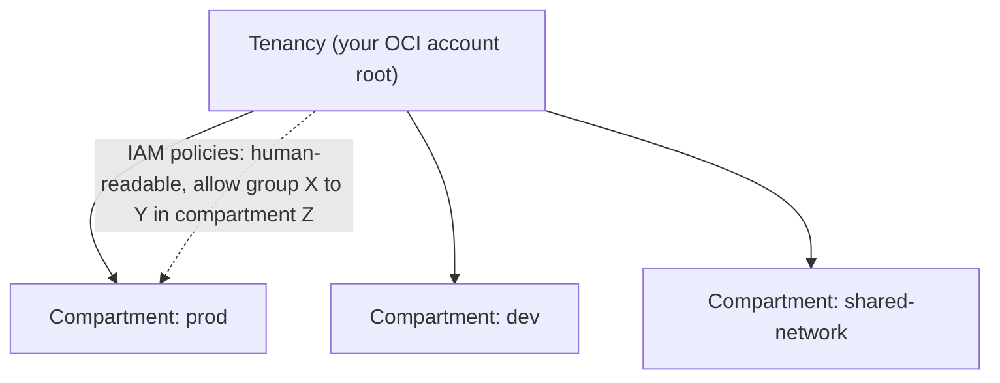

# Oracle Cloud Infrastructure (OCI) — the youngest hyperscaler

> Same four-part template as [AWS](../aws/): **what it is → the admin skill map → the
> AI-assisted ramp → labs.** The honesty marker is **🧗 ramp** — mapped from the
> AWS/Azure/GCP model and verified, not run in production. OCI is the fourth public
> cloud in the [seven-platform comparison](../../the-stack/), and being the youngest
> design shows in a few deliberate, admin-relevant differences.

## 1. What OCI is

Oracle Cloud Infrastructure is Oracle's answer to AWS — a full public cloud, built
later than the big three and using that hindsight to make some different engineering
choices. Two of them matter to an operator from day one: **off-box network
virtualization** (network I/O handled outside the host, so the hypervisor tax is low
and performance is predictable) and **bare-metal instances as a first-class product**
(the closest a public cloud comes to handing you the actual server — a natural fit
for the [self-host](../self-host/) and [vSphere](../vsphere/) mindset). Its other
deliberate play is **aggressively cheap egress**, which makes it a favored target for
backup, archive, and data-heavy workloads the [egress meter](../../the-stack/02-network.md)
punishes elsewhere.

Mapped onto the [seven surfaces](../../00-the-operating-model.md):

| Surface | OCI's word(s) for it | The one-liner |
| --- | --- | --- |
| **Identity & access** | **IAM** — compartments, policies, dynamic groups, instance principals | Compartments are the org/isolation unit; policies are human-readable statements. |
| **Compute** | **Instances**, **flexible shapes**, **bare-metal shapes** | Dial OCPUs + memory; an **OCPU is a full physical core**, not a hyperthread. |
| **Networking** | **VCN** (regional), security lists **and** NSGs, FastConnect | Two overlapping filter mechanisms — pick one and standardize. |
| **Storage** | **Block Volume**, **File Storage**, **Object Storage** (+ Archive) | The expected trio; retrieval/egress is cheap by design. |
| **Provisioning & config** | **Resource Manager** (managed Terraform), cloud-init | Terraform is the first-class IaC path; cloud-init standard on Linux. |
| **Observability** | **Monitoring**, **Logging**, **APM** | The expected stack, younger and shallower than the big three's. |
| **Security & compliance** | IAM, **Cloud Guard**, **Security Zones**, Vault, Budgets | Cloud Guard is posture + threat; Security Zones are preventive guardrails. |

The admin-relevant headline: **compartments are OCI's blast-radius unit** (the analog
of an AWS account or a GCP project — nested, and the thing IAM policies are scoped
against), and **its IAM policy language reads like sentences** — `Allow group Admins
to manage instances in compartment Prod` — which is genuinely nicer than JSON.

## 2. The admin skill map

The concrete, checkable list in **[`skills-map.md`](skills-map.md)**. The headline
capabilities, with the OCI-specific deltas:

- **Compartments and policies** — design the compartment hierarchy (blast radius),
  write least-privilege policy statements, and use **instance principals** so a VM
  authenticates with no key (the workload-identity story).
- **A VCN you designed** — regional, subnets, gateways; and **pick security lists
  *or* NSGs and standardize** rather than tangling both.
- **Compute sizing** — flexible shapes (dial exact OCPU/memory), and remembering an
  **OCPU = a full core** when comparing to other clouds' vCPUs.
- **Bare metal when it fits** — OCI's first-class metal shapes for per-core licensing
  or performance-sensitive workloads ([the reason it leads with metal](../../the-stack/01-physical.md)).
- **Storage + the egress advantage** — Object Storage/Archive as a cheap-retrieval
  backup target ([`the-stack/04`](../../the-stack/04-storage.md)).
- **IaC via Resource Manager** — OCI's managed Terraform, or your own.
- **Secure and within budget** — Cloud Guard, Security Zones, a **budget alert
  first** ([`cost`](../../cross-cutting/cost.md)).

## 3. The AI-assisted path to competence

The method is in **[`ai-ramp.md`](ai-ramp.md)**. In one paragraph:

OCI is a strong case for the ramp method: an admin who knows AWS/Azure/GCP has
already mapped the seven surfaces, so OCI is *"what's Oracle's word for it, and what's
the deliberate difference?"* Use AI to translate — *"map OCI compartments, VCN,
shapes, and IAM onto their AWS equivalents, and flag the genuine differences (OCPU
vs vCPU, security lists vs NSGs, the policy language)"* — then verify against current
docs and run it in an Always-Free-tier tenancy. The four differences above are where
the "OCI is just AWS" reflex fails; everything else is a rename.

## 4. Labs

Repo-runnable exercises are **specced in [`labs/`](labs/)**, mirroring the
[AWS labs'](../aws/labs/) shape: a scoped-identity (a least-privilege IAM policy +
compartment) inventory script, then a minimal VCN + instance in Terraform via Resource
Manager. OCI's **Always Free tier** makes this genuinely runnable at no cost — the
budget-safe throwaway tenancy this platform's ramp needs.

## Honest boundaries

🧗 **honest ramp — labeled as one.** No production OCI operations claimed: this module
maps the transferable operating model (AWS/Azure/GCP surfaces + on-prem depth) onto
OCI's names and verifies against current docs — the ramp method
[`WHY.md`](../../WHY.md) argues for. The *instincts* underneath (blast-radius thinking
via compartments, least privilege, bare-metal and failure-domain judgment from real
[vSphere](../vsphere/) and [self-host](../self-host/) experience) are ✋; the OCI-service
specifics are the ramp. Worth noting: OCI's bare-metal-first, egress-cheap design maps
unusually well onto genuine hands-on strengths — which shortens the ramp — but the
claim stays honest: a transferable model plus a fast, verifiable ramp, not years on
OCI.
