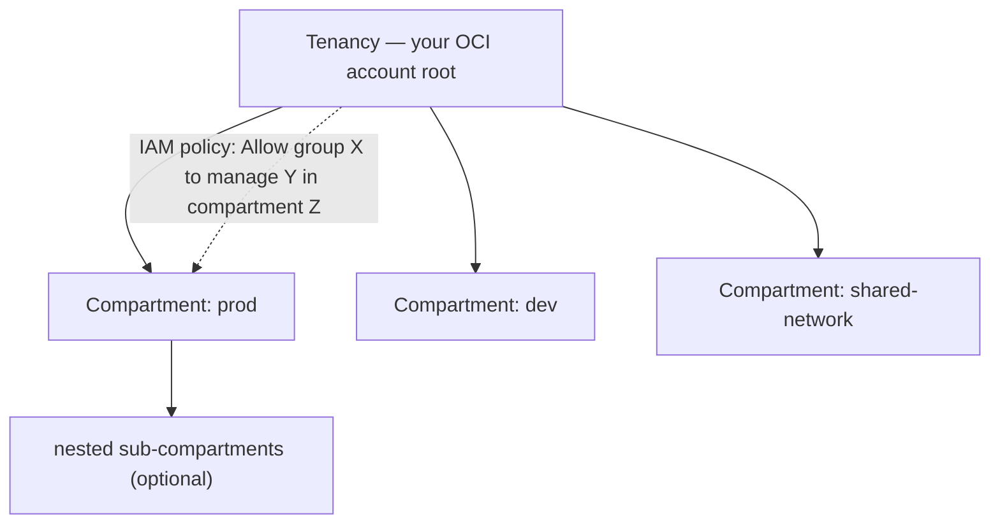
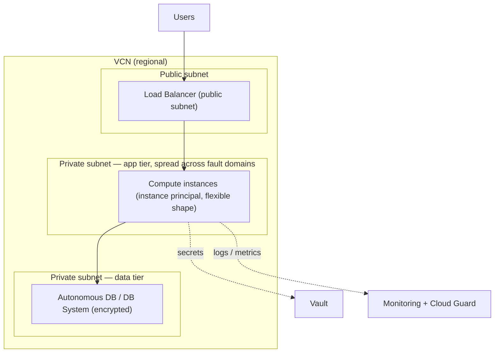

# OCI — Understanding the Architecture

> The [README](README.md) mapped OCI onto the seven surfaces — *what the services
> are.* This note is the layer up: *how OCI is structured*, so you design with its
> architecture instead of fighting it. Because OCI borrows the big three's shape, the
> whole job is the **four deliberate differences** Oracle built in — get those right
> and the rest is a rename.

## 1. The tenancy → compartment hierarchy — the blast-radius unit

OCI's most consequential structural decision is the **compartment** — the analog of an
AWS account or a GCP project, and the thing IAM policies scope against:

- **Compartments are the isolation and blast-radius unit** — nested, and the boundary
  every resource lives in. Prod and dev in *separate compartments* is the baseline,
  not an optimization ([`the-stack/01`](../../the-stack/01-physical.md)).
- **The IAM policy language reads like sentences** — `Allow group Admins to manage
  instances in compartment Prod` — genuinely nicer than JSON, and different enough to
  learn deliberately ([`identity`](../../cross-cutting/identity-iam.md)).
- **Instance principals** let a VM authenticate as itself with no key — the
  workload-identity "no secret on the box" rule, OCI's word for it.

## 2. Regions → Availability Domains → Fault Domains

OCI's [failure-domain](../../the-stack/01-physical.md) model, one level finer than
most:

- A **Region** is geographic; some regions have a **single Availability Domain (AD)**,
  others three. An AD is a data-center-class failure boundary (independent power,
  cooling, network).
- Each AD is subdivided into three **Fault Domains** — anti-affinity you're expected
  to use *deliberately*: spread replicas across fault domains so a rack-level failure
  inside one AD doesn't take both. In a single-AD region, fault domains are your only
  intra-region spread — know which you have before you design HA.

## 3. Compute — OCPU, and bare metal as a first-class citizen

Two OCI-specific facts that change sizing and cost math:

- **An OCPU is a full physical core**, not a hyperthread. The same "2 CPUs" is *twice*
  the compute of a hyperthreaded vCPU elsewhere — miss this and your sizing and
  cross-cloud cost comparisons are off by 2×.
- **Flexible shapes** let you dial exact OCPU + memory; **bare-metal shapes** are a
  first-class product (the closest a public cloud comes to handing you the server) —
  a natural fit for per-core licensing and the [self-host](../self-host/)/
  [vSphere](../vsphere/) mindset. Off-box network virtualization keeps the hypervisor
  tax low.

## 4. Networking & the security-filter choice

- The **VCN** (Virtual Cloud Network) is regional, with subnets, gateways, and route
  tables — the AWS VPC's shape ([`the-stack/02`](../../the-stack/02-network.md)).
- **The OCI-specific gotcha: security lists *and* NSGs are two overlapping
  packet-filter mechanisms.** Pick one and standardize; tangling both is how "why is
  this connection denied" becomes an afternoon. NSGs (attached to resources) are
  usually the cleaner choice at scale.
- **Egress is cheap by design** — the [chapter-02](../../the-stack/02-network.md)
  lock-in meter is deliberately gentler here, which makes OCI a favored backup/archive
  target for data the other clouds' egress punishes.

## The shared responsibility model

Standard cloud split ([`the-stack/07`](../../the-stack/07-security.md)): Oracle secures
the data centers, hardware, and managed-service internals; your compartments, IAM
policies, network config, and encryption choices are always yours — and, as
everywhere, most breaches live on your side of the line.

## A reference architecture — how the surfaces compose

Every surface: **identity** (instance principal, compartment-scoped policy),
**networking** (VCN, NSGs), **compute** (flexible shape, fault-domain spread),
**storage** (encrypted DB), **observability** (Monitoring), **security** (Vault, Cloud
Guard) — the [skill map](skills-map.md) doing one job.

## Honest boundaries

🧗 **ramp, honestly.** This maps the transferable architecture model — blast-radius via
compartments, failure domains, shared responsibility — onto OCI and verifies it against
current docs, with **no production OCI operations claimed** (the [README](README.md)
says the same). The *instincts* underneath (compartment blast-radius thinking, bare-
metal and fault-domain judgment from real [vSphere](../vsphere/) and
[self-host](../self-host/) work, least privilege) are ✋; the OCI-service specifics are
the ramp. The four deliberate differences (compartments, OCPU-vs-vCPU, security-lists-
vs-NSGs, the policy language) are flagged precisely because they're where the "OCI is
just AWS" reflex fails. The claim is a sound model plus a fast, verifiable ramp — not
years on OCI.
