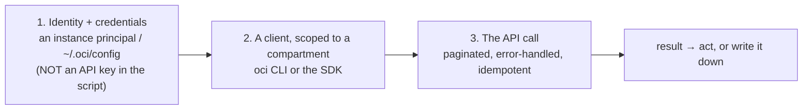
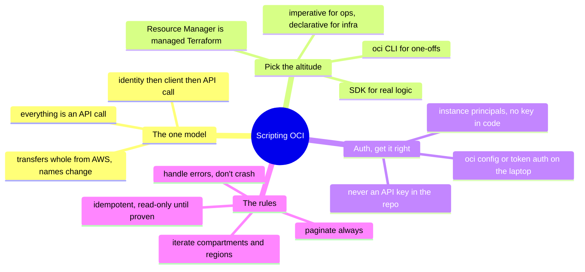

# OCI — Scripting the API (managing & operating from code)

> [`architecture`](architecture.md) is how OCI is structured; [`operations`](operations.md)
> is what running it looks like. This note is the *how*: **driving OCI from code** —
> the [operating-model](../../00-the-operating-model.md) move #3, and a clean case for
> the ramp method, because the API model transfers whole from AWS/GCP and only the
> names change.

Everything in OCI is an API call — the console, the `oci` CLI, Terraform, the SDK are
wrappers over the same API. So "how do I automate X?" becomes *"which call, with which
identity, handling which failure modes?"* — where a [scripting](../../foundations/)
background turns straight into OCI operations.

## The one model: `(identity) → (client) → (API call)`

Get those three right — a **scoped identity**, a **compartment-aware client**, and a
**properly-called API** — and you can automate anything OCI exposes.

## The tooling ladder — pick the altitude

| Tool | What it is | Reach for it when |
| --- | --- | --- |
| **`oci` CLI** | the API as shell commands | one-offs, quick checks, glue in Bash |
| **the SDK** (Python etc.) | the API as a library | real logic — loops, branching, tooling |
| **Cloud Shell** | CLI + SDK in a managed shell | ad-hoc ops without local creds |
| **Terraform / Resource Manager** | *declarative* desired state | anything reproducible ([`iac`](../../cross-cutting/iac-and-config.md)) |

Same dividing line as everywhere: **the CLI and SDK are imperative** (ops); **Terraform
/ Resource Manager is declarative** (the standing infra). Resource Manager is OCI's
*managed* Terraform — state and runs handled for you.

## Authentication — instance principals over key files

The most important rule, and the one AI gets wrong most: **never put an API signing
key in a script or repo.**

- **On a compute instance / OKE** → an **instance principal** (or dynamic group): the
  VM authenticates as itself, no key anywhere — the analog of an AWS instance role, and
  the correct default for anything running in OCI.
- **On your laptop** → `~/.oci/config` from `oci setup config`, using a key you keep
  local (or, better, token-based `oci session authenticate`).
- **Never** → the API private key committed to a repo or baked into an image — the
  [leaked-key](operations.md) incident, pre-committed ([`identity`](../../cross-cutting/identity-iam.md)).

The absence of a key in your running code is the point — instance principals exist so
there's nothing to leak.

## The rules that separate a working script from a footgun

The [foundations](../../foundations/) idempotence-and-safety discipline, OCI-specific:

- **Paginate — always.** OCI list calls page; the CLI's `--all` and the SDK's
  pagination helpers exist so you don't silently miss everything past page one.
- **Iterate compartments (and regions).** Resources live *per compartment*; a script
  that inventories "everything" from one compartment sees a slice. Loop the compartment
  tree, and regions for regional resources.
- **Handle errors per resource** — one compartment you lack access to shouldn't abort
  the whole run.
- **Be idempotent for mutations** — check-then-act, safe to re-run — the same rule
  [Terraform](../../cross-cutting/iac-and-config.md) enforces structurally.
- **Read-only until proven** — develop against `list`/`get` calls; add
  `create`/`delete`/`update` only once the logic is proven, behind a dry-run flag.

## Two shapes of automation script

- **The read/audit script** — inventory, a compliance check (public buckets, over-broad
  policies, unencrypted volumes), a cost/tag report. Read-only, safe, run often — the
  [inventory lab](labs/) is exactly this on OCI.
- **The remediation / orchestration script** — *acts*: tag untagged resources, stop
  idle instances, rotate a secret. Mutating, so it carries the full discipline — instance
  principal / scoped identity, dry-run first, idempotent, logged.

## How AI assists writing the automation

- **Great for the skeleton and the API lookup** — *"an `oci` CLI command to list every
  bucket with public access in this compartment"* — the shape in seconds, *if* you
  verify the call exists.
- **Where AI burns you (verify hardest):** OCI is **younger and thinner in training
  data, so AI invents `oci` subcommands, flags, and IAM policy verbs more freely than
  on AWS**; it **forgets compartment iteration**; it **conflates OCPU/vCPU**; and it
  **references an API key** instead of an instance principal. Run it read-only against
  a sandbox compartment; the missing compartment or the truncated result shows up
  immediately.

## Honest boundaries

✋ **where it transfers, 🧗 where it's OCI.** The scripting-and-automation *discipline*
is hands-on — Python/Bash, paginated/idempotent/error-handled automation, read-only-
first ([`foundations/`](../../foundations/)) — and it transfers whole onto OCI's API.
But the OCI-*specific* surface (the exact CLI/SDK, instance-principal setup, service
quirks) is the 🧗 ramp, mapped and verified, with **no production OCI claimed**. The
claim: a strong automation foundation plus a fast, verifiable ramp onto OCI's API — the
honest position of every OCI doc here ([`WHY.md`](../../WHY.md)).

## The doc on one screen

