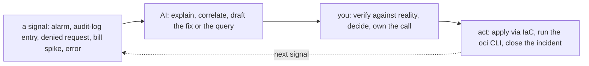

# OCI — Operating It (the day-2 reality)

> The [README](README.md) is *what OCI is*; [architecture](architecture.md) is *how
> it's structured*; this note is **what running it looks like** — the brief, what
> pages you, the ops work by cadence, and AI in the operating loop. OCI is a 🧗 ramp,
> so this is the transferable operating discipline mapped onto OCI's tools, not
> production-OCI experience.

## The brief — what "operating OCI" means

Same shape as any cloud: you operate by declaring intent and keeping the result
healthy, safe, and affordable. The three day-2 questions:

- **Is it healthy?** — Monitoring alarms wired, and would you know before a user does?
- **Is it safe?** — least-privilege compartment policies, Cloud Guard clean, nothing
  public that shouldn't be?
- **Is it affordable?** — a budget set, no forgotten resource, the OCPU/egress math
  right?

## Ops notes — what pages you on OCI

- **The public Object Storage bucket** — private data made public by a
  misconfiguration; the canonical cloud breach. A Cloud Guard finding someone *reads*
  ([`the-stack/07`](../../the-stack/07-security.md)).
- **The leaked API key / misused instance principal** — an API signing key committed
  to a repo, or an over-broad instance principal. This is *why* OCI pushes instance
  principals over key files ([automation](automation.md)); a key in git is an incident.
- **Security-list vs NSG confusion** — a connection denied because two overlapping
  filter mechanisms disagree ([architecture](architecture.md)); the daily networking
  incident, OCI-flavored, on top of the [debug ladder](../../the-stack/02-network.md).
- **The OCPU cost surprise** — someone compared a "2 OCPU" box to a "2 vCPU" box and
  got the math wrong by 2× ([architecture](architecture.md), [cost](../../cross-cutting/cost.md)).
- **Single-AD vs fault-domain placement** — a "highly available" service with both
  replicas in one fault domain (or a single-AD region with no cross-AD option),
  discovered during the failure it was meant to survive.
- **The egress-cheap advantage, used well** — not a page, but the design win: routing
  backups/archive to OCI Object Storage because retrieval is cheap.

## The ops work, broken down

By **cadence**, using OCI's native tools:

| Cadence | Task | Surface | Why it matters |
| --- | --- | --- | --- |
| **Continuous (automated)** | Monitoring alarms on health, errors, budget; Cloud Guard findings | observability, security | The system pages you, not a user. |
| **Continuous (automated)** | Instance pools heal/scale unhealthy instances | compute | Cattle, not pets. |
| **Daily** | Triage Cloud Guard findings + alarms; act on the real ones | security | Findings only help if someone acts. |
| **Daily** | Answer "why is this denied" (security list vs NSG) and "who did this" (Audit) | networking, identity | The bread-and-butter incident and audit questions. |
| **Weekly** | Review compartment policies: over-broad grants, unused dynamic groups | identity | Least privilege decays; compartment scope keeps blast radius small. |
| **Weekly** | Cost review: anomalies, untagged spend, OCPU right-sizing | cost | Catch the forgotten resource before the invoice. |
| **Monthly** | Right-size flexible shapes from utilization; revisit commit/preemptible | cost, compute | Most instances are oversized because nobody looked. |
| **Monthly** | Refresh custom images; roll instance pools | compute, security | Closes known-CVE exposure ([`the-stack/03`](../../the-stack/03-compute-and-images.md)). |
| **Quarterly** | Restore-test a backup from Object/Archive; verify RPO/RTO | storage | An untested backup is a hope ([`the-stack/04`](../../the-stack/04-storage.md)). |
| **Quarterly** | Access recertification; review Security Zones guardrails | identity, security | Prove the guardrails hold; audits want evidence. |
| **On-incident** | Detect → contain → eradicate → recover → post-mortem | all | The [incident discipline](../../cross-cutting/incident-response.md). |
| **On-change** | Everything through IaC + review, not the console | provisioning | The console is for looking ([`iac`](../../cross-cutting/iac-and-config.md)). |

Same two truths as every cloud: **most routine work is automated — the human job is
triage, review, and judgment**; and **the review cadence (weekly policy, weekly cost,
quarterly restores) is the part teams skip and regret.**

## How AI assists the operating work

Distinct from the [learning ramp](ai-ramp.md) — AI in the daily loop:

- **Incident co-pilot / query authoring** — paste the audit entry, the `oci` error, a
  Logging query need: *"what does this mean, what would you check?"* A fast hypothesis
  you test.
- **Drafting fixes as code** — a policy statement, an NSG rule, a Terraform change —
  as a reviewable draft through the normal IaC gate.
- **Where AI burns you (verify hardest):** OCI is **younger and less represented in
  training data, so AI hallucinates here *more*, not less** — invented service names,
  CLI flags, and IAM policy verbs that don't exist. It also **conflates OCPU with
  vCPU** in cost reasoning. The guardrail is the repo's rule — **AI touches signals and
  drafts; you touch production** — and on OCI you verify harder than on AWS.

## Honest boundaries

🧗 **ramp.** The ops *discipline* is ✋ — triage, incident method, review cadence,
least-privilege review, restore-testing, cost-as-a-signal — carried from real
infrastructure work. But every OCI-service specific (which console, which finding,
which alarm) is the ramp, mapped and verified per this repo's method, not claimed as
time on-call for a production OCI estate. The claim: a transferable operating
discipline plus a fast, honest ramp onto OCI's tooling — and the AI-assisted loop above
is how the ramp gets applied without pretending the judgment came from the machine.
